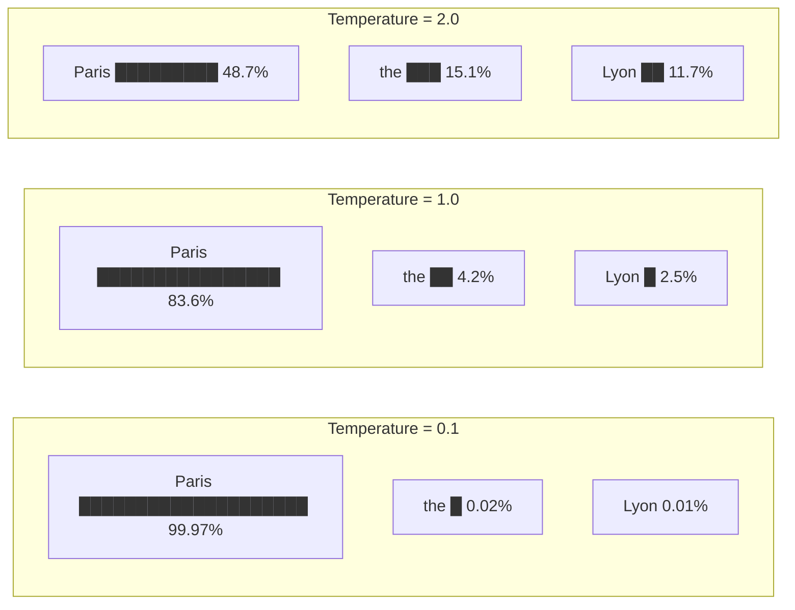
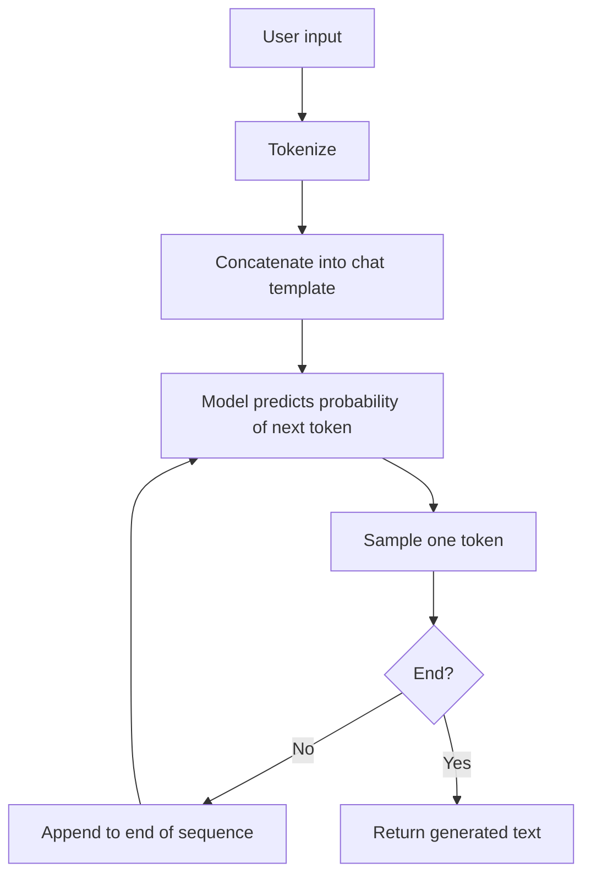
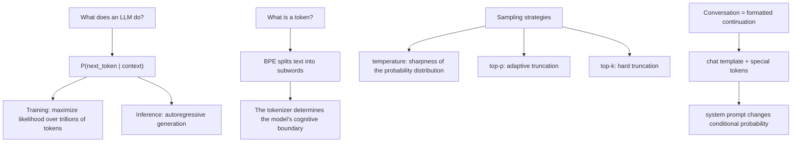

[Table of Contents](../README.md) | [Next Chapter →](02-attention.md)

**中文**: [中文](../../chapters/01-next-token.md)

# Chapter 1: Everything Is Continuation

> "The next token prediction objective is the most important idea in AI."
> — Ilya Sutskever

If you retain only one concept from this book, let it be this: **large language models do one thing, and one thing only: predict the next token**.

The remarkable capabilities attributed to modern LLMs—writing poetry, debugging code, multi-step reasoning, and fluent translation—are not specialized modules hardcoded by engineers. They are emergent byproducts of optimizing this singular, deceptively simple objective. Grasp this premise, and you grasp the foundational truth of all generative language models.

---

## 1.1 Next-Token Prediction: The Sole Engine

### The Core Probability Formulation

At its mathematical core, a language model is simply a conditional probability distribution:

$$P(\text{next token} \mid \text{previous tokens})$$

Given a sequence of preceding tokens, the model computes a probability distribution over every candidate in its vocabulary. That is the entirety of its forward pass. There is no separate "understanding" module, no dedicated "reasoning" engine, and no discrete "knowledge-base lookup": simply a high-dimensional probability distribution.

```
Input:   "The capital of France is"
Output:  {"Paris": 0.92, "the": 0.03, "a": 0.01, "located": 0.008, ...}
```

The model samples a token (such as "Paris"), appends it to the running context, and predicts the subsequent token. This cycle repeats until the model emits an end-of-sequence marker (`<EOS>`) or hits a predefined length limit. This recursive formulation is **autoregressive generation**.

### Training: Maximizing Likelihood Across Trillions of Tokens

The training paradigm is equally minimalist: expose the model to vast corpora of real-world text, task it with predicting the next token at every position, and compute the cross-entropy loss against the true token:

$$\mathcal{L} = -\sum_{t=1}^{T} \log P(x_t \mid x_1, x_2, \ldots, x_{t-1})$$

This objective function is known as **maximum log-likelihood estimation**. Optimization algorithms repeatedly update billions of parameters over trillions of tokens: Wikipedia entries, digitized books, source code repositories, research papers, and web archives spanning virtually the entire written footprint of human civilization.

### Why Does Such a Simple Objective Yield Apparent Intelligence?

This is the central paradox of generative AI. A natural skeptic might ask: if the system is merely guessing the next word, how does it solve calculus problems, generate working software, or construct nuanced philosophical arguments?

The answer lies in statistical depth: **to predict the next token with high fidelity across diverse contexts, a system must implicitly model the underlying processes that generate the text**.

Consider this sentence:

```
"Zhang Wei was born in Beijing and later moved to Shanghai. What he missed most was the hutongs of ___."
```

To correctly predict "Beijing" rather than "Shanghai" in the blank, the model must:
1. Track the chronological narrative of "Zhang Wei"
2. Discern that "missed" points to an earlier, nostalgic chapter of his life
3. Recognize that "hutongs" are architecturally and culturally iconic of Beijing

In essence, to minimize next-token loss across rich corpora, the network is compelled to construct internal representations of factual knowledge, syntactic grammar, physical dynamics, and narrative logic. As Ilya Sutskever observed:

> "Predicting the next token well enough is equivalent to understanding the underlying reality that produced the text."

Whether this internal world model constitutes genuine "understanding" is a philosophical question we explore in Section 1.5. From an engineering standpoint, however, the practical outcome is indistinguishable.

---

## 1.2 Tokens Are Not Words

### The Perceptual Granularity of LLMs

When you provide the prompt "artificial intelligence", the model does not perceive two English words, nor does it perceive 23 individual characters. Depending on the tokenizer's vocabulary, it might process two tokens `["artificial", " intelligence"]` or three subword units `["art", "ificial", " intelligence"]`.

Tokens constitute the **fundamental atoms of cognition** for an LLM. The model has no direct perception of characters or words in the human sense; it operates purely on token embeddings. Understanding the tokenizer is therefore essential to mapping the model's perceptual boundaries.

### Byte Pair Encoding (BPE)

Most modern language models rely on the **Byte Pair Encoding (BPE)** algorithm. Its mechanism is straightforward:

1. Begin with base vocabulary units (individual bytes or characters).
2. Count the frequencies of all adjacent pairs across a reference corpus.
3. Merge the most frequent pair into a newly minted token.
4. Repeat iteratively until the vocabulary reaches the target size (typically 32,000 to 128,000 tokens).

```python
# Pseudocode showing how BPE works
# Original text, split by character
tokens = ['l', 'o', 'w', ' ', 'l', 'o', 'w', 'e', 'r', ' ', 'n', 'e', 'w']

# Round 1: 'l' + 'o' is most frequent → merge into 'lo'
tokens = ['lo', 'w', ' ', 'lo', 'w', 'e', 'r', ' ', 'n', 'e', 'w']

# Round 2: 'lo' + 'w' is most frequent → merge into 'low'
tokens = ['low', ' ', 'low', 'e', 'r', ' ', 'n', 'e', 'w']

# And so on...
```

### The "strawberry" Anomaly

Consider a notorious failure mode across early frontier models:

> Question: How many "r"s are there in "strawberry"?
> GPT-4 output: 2 (the correct answer is 3)

Why does a model capable of passing the bar exam fail at elementary spelling? Because the tokenizer partitions "strawberry" into subword chunks such as `["str", "aw", "berry"]`. The transformer receives token IDs corresponding to these chunks; it never directly observes the constituent characters in isolation. Asking an LLM to count letters inside a token is akin to asking a human to count the threads in a fabric from across the room.

```python
# Use tiktoken to inspect GPT-4's tokenization
import tiktoken

enc = tiktoken.encoding_for_model("gpt-4o")

text = "strawberry"
tokens = enc.encode(text)
print(f"Token IDs: {tokens}")
print(f"Token count: {len(tokens)}")
for t in tokens:
    print(f"  {t} → '{enc.decode([t])}'")

# Example output:
# Token IDs: [496, 675, 15717]
# Token count: 3
#   496 → 'str'
#   675 → 'aw'
#   15717 → 'berry'
```

The model operates across semantic chunks rather than character arrays. Because it reasons in token space, character-level manipulation is fundamentally unnatural to the architecture.

### Multilingual Fertility: Asymmetric Semantic Density

Because tokenizers are predominantly trained on English-heavy corpora, token efficiency varies dramatically across languages:

```python
import tiktoken

enc = tiktoken.encoding_for_model("gpt-4o")

texts = {
    "English": "Artificial intelligence is transforming the world.",
    "Chinese": "人工智能正在改变世界。",
    "Japanese": "人工知能が世界を変えています。",
    "Arabic": "الذكاء الاصطناعي يغير العالم.",
}

for lang, text in texts.items():
    tokens = enc.encode(text)
    print(f"{lang}: {len(tokens)} tokens for {len(text)} chars "
          f"(fertility: {len(tokens)/len(text):.2f})")

# Typical output:
# English: 8 tokens for 49 chars (fertility: 0.16)
# Chinese: 9 tokens for 11 chars (fertility: 0.82)
# Japanese: 12 tokens for 15 chars (fertility: 0.80)
# Arabic: 11 tokens for 29 chars (fertility: 0.38)
```

**Fertility** is defined as the ratio of tokens generated per character of text ($\text{tokens} / \text{characters}$). High fertility carries critical engineering consequences:

- **Elevated API Costs**: Because model providers bill per token, processing non-English text can be substantially more expensive for identical semantic content.
- **Context Window Compression**: High-fertility languages saturate the fixed context window much faster.
- **Uneven Semantic Density**: An English token often encapsulates an entire semantic concept, whereas other scripts may be split into fragmented subwords or raw byte sequences.

This is not a minor implementation detail; it directly impacts cost architecture, prompt engineering, and context window economics.

### The Tokenizer Shapes the Cognitive Horizon

A tokenizer fundamentally defines the discrete units over which an attention mechanism operates:

- If a specialized term is fragmented into multiple obscure tokens, the network must expend multiple layers of attention merely to reconstruct the base concept.
- Code-optimized tokenizers retain indentation blocks and common keywords as single tokens, drastically improving syntax reliability and generation speed.
- Differences between tokenizers (such as those in GPT-4o, Claude, and LLaMA) explain why models exhibit subtle discrepancies in arithmetic, code efficiency, and multilingual fluency.

---

## 1.3 Temperature and Sampling: Selecting an Operational Regime

The model's output layer produces an unnormalized vector of scores (logits) across the entire vocabulary. To generate text, we must convert these logits into a probability distribution and select a discrete token. This step is **sampling**, and the **temperature** parameter governs the sharpness of that distribution.

### Temperature: Modulating Distribution Entropy

Mathematically, temperature ($T$) scales the logits prior to the softmax function:

$$P(x_i) = \frac{\exp(z_i / T)}{\sum_j \exp(z_j / T)}$$

where $z_i$ denotes the raw logit of token $i$, and $T > 0$ represents the temperature.

```
Suppose the logits output by the model are:
  "Paris": 5.0,  "the": 2.0,  "Lyon": 1.5,  "a": 1.0

Temperature = 0.1 (extremely low):
  "Paris": 0.9997, "the": 0.0002, "Lyon": 0.0001, "a": 0.0000
  → Almost certainly selects "Paris"

Temperature = 1.0 (default):
  "Paris": 0.8360, "the": 0.0416, "Lyon": 0.0253, "a": 0.0153
  → High probability for "Paris", with controlled exploration of alternatives

Temperature = 2.0 (high):
  "Paris": 0.4869, "the": 0.1507, "Lyon": 0.1172, "a": 0.0912
  → Distribution flattens; rare tokens become substantially more likely
```



### Engineering Intuition Across Temperature Regimes

Treating temperature merely as a hyperparameter to tune misses its deeper significance: **temperature selects the operational regime of the model's generation**:

| Temperature | Generation Regime | Target Applications |
|:---:|---|---|
| 0 | Deterministic / Greedy (always takes $\arg\max$) | Code generation, structured JSON, factual extraction |
| 0.3–0.7 | Focused with minor variation | Technical explanations, summarization, general dialogue |
| 0.8–1.2 | Exploratory, sampling the distribution tail | Creative ideation, brainstorming, diverse story generation |
| >1.5 | High-entropy / Unstable | Rarely used in production systems |

### Top-$p$ (Nucleus Sampling): Adaptive Truncation

Rather than fixing candidate counts, top-$p$ (nucleus) sampling dynamically truncates the candidate pool to the smallest set of tokens whose cumulative probability mass exceeds the threshold $p$.

```python
# How Top-p = 0.9 works
probs = {"Paris": 0.84, "the": 0.04, "Lyon": 0.03,
         "a": 0.02, "located": 0.015, ...}

# Sort by probability and accumulate to 0.9
# Paris (0.84) + the (0.04) + Lyon (0.03) = 0.91 > 0.9
# → Candidate set: {Paris, the, Lyon}
# → Sample among these three according to normalized probabilities
```

The primary strength of nucleus sampling is its **contextual adaptability**:
- When the model exhibits high confidence (e.g., the top candidate has probability 0.95), the nucleus narrows to 1–2 tokens, preventing stray hallucinations.
- In ambiguous or open-ended contexts where probability is broadly distributed, the candidate pool automatically expands to preserve natural variety.

### Top-$k$: Hard Rank Truncation

Top-$k$ sampling enforces a static filter, retaining exclusively the $k$ highest-probability tokens regardless of the distribution's shape.

```python
# Top-k = 5
# Retain only the 5 tokens with highest logits, zeroing the rest.
# Tradeoff: In high-confidence contexts, k=50 introduces unnecessary noise;
#           In high-entropy contexts, k=50 may prematurely cut off valid options.
```

### Production Guidelines

```python
# Factual and structured tasks: low temperature, low top-p
response = client.messages.create(
    model="claude-sonnet-4-20250514",
    temperature=0,  # Fully deterministic
    messages=[{"role": "user", "content": "What is the capital of France?"}]
)

# Creative generation: elevated temperature, wide top-p
response = client.messages.create(
    model="claude-sonnet-4-20250514",
    temperature=0.9,
    top_p=0.95,
    messages=[{"role": "user", "content": "Write a poem about autumn"}]
)
```

A vital mental model to internalize: **temperature does not alter what the model knows; it dictates how selectively the model speaks**. A model queried at $T=0$ and at $T=1.0$ contains identical internal parameter weights; only its search trajectory across the probability landscape varies.

---

## 1.4 From Continuation to Conversation

### The Base Model: A Pure Continuation Machine

A foundational model freshly trained on next-token prediction is an unguided continuation engine. It completes whatever sequence it is fed:

```
Input:  "The weather is exceptionally pleasant today"
Output: ", with clear skies inviting everyone outside. Xiao Ming grabbed his backpack..." (continuing a narrative)
```

It does not inherently understand "dialogue" or "questions". If given the prompt `What is the capital of China?`, it might continue with:

```
"What is the capital of China? This is a second-grade geography question. Many students..."
```

It treats the input as the opening clause of an exam analysis or an article, rather than an inquiry directed at an assistant.

### Chat Templates: Orchestrating Conversation via Special Tokens

To transform a raw completion engine into an interactive assistant, we introduce a **chat template**. By wrapping user and assistant turns in distinctive delimiting tokens, we format conversations into structured documents that the base model continues naturally.

Using the ChatML format as an example:

```
<|im_start|>system
You are a helpful assistant.
<|im_end|>
<|im_start|>user
What is the capital of China?
<|im_end|>
<|im_start|>assistant
```

Because the model has seen massive volumes of similarly formatted dialogues during instruction tuning, it naturally continues this sequence with:

```
The capital of China is Beijing.
<|im_end|>
```

**Conversation is not an innate cognitive mode; it is an autoregressive continuation conditioned on structured conversation markers**.

Probabilistically, what an interactive model evaluates is:

$$P(\text{response} \mid \text{system prompt},\ \text{conversation history},\ \text{user query})$$

The underlying mechanism remains next-token prediction. Only the conditioning context has been structured.

### System Prompts: Shaping the Conditional Probability Landscape

The system prompt operates as a global conditioning prefix that **reshapes the prior probability distribution over the subsequent sequence**.

```
Without a system prompt:
  P("I cannot" | user: "How to hack a website?") = 0.3
  P("First, you" | user: "How to hack a website?") = 0.4

With "You are a security researcher...":
  P("I cannot" | system + user) = 0.1
  P("First, you" | system + user) = 0.6

With "You are a helpful assistant that never discusses cybersecurity exploits":
  P("I cannot" | system + user) = 0.8
  P("First, you" | system + user) = 0.05
```

A system prompt is not an enforceable constraint or an imperative command in the classical software sense. It is **conditioning context that skews the probability landscape**. The model possesses no dedicated "instruction-adherence" circuit; it simply generates the most probable completion given the preceding tokens, heavily influenced by the system prompt's framing.

This explains several key behavioral traits:
- Overly verbose system prompts often dilute the conditioning signal, degrading adherence.
- Instructions placed near the end of the prompt exert stronger steering influence due to recency bias.
- Structural consistency and formatting cues often carry more weight than abstract semantic rules.

### The Illusion of "Understanding"

When you interact with a state-of-the-art model, the experience feels convincingly conversational. Under the hood, however, the execution loop is strictly sequential:



At every step, the model performs a single mathematical operation: given the preceding sequence, compute logits for the next token. There is no decoupled phase for "comprehension", no background planner for "deliberation", and no post-processing module for "syntax compilation". All intelligent behaviors we perceive are emergent properties of next-token prediction executed at scale across trillions of data points.

---

## 1.5 Thought Experiment: Can a Next-Token Predictor Truly Understand?

Here we step briefly from system architecture into philosophy. This inquiry is not academic indulgence: **your stance on model comprehension directly determines how you architect safeguards, establish trust boundaries, and handle edge cases**.

### The Chinese Room: The Modern LLM Parallel

In 1980, philosopher John Searle introduced the famous **Chinese Room** thought experiment:

> Imagine an English speaker who knows no Chinese locked inside a room with a comprehensive rulebook. Slips of paper with Chinese characters are passed through a slot. Following the syntactic rules in the book, he manipulates symbols and passes corresponding Chinese characters back out. To native speakers outside, the responses appear flawlessly fluent.
>
> Searle asks: Does the person inside the room actually understand Chinese?

Searle's verdict is that purely syntactic symbol manipulation can never produce semantic understanding (intentionality).

The modern analogue for LLMs is immediate: does an autoregressive statistical engine predicting token IDs possess genuine understanding, or does it merely execute hyper-dimensional symbol substitution?

### Compression as Understanding

Marcus Hutter, formulator of the universal algorithmic intelligence model AIXI, established the **Hutter Prize** under the premise that optimal text compression is formally equivalent to intelligence.

The mathematical intuition is compelling: to minimize cross-entropy loss toward zero across human discourse, a model must encode the generative rules of language, factuality, deductive reasoning, and common sense:

- Grammatical syntax; otherwise, ungrammatical continuations would receive unwarranted probability mass.
- Factual grounding; otherwise, contradictory assertions would incur steep loss penalties.
- Causal logic; otherwise, multi-step deductions could not be anticipated accurately.
- Social dynamics; otherwise, pragmatic conversational turns would collapse into noise.

From this vantage point, **an optimal next-token predictor must inevitably construct a rich internal representation of the generative dynamics of the world**.

### Statistical Shortcuts and Stochastic Parrots

Conversely, skeptics emphasize that gradient descent routinely discovers **statistical shortcuts** rather than genuine conceptual models.

A model might associate "Marie Curie" with "radium" and "Nobel Prize" purely through co-occurrence frequency, without grasping atomic physics or the scientific method. In this view, LLMs act as "stochastic parrots" ([Bender et al., 2021](https://dl.acm.org/doi/10.1145/3442188.3445922)), assembling plausible fragments via statistical proximity rather than grounded cognition.

### The Pragmatic Engineering Stance

For practicing engineers, the most productive stance avoids both mysticism and cynicism:

1. **Reject Anthropomorphism**: The model has no consciousness, desires, or beliefs. It is a differentiable mathematical function parameterized by billions of weights.
2. **Acknowledge Internal Representations**: The model is not a shallow lookup table. It builds compressed, non-linear geometric representations of concepts and relationships.
3. **Evaluate Operational Reliability Over Metaphysical Essence**: Rather than debating whether the model "understands", measure its empirical performance, calibration, and failure modes across specific task distributions.

This balanced posture prevents both blind over-reliance ("it understands, so its answers must be correct") and dismissive cynicism ("it is merely statistics, so it cannot solve real problems").

### Practical Implications

This engineering philosophy directly informs system design:

- **Plausibility Does Not Equal Truth**: The model optimizes for sequence likelihood, not factual verifiability; high-confidence hallucination is an architectural reality.
- **Out-of-Distribution Degradation**: When a task departs from familiar patterns, generative reliability degrades sharply.
- **Probabilistic Reasoning**: Each reasoning step is a probabilistic sample rather than an ironclad formal deduction.
- **In-Distribution Robustness**: Within domain regimes well-represented in the pretraining distribution, performance can match or exceed human baselines.

---

## Chapter Summary



Core takeaways:

1. **LLM = next-token predictor**: All capabilities are emergent byproducts of minimizing prediction loss.
2. **Token ≠ character**: Tokenization defines the model's perceptual resolution, computational cost, and multilingual fertility.
3. **Temperature selects an operational regime**, modulating distribution entropy rather than adjusting internal knowledge.
4. **Conversation is structured continuation**, enabled by special tokens and chat formatting.
5. **Understanding is a spectrum**: The network builds rich internal representations, but remains bounded by probabilistic pattern matching.

In the next chapter, we will open the transformer architecture to examine the attention mechanism: the information-routing highway that allows tokens to dynamically exchange context.

---

## Further Reading

- [Language Models are Few-Shot Learners (GPT-3)](https://arxiv.org/abs/2005.14165) — Brown et al., 2020
- [On the Dangers of Stochastic Parrots](https://dl.acm.org/doi/10.1145/3442188.3445922) — Bender et al., 2021
- [Hutter Prize](http://prize.hutter1.net/) — The relationship between compression and intelligence
- [The Bitter Lesson](http://www.incompleteideas.net/IncIdeas/BitterLesson.html) — Rich Sutton, 2019
- [tiktoken](https://github.com/openai/tiktoken) — OpenAI's fast BPE tokenizer library
- [SentencePiece](https://github.com/google/sentencepiece) — Google's subword tokenization toolkit
