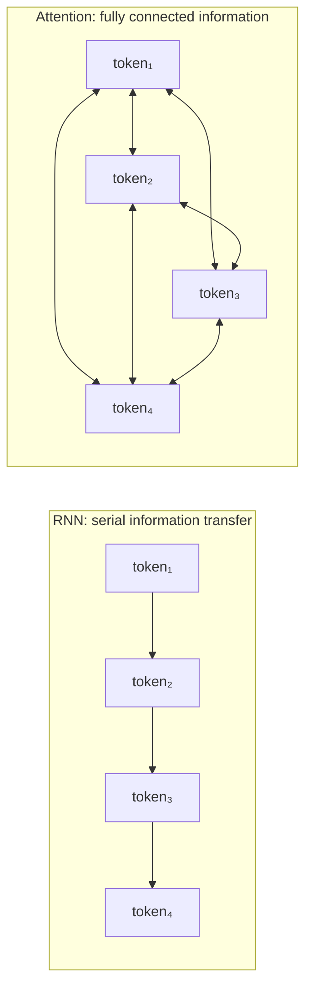
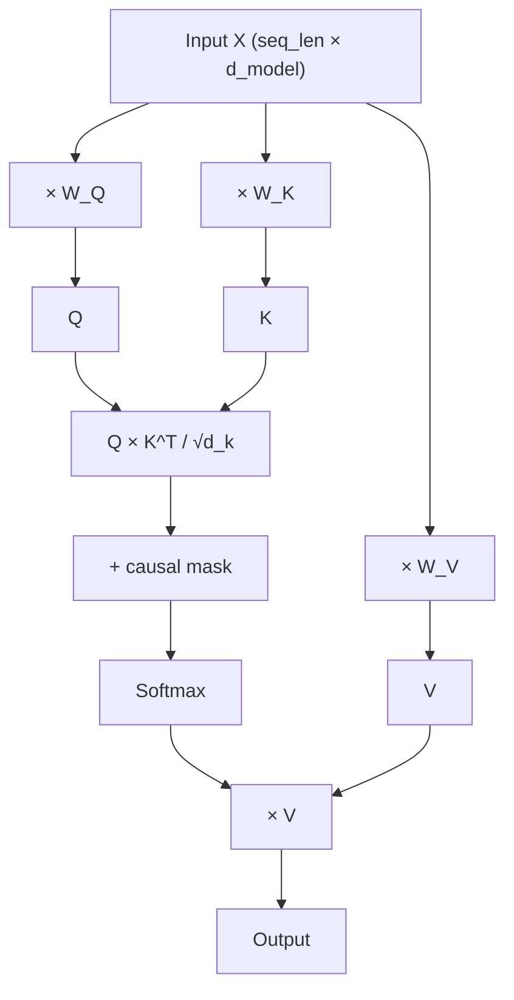
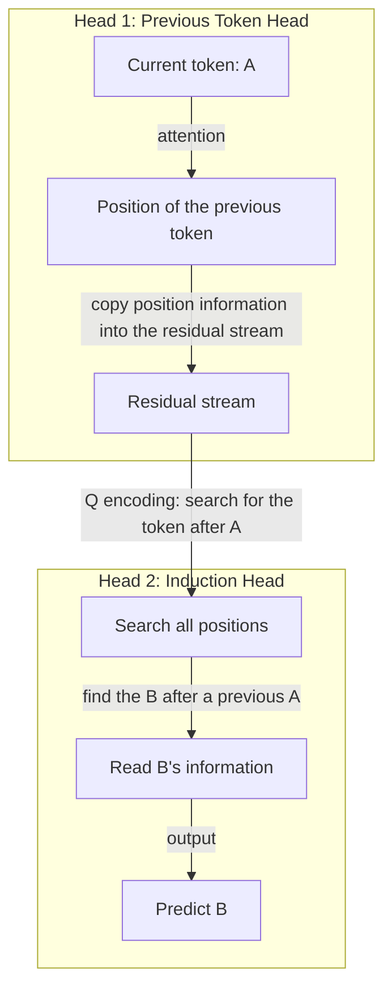
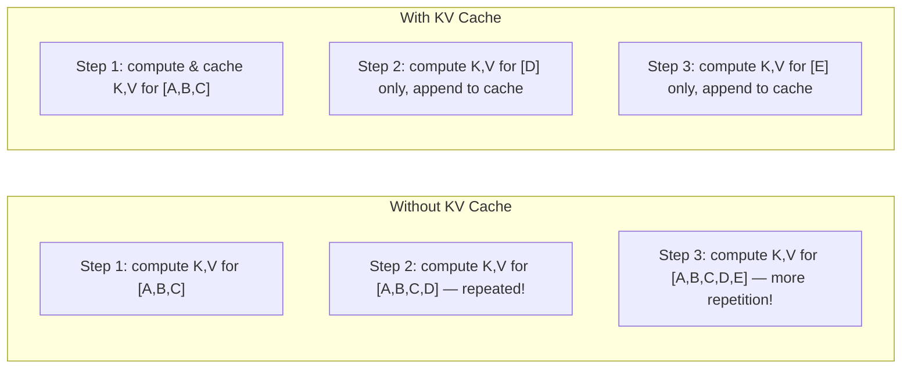
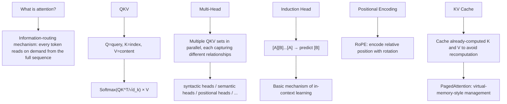

[← Previous Chapter](01-next-token.md) | [Table of Contents](../README.md) | [Next Chapter →](03-scaling.md)

**中文**: [中文](../../chapters/02-attention.md)

# Chapter 2: Attention Is Information Routing

> "Attention is all you need."
> — Vaswani et al., 2017

The name "attention" is misleading. When we say "attention mechanism," you might picture human concentration: focusing on one thing while ignoring the rest. But attention in a Transformer is more like an **information-routing network**: every token asks, "Where do I need to get information from?" and then **reads on demand** from the entire sequence.

Understand attention, and you understand the core of the Transformer, which means you understand the core architecture of modern LLMs.

---

## 2.1 What Problem Attention Solves

### The RNN Bottleneck: Everything Passes Through One Narrow Gate

Before Transformers, the main workhorse for sequence modeling was the RNN (recurrent neural network). An RNN processes tokens like a pipeline:

```
token_1 → [h₁] → token_2 → [h₂] → token_3 → [h₃] → ... → token_n → [hₙ]
```

All past information is compressed into a fixed-size hidden vector $h$. To pass information from token_1 to token_1000, that information must go through 999 compression steps. Imagine playing a telephone game through 999 people. How much of the original information would still remain at the end?

This is the famous **long-range dependency problem**. LSTMs and GRUs alleviated it, but they did not fundamentally solve it.

### Attention: Every Position Directly Accesses Every Other Position

Attention's solution is both brute-force and elegant: **let every token communicate directly with every other token**.



If token_1000 needs to know what token_1 said, it reads it directly, with no need to pass through the 998 tokens in between.

The cost is **O(n²)** computation: with n tokens, an attention score must be computed for every pair. This is why context windows cannot be infinitely large: processing a 100K-token sequence requires computing 100K × 100K = 10 billion attention scores.

---

## 2.2 QKV: Query-Match-Read

The core of the attention mechanism is three vectors produced by three projection matrices: **Query (Q), Key (K), and Value (V)**.

### Intuition: A Database Query

A useful analogy is a database query:

```sql
SELECT value FROM memory WHERE key MATCHES query
```

- **Q (Query)**: What information am I looking for?
- **K (Key)**: What information do I have available?
- **V (Value)**: If you need my information, here is the content itself.

Every token plays all three roles at once: it uses its own Q to query other tokens, its own K so other tokens can query it, and its own V to provide information to any token whose query matches it.

### The Computation

```python
import torch
import torch.nn.functional as F

def attention(Q, K, V, mask=None):
    """
    Q, K, V: [batch, seq_len, d_k]
    """
    d_k = Q.size(-1)

    # Step 1: Compute attention scores (dot product of Q and K)
    scores = torch.matmul(Q, K.transpose(-2, -1)) / (d_k ** 0.5)
    # scores: [batch, seq_len, seq_len] — "relevance" between each pair of tokens

    # Step 2: Causal mask (for a decoder, future tokens cannot be seen)
    if mask is not None:
        scores = scores.masked_fill(mask == 0, float('-inf'))

    # Step 3: Softmax normalization → attention weights
    weights = F.softmax(scores, dim=-1)
    # weights: [batch, seq_len, seq_len] — each row sums to 1

    # Step 4: Use the weights to compute a weighted sum of V
    output = torch.matmul(weights, V)
    # output: [batch, seq_len, d_k]

    return output, weights
```

Let's break down each step:

**Step 1: Compute the "match score"**

The dot product of Q and K measures the "relevance" between two tokens. The larger the dot product, the more closely Q's request matches what K can provide.

Why divide by $\sqrt{d_k}$? To prevent the dot product values from becoming too large, which would make the softmax output nearly one-hot and cause gradients to vanish. This is known as **Scaled Dot-Product Attention**.

**Step 2: Causal Mask**

In a language model (decoder), a token cannot see future tokens, because that would leak the answer. The causal mask is a lower-triangular matrix:

```
     t₁  t₂  t₃  t₄
t₁ [  1   0   0   0 ]    t₁ can only see itself
t₂ [  1   1   0   0 ]    t₂ can see t₁ and itself
t₃ [  1   1   1   0 ]    t₃ can see t₁, t₂, and itself
t₄ [  1   1   1   1 ]    t₄ can see everything
```

Masked positions are set to $-\infty$, which becomes 0 after softmax.

**Step 3: Softmax → Attention Weights**

Softmax turns match scores into a probability distribution. Each token allocates 100% of its "attention budget" across the positions in the sequence.

**Step 4: Weighted Reading**

The attention weights are used to compute a weighted sum of V. If token_5 gives token_2 an attention weight of 0.7 and token_1 a weight of 0.2, then token_5's output gets 70% of its information from token_2 and 20% from token_1.

### The Complete Self-Attention Flow



The key insight: **Q, K, and V are all derived from the same input X through learnable linear transformations**. By learning the three weight matrices $W_Q$, $W_K$, and $W_V$, the model decides "what information is worth querying," "what information is worth indexing," and "what information is worth passing along."

---

## 2.3 Multi-Head Attention: Many Pairs of Eyes

A single set of QKV can capture only one "relationship pattern." Multi-head attention works by **using multiple sets of QKV in parallel, with each set capturing a different type of relationship**.

```python
class MultiHeadAttention(torch.nn.Module):
    def __init__(self, d_model, n_heads):
        super().__init__()
        self.n_heads = n_heads
        self.d_k = d_model // n_heads

        # Each head has its own Q, K, V projections
        self.W_q = torch.nn.Linear(d_model, d_model)
        self.W_k = torch.nn.Linear(d_model, d_model)
        self.W_v = torch.nn.Linear(d_model, d_model)
        self.W_o = torch.nn.Linear(d_model, d_model)

    def forward(self, x, mask=None):
        batch, seq_len, d_model = x.shape

        # Project and split into multiple heads
        Q = self.W_q(x).view(batch, seq_len, self.n_heads, self.d_k).transpose(1, 2)
        K = self.W_k(x).view(batch, seq_len, self.n_heads, self.d_k).transpose(1, 2)
        V = self.W_v(x).view(batch, seq_len, self.n_heads, self.d_k).transpose(1, 2)
        # Q, K, V: [batch, n_heads, seq_len, d_k]

        # Each head performs attention independently
        out, weights = attention(Q, K, V, mask)

        # Concatenate the outputs of all heads
        out = out.transpose(1, 2).contiguous().view(batch, seq_len, d_model)

        # Final linear transformation
        return self.W_o(out)
```

### What Do Different Heads See?

Research has found ([Clark et al. 2019](https://arxiv.org/abs/1906.04341)) that different attention heads often learn to focus on different types of relationships:

- **Syntactic heads**: focus on subject-verb agreement (in "The dogs **are** running," "are" strongly attends to "dogs")
- **Position heads**: focus on neighboring tokens (the previous word or next word)
- **Semantic heads**: focus on synonyms or related concepts
- **Separator heads**: focus on punctuation and sentence boundaries
- **Rare-pattern heads**: focus on uncommon collocations

It is like a reading-comprehension group: each member reads the same article from a different perspective, and then the group synthesizes everyone's findings.

### Analogy

Imagine you are reading a complex sentence:

> "The trophy doesn't fit in the brown suitcase because **it** is too big."

Understanding this sentence requires tracking several relationships at the same time:
- **Coreference**: What does "it" refer to? (head 1 handles this)
- **Causality**: What does "because" connect? (head 2 handles this)
- **Physical property**: What does "too big" describe? (head 3 handles this)
- **Syntactic structure**: What is the subject? What is the predicate? (head 4 handles this)

Multi-head attention lets the model route information along multiple dimensions at the same time.

---

## 2.4 Induction Heads: The First "Algorithm" the Model Learns

### What Is an Induction Head?

[Olsson et al. 2022](https://arxiv.org/abs/2209.11895) identified an attention pattern called an **induction head**, which may be the most basic "algorithm" learned by Transformers.

An induction head does something simple:

> If `[A][B]` appeared before, then when `[A]` appears again, predict `[B]`.

```
Text: "Harry Potter is a wizard. Harry Potter is a"
                                                 ^
                                    The model predicts the next token here

How an induction head works:
  1. See that the current token is "a"
  2. Search for positions where "a" appeared before
  3. Find "...is a wizard..."
  4. Read the token after "a" → "wizard"
  5. Predict that the next token is "wizard"
```

### Why Is This Important?

Induction heads are the most basic form of **in-context learning**. They explain why few-shot prompting works:

```
Input:
  "cat → 猫
   dog → 狗
   bird → "

The model identifies the pattern through an induction head:
  English → Chinese
  English → Chinese
  English → ?

Prediction: "鸟"
```

The model is not "understanding" the translation task; it is doing **pattern matching and completion**. But that pattern matching is powerful enough to handle very complex few-shot tasks.

### Two-Layer Cooperation

An induction head requires cooperation between two attention heads:



1. **First layer**: a "previous token head" learns to write information about "what the previous token was" into the residual stream
2. **Second layer**: the induction head uses this information to find where the same pattern appeared before and to read the following token

This is a clear example of **cross-layer information transfer** in a Transformer.

---

## 2.5 Positional Encoding: Assigning Seats to Tokens

### Transformers Have No Concept of Position

The attention computation is **permutation invariant**. If you shuffle the input tokens, attention's output is shuffled in the same way, but the weight computation itself does not change.

This means that without positional encoding, a Transformer cannot distinguish:
- "cat eats fish" and "fish eats cat"

because the two contain exactly the same set of tokens.

### RoPE: Encoding Position with Rotation

The most widely used positional encoding scheme today is **Rotary Position Embedding (RoPE)** ([Su et al. 2021](https://arxiv.org/abs/2104.09864)).

The core idea is to encode positional information as the **rotation angle** of a vector. The larger the distance between two tokens' positions, the larger the "rotation-angle difference" between their Q and K vectors.

```python
import torch

def apply_rope(x, positions, d_model):
    """
    x: [batch, seq_len, d_model] — Q or K vector
    positions: [seq_len] — position indices
    """
    # Frequencies: different dimensions use different frequencies
    freqs = 1.0 / (10000 ** (torch.arange(0, d_model, 2).float() / d_model))
    # [d_model/2]

    # Angle = position × frequency
    angles = positions.unsqueeze(-1) * freqs.unsqueeze(0)
    # [seq_len, d_model/2]

    cos_angles = torch.cos(angles)
    sin_angles = torch.sin(angles)

    # Process the even and odd dimensions of x separately
    x_even = x[..., 0::2]  # even dimensions
    x_odd  = x[..., 1::2]  # odd dimensions

    # Rotate
    x_rotated_even = x_even * cos_angles - x_odd * sin_angles
    x_rotated_odd  = x_even * sin_angles + x_odd * cos_angles

    # Interleave and concatenate
    x_rotated = torch.stack([x_rotated_even, x_rotated_odd], dim=-1)
    return x_rotated.flatten(-2)
```

RoPE is elegant because:
- The attention score between two positions depends only on their **relative distance**, not their absolute positions
- In theory, it can extrapolate to longer sequences (although performance degrades in practice)
- It is computationally efficient and requires no extra learnable parameters

### Context Window: Attention's Hard Limit

Every model has a context window: the maximum number of tokens it can "see" at once.

```
GPT-4o:      128K tokens
Claude 3.5:  200K tokens
Gemini 1.5:  1M-2M tokens
```

The context window is limited by:
1. **Computational complexity**: O(n²) attention computation
2. **Memory**: the KV cache grows linearly with sequence length
3. **Positional-encoding generalization**: beyond the training length, positional encoding may fail

Text beyond the context window simply **does not exist** to the model. This is a hard limit, not a soft one.

---

## 2.6 KV Cache: Why Inference Does Not Recompute Everything

### The Problem: Wasted Computation in Autoregressive Generation

Recall autoregressive generation:

```
Step 1: input [A, B, C]     → predict D
Step 2: input [A, B, C, D]   → predict E
Step 3: input [A, B, C, D, E] → predict F
```

In Step 2, A, B, and C have already been processed in Step 1. Recomputing them every time would waste a large amount of computation.

### KV Cache: Cache the Already-Computed K and V

The key observation: during autoregressive generation, **the K and V of previous tokens do not change** (because the causal mask ensures they cannot see future tokens). That means we can cache them:

```python
class CachedAttention:
    def __init__(self):
        self.k_cache = None  # Cache K for all generated tokens
        self.v_cache = None  # Cache V for all generated tokens

    def forward(self, x_new, W_q, W_k, W_v):
        """x_new: representation of only the new token"""
        # Compute Q, K, and V only for the new token
        q_new = x_new @ W_q
        k_new = x_new @ W_k
        v_new = x_new @ W_v

        # Append the new K and V to the cache
        if self.k_cache is not None:
            self.k_cache = torch.cat([self.k_cache, k_new], dim=1)
            self.v_cache = torch.cat([self.v_cache, v_new], dim=1)
        else:
            self.k_cache = k_new
            self.v_cache = v_new

        # Q is only for the new token, but K and V cover the full history
        scores = torch.matmul(q_new, self.k_cache.transpose(-2, -1))
        weights = F.softmax(scores / (self.d_k ** 0.5), dim=-1)
        output = torch.matmul(weights, self.v_cache)

        return output
```



### Memory Cost

KV cache trades computation for memory. For a typical 70B model:

```
KV cache size per layer per token:
  = 2 (K and V) × n_heads × d_head × sizeof(float16)
  = 2 × 64 × 128 × 2 bytes
  = 32 KB per layer per token

80 layers × 32 KB = 2.5 MB per token

For 128K context:
  128,000 × 2.5 MB = 320 GB — larger than the model itself!
```

This is why long-context inference is so expensive: less because of computation than because of **memory**.

### PagedAttention: Managing KV Cache Like an Operating System

[vLLM](https://github.com/vllm-project/vllm) introduced **PagedAttention** ([Kwon et al. 2023](https://arxiv.org/abs/2309.06180)), which borrows the idea of operating-system virtual memory to manage the KV cache:

```
Traditional approach: preallocate contiguous memory at the maximum length for each request
  → large amounts of memory fragmentation and waste (actual sequence length is far below maximum length)

PagedAttention: split the KV cache into fixed-size pages
  → allocate on demand, with no need for contiguous memory
  → similar to the mapping between virtual memory and physical memory in an OS
  → memory utilization improves by 2-4×
```

This is not a purely academic optimization. It directly determines how many requests the same GPU can serve concurrently, which affects inference cost.

---

## 2.7 Visualization: Seeing What Attention Looks At

We have discussed a lot of theory. Now let us look directly at attention patterns.

### Visualizing with BertViz

[BertViz](https://github.com/jessevig/bertviz) is an excellent attention visualization tool:

```python
from bertviz import head_view
from transformers import AutoTokenizer, AutoModel

model_name = "bert-base-uncased"
tokenizer = AutoTokenizer.from_pretrained(model_name)
model = AutoModel.from_pretrained(model_name, output_attentions=True)

text = "The cat sat on the mat because it was tired."
inputs = tokenizer(text, return_tensors="pt")
outputs = model(**inputs)

attention = outputs.attentions  # tuple of (batch, heads, seq, seq)
tokens = tokenizer.convert_ids_to_tokens(inputs["input_ids"][0])

head_view(attention, tokens)
```

### Typical Patterns You Will See

**1. Subject-Verb Agreement Head**

```
"The dogs in the park are running fast"

   dogs ←←←←←←←←←← are
   (Head 3, Layer 5 strongly focuses on the subject-verb relationship)
```

Even when "in the park" separates "dogs" and "are," certain heads can point the verb's attention precisely to the subject.

**2. Coreference Resolution Head**

```
"Alice told Bob that she would help him tomorrow"

   she →→→→→→→→→→→ Alice    (the pronoun points back to its antecedent)
   him →→→→→→→→→ Bob
```

**3. Positional Attention Head**

Some heads specialize in attending to neighboring positions (the previous token or next token), acting as "local context." The attention patterns of these heads appear as diagonal stripes.

**4. Separator Attention Head**

Some heads place a large amount of attention on punctuation such as periods and commas. One conjecture is that punctuation carries sentence-boundary information.

### An Interesting Finding

In visualization studies of GPT-2, researchers found that heads in shallow layers (the first few layers) mainly perform local and syntactic attention, while heads in deeper layers perform more abstract and semantic attention. This matches intuition: the model first "parses" sentence structure, then builds an "understanding" of meaning on top of it.

---

## Chapter Summary



Key points:

1. **Attention = information routing**, not human-like "attention": every token reads information on demand from the full sequence
2. The **QKV triple** is the core of attention: Query looks for information, Key is matched, and Value provides content
3. **Multi-head** lets the model track multiple relationship types at once
4. **Induction heads** are the most basic mechanism of in-context learning
5. **RoPE** gives Transformers positional awareness
6. **KV cache** is the key optimization for inference efficiency, but its memory cost grows linearly with sequence length
7. **The context window is a hard limit**: the model truly cannot see tokens outside the window

In the next chapter, we will zoom out and see what happens when these modules are stacked at extreme scale: how scale changes everything.

---

## Further Reading

- [Attention Is All You Need](https://arxiv.org/abs/1706.03762) — Vaswani et al. 2017, the original Transformer paper
- [In-context Learning and Induction Heads](https://arxiv.org/abs/2209.11895) — Olsson et al. 2022
- [What Does BERT Look At?](https://arxiv.org/abs/1906.04341) — Clark et al. 2019, attention visualization analysis
- [RoFormer: Enhanced Transformer with Rotary Position Embedding](https://arxiv.org/abs/2104.09864) — Su et al. 2021
- [Efficient Memory Management for Large Language Model Serving with PagedAttention](https://arxiv.org/abs/2309.06180) — Kwon et al. 2023
- [BertViz](https://github.com/jessevig/bertviz) — interactive attention visualization tool
- [A Mathematical Framework for Transformer Circuits](https://transformer-circuits.pub/2021/framework/index.html) — Elhage et al. 2021
