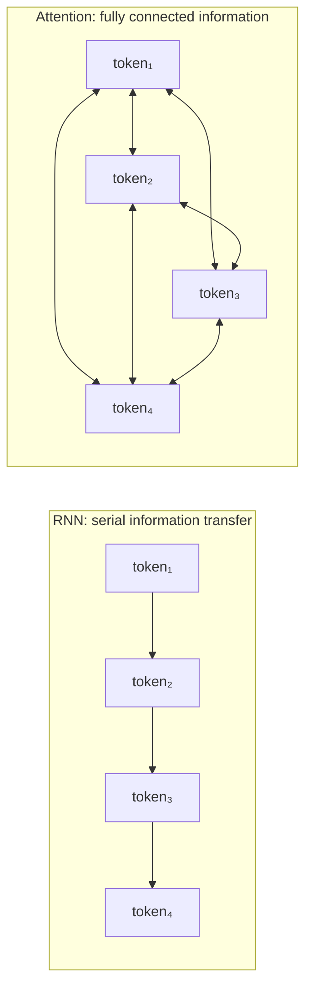
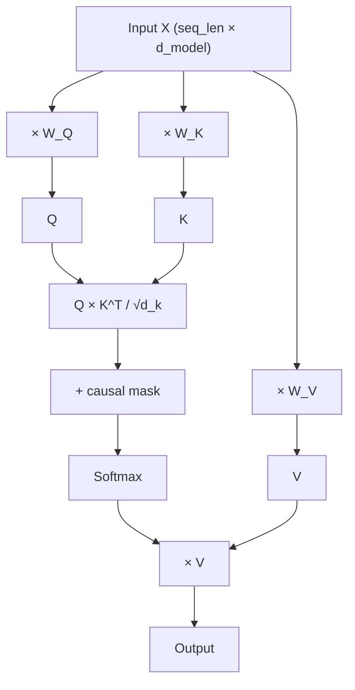
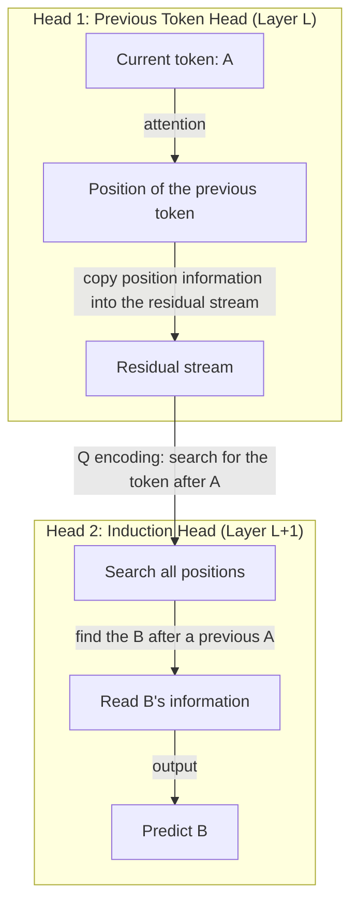
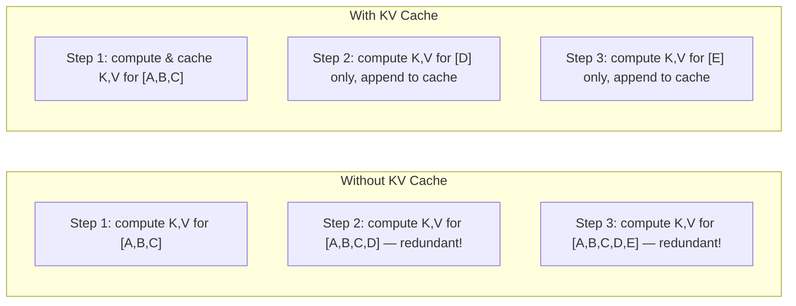
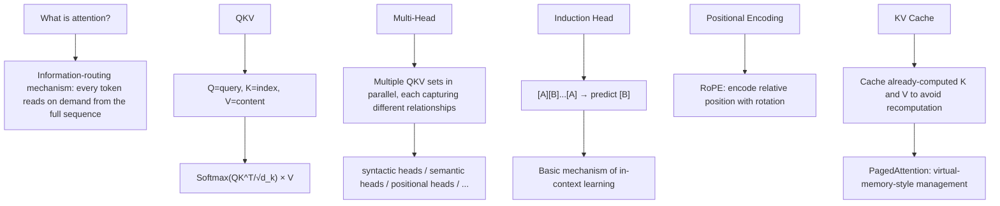

[← Previous Chapter](01-next-token.md) | [Table of Contents](../README.md) | [Next Chapter →](03-scaling.md)

**中文**: [中文](../../chapters/02-attention.md)

# Chapter 2: Attention Is Information Routing

> "Attention is all you need."
> — Vaswani et al., 2017

The term "attention" is somewhat misleading. In human cognition, attention suggests selective focus: concentrating on one stimulus while ignoring the rest. In a Transformer, however, the attention mechanism functions as a dynamic **information-routing network**: every token queries the sequence, resolving dependencies and aggregating context **on demand**.

Master the attention mechanism, and you master the conceptual engine of the Transformer; and with it, the architectural foundation of modern artificial intelligence.

---

## 2.1 The Architectural Bottleneck Attention Solves

### The Recurrent Bottleneck: Compression Through a Narrow Gate

Before Transformers, sequential modeling relied almost exclusively on Recurrent Neural Networks (RNNs). An RNN processes tokens in rigid serial succession:

```
token_1 → [h₁] → token_2 → [h₂] → token_3 → [h₃] → ... → token_n → [hₙ]
```

All historical context is compressed into a fixed-dimensional hidden vector $h$. For information to travel from $\text{token}_1$ to $\text{token}_{1000}$, it must survive 999 successive non-linear transformations. Like a game of telephone played across a thousand participants, nuanced information from early steps inevitably dissipates or distorts.

This structural flaw is the classical **long-range dependency problem**. While LSTM and GRU architectures introduced gating mechanisms to mitigate decay, they remained bounded by sequential compression.

### Attention: Direct Pairwise Routing

The Transformer bypasses this bottleneck through a conceptually straightforward yet powerful paradigm: **grant every token direct, unmediated communication channels to every other token in the sequence**.



When $\text{token}_{1000}$ requires information established by $\text{token}_1$, it retrieves it directly in a single computational step, bypassing the intermediate 998 tokens entirely.

The computational cost of this global connectivity is quadratic: $\mathcal{O}(n^2)$. For a sequence of $n$ tokens, the model must evaluate attention weights across all $n \times n$ pairs. This quadratic scaling is the primary computational barrier constraining context window sizes: processing a 100K-token context demands calculating $100\text{K} \times 100\text{K} = 10\text{ billion}$ attention scores per layer.

---

## 2.2 QKV: Query, Key, and Value Mechanics

The attention mechanism operates via three vector projections computed for each token: **Query ($Q$), Key ($K$), and Value ($V$)**.

### Intuition: The Differentiable Database Query

A clear conceptual analogy is a relational database query:

```sql
SELECT value FROM memory WHERE key MATCHES query
```

- **Query ($Q$)**: What information is this token seeking?
- **Key ($K$)**: What properties does this token advertise to others?
- **Value ($V$)**: What actual content does this token transmit if matched?

Every token simultaneously assumes all three roles: it emits a Query to probe other positions, presents a Key for other tokens to match against, and supplies a Value containing the payload to be routed.

### The Mathematical Formulation

```python
import torch
import torch.nn.functional as F

def attention(Q, K, V, mask=None):
    """
    Q, K, V: [batch, seq_len, d_k]
    """
    d_k = Q.size(-1)

    # Step 1: Compute attention scores (dot product of Q and K)
    scores = torch.matmul(Q, K.transpose(-2, -1)) / (d_k ** 0.5)
    # scores: [batch, seq_len, seq_len] — "relevance" between each pair of tokens

    # Step 2: Causal mask (for a decoder, future tokens cannot be seen)
    if mask is not None:
        scores = scores.masked_fill(mask == 0, float('-inf'))

    # Step 3: Softmax normalization → attention weights
    weights = F.softmax(scores, dim=-1)
    # weights: [batch, seq_len, seq_len] — each row sums to 1

    # Step 4: Use the weights to compute a weighted sum of V
    output = torch.matmul(weights, V)
    # output: [batch, seq_len, d_k]

    return output, weights
```

Let us examine each phase of this forward pass:

**Step 1: Compute Pairwise Affinity Scores**

The inner product of $Q$ and $K^T$ computes an unnormalized similarity matrix between all positions. A higher dot product signifies stronger semantic alignment between what position $i$ requests and what position $j$ offers.

The scaling factor $1/\sqrt{d_k}$ stabilizes the variance of the dot products. In high dimensions, unscaled dot products grow large in magnitude, pushing the softmax function into regions of near-zero gradients. Scaling guarantees stable gradient flow during backpropagation. This design is called **Scaled Dot-Product Attention**.

**Step 2: Apply the Causal Mask**

In autoregressive decoder models, token $i$ must not attend to future tokens $j > i$, as doing so would leak the ground-truth targets during training. A lower-triangular causal mask enforces this temporal constraint:

```
     t₁  t₂  t₃  t₄
t₁ [  1   0   0   0 ]    t₁ can only attend to t₁
t₂ [  1   1   0   0 ]    t₂ can attend to t₁ and t₂
t₃ [  1   1   1   0 ]    t₃ can attend to t₁, t₂, and t₃
t₄ [  1   1   1   1 ]    t₄ can attend to all previous tokens
```

Masked positions are set to $-\infty$, collapsing to zero probability following the softmax operation.

**Step 3: Softmax Normalization**

The softmax function converts raw affinity scores into normalized probability distributions across the sequence. Each token distributes its unit attention budget across all accessible preceding positions.

**Step 4: Value Aggregation**

The normalized attention weights act as routing coefficients to compute a linear combination of the Value vectors ($V$). If token 5 assigns weights of $0.70$ to token 2 and $0.20$ to token 1, its updated representation incorporates a blend of 70% of token 2's Value vector and 20% of token 1's Value vector.

### The Complete Self-Attention Dataflow



The key insight: **$Q$, $K$, and $V$ are all derived from the same input representations via learnable linear projection matrices ($W_Q, W_K, W_V$)**. Through gradient descent, the model optimizes what features to request, what features to index, and what content to propagate.

---

## 2.3 Multi-Head Attention: Parallel Cognitive Subspaces

A single set of QKV projections captures only one relational dimension at a time. Multi-head attention resolves this by **running multiple QKV projections in parallel, each specialized in distinct relational dependencies**.

```python
class MultiHeadAttention(torch.nn.Module):
    def __init__(self, d_model, n_heads):
        super().__init__()
        self.n_heads = n_heads
        self.d_k = d_model // n_heads

        # Each head has its own Q, K, V projections
        self.W_q = torch.nn.Linear(d_model, d_model)
        self.W_k = torch.nn.Linear(d_model, d_model)
        self.W_v = torch.nn.Linear(d_model, d_model)
        self.W_o = torch.nn.Linear(d_model, d_model)

    def forward(self, x, mask=None):
        batch, seq_len, d_model = x.shape

        # Project and split into multiple heads
        Q = self.W_q(x).view(batch, seq_len, self.n_heads, self.d_k).transpose(1, 2)
        K = self.W_k(x).view(batch, seq_len, self.n_heads, self.d_k).transpose(1, 2)
        V = self.W_v(x).view(batch, seq_len, self.n_heads, self.d_k).transpose(1, 2)
        # Q, K, V: [batch, n_heads, seq_len, d_k]

        # Each head performs attention independently
        out, weights = attention(Q, K, V, mask)

        # Concatenate the outputs of all heads
        out = out.transpose(1, 2).contiguous().view(batch, seq_len, d_model)

        # Final linear transformation
        return self.W_o(out)
```

### Functional Specialization Across Attention Heads

Empirical mechanistic interpretability research ([Clark et al., 2019](https://arxiv.org/abs/1906.04341)) shows that individual attention heads naturally specialize in distinct linguistic and structural roles:

- **Syntactic Heads**: Track grammatical agreement (e.g., in "The dogs **are** running," the verb "are" strongly attends to the plural subject "dogs").
- **Positional Heads**: Attend consistently to immediate local neighbors (the previous or subsequent token).
- **Coreference Heads**: Link pronouns to their antecedent referents across long narrative spans.
- **Delimiter Heads**: Route attention to sentence boundaries, periods, and special delimiter tokens.
- **Lexical Pattern Heads**: Detect compound phrases and idiomatic collocations.

This resembles a team of specialized readers analyzing the same text concurrently: one tracks syntax, another tracks pronouns, and a third tracks causal relations, before consolidating their findings into a unified representation.

### A Concrete Linguistic Example

Consider the ambiguous sentence:

> "The trophy doesn't fit in the brown suitcase because **it** is too big."

Resolving this sentence requires evaluating multiple relational planes concurrently:
- **Coreference**: What does "it" refer to? (Head 1 resolves "it" to "trophy")
- **Causal Logic**: What does "because" connect? (Head 2 links spatial constraint to size)
- **Physical Attribution**: What does "too big" modify? (Head 3 links size to the subject)
- **Syntactic Parsing**: What is the root clause structure? (Head 4 tracks the predicate)

Multi-head attention allows the model to route information across all these orthogonal dimensions simultaneously.

---

## 2.4 Induction Heads: The Foundational Circuit of In-Context Learning

### What Is an Induction Head?

Mechanistic interpretability work by Anthropic ([Olsson et al., 2022](https://arxiv.org/abs/2209.11895)) identified an emergent algorithmic circuit termed the **induction head**, which represents one of the most fundamental computational primitives learned by Transformers.

An induction head executes a universal pattern-completion algorithm:

> If the sequence previously contained pattern `[A][B]`, then upon observing `[A]` again, predict `[B]`.

```
Context: "Harry Potter is a wizard. Harry Potter is a"
                                                 ^
                                    Model predicts next token here

Execution trace of an induction head:
  1. Inspect the current token: "a"
  2. Search historical positions for prior occurrences of "a"
  3. Locate the segment "...is a wizard..."
  4. Retrieve the token immediately following "a" → "wizard"
  5. Route "wizard" into the residual stream to complete the prediction
```

### The Engine of In-Context Learning

Induction heads provide the mechanical foundation for **in-context few-shot learning**. They explain how a model adapts to arbitrary few-shot prompts without parameter updates:

```
Prompt:
  "cat → 猫
   dog → 狗
   bird → "

The induction circuit identifies the repeating transition pattern:
  [English Word] → [Chinese Translation]
  [English Word] → [Chinese Translation]
  [English Word] → ?

Prediction: "鸟"
```

The model does not need an explicit translation module; it executes **algorithmic pattern induction and copy-completion**. This simple primitive, when stacked across multiple layers, yields remarkable few-shot flexibility.

### The Two-Layer Circuit Mechanism

An induction head requires the coordinated interaction of two distinct attention heads across successive layers:



1. **Layer $L$ (Previous Token Head)**: Writes the identity of the preceding token into the current position's residual stream representation.
2. **Layer $L+1$ (Induction Head)**: Uses this enriched representation as a Query to locate earlier positions where token $A$ was followed by token $B$, then retrieves $B$'s Value vector.

This circuit illustrates how sophisticated computational behaviors emerge from composition across Transformer layers.

---

## 2.5 Positional Encoding: Imposing Spatial Geometry

### Transformers Are Permutation-Invariant by Default

The raw attention operation is entirely **permutation-invariant**. If the input token sequence is shuffled arbitrarily, the resulting attention weights reorder identically, but the pairwise computation itself remains invariant.

Consequently, without explicit positional injection, a Transformer cannot distinguish between:
- "The cat ate the fish" and "The fish ate the cat"

both sequences possess identical unordered bags of token embeddings.

### RoPE: Rotary Position Embedding

The preeminent positional encoding technique across modern LLMs is **Rotary Position Embedding (RoPE)** ([Su et al., 2021](https://arxiv.org/abs/2104.09864)).

The core intuition is geometric: RoPE injects positional information by **rotating Query and Key vectors in the complex plane**. The inner product between two tokens at positions $m$ and $n$ depends purely on their **relative distance** $m - n$, rather than their absolute coordinates.

```python
import torch

def apply_rope(x, positions, d_model):
    """
    x: [batch, seq_len, d_model] — Q or K vector
    positions: [seq_len] — position indices
    """
    # Frequencies: different dimensions use different frequencies
    freqs = 1.0 / (10000 ** (torch.arange(0, d_model, 2).float() / d_model))
    # [d_model/2]

    # Angle = position × frequency
    angles = positions.unsqueeze(-1) * freqs.unsqueeze(0)
    # [seq_len, d_model/2]

    cos_angles = torch.cos(angles)
    sin_angles = torch.sin(angles)

    # Process the even and odd dimensions of x separately
    x_even = x[..., 0::2]  # even dimensions
    x_odd  = x[..., 1::2]  # odd dimensions

    # Rotate
    x_rotated_even = x_even * cos_angles - x_odd * sin_angles
    x_rotated_odd  = x_even * sin_angles + x_odd * cos_angles

    # Interleave and concatenate
    x_rotated = torch.stack([x_rotated_even, x_rotated_odd], dim=-1)
    return x_rotated.flatten(-2)
```

RoPE exhibits several compelling theoretical and practical properties:
- Relative positional awareness naturally decays as distance increases, mimicking linguistic intuition.
- It requires zero learnable parameters, preserving model parameter efficiency.
- It enables dynamic context length extension via frequency interpolation techniques (e.g., YaRN, RoPE scaling).

### The Context Window: A Rigid Attention Horizon

Every LLM possesses a defined **context window**: the maximum sequence length it can ingest in a single forward pass:

```
GPT-4o:      128K tokens
Claude 3.5:  200K tokens
Gemini 1.5:  1M–2M tokens
```

Context windows are bounded by three architectural bottlenecks:
1. **Computational Complexity**: Quadratic $\mathcal{O}(n^2)$ FLOP scaling per forward pass.
2. **VRAM Footprint**: Linear growth of the Key-Value (KV) cache during autoregressive generation.
3. **Positional Generalization**: Degradation when extrapolating RoPE beyond pretraining sequence lengths.

Tokens beyond the context window boundary simply do not exist to the model; this is a strict structural boundary, not a soft degradation.

---

## 2.6 The KV Cache: Eliminating Redundant Inference Computation

### The Problem: Quadratic Redundancy in Autoregressive Generation

Consider the sequential generation loop:

```
Step 1: Input [A, B, C]       → Predict D
Step 2: Input [A, B, C, D]     → Predict E
Step 3: Input [A, B, C, D, E]   → Predict F
```

In Step 2, recalculating the Key and Value representations for $A$, $B$, and $C$ produces identical results to Step 1 because causal masking prevents future tokens from altering past states. Recomputing past tokens at every step leads to quadratic computational waste: $\mathcal{O}(n^2)$ work to generate $n$ tokens.

### The Solution: KV Caching

By caching the already-computed $K$ and $V$ tensors across all previous positions, the forward pass at step $t$ requires computing $Q, K, V$ **only for the single newly generated token**:

```python
class CachedAttention:
    def __init__(self):
        self.k_cache = None  # Cache K for all generated tokens
        self.v_cache = None  # Cache V for all generated tokens

    def forward(self, x_new, W_q, W_k, W_v):
        """x_new: representation of only the new token"""
        # Compute Q, K, and V only for the new token
        q_new = x_new @ W_q
        k_new = x_new @ W_k
        v_new = x_new @ W_v

        # Append the new K and V to the cache
        if self.k_cache is not None:
            self.k_cache = torch.cat([self.k_cache, k_new], dim=1)
            self.v_cache = torch.cat([self.v_cache, v_new], dim=1)
        else:
            self.k_cache = k_new
            self.v_cache = v_new

        # Q is only for the new token, but K and V cover the full history
        scores = torch.matmul(q_new, self.k_cache.transpose(-2, -1))
        weights = F.softmax(scores / (self.d_k ** 0.5), dim=-1)
        output = torch.matmul(weights, self.v_cache)

        return output
```



### The Memory Footprint of the KV Cache

The KV cache fundamentally trades VRAM memory for computational throughput. For a standard 70B parameter model:

```
KV cache memory per layer per token:
  = 2 (K and V) × n_heads × d_head × sizeof(float16)
  = 2 × 64 × 128 × 2 bytes
  = 32 KB per layer per token

80 layers × 32 KB = 2.56 MB per token

For a 128K context sequence:
  128,000 × 2.56 MB ≈ 327 GB — exceeding the model weight footprint itself!
```

This explains why long-context serving is primarily a **memory bandwidth and capacity bottleneck** rather than a pure compute problem.

### PagedAttention: OS-Inspired Memory Virtualization

To address severe VRAM fragmentation caused by dynamic sequence lengths, [vLLM](https://github.com/vllm-project/vllm) introduced **PagedAttention** ([Kwon et al., 2023](https://arxiv.org/abs/2309.06180)):

```
Traditional Allocation: Preallocates contiguous VRAM for maximum theoretical context length
  → Massive internal and external memory fragmentation (wasting 60-80% of VRAM).

PagedAttention: Partitions the KV cache into discrete, fixed-size virtual pages
  → Allocates physical memory blocks on demand, eliminating contiguous constraints
  → Mirrors virtual memory paging in classical operating systems
  → Increases serving batch size and system throughput by 2× to 4×.
```

This optimization directly dictates serving economics, hardware concurrency, and inference unit costs.

---

## 2.7 Mechanistic Visualization: Inspecting Attention in Practice

Theoretical models crystallize when observed empirically across trained networks.

### Tooling: Interactive Probing with BertViz

[BertViz](https://github.com/jessevig/bertviz) allows developers to inspect layer-by-layer attention distributions interactively:

```python
from bertviz import head_view
from transformers import AutoTokenizer, AutoModel

model_name = "bert-base-uncased"
tokenizer = AutoTokenizer.from_pretrained(model_name)
model = AutoModel.from_pretrained(model_name, output_attentions=True)

text = "The cat sat on the mat because it was tired."
inputs = tokenizer(text, return_tensors="pt")
outputs = model(**inputs)

attention = outputs.attentions  # tuple of (batch, heads, seq, seq)
tokens = tokenizer.convert_ids_to_tokens(inputs["input_ids"][0])

head_view(attention, tokens)
```

### Archetypal Attention Circuits

**1. Subject-Verb Agreement Circuits**

```
"The dogs in the park are running fast"

   dogs ←←←←←←←←←← are
   (Head 3, Layer 5 focuses precisely on plural agreement across intervening clauses)
```

Even across lengthy prepositional phrases, agreement heads reliably route syntactic dependencies.

**2. Coreference Resolution Circuits**

```
"Alice told Bob that she would help him tomorrow"

   she →→→→→→→→→→→ Alice    (binds pronoun to feminine entity)
   him →→→→→→→→→ Bob       (binds pronoun to masculine entity)
```

**3. Positional and Local Context Heads**

Specialized heads allocate uniform mass to adjacent neighbors ($t-1, t+1$), manifesting as sharp diagonal bands in attention heatmaps.

**4. Delimiter and Global Broadcast Heads**

Heads that pool attention onto periods, paragraph breaks, or special tokens (`[CLS]`, `<|im_start|>`), serving as semantic aggregation hubs across sentences.

### Hierarchical Abstraction Across Layers

Empirical probing of Transformer architectures reveals a consistent hierarchical progression:
- **Early Layers**: Specialize in tokenization artifacts, immediate local n-grams, and low-level syntactic parsing.
- **Middle Layers**: Assemble syntactic trees, resolve coreference, and track entity relations.
- **Deep Layers**: Perform complex semantic integration, abstract reasoning, and factual retrieval for next-token emission.

---

## Chapter Summary



Core takeaways:

1. **Attention is dynamic routing**, not passive filtering: every token queries and aggregates context across the entire sequence.
2. The **QKV triad** forms the core computational engine: Queries search, Keys match, and Values deliver the information payload.
3. **Multi-Head Attention** enables concurrent projection into multiple orthogonal relational subspaces.
4. **Induction Heads** represent the primitive two-layer algorithmic circuits powering in-context learning.
5. **RoPE** imposes spatial geometry by rotating feature vectors in the complex plane based on relative position.
6. **KV Caching** trades memory for computational efficiency, forming the backbone of autoregressive serving.
7. **The context window is a hard boundary**: tokens beyond the limit cannot participate in the attention graph.

In the next chapter, we explore what occurs when these attention circuits are scaled by orders of magnitude: the phenomenon of scaling laws and emergent capabilities.

---

## Further Reading

- [Attention Is All You Need](https://arxiv.org/abs/1706.03762) — Vaswani et al., 2017 (The seminal Transformer paper)
- [In-context Learning and Induction Heads](https://arxiv.org/abs/2209.11895) — Olsson et al., 2022
- [What Does BERT Look At?](https://arxiv.org/abs/1906.04341) — Clark et al., 2019
- [RoFormer: Enhanced Transformer with Rotary Position Embedding](https://arxiv.org/abs/2104.09864) — Su et al., 2021
- [Efficient Memory Management for Large Language Model Serving with PagedAttention](https://arxiv.org/abs/2309.06180) — Kwon et al., 2023
- [BertViz](https://github.com/jessevig/bertviz) — Interactive attention visualization toolkit
- [A Mathematical Framework for Transformer Circuits](https://transformer-circuits.pub/2021/framework/index.html) — Elhage et al., 2021
