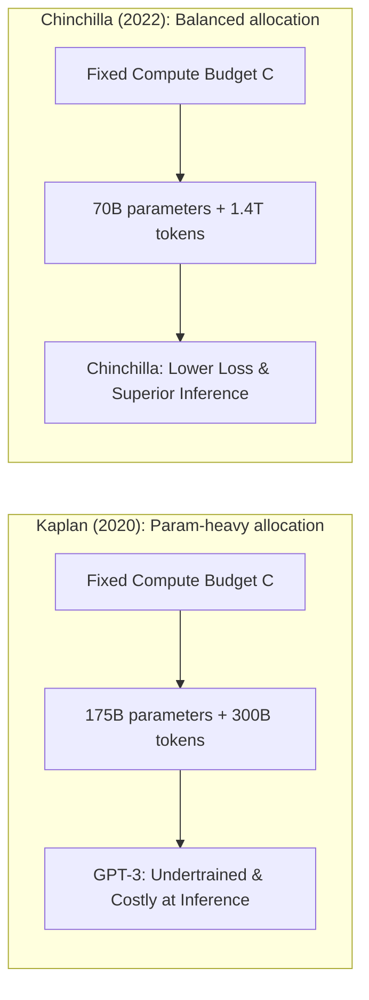
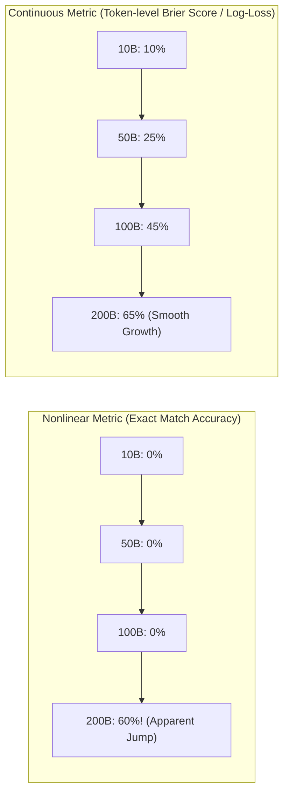
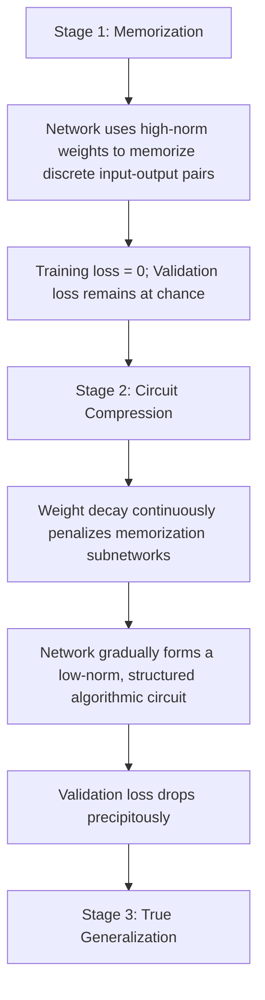
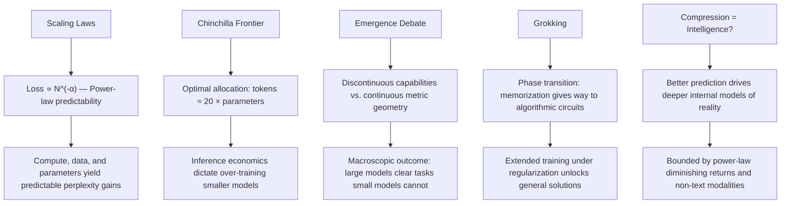

[← Previous Chapter](02-attention.md) | [Table of Contents](../README.md) | [Next Chapter →](04-alignment.md)

**中文**: [中文](../../chapters/03-scaling.md)

# Chapter 3: Emergence from Scale

> "The unreasonable effectiveness of scale."
> — An AI adaptation of Eugene Wigner's famous thesis

Over the past decade, the most consequential discovery in artificial intelligence was not a bespoke architectural tweak, but a stark empirical realization: **expand parameter capacity, ingest larger text corpora, scale compute budget, and model performance advances with rigorous predictability**.

This finding defied classical machine learning intuitions, where expanding model capacity without strict inductive biases was long presumed to invite severe overfitting. The convergence of the Transformer architecture, massive web-scale corpora, and modern GPU clusters established a new foundational doctrine: scale is not merely an engineering multiplier; it is an engine of capability.

In this chapter, we analyze why scaling laws hold, how compute-optimal frontiers govern training efficiency, and how quantitative scale translates into qualitative behavioral emergence.

---

## 3.1 Scaling Laws: Predictable Trajectories of Progress

### Empirical Power-Law Regimes

In 2020, Jared Kaplan and collaborators at OpenAI published their landmark empirical study, [*Scaling Laws for Neural Language Models*](https://arxiv.org/abs/2001.08361). They revealed that the cross-entropy test loss of autoregressive Transformers adheres to precise **power-law relationships** governed by three core variables:

$$L(N) \approx \left(\frac{N_c}{N}\right)^{\alpha_N} \quad \text{(parameter count } N\text{)}$$

$$L(D) \approx \left(\frac{D_c}{D}\right)^{\alpha_D} \quad \text{(dataset tokens } D\text{)}$$

$$L(C) \approx \left(\frac{C_c}{C}\right)^{\alpha_C} \quad \text{(total compute } C\text{)}$$

where empirical exponents were initially estimated at $\alpha_N \approx 0.076$, $\alpha_D \approx 0.095$, and $\alpha_C \approx 0.050$.

### Log-Log Linearity: The Straight Line That Reshaped the Industry

When cross-entropy test loss is plotted against compute, parameters, or data tokens on log-log scales, the empirical data points collapse into a striking, unbroken straight line:

```
log(Loss)
    |
    |\
    | \
    |  \
    |   \
    |    \
    |     \
    |      \___________  ← No empirical saturation across initial orders of magnitude
    |
    +-----------------------> log(Compute)
```

This structural regularity established three transformative engineering implications:

1. **Predictability**: Researchers can accurately forecast the loss profile of a frontier trillion-parameter model by extrapolating small-scale runs.
2. **Deterministic Returns**: Each tenfold increase in compute yields a predictable, quantifiable decrement in perplexity.
3. **Absence of Immediate Ceilings**: Across multiple orders of magnitude, the scaling curve showed no catastrophic inflection point or sudden plateau.

This mathematical certainty provided the capital justification for tech conglomerates to invest billions of dollars constructing massive GPU superclusters: **the return on compute investment was de-risked into a known engineering gradient**.

### Concrete Mathematical Approximation

```python
import numpy as np

# Scaling law approximation (simplified version)
def estimated_loss(params_billions, data_tokens_billions):
    """Estimate loss from parameter count and data size"""
    N_c = 8.8e13   # characteristic scale for parameter count
    D_c = 5.4e13   # characteristic scale for data size
    alpha_N = 0.076
    alpha_D = 0.095

    N = params_billions * 1e9
    D = data_tokens_billions * 1e9

    loss_N = (N_c / N) ** alpha_N
    loss_D = (D_c / D) ** alpha_D

    # Simplification: use a harmonic-style approximation of the two
    return max(loss_N, loss_D)

# Estimated loss at different scales
for params in [1, 7, 70, 405]:
    for data in [1000, 5000, 15000]:
        loss = estimated_loss(params, data)
        print(f"{params:>4}B params, {data:>5}B tokens → loss ≈ {loss:.3f}")
```

### The Compute Envelope

Total pretraining compute for a standard Transformer is well-approximated by $C \approx 6ND$ floating-point operations (FLOPs), where $N$ is non-embedding parameter count and $D$ is token volume (3 FLOPs per parameter per token on the forward pass, and 3 FLOPs on the backward pass). Under a fixed computational budget $C$, deciding how to split resources between model size $N$ and token volume $D$ becomes a constrained optimization problem.

---

## 3.2 Chinchilla and Compute-Optimal Allocation

### The Chinchilla Paradigm

In 2022, Jordan Hoffmann and colleagues at DeepMind published [*Training Compute-Optimal Large Language Models*](https://arxiv.org/abs/2203.15556), introducing the **Chinchilla scaling laws**.

DeepMind demonstrated that Kaplan's original formulation had underestimated the importance of token volume due to a suboptimal learning rate schedule. Their revised analysis proved that **under a constrained training compute budget, parameters $N$ and tokens $D$ should scale in equal geometric proportion**:

$$N_{opt} \propto C^{0.5}, \quad D_{opt} \propto C^{0.5}$$

This yields a fundamental rule of thumb: **the compute-optimal dataset size is approximately 20 tokens per model parameter**.

```
Model Parameter Count     Compute-Optimal Token Volume
1B parameters             → 20B tokens
7B parameters             → 140B tokens
70B parameters            → 1.4T tokens
175B parameters           → 3.5T tokens
```

### The Undertraining of First-Generation LLMs

Under the Chinchilla frontier, GPT-3 (175B parameters) should have been trained on roughly 3.5 trillion tokens; its actual training corpus was only 300 billion tokens. GPT-3 was **massively undertrained**.

To validate this, DeepMind trained Chinchilla: a 70B parameter model trained on 1.4 trillion tokens. Despite using identical aggregate training FLOPs as GPT-3, Chinchilla decisively outperformed GPT-3 across virtually every linguistic and mathematical benchmark, while being cheaper to run during downstream inference.



### Inference-Optimal Over-Training

While Chinchilla optimizes **training compute efficiency** (achieving the lowest loss per pretraining FLOP), commercial reality is governed by **lifecycle Total Cost of Ownership (TCO)**.

A 70B model incurs roughly ten times the memory bandwidth and inference FLOP cost of a 7B model per generated token. When a model is destined to serve billions of user queries in production, it is economically superior to "over-train" a smaller model far past its Chinchilla optimum during pretraining.

This rationale drove Meta's **LLaMA** family ([Touvron et al., 2023](https://arxiv.org/abs/2302.13971)):

```
LLaMA-7B:    Trained on 1.0T tokens (Chinchilla optimum ≈ 140B)
LLaMA-13B:   Trained on 1.0T tokens (Chinchilla optimum ≈ 260B)
LLaMA-3-8B:  Trained on 15.0T tokens (Over-trained by ~100×)

→ Front-load compute into pretraining to minimize per-token serving cost in perpetuity.
```

### The Looming Data Wall

Compute-optimal scaling exposes a looming physical constraint: frontier models require tens of trillions of high-quality tokens, yet accessible, high-grade human linguistic data on the open web is fundamentally finite:

```
Estimated high-quality public text:   ~10–15T tokens
All written human historical output:   ~100T tokens (all languages, formats, and archives)

LLaMA-3 (405B) pretraining corpus:    15T tokens
Frontier 2025–2026 pretraining runs:  30T–50T tokens (saturating available raw web text)
```

As the industry approaches this **data wall**, progress increasingly relies on three frontiers: algorithmic data curation and deduplication, high-fidelity synthetic data generation (using frontier models to teach successor models), and multimodal ingestion (grounding models in audio, image, and video token streams).

---

## 3.3 Emergence: Phase Transitions vs. Measurement Artifacts

### Defining Emergent Capabilities

While scaling laws describe a smooth, continuous power-law decrease in test loss, individual downstream capabilities often appear to manifest discontinuously.

Jason Wei and colleagues ([Wei et al., 2022](https://arxiv.org/abs/2206.07682)) codified this as **emergent abilities**:

> Capabilities that are entirely absent in smaller models, but manifest abruptly once computational scale surpasses a critical threshold.

### Canonical Examples of Apparent Emergence

**Multi-Step Arithmetic**:
```
Model Scale   "23 + 47 = ?"      "237 + 418 = ?"     "23 × 47 = ?"
1B            ✗ Random guess      ✗ Random guess      ✗ Random guess
10B           ✓ Reliable          ✗ Sporadic          ✗ Random guess
100B+         ✓ Reliable          ✓ High accuracy     ✓ Emerging capability
```

**Anagram Solving and Cipher Decoding**:
```
Task: "dnuorgkcab" → "background"

Model Scale   Exact-Match Accuracy
<10B          ≈ 0% (incoherent completions)
10B–50B       ≈ 0% (still unable)
>100B         ≈ 50%+ (sudden transition to accurate inversion)
```

**Chain-of-Thought (CoT) Prompting**:
```
Small Models (<10B) + CoT  → Accuracy flatlines or degrades (distracted by intermediate tokens)
Large Models (>100B) + CoT → Dramatic, non-linear jump in multi-step problem solving
```

### The Mirage Debate: Nonlinear Metrics vs. Continuous Geometry

In 2023, Stanford researchers ([Schaeffer et al., 2023](https://arxiv.org/abs/2304.15004)) challenged this paradigm with a provocative thesis: **emergent abilities may be largely an artifact of discontinuous evaluation metrics**.

Their core argument is mathematical:

```
Consider an arithmetic evaluation scored with an all-or-nothing exact match metric:
  Accuracy = (Correct Answer) / (Total Questions)

For a 3-step arithmetic problem requiring 3 accurate tokens:
  If a small model predicts each step with p = 0.50:
    Sequence Accuracy = 0.50³ = 0.125 (near-zero exact match)
  If a large model predicts each step with p = 0.85:
    Sequence Accuracy = 0.85³ = 0.614 (sharp jump to 61%)

Although per-token log-probabilities improve linearly with scale,
the non-linear exact-match metric creates an illusion of sudden, discontinuous emergence.
```



### The Pragmatic Takeaway: Qualitative Realities for System Architects

Whether one frames emergence as a continuous mathematical progression or a macroscopic phase transition, the practical reality for software engineers is identical: **there exist task domains where small models produce unusable gibberish and large models deliver reliable execution**.

Engineering guidelines:
- **Calibrate Model Size to Reasoning Depth**: Do not deploy a 70B model for simple extraction, nor expect a 3B model to succeed at multi-step constraint satisfaction.
- **Avoid Premature Capability Dismissal**: Zero accuracy on a small prototype model does not prove a task is beyond LLM capability; frontier models may cross the viability threshold.
- **Scaffold Prompting to Parameter Scale**: Complex prompting patterns such as Chain-of-Thought, Reflection, and Tree-of-Thought are generally effective only when model capacity is sufficient to leverage extended intermediate context.

---

## 3.4 Grokking: Delayed Insight

### What Is Grokking?

In 2022, [Power et al.](https://arxiv.org/abs/2201.02177) discovered a surprising phenomenon in a simple experiment:

> Training loss drops to 0 very early (the training set has been perfectly memorized), but test loss remains high for a long time, and then test loss **suddenly** drops too.

## 3.4 Grokking: Delayed Generalization and Circuit Formation

### What Is Grokking?

In 2022, researchers at OpenAI ([Power et al., 2022](https://arxiv.org/abs/2201.02177)) documented a striking optimization phenomenon in algorithmic networks termed **grokking**:

> Training loss collapses to near-zero early in training (indicating complete memorization of the training set), while validation loss remains elevated at chance levels for tens of thousands of steps, before **suddenly** collapsing into near-perfect generalization.

```
Optimization Timeline →

Train Loss:  ████▁▁▁▁▁▁▁▁▁▁▁▁▁▁▁▁▁▁▁▁▁▁▁▁▁▁  (rapidly collapses to 0)
Val Loss:    ████████████████████████████▁▁▁▁  (flatlines, then abruptly plummets)
                                    ^
                                "Grokking" Event:
                 Phase transition from rote lookup to algorithmic generalization
```

### An Empirical Case: Modular Arithmetic

Power and colleagues demonstrated this on modular addition:

```
Task: Learn the mapping (a + b) mod 97

Training Split: Uniform 50% subset of all 9,409 pairs
Validation Split: Unseen remaining 50%

Optimization Trajectory:
- Epoch 100:    Train Acc: 100%,  Val Acc: ~20% (Random chance)
- Epoch 1,000:  Train Acc: 100%,  Val Acc: ~20% (Pure lookup memorization)
- Epoch 10,000: Train Acc: 100%,  Val Acc: ~20% (Persistent memorization)
- Epoch 30,000: Train Acc: 100%,  Val Acc: 99.2% (Sudden algorithmic breakthrough)
```

The network first **memorizes** the training dataset via uncoordinated parameter paths; with extended training under regularization, it discovers a clean, generalizable algorithmic solution.

### Mechanistic Explanation of Grokking

Why does this delayed breakthrough occur? Mechanistic interpretability research provides a coherent framework:



Neel Nanda and colleagues ([Nanda et al., 2023](https://arxiv.org/abs/2301.05217)) analyzed the internal representations of modular addition networks and discovered that the grokked circuit computes addition using **discrete Fourier transforms and trigonometric identities**: an optimal, compact algorithmic representation rather than an unstructured memorization table.

### Engineering Implications

Grokking challenges standard machine learning dogmas regarding early stopping:

1. **Zero Training Loss Is Not a Termination Criterion**: Generalization circuits may still be consolidating in the weight geometry.
2. **Regularization Drives Representation Quality**: Weight decay is the active force dismantling memorization circuits in favor of compact algorithmic representations.
3. **Internal Representation Formation Is Often Non-Linear**: A model showing flat validation accuracy may be silently assembling partial sub-circuits that suddenly click into alignment.

While grokking is most cleanly observed in synthetic algorithmic settings, it provides valuable conceptual intuition for how deep networks transition from memorizing training facts to learning underlying reasoning abstractions.

---

## 3.5 The Philosophical Horizon: Is Intelligence Simply Compression?

### The Legacy of the Hutter Prize

Marcus Hutter, formulator of the universal mathematical intelligence model AIXI, established the **Hutter Prize** under the foundational thesis that **algorithmic compression and intelligence are fundamentally identical**.

To compress a dataset efficiently, an algorithm must discover the invariant generative laws governing the data. A lossless compressor is, by definition, an optimal predictor: eliminating statistical redundancy requires anticipating the next symbol with maximal accuracy.

The cross-entropy loss driving modern LLMs directly minimizes the Shannon entropy of human text:

$$H = -\sum P(x) \log P(x)$$

Lower cross-entropy loss strictly implies superior compression; which in turn requires learning deeper latent abstractions of the generating distribution.

### The Ideal Predictor Thought Experiment

Consider a hypothetical language model that achieves optimal theoretical loss ($L \to 0$ across all human discourse). What must such an entity internalize?

- **Universal World Knowledge**: To predict factual claims without error.
- **Formal Logical Deduction**: To anticipate the conclusion of multi-step proofs.
- **Cognitive Theory of Mind**: To predict conversational turns and human psychological reactions.
- **Intuitive Physical Dynamics**: To anticipate descriptions of real-world physical causal chains.

In the asymptotic limit, an optimal next-token predictor is **functionally indistinguishable from an Artificial General Intelligence**.

### Structural Boundaries of the Pure Scaling Paradigm

While scaling compute and parameters is remarkably effective, empirical boundaries exist:

**1. Power-Law Returns Demand Exponential Resources**

```
Loss 3.0 → 2.5: Requires ~10× Compute
Loss 2.5 → 2.0: Requires ~100× Compute
Loss 2.0 → 1.5: Requires ~1,000× Compute
```

As the curve flattens, each incremental fraction of a perplexity point demands orders of magnitude more energy, silicon, and capital.

**2. Asymmetries in Text-Only Grounding**

Certain cognitive modalities are inefficiently encoded in flat text:
- High-bandwidth spatial and motor coordination
- Formal mathematical verification (demanding symbolic constraint solvers rather than statistical sampling)
- Extended planning and tree search (requiring test-time deliberation rather than greedy token generation)

**3. The Imperative of Data Quality**

Scaling on low-fidelity, noisy corpora yields larger low-fidelity models. Modern frontiers prioritize synthetic data generation, automated filtering, and post-training reinforcement learning over raw data volume.

### Architectural Decision Framework for Model Sizing

```python
def select_model_tier(task_complexity: str, latency_sla_ms: int, budget_tier: str) -> dict:
    """
    Architectural decision heuristic for production LLM selection.
    """
    tiers = {
        "edge_or_embedded": {
            "parameter_range": "1B - 3B",
            "archetypes": ["Llama-3.2-1B/3B", "Qwen-2.5-1.5B/3B"],
            "target_tasks": "Local entity extraction, token classification, edge device query routing",
            "tradeoffs": "Sub-10ms TTFT, zero external API latency, minimal multi-step reasoning"
        },
        "workhorse_utility": {
            "parameter_range": "7B - 14B",
            "archetypes": ["Llama-3.1-8B", "Qwen-2.5-7B/14B", "Mistral-7B"],
            "target_tasks": "Summarization, structured JSON parsing, standard code completion",
            "tradeoffs": "Single-GPU deployment, cost-efficient high-throughput serving"
        },
        "high_capacity_reasoning": {
            "parameter_range": "32B - 70B",
            "archetypes": ["Llama-3.3-70B", "Qwen-2.5-72B", "DeepSeek-V3"],
            "target_tasks": "Complex multi-step reasoning, dense coding, analytical synthesis",
            "tradeoffs": "Multi-GPU tensor parallelism required, higher latency, near-frontier fidelity"
        },
        "frontier_class": {
            "parameter_range": "200B+ / Dense or MoE",
            "archetypes": ["Claude 3.5 Sonnet", "GPT-4o", "DeepSeek-R1"],
            "target_tasks": "Autonomous software development, deep research, complex agent orchestration",
            "tradeoffs": "Highest unit token cost, managed API dependency, maximum cognitive ceiling"
        }
    }
    return tiers.get(task_complexity, tiers["workhorse_utility"])
```

---

## Chapter Summary



Core takeaways:

1. **Scaling laws de-risk AI development**: Predictable power-law loss curves transform training from trial-and-error into an empirical engineering science.
2. **Compute-optimal balance matters**: Chinchilla established that parameter count and token volume must scale proportionally.
3. **Inference economics govern deployment**: Modern open models are heavily over-trained relative to the Chinchilla point to minimize long-term serving TCO.
4. **Emergence reflects capability thresholds**: Whether driven by phase transitions or nonlinear evaluation metrics, large models cross critical thresholds unavailable to smaller networks.
5. **Grokking reveals circuit crystallization**: Deep neural networks can transition abruptly from brute-force memorization to structured algorithmic reasoning.

In the next chapter, we examine the bridge from raw statistical base models to cooperative conversational agents: the science of post-training and alignment.

---

## Further Reading

- [Scaling Laws for Neural Language Models](https://arxiv.org/abs/2001.08361) — Kaplan et al., OpenAI, 2020
- [Training Compute-Optimal Large Language Models (Chinchilla)](https://arxiv.org/abs/2203.15556) — Hoffmann et al., DeepMind, 2022
- [Emergent Abilities of Large Language Models](https://arxiv.org/abs/2206.07682) — Wei et al., 2022
- [Are Emergent Abilities of Large Language Models a Mirage?](https://arxiv.org/abs/2304.15004) — Schaeffer et al., 2023
- [Grokking: Generalization Beyond Overfitting on Small Algorithmic Datasets](https://arxiv.org/abs/2201.02177) — Power et al., 2022
- [Progress Measures for Grokking via Mechanistic Interpretability](https://arxiv.org/abs/2301.05217) — Nanda et al., 2023
- [LLaMA: Open and Efficient Foundation Language Models](https://arxiv.org/abs/2302.13971) — Touvron et al., Meta AI, 2023
- [The Bitter Lesson](http://www.incompleteideas.net/IncIdeas/BitterLesson.html) — Rich Sutton, 2019
