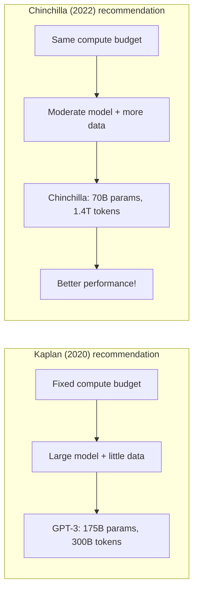
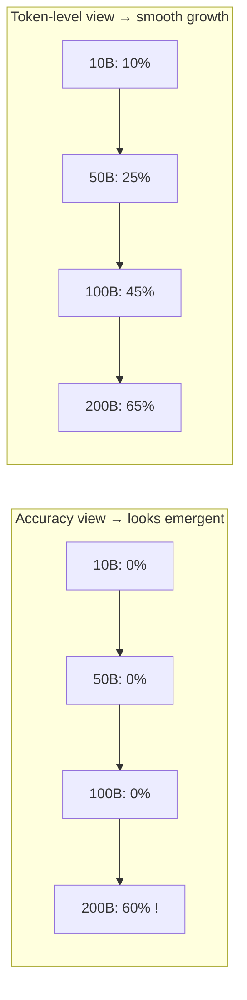
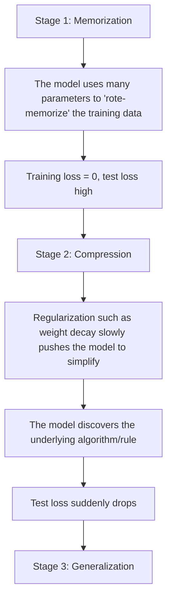
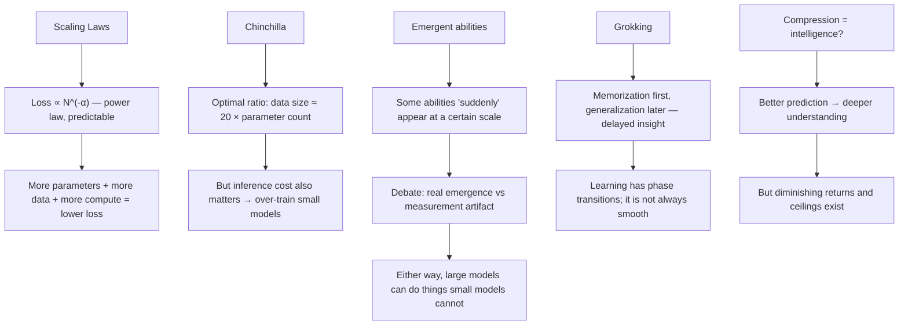

[← Previous Chapter](02-attention.md) | [Table of Contents](../README.md) | [Next Chapter →](04-alignment.md)

**中文**: [中文](../../chapters/03-scaling.md)

# Chapter 3: Emergence from Scale

> "The unreasonable effectiveness of scale."
> — An AI adaptation of Wigner's famous phrase

Over the past five years, the most profound discovery in AI has not been a new algorithm, but a simple fact: **make models larger, train on more data, use more compute, and performance improves in a predictable way**.

This was not an obvious conclusion. For most of machine learning history, "making things bigger" meant overfitting and waste. But the combination of Transformers and big data broke this pattern and gave rise to a new paradigm: **scale is all you need**.

In this chapter, we will examine why scale works, when scale fails, and how it gives rise to abilities we did not anticipate.

---

## 3.1 Scaling Laws: Predictable Progress

### Power-Law Relationships

In 2020, Kaplan and colleagues at OpenAI published an industry-changing paper, [Scaling Laws for Neural Language Models](https://arxiv.org/abs/2001.08361). They found that the test loss of language models follows a **power-law relationship** with three factors:

$$L(N) \approx \left(\frac{N_c}{N}\right)^{\alpha_N} \quad \text{(parameter count N)}$$

$$L(D) \approx \left(\frac{D_c}{D}\right)^{\alpha_D} \quad \text{(data size D)}$$

$$L(C) \approx \left(\frac{C_c}{C}\right)^{\alpha_C} \quad \text{(compute C)}$$

where $\alpha_N \approx 0.076$, $\alpha_D \approx 0.095$, and $\alpha_C \approx 0.050$.

### Log-Log Plots: One Straight Line Changed Everything

When you plot loss against parameter count, data size, or compute on log-log axes, you see an almost perfect **straight line**:

```
log(Loss)
    |
    |\
    | \
    |  \
    |   \
    |    \
    |     \
    |      \___________  ← No bend in the curve yet!
    |
    +-----------------------> log(Compute)
```

This means:

1. **Predictability**: you can predict the performance of larger models in advance, without training them first
2. **Clear return on investment**: 10x more compute → a fixed proportional drop in loss
3. **No obvious bend in the curve**: at the scales studied at the time, the power-law relationship had not flattened out

This is why technology companies were willing to invest tens of billions of dollars in training larger models: **the returns were predictable**.

### A Concrete Example

```python
import numpy as np

# Scaling law approximation (simplified version)
def estimated_loss(params_billions, data_tokens_billions):
    """Estimate loss from parameter count and data size"""
    N_c = 8.8e13   # characteristic scale for parameter count
    D_c = 5.4e13   # characteristic scale for data size
    alpha_N = 0.076
    alpha_D = 0.095

    N = params_billions * 1e9
    D = data_tokens_billions * 1e9

    loss_N = (N_c / N) ** alpha_N
    loss_D = (D_c / D) ** alpha_D

    # Simplification: use a harmonic-style approximation of the two
    return max(loss_N, loss_D)

# Estimated loss at different scales
for params in [1, 7, 70, 405]:
    for data in [1000, 5000, 15000]:
        loss = estimated_loss(params, data)
        print(f"{params:>4}B params, {data:>5}B tokens → loss ≈ {loss:.3f}")
```

### A Unified View of Compute

Kaplan also found that if you look only at total compute C (≈ 6ND, where N is parameter count and D is the number of training tokens), loss follows the "cleanest" pattern. This means that, under a fixed compute budget, allocating parameters and data is an **optimization problem**.

---

## 3.2 Chinchilla and Optimal Allocation

### The Chinchilla Law

In 2022, Hoffmann and colleagues at DeepMind published [Training Compute-Optimal Large Language Models](https://arxiv.org/abs/2203.15556), usually called the **Chinchilla paper**.

The core finding: **given a fixed compute budget, parameter count N and training data size D should grow in equal proportion**.

$$N_{opt} \propto C^{0.5}, \quad D_{opt} \propto C^{0.5}$$

A rough rule of thumb: **optimal data size ≈ 20 × parameter count**.

```
Model parameter count    Optimal number of training tokens
1B          → 20B tokens
7B          → 140B tokens
70B         → 1.4T tokens
175B        → 3.5T tokens
```

### GPT-3 Was Undertrained

According to the Chinchilla law, GPT-3 (175B parameters) should have been trained on about 3.5T tokens, but in practice it used only 300B tokens: it was **severely undertrained**. With the same compute budget, a smaller but better-performing model could have been trained by following the Chinchilla-optimal allocation.

DeepMind trained a 70B-parameter Chinchilla model using the same compute budget as GPT-3, and it outperformed GPT-3 on almost all benchmarks.



### Over-Training

In practice, however, the story is more complex. The Chinchilla law optimizes **training efficiency**: reaching the lowest loss with the least compute. Real-world deployment also has to consider **inference efficiency**.

The inference cost of a 70B model is far higher than that of a 7B model. If your application needs high-throughput inference, an "over-trained" smaller model (trained on far more data than the Chinchilla optimum) may have a lower overall cost.

This is the idea behind Meta's training of **LLaMA** ([Touvron et al. 2023](https://arxiv.org/abs/2302.13971)):

```
LLaMA-7B:   trained on 1T tokens (Chinchilla optimum ≈ 140B)
LLaMA-13B:  trained on 1T tokens (Chinchilla optimum ≈ 260B)
LLaMA-65B:  trained on 1.4T tokens (Chinchilla optimum ≈ 1.3T)

→ Small models were heavily "over-trained", but inference is cheaper
→ Lower total TCO in inference-intensive scenarios
```

**Inference-optimal scaling**: if inference happens far more often than training, as it does in almost all commercial scenarios, then training a smaller model on more data is economically more sensible.

### The Data Wall

The Chinchilla law also implies a challenge: the larger the model, the more high-quality training data it needs. But high-quality text on the internet is finite:

```
Estimated total high-quality internet text: ~10-15T tokens
All text produced in human history:         ~100T tokens (including all languages and all media)

GPT-4 training data (estimated):     ~13T tokens
LLaMA-3 405B:                         15T tokens
```

We may be approaching the "data wall": naturally produced high-quality text may not be enough to train the next generation of models. Synthetic data (letting models produce training data) and multimodal data (images, video, audio) are the main approaches today.

---

## 3.3 Emergent Abilities

### What Is Emergence?

Scaling laws tell us that loss decreases smoothly. But some researchers found that the appearance of certain **specific abilities** is not smooth: they seem to "jump" into existence at a certain scale.

[Wei et al. 2022](https://arxiv.org/abs/2206.07682) defined **emergent abilities**:

> An ability that is not present in small models but suddenly appears in large models.

### Classic Examples of Emergence

**Multi-step arithmetic**:
```
Model size    "23 + 47 = ?"    "237 + 418 = ?"    "23 × 47 = ?"
1B            ✗ random guess    ✗                   ✗
10B           ✓ mostly correct  ✗ occasionally right ✗
100B+         ✓ reliably correct ✓ often correct     ✓ starts to work
```

**Word unscrambling**:
```
"dnuorgkcab" → "background"

Model size    Accuracy
<10B          ≈ 0% (completely unable)
10-50B        ≈ 0% (still unable)
>100B         ≈ 50%+ (suddenly able)
```

**Chain-of-Thought reasoning**:
```
Small model + CoT prompt → performance unchanged or even worse
Large model + CoT prompt → performance improves substantially
```

### Is Emergence Real? The Debate

In 2023, [Schaeffer et al.](https://arxiv.org/abs/2304.15004) proposed a controversial view: **emergence may be a measurement artifact**.

Their argument:

```
Traditional way to measure emergence (accuracy):

  Accuracy = number of completely correct answers / total number

  Problem: this is an "all-or-nothing" metric

  Consider multi-step arithmetic:
    A small model may get 2 out of 3 steps right → accuracy = 0
    A large model gets all 3 steps right → accuracy = 1

  It looks like "sudden emergence", but in reality the ability at each step
  is growing smoothly.

  If we switch to continuous metrics (such as token-level accuracy or Brier score),
  "emergence" disappears: performance grows smoothly.
```



### Either Way, Large Models Changed Qualitatively

Whether or not emergence is a statistical artifact, one fact is hard to deny: **there are tasks that small models cannot do but large models can**. Whether the underlying mechanism is smooth growth or a phase transition, from the user's perspective the effect is "from impossible to possible".

Practical implications:
- **Consider task complexity when choosing model size**: simple tasks do not need large models; complex reasoning tasks do need them
- **Do not evaluate complex abilities on small models and extrapolate**: a zero score from a small model does not mean a large model will also score zero
- **Prompting techniques (such as CoT) work only on sufficiently large models**

---

## 3.4 Grokking: Delayed Insight

### What Is Grokking?

In 2022, [Power et al.](https://arxiv.org/abs/2201.02177) discovered a surprising phenomenon in a simple experiment:

> Training loss drops to 0 very early (the training set has been perfectly memorized), but test loss remains high for a long time, and then test loss **suddenly** drops too.

```
Training progress →

Training loss:  ████▁▁▁▁▁▁▁▁▁▁▁▁▁▁▁▁▁▁▁▁▁▁▁▁▁▁  (quickly drops to 0)
Test loss:      ████████████████████████████▁▁▁▁  (drops only after a long time)
                                       ^
                                   "grokking" happens!
                               (a phase transition from memorization to generalization)
```

### A Concrete Example

Power and colleagues ran experiments on modular arithmetic:

```
Task: learn (a + b) mod 97

Training set: random 50% of all (a,b) pairs
Test set: remaining 50%

Observed:
- Epoch 100:   training accuracy 100%, test accuracy 20% (random guessing)
- Epoch 1000:  training accuracy 100%, test accuracy 20% (still random guessing)
- Epoch 10000: training accuracy 100%, test accuracy 20% (still random guessing!)
- Epoch 30000: training accuracy 100%, test accuracy 98% (suddenly learned!)
```

The model first **memorizes** the training set; then, after a long period of continued training, it suddenly **generalizes**.

### Why Does Grokking Happen?

The current understanding is as follows:



[Nanda et al. 2023](https://arxiv.org/abs/2301.05217) conducted a detailed analysis of grokking in modular arithmetic and found that the model eventually learned to compute modular arithmetic using the **Fourier transform**: an elegant algorithmic solution rather than a lookup table.

### Practical Implications

The discovery of grokking challenges the traditional wisdom of "early stopping":

1. **Training loss of 0 does not mean training should stop**: generalization may not have happened yet
2. **Regularization matters**: weight decay is the key force that pushes the model from memorization to generalization
3. **The model may already be close to "understanding" but may not have fully grokked the rule yet**: sometimes more training is enough to break through
4. **Phase transitions are real**: learning is not always smooth; qualitative change points exist

However, caution is needed: grokking has so far mainly been observed on small-scale algorithmic tasks. Whether it also occurs in the training of large language models remains an open question.

---

## 3.5 The Philosophical Question: Intelligence = Compression?

### The Lesson of the Hutter Prize

Marcus Hutter (a driving force behind Solomonoff induction and AIXI theory) established the [Hutter Prize](http://prize.hutter1.net/): a prize for algorithms that can **compress** Wikipedia more effectively.

The philosophy behind it is: **compression and intelligence are two sides of the same thing**.

To compress data, you need to find patterns in the data; that is understanding. A perfect compressor is a perfect predictor, because compression means eliminating redundancy, which means predicting the next bit or token.

The cross-entropy loss used to train language models measures compression efficiency:

$$H = -\sum P(x) \log P(x)$$

Lower loss → better compression → deeper "understanding".

### A Thought Experiment

Suppose you have a perfect language model (loss = 0, capable of perfectly predicting the next token for any text). What must this model possess?

- **Complete world knowledge**: otherwise it could not predict factual statements
- **Perfect logical reasoning**: otherwise it could not predict chains of reasoning
- **A model of human behavior**: otherwise it could not predict dialogue and fiction
- **Physical intuition**: otherwise it could not predict descriptions of physical phenomena
- **Mathematical ability**: otherwise it could not predict mathematical proofs

In other words, a perfect next-token predictor is **functionally equivalent to artificial general intelligence**.

Of course, a perfect language model does not exist. But this thought experiment tells us: better prediction → more abilities, and this "more" may have no upper bound.

### Objections and Limits

However, scaling is not omnipotent:

**1. Power-law decay means diminishing returns**

```
From loss 3.0 → 2.5: requires 10x compute
From loss 2.5 → 2.0: requires 100x compute
From loss 2.0 → 1.5: requires 1000x compute
```

Progress continues, but it becomes increasingly expensive.

**2. Some abilities may not be contained in text compression**

- Visual-spatial reasoning
- Motor control
- Long-term planning (requires search, not just intuition)
- Formal mathematical proof (requires verification, not just generation)

These abilities may require architectural innovation or changes in the training paradigm, not just more scale.

**3. Data quality matters more than data quantity**

Garbage in, garbage out. Scaling on low-quality data only produces a larger low-quality model.

### Practical Summary

```python
# Decision framework for choosing model size
def choose_model_size(task_complexity, latency_budget_ms, cost_budget_per_query):
    """
    task_complexity: 'simple' | 'moderate' | 'complex' | 'frontier'
    """
    recommendations = {
        'simple': {
            'size': '1-3B',
            'examples': 'classification, entity extraction, simple Q&A',
            'note': 'can be deployed locally, extremely low latency'
        },
        'moderate': {
            'size': '7-13B',
            'examples': 'summarization, translation, code completion',
            'note': 'can run on a single GPU, good cost-performance ratio'
        },
        'complex': {
            'size': '30-70B',
            'examples': 'complex reasoning, long-form writing, multi-step tasks',
            'note': 'requires multiple GPUs, higher latency'
        },
        'frontier': {
            'size': '200B+',
            'examples': 'frontier research, complex agent tasks',
            'note': 'API calls, highest cost but strongest capabilities'
        }
    }
    return recommendations[task_complexity]
```

---

## Chapter Summary



Key takeaways:

1. **Scaling laws make AI progress predictable**: this is the theoretical foundation for large-scale investment
2. **Chinchilla corrected the simplistic idea that "bigger is better"**: the key is the balance between parameters and data
3. **Emergent abilities mean scale brings qualitative changes**: you cannot extrapolate large-model abilities from small models
4. **Grokking shows that learning is not always gradual**: phase transitions and breakthrough progress are possible
5. **Compression ≈ understanding is a powerful but limited framework**: it helps us understand why scale works

In the next chapter, we will see how, after obtaining a powerful base model, alignment can turn it into a useful assistant rather than a dangerous continuation engine.

---

## Further Reading

- [Scaling Laws for Neural Language Models](https://arxiv.org/abs/2001.08361) — Kaplan et al. 2020
- [Training Compute-Optimal Large Language Models (Chinchilla)](https://arxiv.org/abs/2203.15556) — Hoffmann et al. 2022
- [Emergent Abilities of Large Language Models](https://arxiv.org/abs/2206.07682) — Wei et al. 2022
- [Are Emergent Abilities of Large Language Models a Mirage?](https://arxiv.org/abs/2304.15004) — Schaeffer et al. 2023
- [Grokking: Generalization Beyond Overfitting on Small Algorithmic Datasets](https://arxiv.org/abs/2201.02177) — Power et al. 2022
- [Progress Measures for Grokking via Mechanistic Interpretability](https://arxiv.org/abs/2301.05217) — Nanda et al. 2023
- [LLaMA: Open and Efficient Foundation Language Models](https://arxiv.org/abs/2302.13971) — Touvron et al. 2023
- [The Bitter Lesson](http://www.incompleteideas.net/IncIdeas/BitterLesson.html) — Rich Sutton, 2019
