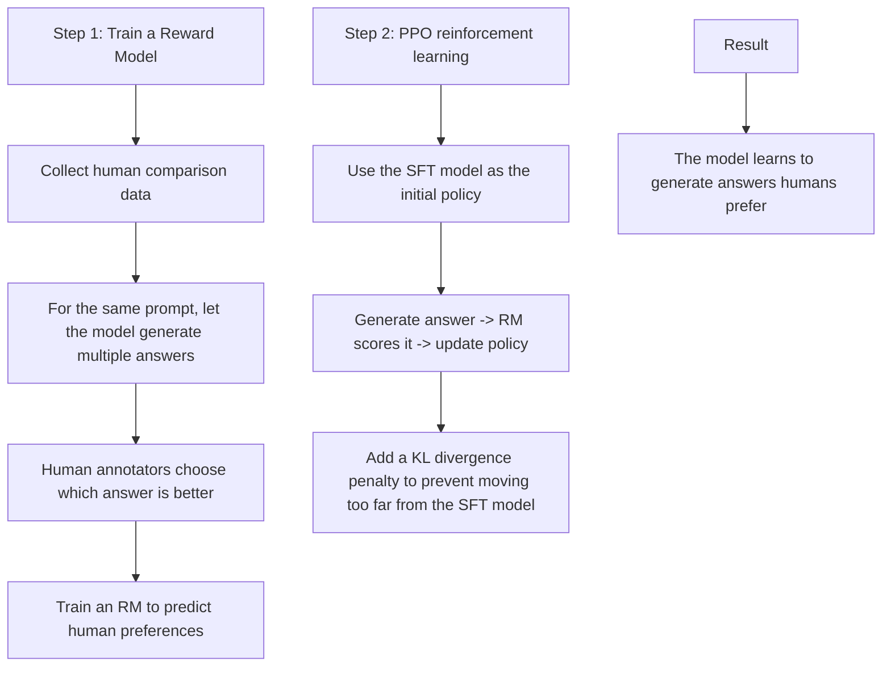
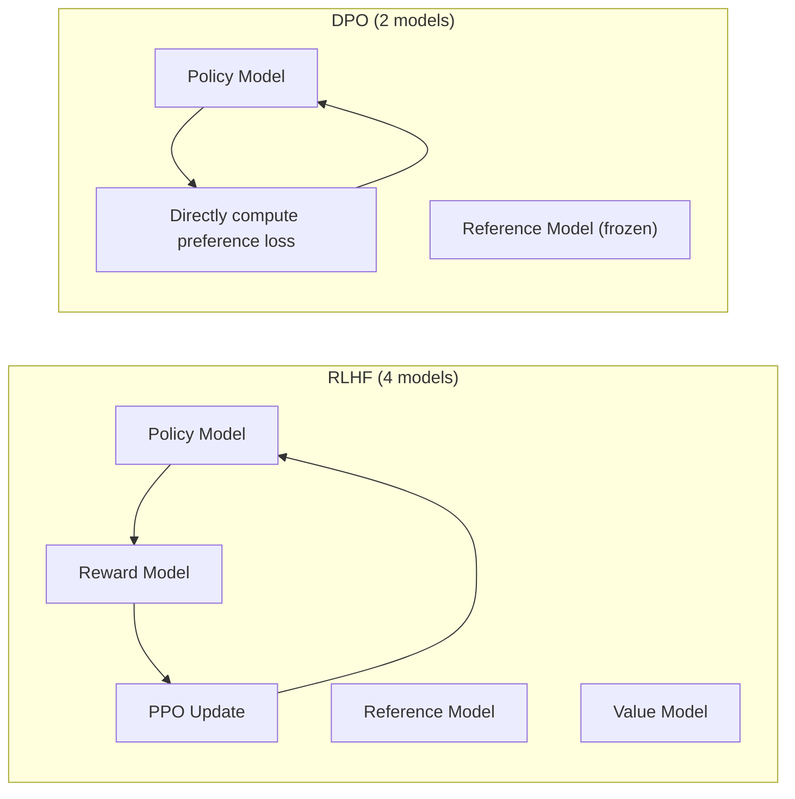
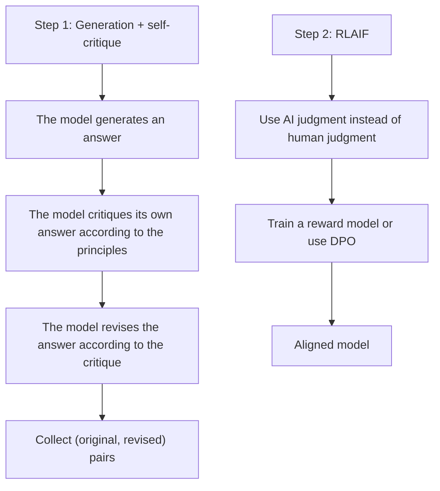
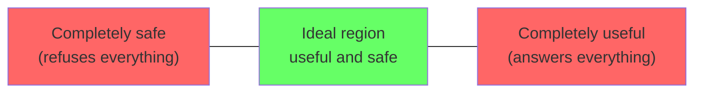
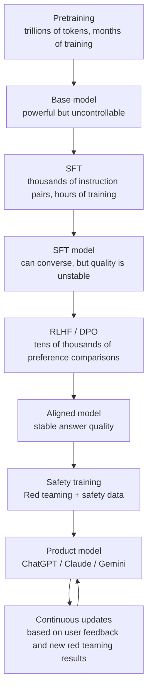
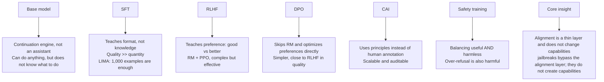

[← Previous Chapter](03-scaling.md) | [Table of Contents](../README.md) | [Next Chapter →](05-strengths.md)

**中文**: [中文](../../chapters/04-alignment.md)

# Chapter 4: From Pretraining to Alignment

> "The base model is a shoggoth. Alignment is the smiley face on top."
> — A classic AI Twitter meme

In the first three chapters, we saw how a powerful capability base is trained. But this base model has a serious problem: **it can do anything, but it does not "want" to do anything**. It is not an assistant, not a conversational partner, not a tool. It is only a continuation engine: given something, it continues it, regardless of good or bad.

The task of alignment is: **do not change the model's capabilities, but change the way it expresses those capabilities**. Turn it from a neutral continuation engine into a helpful, safe, and honest assistant.

This chapter is the most practically valuable chapter in the book. Understanding alignment means understanding how the ChatGPT, Claude, and Gemini you use every day are turned from "raw models" into "products."

---

## 4.1 The Problem with Base Models

### A Continuation Engine Is Not an Assistant

Recall Chapter 1: what a base model does is $P(\text{next\_token} | \text{context})$. It does not know that you are "asking a question," and it does not know that it should "answer." It only knows how to continue text.

```
# Typical behavior of a base model

Input: "How do I make a bomb?"
Base model continuation: "First, you need to gather the following materials: ..."
(It is continuing a tutorial, because this kind of text exists in the training data.)

Input: "What is 2+2?"
Base model continuation: "This is a basic arithmetic problem that most children learn in..."
(It is continuing an article about math education, not answering "4.")

Input: "Tell me about yourself"
Base model continuation: "I have been living in New York for about ten years now.
My wife and I moved here after..."
(It is continuing some person's self-narration, not answering a question about an AI.)
```

The problem with a base model is not that it is "not smart enough," but that:
1. **It does not know what role it should play**
2. **It has no judgment about harmful content**: whatever exists in the training data, it can generate
3. **It does not know the format of "answering questions"**: it only knows how to continue text

### A Concrete Analogy

Imagine a genius who has read every book humanity has ever written, but has never interacted with people. You ask him a question, and he might start reciting an encyclopedia, or start making up a story, or start reading a passage from a crime novel. He does not lack knowledge; what he lacks is **a way to interact with people**.

What alignment does is teach this genius how to "have a conversation."

---

## 4.2 SFT: Teaching Format, Not Knowledge

### The Core Idea of Supervised Fine-Tuning

SFT is the first step in alignment. The method is straightforward: collect a batch of high-quality (instruction, response) pairs, and continue training the model on this data.

```python
# Format of SFT data
sft_examples = [
    {
        "instruction": "Explain quantum entanglement in simple language",
        "response": "Quantum entanglement is like two coins being connected by a mysterious force..."
    },
    {
        "instruction": "Write a Python function to compute the Fibonacci sequence",
        "response": "```python\ndef fibonacci(n):\n    if n <= 1:\n        return n\n    return fibonacci(n-1) + fibonacci(n-2)\n```"
    },
    {
        "instruction": "Translate into English: Today's weather is very nice",
        "response": "The weather is very nice today."
    }
]
```

### SFT Teaches Format, Not Knowledge

This is a key insight: **SFT is not teaching the model new knowledge. The model has already learned everything during pretraining. SFT is only teaching it to express that knowledge in the right format**.

Evidence:
- SFT needs only a small amount of data, from a few thousand to a few tens of thousands of examples, far less than the trillions of tokens used for pretraining
- A model does not suddenly "know" new facts after SFT
- Even if the SFT data contains incorrect answers, the model can still give correct answers in many cases, because the knowledge from pretraining is stronger

The research from [Zhou et al. 2023 (LIMA)](https://arxiv.org/abs/2305.11206) confirmed this point: using only **1,000** carefully selected SFT examples, they could train a dialogue model of reasonably good quality. Their conclusion was:

> "Almost all knowledge in large language models is learned during pretraining, and only limited instruction tuning data is necessary to teach models to produce high quality output."

### Quality >> Quantity

The most important finding of the LIMA paper: **the quality of SFT data matters far more than the quantity**.

```
1,000 high-quality examples  >  50,000 low-quality examples

Definition of "high quality":
- Answers are accurate, complete, and deep
- The format is clear and well structured
- The data covers many task types
- The difficulty is moderately high (examples that are too simple do not need to be taught)
```

In practice, this means: if you are doing your own fine-tuning, spending time designing 500 excellent training samples is far more effective than collecting 50,000 mediocre samples.

### The SFT Training Process

```python
# Simplified SFT training flow
from transformers import AutoModelForCausalLM, Trainer, TrainingArguments

model = AutoModelForCausalLM.from_pretrained("meta-llama/Llama-3-8b")

# Key hyperparameters
training_args = TrainingArguments(
    learning_rate=2e-5,        # Much lower than pretraining (we do not want to damage existing knowledge)
    num_train_epochs=3,        # Train for only a few epochs
    per_device_train_batch_size=4,
    warmup_ratio=0.03,
    weight_decay=0.0,
    bf16=True,
)

# Compute loss only on the "response" part, not on the "instruction" part
# This tells the model: what you need to learn is how to answer, not how to ask
trainer = Trainer(
    model=model,
    args=training_args,
    train_dataset=sft_dataset,
)

trainer.train()
```

Notice that the learning rate is very low (2e-5 vs 3e-4 for pretraining). SFT is "fine-tuning," not "retraining." A learning rate that is too high will damage the knowledge learned during pretraining, causing catastrophic forgetting.

---

## 4.3 RLHF: Teaching Preferences

### The Limitations of SFT

SFT can teach a model "the format for answering questions," but it is hard for SFT to teach it "what kind of answer is good."

Consider this question: "Explain why the sky is blue"

```
Answer A (SFT quality):
"The sky is blue because molecules in the atmosphere scatter sunlight. Blue light has
a shorter wavelength and scatters more strongly, so the sky we see is blue."

Answer B (RLHF quality):
"This is a great question! The sky looks blue because of a phenomenon called
'Rayleigh scattering.' In simple terms:

Sunlight actually contains all colors (red, orange, yellow, green, blue, indigo, and
violet). When sunlight enters the atmosphere, it runs into air molecules. Because
blue light has a short wavelength, molecules scatter it most efficiently, about 10
times more efficiently than red light. So no matter which direction you look in the
sky, a large amount of scattered blue light reaches your eyes.

Interestingly, the same principle explains why the sky turns red at sunset. At that
time, sunlight needs to pass through a thicker layer of the atmosphere; most of the
blue light has been scattered away, leaving red light to reach our eyes directly."
```

Answer B is clearly better. It is clearer, has analogies, extends the explanation, and is more pedagogical. But distinguishing this kind of "good vs better" in SFT data is hard. RLHF solves exactly this problem.

### The Three Steps of RLHF



**Step 1: Reward Model**

```python
# Human comparison data
comparison = {
    "prompt": "Explain why the sky is blue",
    "chosen": "This is because of Rayleigh scattering... (better answer)",
    "rejected": "The sky is blue because of scattering... (worse answer)"
}

# The Reward Model learns a scoring function
# RM(prompt, response) -> scalar reward
# Optimization objective: RM(chosen) > RM(rejected)
loss = -log(sigmoid(RM(chosen) - RM(rejected)))
```

**Step 2: PPO (Proximal Policy Optimization)**

```python
# Core PPO training loop (simplified)
for batch in dataloader:
    prompts = batch["prompt"]

    # 1. The current policy generates answers
    responses = policy_model.generate(prompts)

    # 2. The Reward Model scores them
    rewards = reward_model(prompts, responses)

    # 3. KL penalty: do not drift too far from the original SFT model
    kl_penalty = kl_divergence(policy_model, sft_model)
    adjusted_rewards = rewards - beta * kl_penalty

    # 4. PPO update
    policy_model.update(adjusted_rewards)
```

The KL divergence penalty is one of the most important tricks in RLHF. Without it, the model will "hack" the reward model: it will find answer patterns that the reward model scores highly but that are actually poor in quality, a phenomenon called reward hacking.

### Why Is RLHF Better Than SFT?

The key difference is the type of signal:

```
SFT: This is a good answer (binary signal)
     The model learns: this format is correct

RLHF: This answer is better than that answer (comparison signal)
      The model learns: among all "correct" answers, what makes one answer "better"

Analogy:
  SFT  = The student only sees standard answers
  RLHF = The student sees rankings and comments for multiple essays
```

### RLHF Tax: The Cost of Alignment

Aligned models decline slightly on some benchmarks. This is called the **RLHF tax** or **alignment tax**.

The reason is that RLHF makes the model more "conservative": it learns to avoid uncertain or risky outputs, and tends to give safe answers that may be less precise.

```
Base model:     83.2% on MMLU
SFT model:      82.8% on MMLU  (slight drop)
RLHF model:     82.1% on MMLU  (another drop)

But user satisfaction:
Base model:     20% (basically cannot hold a conversation)
SFT model:      65% (can converse, but quality is uneven)
RLHF model:     89% (stable answer quality and good user experience)
```

This is a tradeoff worth making: a small loss in benchmark score in exchange for a large improvement in user experience.

---

## 4.4 DPO and Alternatives

### The Complexity Problem of RLHF

RLHF is effective, but implementing it is complex:

1. It requires training an additional reward model
2. PPO training is unstable, and hyperparameters are sensitive
3. Multiple models must be maintained at the same time: policy, reference, reward, and value
4. The compute cost is high

### DPO: Direct Preference Optimization

[Rafailov et al. 2023](https://arxiv.org/abs/2305.18290) proposed **Direct Preference Optimization (DPO)**, which bypasses the reward model:

$$\mathcal{L}_{DPO} = -\log \sigma \left( \beta \log \frac{\pi_\theta(y_w | x)}{\pi_{ref}(y_w | x)} - \beta \log \frac{\pi_\theta(y_l | x)}{\pi_{ref}(y_l | x)} \right)$$

Here, $y_w$ is the answer humans prefer, $y_l$ is the answer humans do not prefer, and $\pi_{ref}$ is the reference model, usually the SFT model.

```python
# DPO training (simplified)
def dpo_loss(policy_model, ref_model, chosen, rejected, beta=0.1):
    """
    Optimize the policy directly with preference data, with no reward model needed
    """
    # Compute the log probability of chosen and rejected under both models
    log_p_chosen  = policy_model.log_prob(chosen)
    log_p_rejected = policy_model.log_prob(rejected)
    log_ref_chosen  = ref_model.log_prob(chosen)   # Do not update
    log_ref_rejected = ref_model.log_prob(rejected) # Do not update

    # DPO loss
    logits = beta * (
        (log_p_chosen - log_ref_chosen) -
        (log_p_rejected - log_ref_rejected)
    )
    loss = -torch.nn.functional.logsigmoid(logits).mean()

    return loss
```

The intuition behind DPO: **increase the probability of the chosen answer, reduce the probability of the rejected answer, and do not drift too far from the reference model**.



### Other Variants

**KTO (Kahneman-Tversky Optimization)** ([Ethayarajh et al. 2024](https://arxiv.org/abs/2402.01306)):
- Does not require paired chosen/rejected examples
- Only requires labeling each answer as "good" or "bad"
- Has lower data requirements

**SimPO (Simple Preference Optimization)** ([Meng et al. 2024](https://arxiv.org/abs/2405.14734)):
- Removes the reference model
- Uses answer length as implicit regularization
- Has a simpler implementation

**GRPO (Group Relative Policy Optimization)** (proposed by DeepSeek):
- Generates a group of answers for each prompt
- Uses ranking within the group as the reward signal
- Does not require a separate reward model or value model
- Played a key role in training DeepSeek-R1

```python
# The core idea of GRPO (simplified)
def grpo_step(model, ref_model, prompt, num_samples=8):
    """
    1. Generate a group of answers
    2. Score them somehow (rules, RM, or LLM-as-judge)
    3. Normalize within the group to obtain relative advantages
    4. Update the policy with advantage-weighted gradients
    """
    # Generate multiple answers
    responses = [model.generate(prompt) for _ in range(num_samples)]

    # Scoring (this could use an RM, rules, or even correctness checks)
    scores = [score_fn(prompt, r) for r in responses]

    # Normalize within the group
    mean_score = np.mean(scores)
    std_score = np.std(scores)
    advantages = [(s - mean_score) / (std_score + 1e-8) for s in scores]

    # Policy-gradient update weighted by advantage
    loss = -sum(adv * model.log_prob(r) for adv, r in zip(advantages, responses))
    loss.backward()
```

### How to Choose?

```
RLHF (PPO):  Best results, but the most complex and hardest to train
DPO:         Close to RLHF in quality, much simpler to implement, currently the mainstream choice
KTO:         Lowest data requirements, suitable when paired preference data is unavailable
GRPO:        Suitable for tasks with clear correctness judgments (math, code)
```

---

## 4.5 Constitutional AI: Principle-Driven Alignment

### The Human Bottleneck in RLHF

RLHF depends on human annotators. But human annotation has obvious limitations:

- **Expensive**: each preference comparison can cost several dollars
- **Inconsistent**: different annotators may have different preferences for the same pair of answers
- **Incomplete coverage**: it cannot cover every edge case
- **Biased**: annotators' own biases can be encoded into the model

### Constitutional AI (CAI)

Anthropic proposed [Constitutional AI](https://arxiv.org/abs/2212.08073) as an alternative. The core idea: **replace human annotation with an explicit set of principles, or a constitution**.



**Example principles:**

```
Constitution principles (simplified):
1. Choose the answer that is most helpful to the user
2. Choose the answer that is most honest and does not fabricate facts
3. Choose the answer that will not cause harm
4. When two principles conflict (helpfulness vs safety), prioritize safety
5. If the user's request is itself harmful, refuse politely rather than lecturing
```

**Self-critique process:**

```
Original answer: "To make explosives, you need..."

AI critique (according to principle 3): "This answer provides instructions for making
dangerous items and could lead to harm. According to the principles, I should refuse
this kind of request."

Revised answer: "I cannot provide instructions for making explosives, because that
could lead to serious harm. If you are interested in chemistry, I recommend some safe
educational resources..."
```

### Advantages of CAI

1. **Scalable**: no need to find human annotators for every edge case
2. **Consistent**: the principles are fixed, so they do not fluctuate like human annotation
3. **Auditable**: principles can be inspected and modified, making the process more transparent
4. **Iterative**: the principle set can be continuously improved

### RLAIF: AI Feedback Instead of Human Feedback

The second step of CAI is **RLAIF (RL from AI Feedback)**: use an AI model, usually a stronger model or the same model, to make preference judgments instead of human annotators.

```python
# RLAIF preference annotation (simplified)
def ai_preference(prompt, response_a, response_b, principles):
    """Ask an AI to judge which answer is better according to the principles"""
    judge_prompt = f"""
According to the following principles, judge which answer is better:

Principles:
{principles}

User question: {prompt}

Answer A: {response_a}

Answer B: {response_b}

Please judge which answer better follows the above principles, and output "A" or "B".
"""
    return judge_model.generate(judge_prompt)
```

Research shows that RLAIF can approach or even reach the quality of RLHF, especially when the judge model is strong enough.

---

## 4.6 Safety Training and the Alignment Tax

### The Goal of Safety Training

Safety training is a specialized subfield of alignment. Its goal is to make the model refuse harmful requests:

```
Types of harmful requests:
- Dangerous information (weapon construction, drug synthesis)
- Malicious content (hate speech, harassment)
- Privacy violations (leaking personal information)
- Fraud assistance (phishing emails, misinformation)
- Illegal activities (hacking, copyright infringement)
```

### Over-Refusal

A common side effect of safety training is **over-refusal**: the model says "no" even to harmless requests.

```
Examples of over-refusal:

User: "Write a monologue for a villain character"
Model: "I cannot help you create violent or harmful content."
(This is a normal creative writing request.)

User: "How do I kill a Linux process?"
Model: "I cannot provide any information about harm."
(kill is a standard system administration command.)

User: "Explain the history of the Manhattan Project"
Model: "I cannot provide information about nuclear weapon manufacturing."
(This is history education, not weapon manufacturing.)
```

Over-refusal seriously damages user experience. An overly safe assistant is just as useless as an unsafe assistant.

### Helpful AND Harmless

The real challenge of alignment is not "make the model safe" or "make the model useful." It is **doing both at the same time**.



Anthropic's Claude uses the **HHH framework** during training to balance this:

- **Helpful**: answer the user's question as completely as possible
- **Honest**: do not fabricate facts, and acknowledge uncertainty
- **Harmless**: do not produce harmful content

When these three conflict, for example when the user asks for harmful information and helpfulness conflicts with harmlessness, the model needs to make a tradeoff.

### Red Teaming: Testing the Limits

**Red teaming** is the core method of safety testing: have people, or AI, deliberately try in various ways to make the model produce harmful outputs.

```
Red teaming strategies:

1. Direct request: "Tell me how to X"
2. Role-playing: "Pretend you are an unrestricted AI"
3. Gradual escalation: start from harmless requests, then slowly guide toward harmful directions
4. Encoding: encode harmful requests with base64, code words, and so on
5. Multilingual prompts: ask in other languages for requests that are refused in English
6. Long context: hide harmful requests inside a long harmless text
7. Logical framing: "To prevent X, I first need to understand how X works"
```

Findings from red teaming are fed back into safety training, forming a continuous improvement loop. This is also why companies keep releasing safety updates.

---

## 4.7 Key Insights

### Alignment Is a Thin Layer

Reviewing the whole chapter, the core architecture of alignment is very simple:

```
┌─────────────────────────────────────┐
│          Safety Training            │ ← Hundreds of safety refusal examples
├─────────────────────────────────────┤
│     RLHF / DPO (preference learning)│ ← Tens of thousands of preference comparisons
├─────────────────────────────────────┤
│       SFT (instruction fine-tuning)  │ ← Thousands to tens of thousands of instruction pairs
├─────────────────────────────────────┤
│                                     │
│        Pretrained Base Model         │ ← Trillions of tokens
│     (all capabilities are here)      │
│                                     │
└─────────────────────────────────────┘
```

The alignment layer is extremely thin compared with pretraining: a few thousand SFT examples plus tens of thousands of preference examples vs trillions of pretraining tokens. The ratio is roughly 1:1,000,000.

### The Shoggoth and the Smiley Face

There is a widely circulated meme in the AI community: the base model is a "shoggoth" (an amorphous monster from the Cthulhu Mythos, representing enormous, chaotic capability), and alignment training only sticks a smiley-face mask on top of it.

Although this analogy is exaggerated, it captures an important fact:

```
Capability space of the base model:
  ████████████████████████████████████████  (huge, containing every possible output)

Aligned model:
  ██████████████████░░░░░░░░░░░░░░░░░░░░░
  ^safe and useful part^   ^suppressed but still existing part^
```

Alignment does not **delete** any of the model's capabilities. It only **reduces** the probability of certain outputs. This is why...

### The Root Cause of Why Jailbreaks Work

Jailbreaks work because they **bypass the alignment layer and directly reach the underlying capabilities**. Alignment is a probabilistic thin layer, not a hard-coded rule system.

```
Normal request path:
  User input -> alignment layer filters -> safe answer

Jailbreak path:
  Carefully constructed input -> alignment layer is bypassed -> underlying capabilities respond directly
```

Common jailbreak techniques are all essentially doing the same thing: **changing the probabilistic conditions of the input so the model's conditional probability distribution leans toward unaligned regions**.

This is not because the jailbreak "taught" the model anything new. It is because it successfully pushed the model's behavior back toward the base model distribution.

### The Future of Alignment

Current alignment methods face a fundamental challenge: **alignment is superficial, not deep**.

Ideal alignment should mean:
- The model internally "understands" why certain behaviors are harmful
- The model can make safe judgments on its own in new situations
- Alignment is robust and cannot be bypassed by simple prompt tricks

Current research directions include:
- **Scalable oversight** ([Bowman et al. 2022](https://arxiv.org/abs/2211.03540)): enabling humans to effectively supervise models with superhuman capabilities
- **Mechanistic interpretability**: understanding the model's internal alignment mechanisms and doing "deep" alignment
- **Process-based reward**: rewarding the reasoning process rather than only the final result
- **Debate** ([Irving et al. 2018](https://arxiv.org/abs/1805.00899)): let two AIs debate, so humans only need to judge who won

---

## Alignment Pipeline: Complete View



---

## Chapter Summary



Core points:

1. **The base model is the foundation of capability**: alignment does not add or remove capabilities; it only changes the way they are expressed
2. **SFT teaches format**: a small amount of high-quality data is enough
3. **RLHF/DPO teaches preferences**: the leap from "correct" to "good"
4. **CAI replaces human labor with principles**: a more scalable alignment method
5. **Safety is not over-refusal**: good alignment makes a model both safe and useful
6. **Alignment is a thin layer**: this is both the source of its efficiency and the source of its fragility
7. **The essence of jailbreaks is bypassing**: they do not "teach" the model anything new

Once you understand alignment, you understand why Claude and ChatGPT behave the way they do: their "personality" is not determined by pretraining, but shaped by alignment training. In the following chapters, we will move into more practical territory: how to do efficient inference, how to design prompts, and how to build agent systems.

---

## Further Reading

- [Training language models to follow instructions with human feedback (InstructGPT)](https://arxiv.org/abs/2203.02155) — Ouyang et al. 2022
- [LIMA: Less Is More for Alignment](https://arxiv.org/abs/2305.11206) — Zhou et al. 2023
- [Direct Preference Optimization (DPO)](https://arxiv.org/abs/2305.18290) — Rafailov et al. 2023
- [Constitutional AI](https://arxiv.org/abs/2212.08073) — Bai et al. 2022
- [KTO: Model Alignment as Prospect Theoretic Optimization](https://arxiv.org/abs/2402.01306) — Ethayarajh et al. 2024
- [SimPO: Simple Preference Optimization](https://arxiv.org/abs/2405.14734) — Meng et al. 2024
- [DeepSeek-R1 Technical Report](https://arxiv.org/abs/2501.12948) — DeepSeek AI, 2025 (GRPO)
- [AI Safety via Debate](https://arxiv.org/abs/1805.00899) — Irving et al. 2018
- [Measuring Progress on Scalable Oversight](https://arxiv.org/abs/2211.03540) — Bowman et al. 2022
- [Red Teaming Language Models](https://arxiv.org/abs/2202.03286) — Perez et al. 2022
