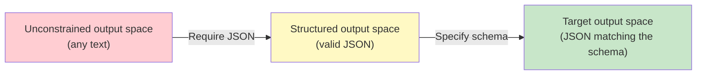
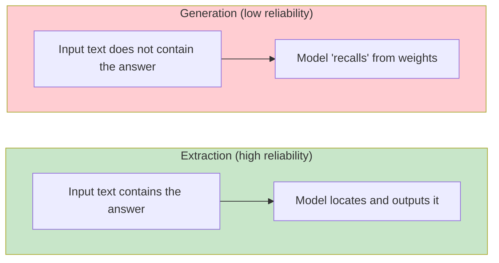
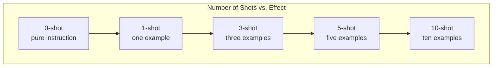
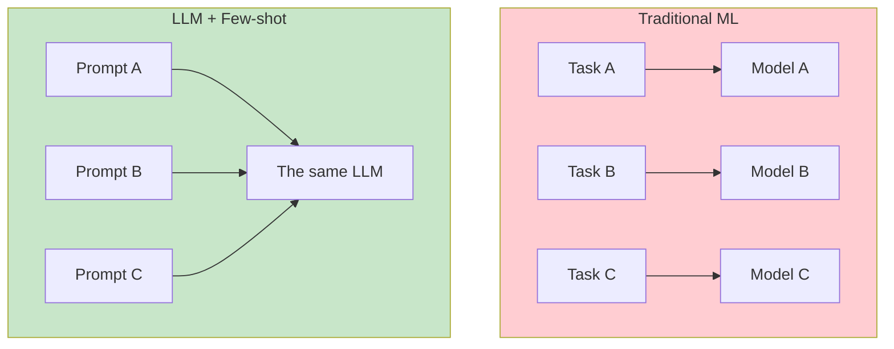

[← Previous Chapter](04-alignment.md) | [Table of Contents](../README.md) | [Next Chapter →](06-limitations.md)

# Chapter 5: What LLMs Are Truly Good At

> "Know thy tool." -- Every engineer should know the situations where the tool in their hands is sharpest.

In the first four chapters, we unpacked the internal mechanisms of LLMs: next-token prediction, attention, scaling, and alignment. Now it is time to answer a practical question: **what exactly are LLMs good at?**

This is not an academic question. When you design an LLM system, the system can work reliably only if you put the model on tasks it is good at. Conversely, if you ask an LLM to do things it is naturally bad at (which the next chapter will discuss in detail), no amount of prompt engineering can save you.

The core argument of this chapter is: **LLM strengths come directly from the way they are trained**. Once you understand "why they are good at it," you can judge whether an LLM applies to a new scenario instead of relying on trial and error.

---

## 5.1 Pattern Recognition and Analogy

### What Is Learned from Trillions of Tokens Is Not Knowledge, but Patterns

What has a model trained on trillions of tokens seen?

- Almost every public code repository
- All of Wikipedia (in multiple languages)
- Millions of papers, books, and news articles
- Countless forum discussions, technical blogs, and Stack Overflow answers

But what an LLM learns is not the "content" of these texts. It learns **patterns** -- statistical relationships between tokens.

For example, a model has seen tens of thousands of Python function definitions:

```python
def calculate_area(radius):
    return 3.14159 * radius ** 2
```

What it learns is not the knowledge point that "the area formula for a circle is πr²." What it learns is:

1. `def` is followed by a function name and parameters
2. `return` is followed by an expression
3. When `radius` and `area` are involved, `3.14` or `math.pi` often appears
4. The `**` operator is often paired with `2`

When these patterns are layered together, the model can "write" correct code, even if it does not "understand" geometry.

### Not Memorization, but Generalization

A common misconception is that LLMs are just reciting training data.

If it were pure memorization, a model should only be able to repeat code it has seen before. But in practice, you can give the model a requirement it has never seen, and it can combine existing patterns to generate entirely new code.

```python
# Your request: "Write a function that takes a sentence and returns an acronym
# made from the first letter of each word"
# The model has never seen this exact request, but it can combine:
#   - the pattern of string split
#   - the pattern of list comprehension
#   - the pattern of string join
#   - the pattern of extracting first letters

def make_acronym(sentence):
    words = sentence.split()
    return ''.join(word[0].upper() for word in words)
```

This is like someone who has read every cookbook. They do not need to have seen the exact recipe "tomato scrambled eggs with garlic"; they can combine patterns such as "how to handle tomatoes," "how to scramble eggs," and "how to use garlic" into a new dish.

### Analogy: Pattern Transfer

One of the most surprising abilities of LLMs is **cross-domain analogy**. Because texts from different domains share underlying language patterns, the model can "transfer" knowledge from one domain to another.

For example, if you ask, "Explain Git using database concepts," the model can generate:

- commit = transaction
- branch = table partition
- merge = join
- conflict = constraint violation

This is not because the model "understands" Git and databases. It is because explanatory analogy texts contain many co-occurrence patterns in the training data, and the model has learned this mapping structure of "A corresponds to B."

**Practical implication**: When you need an LLM to perform analogical reasoning, knowledge transfer, or generalization from examples, it usually performs well -- because this is exactly the core ability trained from trillions of tokens.

---

## 5.2 Translation and Format Conversion

### The Sweet Spot of LLMs: Mapping

If one word could summarize the most reliable capability of LLMs, it would be **mapping**. Converting one representation into another.

```
Natural language → SQL
Natural language → code
JSON → XML
English → Chinese
Unstructured text → structured data
Spoken language → written language
Long text → summary
```

Why are mapping tasks especially reliable? Because training data is full of parallel correspondences in many forms:

- Bilingual text (translation corpora)
- Code and its comments
- API documentation and code examples
- Database schemas and corresponding SQL queries
- Requirement descriptions and implementation code

During training, the model has seen massive numbers of "input A → output B" pairs, so it naturally learns this transformation pattern.

### Example: Natural Language to SQL

```
User: "Find the top 10 products with the highest sales in 2024"

Model:
SELECT product_name, SUM(sales_amount) as total_sales
FROM orders
WHERE EXTRACT(YEAR FROM order_date) = 2024
GROUP BY product_name
ORDER BY total_sales DESC
LIMIT 10;
```

The model can do this not because it "understands" SQL semantics, but because it has seen hundreds of thousands of similar natural-language-to-SQL correspondences. The pattern "top N highest" → `ORDER BY ... DESC LIMIT N` has been deeply encoded in its weights.

### Example: Structured Data Extraction

```
Input: "Zhang San, male, born in March 1990, currently works as a senior engineer
       at an internet company in Beijing. Phone number 13800138000,
       email zhangsan@example.com"

Output:
{
  "name": "Zhang San",
  "gender": "male",
  "birth_year": 1990,
  "birth_month": 3,
  "city": "Beijing",
  "industry": "internet",
  "title": "senior engineer",
  "phone": "13800138000",
  "email": "zhangsan@example.com"
}
```

This kind of conversion from unstructured to structured data is one of the most reliable applications of LLMs.

### Why Structured Output Is So Effective

Recall the content of Chapter 1: the essence of an LLM is generating the most likely continuation in token space. When you require output in JSON format, you are effectively using format constraints to greatly narrow the possible output space.



The stronger the constraints, the easier it is for the model to "find" the correct answer. This is why function calling and JSON mode are usually much more reliable than free-text generation.

**Practical implication**: Frame tasks as "conversion" problems whenever possible. Do not ask, "Help me analyze this data"; instead ask, "Convert this text into the following JSON format."

---

## 5.3 Summarization and Information Extraction

### Compression Is Understanding

Chapter 1 said that the essence of next-token prediction is compression. A model that can accurately predict the next token must understand what is important in the text and what is redundant.

This means **summarization and information extraction are direct products of the LLM training objective**.

Think about it: to predict the next paragraph of a news report, the model must understand the main points of the preceding paragraphs. To predict the conclusion of a paper, the model must understand the core argument of the full text. This ability to "understand the main points" is a byproduct of training.

### Extraction vs. Generation: Reliability Differences

One key practical insight:

> **LLMs are far more reliable on extraction tasks than on generation tasks.**

Why?

- **Extraction**: the answer is in the input text; the model only needs to "find" it
- **Generation**: the answer is not in the input; the model needs to "recall" it from its weights



Compare these two tasks:

```
# Extraction (high reliability)
Input: "Apple's Q3 2024 revenue was $94.9 billion, up 5% year over year."
Question: "What was Apple's Q3 revenue?"
→ The model only needs to find "$94.9 billion" in the input

# Generation (low reliability)
Question: "What was Apple's Q3 2024 revenue?"
→ No context is provided; the model must "recall" from training data
→ It may be accurate, or it may hallucinate
```

**Practical implication**: Turn generation tasks into extraction tasks whenever possible. First use RAG to retrieve relevant documents, then let the LLM extract the answer from those documents, instead of asking the LLM to answer from thin air.

### Levels of Summarization

LLMs can summarize at different granularities:

| Granularity | Task | Example |
|------|------|------|
| Keywords | Extract core concepts | "This article is about: machine learning, Transformer, attention mechanism" |
| Entities | Named entity recognition | Person names, company names, dates, locations |
| One sentence | Core argument | "This paper proposes a new attention mechanism" |
| Paragraph | Structured summary | Background + method + conclusion |
| Detailed | Comprehensive summary | An abbreviated version that preserves the main details |

Each level is doing information compression -- retaining important information and discarding redundant information. This is exactly what LLMs are trained to do.

---

## 5.4 Few-shot Learning

### A Few Examples Are Enough

Few-shot learning is one of the most impressive abilities of LLMs: you do not need to fine-tune the model; you only need to provide a few examples in the prompt, and the model can learn a new task.

```python
prompt = """
Classify the following sentences as "positive" or "negative".

Sentence: "This movie was fantastic. Highly recommended!"
Classification: positive

Sentence: "Wasted two hours. A terrible movie."
Classification: negative

Sentence: "The actors' performances were impressive, but the plot dragged a bit."
Classification:
"""
# Model output: "positive" (or "positive, with some reservations")
```

What happened here? We did not modify any model weights or do any training. We only gave two examples in the prompt, and the model "learned" a classification task.

### From 0-shot to Few-shot: Diminishing Returns



| Number of shots | Effect | Explanation |
|---------|------|------|
| 0-shot | Baseline | Relies purely on instructions to understand the task |
| 1-shot | Significant improvement | The jump from 0 to 1 is the largest |
| 3-shot | Continued improvement | Marginal gains begin to diminish |
| 5-shot | Near saturation | Most tasks stabilize here |
| 10+ shot | Slight improvement | Uses context space, with very small gains |

The key insight: **the improvement from 0 to 1 is much greater than the improvement from 5 to 10**. This is because the first example helps the model understand the task's **format** and **intent**; subsequent examples only fine-tune how it handles edge cases.

### The Task Specification Is in the Prompt, Not in the Weights

One important implication of few-shot learning is: **the definition of the task can exist entirely in the prompt**.

In traditional machine learning, you need to train a new model for each new task. With few-shot learning, the same LLM can become, through different prompts:

```
A few sentiment analysis examples → sentiment classifier
A few translation examples → translator
A few code examples → code generator
A few summarization examples → summarizer
```

This completely changes the architecture of ML systems: no longer "one task, one model," but "one model, countless prompts."



---

## 5.5 The Nature of In-Context Learning

Few-shot learning has a more academic name: **in-context learning** (ICL). The model "learns" from examples in the context, rather than from gradient updates.

But there is a deeper question here: **how exactly does ICL work?**

### Hypothesis 1: Implicit Gradient Descent

Akyurek et al. (2022), in [_What Learning Algorithm Is In-Context Learning? Investigations with Linear Models_](https://arxiv.org/abs/2211.15661), proposed a surprising hypothesis:

> The forward pass of a Transformer is actually **implicitly performing gradient descent**.

Specifically, when the model processes few-shot examples, the computation in attention layers is equivalent to performing several gradient updates on an internal linear model. The examples are like training data, and the forward pass is like the training process.

```
Traditional learning: data → training loop (multiple gradient descent steps) → update weights → prediction
ICL:                  examples → forward pass (implicit gradient descent) → no weight update → prediction
```

### Hypothesis 2: Bayesian Inference

Xie et al. (2021), in [_An Explanation of In-context Learning as Implicit Bayesian Inference_](https://arxiv.org/abs/2111.15366), proposed another explanation:

> ICL is implicit Bayesian inference. During pretraining, the model learns many "concepts" (priors), and few-shot examples help the model choose the correct concept (posterior update).

In Bayesian terms:

```
P(task | examples) ∝ P(examples | task) × P(task)
```

The model's pretraining gives it a rich prior P(task), and the few-shot examples provide the likelihood P(examples | task). Combining the two gives a posterior -- the model "infers" what task you want.

### Hypothesis 3: Complex Pattern Matching

The third, and most conservative, explanation is that ICL is simply very complex pattern matching.

During training, the model has seen many "examples → conclusion" patterns (textbooks, FAQs, and programming tutorials all have this structure). When you provide examples in the prompt, the model is merely matching the most similar pattern it has seen and then continuing that pattern.

### What Matters Most in Practice

No matter which theory is correct, several practical conclusions are clear:

**1. The format of examples is extremely important**

```python
# Format A: works well
"""
Input: "I love this movie"
Sentiment: positive

Input: "Terrible experience"
Sentiment: negative

Input: "The food was okay"
Sentiment:
"""

# Format B: works poorly
"""
"I love this movie" is positive.
"Terrible experience" is negative.
"The food was okay" is
"""
```

The same examples, in different formats, can produce very different results. This is because the model is matching **structural patterns**, not just semantics.

**2. The order of examples has an effect**

Research shows ([Lu et al., 2022: _Fantastically Ordered Prompts and Where to Find Them_](https://arxiv.org/abs/2104.08786)) that the ordering of few-shot examples can cause huge differences in accuracy, from near random to 90%+.

General rules of thumb:
- The last example has the greatest influence on the result (because it is closest to the target)
- Examples should be diverse (do not make them all the same type)
- If there are "hard" examples, put them later

**3. The model is not "learning"; it is being "conditioned"**

This is the most important conceptual shift:

```
❌ The model learned new knowledge from the examples
✅ The model adjusted its behavior distribution based on the examples
```

Examples do not change the model's weights or make the model "learn" anything new. They merely change the model's current conditional probability distribution -- like adding filters to a search engine, not feeding it new data.

---

## 5.6 Experiment: Same Task, Varying Shots

Let us use a concrete experiment to verify the theory above.

### Experimental Design

Task: sentiment classification (positive/negative/neutral)

We compare the following configurations:
1. **0-shot**: instruction only
2. **1-shot**: one example per class
3. **5-shot**: multiple examples per class
4. **Format variants**: the same examples, different formats
5. **Order variants**: the same examples, different orderings

### Experiment Code

```python
from openai import OpenAI

client = OpenAI()

# Test data
test_cases = [
    ("The service at this restaurant was very good, but the food was average.", "neutral"),
    ("This is simply the worst thing I have ever eaten.", "negative"),
    ("Highly recommended! Great value for the money!", "positive"),
    ("It was okay, nothing special.", "neutral"),
    ("Waited an hour before the food arrived. Never coming back.", "negative"),
]

# 0-shot prompt
zero_shot = """Classify the following review as "positive", "negative", or "neutral". Output only the classification result.

Review: {text}
Classification: """

# 1-shot prompt
one_shot = """Classify the following review as "positive", "negative", or "neutral". Output only the classification result.

Review: "The food tasted good, and the environment was also nice."
Classification: positive

Review: {text}
Classification: """

# 5-shot prompt
five_shot = """Classify the following review as "positive", "negative", or "neutral". Output only the classification result.

Review: "The food tasted good, and the environment was also nice."
Classification: positive

Review: "The food was terrible, and the service was bad."
Classification: negative

Review: "The price was reasonable, and the taste was average."
Classification: neutral

Review: "Super delicious! I will come again next time!"
Classification: positive

Review: "Disappointing. Completely different from what people said online."
Classification: negative

Review: {text}
Classification: """

def classify(prompt_template, text):
    response = client.chat.completions.create(
        model="gpt-4o-mini",
        messages=[{"role": "user", "content": prompt_template.format(text=text)}],
        temperature=0,
        max_tokens=10,
    )
    return response.choices[0].message.content.strip()

# Run the experiment
for name, template in [("0-shot", zero_shot), ("1-shot", one_shot), ("5-shot", five_shot)]:
    print(f"\n=== {name} ===")
    correct = 0
    for text, expected in test_cases:
        result = classify(template, text)
        match = "✓" if expected in result else "✗"
        if expected in result:
            correct += 1
        print(f"  {match} '{text[:20]}...' → {result} (expected: {expected})")
    print(f"  Accuracy: {correct}/{len(test_cases)}")
```

### Format Comparison Experiment

```python
# Format A: label style (recommended)
format_a = """
Review: "The food tasted good"
Classification: positive

Review: "{text}"
Classification: """

# Format B: narrative style (not recommended)
format_b = """
The review "The food tasted good" is positive.

The review "{text}" is"""

# Format C: JSON style (suitable for structured output)
format_c = """
{{"text": "The food tasted good", "sentiment": "positive"}}
{{"text": "{text}", "sentiment": """"
```

In actual experiments, format A usually performs best because it separates input and output most clearly, making this pattern easier for the model to match.

### Order Comparison Experiment

```python
import itertools
import random

examples = [
    ("The food tasted good, and the environment was also nice.", "positive"),
    ("The food was terrible, and the service was bad.", "negative"),
    ("The price was reasonable, and the taste was average.", "neutral"),
]

# Generate all permutations
permutations = list(itertools.permutations(examples))

results = {}
for perm in permutations:
    prompt = "Classify reviews as positive/negative/neutral.\n\n"
    for text, label in perm:
        prompt += f'Review: "{text}"\nClassification: {label}\n\n'
    prompt += f'Review: "The service at this restaurant was very good, but the food was average."\nClassification: '

    result = classify_with_prompt(prompt)
    order_key = " → ".join([label for _, label in perm])
    results[order_key] = result

# Observe differences in results under different orderings
for order, result in results.items():
    print(f"  Order [{order}] → {result}")
```

### Typical Experimental Results

| Configuration | Accuracy range | Key finding |
|------|-----------|---------|
| 0-shot | 60-75% | Can do it, but handles edge cases poorly |
| 1-shot | 75-85% | The jump from 0 to 1 is the largest |
| 5-shot | 85-92% | Continues to improve, but with diminishing margins |
| Format A vs B | 5-15% gap | Structured formats clearly outperform narrative formats |
| Best order vs worst order | 10-20% gap | Order matters more than most people expect |

### Key Conclusions

1. **1-shot is the highest-ROI investment**: if you can provide only one example, its benefit is far greater than the following examples.

2. **Format matters more than content**: good format + ordinary examples > poor format + good examples.

3. **Order cannot be ignored**: if your few-shot performance is unstable, try adjusting the order of examples.

4. **5-shot is the practical sweet spot**: good enough accuracy with reasonable context cost.

---

## Summary

The core strength of LLMs can be reduced to one sentence: **an LLM is an extremely powerful pattern converter**.

| Tasks LLMs are good at | Why they are good at them | Typical applications |
|-----------|-----------|---------|
| Pattern recognition and analogy | They learned rich patterns from trillions of tokens | Code generation, Q&A, creative writing |
| Translation and format conversion | The training data contains many parallel correspondences | NL→SQL, JSON conversion, multilingual translation |
| Summarization and information extraction | Compression is a direct product of the training objective | Document summaries, entity extraction, structured data extraction |
| Few-shot Learning | ICL lets the same model adapt to countless tasks | Zero-shot/few-shot classification, format conversion |

When designing LLM systems, follow this principle:

> **Put the LLM where it is good -- pattern recognition, format conversion, and information extraction. Give the things it is not good at to tools.**

In the next chapter, we will look at the hard limitations of LLMs -- problems that cannot be solved no matter how much you tune the prompt.

---

## Further Reading

- [Brown et al., 2020: _Language Models are Few-Shot Learners_](https://arxiv.org/abs/2005.14165) -- the GPT-3 paper and a milestone in few-shot learning
- [Akyurek et al., 2022: _What Learning Algorithm Is In-Context Learning?_](https://arxiv.org/abs/2211.15661) -- ICL as implicit gradient descent
- [Xie et al., 2021: _An Explanation of In-context Learning as Implicit Bayesian Inference_](https://arxiv.org/abs/2111.15366) -- the Bayesian explanation of ICL
- [Lu et al., 2022: _Fantastically Ordered Prompts and Where to Find Them_](https://arxiv.org/abs/2104.08786) -- the impact of few-shot ordering
- [Min et al., 2022: _Rethinking the Role of Demonstrations_](https://arxiv.org/abs/2202.12837) -- can the labels in examples even be wrong?

[← Previous Chapter](04-alignment.md) | [Table of Contents](../README.md) | [Next Chapter →](06-limitations.md)
