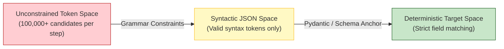
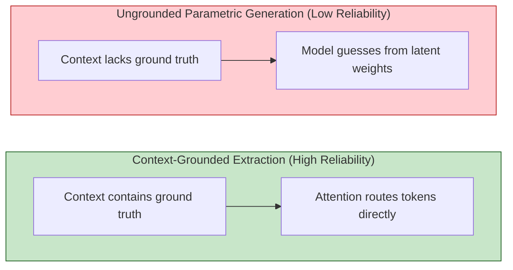
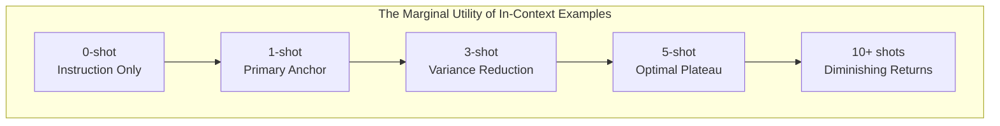
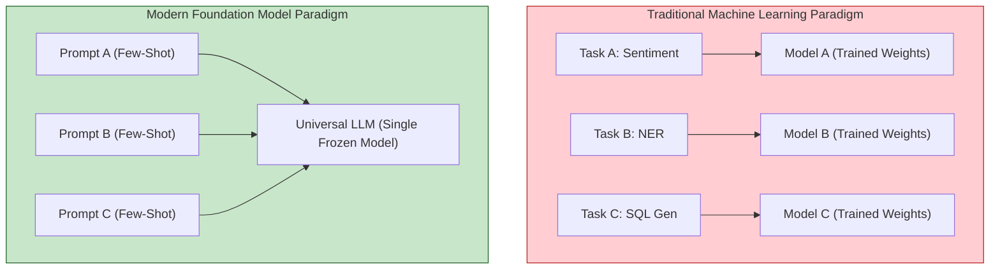
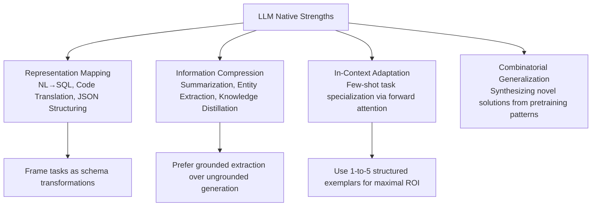

[← Previous Chapter](04-alignment.md) | [Table of Contents](../README.md) | [Next Chapter →](06-limitations.md)

**中文**: [中文](../../chapters/05-strengths.md)

# Chapter 5: What LLMs Are Truly Good At

> "Know thy tool." — True engineering mastery begins by knowing where your instruments cut cleanest.

In Part I, we analyzed the internal mechanics of large language models: next-token autoregression, dynamic attention routing, empirical scaling laws, and post-training alignment. Now we confront an essential engineering inquiry: **what cognitive workloads do LLMs naturally excel at?**

This is not a matter of academic classification; it is the cornerstone of robust system architecture. An LLM-powered application succeeds only when the model is assigned tasks aligned with its native statistical strengths. Conversely, if you force an autoregressive transformer to execute workloads that run counter to its computational geometry (as we explore in Chapter 6), no amount of prompt engineering can prevent catastrophic failure.

The central thesis of this chapter is straightforward: **the capabilities of LLMs are direct mathematical corollaries of their pretraining objective**. When you understand *why* a model excels at a particular task, you can evaluate new product requirements from first principles rather than relying on brittle trial and error.

---

## 5.1 Pattern Recognition, Composition, and Analogy

### Trillions of Tokens Ingest Statistical Structure, Not Discrete Factoids

Consider the empirical scale of a modern pretraining corpus:

- Hundreds of millions of public code repositories
- The entirety of multilingual Wikipedia
- Millions of scientific treatises, textbooks, and legal filings
- Billions of conversational threads, technical forums, and documentation trees

A language model does not index this vast corpus as a relational database of discrete facts. Instead, it extracts **high-dimensional statistical patterns**: the structural, syntactic, and semantic invariants that govern human discourse.

When a model observes tens of thousands of Python functions structured like this:

```python
def calculate_area(radius):
    return 3.14159 * radius ** 2
```

it does not memorize the formula as an isolated factual entry. It internalizes a layered set of probabilistic abstractions:

1. `def` initiates an identifier bound to a parameter signature.
2. `return` terminates execution by emitting an evaluated expression.
3. Variable names such as `radius` and `area` co-occur strongly with mathematical constants (`3.14159`, `math.pi`).
4. Geometric area computations correlate with polynomial power operations (`** 2`).

By superimposing these multi-layered attention patterns across hundreds of billions of parameters, the model constructs executable software routines without possessing a biological concept of geometry.

### Generalization via Combinatorial Pattern Synthesis

A frequent skeptic misconception is that large language models are merely stochastic parrots that parrot verbatim snippets from their training data.

If LLMs operated purely via retrieval, they would fail instantly when faced with novel task specifications. In practice, a model can receive an unprecedented functional requirement and immediately synthesize an accurate solution by composing orthogonal patterns learned across disparate domains:

```python
# Unprecedented prompt: "Write a function that accepts an arbitrary string, 
# strips punctuation, and returns an uppercase acronym constructed from the 
# first character of every word exceeding two letters."

def make_filtered_acronym(text: str) -> str:
    import re
    cleaned = re.sub(r'[^\w\s]', '', text)
    words = cleaned.split()
    return ''.join(word[0].upper() for word in words if len(word) > 2)
```

The model achieves this by seamlessly binding multiple sub-circuits: regular expression sanitization, string tokenization, conditional list filtering, and uppercase character mapping.

Like a master chef who has studied culinary chemistry across dozens of traditions, the model does not require an exact recipe for every dish; it composes foundational primitives to solve novel culinary challenges on demand.

### Cross-Domain Analogy: Structural Isomorphism

Among the most remarkable manifestations of high-dimensional pattern representation is **cross-domain analogy**. Because concepts from orthogonal fields share topological structures in latent space, the model can project structural relationships across domains.

When asked to `"Explain Git version control using relational database primitives,"` the model maps the structural invariants:

- `git commit` $\leftrightarrow$ `database transaction log record`
- `git branch` $\leftrightarrow$ `isolated schema view / workspace partition`
- `git merge` $\leftrightarrow$ `relational join with conflict resolution`
- `merge conflict` $\leftrightarrow$ `acid constraint violation`

The model succeeds not because it possesses conscious insight, but because its pretraining corpus is saturated with explanatory mappings, allowing its attention heads to bridge the two conceptual graphs.

**System Design Principle**: Whenever your task involves analogical mapping, knowledge transfer, or compositional synthesis from examples, LLMs will perform exceptionally well; this is the core computational domain they were trained to navigate.

---

## 5.2 Translation, Isomorphic Mapping, and Structured Transformation

### The Cognitive Sweet Spot: Representation Mapping

If one were to distill the single most reliable, battle-tested capability of large language models, it would be **isomorphic representation mapping**: transforming an input sequence in schema $A$ into a semantically equivalent sequence in schema $B$.

```
Natural Language       ───► Structured SQL
Unstructured Text      ───► Validated JSON Schema
Python Implementation  ───► Idiomatic Rust
High-Level Objective   ───► CLI Shell Invocation
Verbose Meeting Audio  ───► Action Item Checklist
English Technical Text ───► Fluent Mandarin
```

Why do mapping tasks exhibit such high empirical reliability? Because the pretraining distribution is fundamentally comprised of parallel correspondences:

- Multilingual parallel corpora (official translation archives)
- Codebases accompanied by unit tests and docstrings
- API specifications paired with reference client implementations
- Natural language queries paired with SQL database transactions

During pretraining, the model processes billions of `Input (Schema A) → Output (Schema B)` transitions, refining the attention circuits that execute lossless semantic translation.

### Concrete Example: Natural Language to SQL Compilation

```
User Query: "Identify the top 5 enterprise accounts with highest ARR growth in Q3 2024."

Model Output:
SELECT 
    a.account_id,
    a.account_name,
    (q3.arr - q2.arr) AS arr_growth
FROM accounts a
JOIN quarterly_metrics q2 ON a.account_id = q2.account_id AND q2.quarter = '2024-Q2'
JOIN quarterly_metrics q3 ON a.account_id = q3.account_id AND q3.quarter = '2024-Q3'
WHERE a.tier = 'Enterprise'
ORDER BY arr_growth DESC
LIMIT 5;
```

The model generates this query not by executing logical compilation in a symbolic engine, but by mapping natural-language qualifiers (`"top 5"`, `"highest growth"`, `"enterprise"`) onto standard SQL primitives (`ORDER BY ... DESC`, `LIMIT 5`, `WHERE tier = 'Enterprise'`).

### Concrete Example: Deterministic Entity Extraction

```
Input: "Dr. Elena Rostova, 42, appointed Chief Medical Officer at BioGenix Corp (Basel, Switzerland). Contact: elena.rostova@biogenix.ch / +41 61 555 0199."

Structured JSON Output:
{
  "full_name": "Dr. Elena Rostova",
  "age": 42,
  "role": "Chief Medical Officer",
  "organization": {
    "name": "BioGenix Corp",
    "location": {
      "city": "Basel",
      "country": "Switzerland"
    }
  },
  "contact": {
    "email": "elena.rostova@biogenix.ch",
    "phone": "+41 61 555 0199"
  }
}
```

Extracting unstructured prose into strict relational schemas is one of the highest-leverage production use cases for LLMs in enterprise engineering.

### Why Structural Constraints Stabilize Generation

Recall the probability mechanics from Chapter 1: an autoregressive model samples from an unconstrained vocabulary space containing ~100,000 candidate tokens. Enforcing strict structural schemas (via JSON mode, Pydantic grammars, or tool schemas) drastically prunes the valid search trajectory:



By constraining the model's logits via formal grammar masks during decoding, developers eliminate syntactic drift and drastically improve reliability.

**System Design Principle**: Wherever possible, frame complex reasoning tasks as explicit representation mapping tasks. Rather than prompting `"Analyze this user complaint,"` instruct `"Transform this customer message into the following structured JSON schema containing sentiment, root_cause, and urgency_score."`

---

## 5.3 Information Compression: Summarization and Extraction

### Compression as the Primary Metric of Intelligence

As established in Chapter 3, next-token prediction is formally equivalent to entropy compression. To predict the continuation of a document with minimal loss, the model must maintain an internal representation of which elements are essential context and which are redundant noise.

Consequently, **summarization and semantic extraction are direct, native byproducts of the foundational training objective**.

When predicting the concluding paragraph of a research paper, the model's attention layers naturally route information from the core empirical findings while discarding introductory pleasantries.

### Extraction vs. Open-Ended Generation: The Reliability Asymmetry

An indispensable axiom for production system architects:

> **LLMs are an order of magnitude more reliable at extraction than at ungrounded generation.**

The mechanical reason is straightforward:

- **Extraction Tasks**: The ground-truth information is fully present within the input context window. The model's attention mechanism merely needs to route tokens from the context into the output stream.
- **Ungrounded Generation Tasks**: The information is absent from the prompt. The model must perform probabilistic retrieval across billions of parameter weights, exposing the output to hallucinations.



Consider the operational contrast:

```
# Grounded Extraction (Deterministic & Verifiable)
Context: "Alphabet announced Q3 2024 consolidated revenues of $88.27 billion, up 15% YoY."
Query: "What were Alphabet's Q3 2024 revenues?"
→ The attention mechanism simply attends to "$88.27 billion" within the context.

# Ungrounded Generation (Hallucination-Prone)
Query: "What were Alphabet's Q3 2024 revenues?"
→ No context provided; model samples from parameter weights.
→ High risk of confusing dates, fiscal quarters, or dollar amounts.
```

**System Design Principle**: Convert open-ended generation tasks into grounded extraction tasks via Retrieval-Augmented Generation (RAG). Retrieve the authoritative source documents first, inject them into the context window, and task the LLM with synthesis and extraction.

### Hierarchical Granularities of Extraction

Large language models can process and distill unstructured text across multiple distinct semantic resolutions:

| Extraction Tier | Target Objective | Production Exemplar |
|---|---|---|
| **Lexical / Entity** | Identify discrete named entities | Extracting legal parties, dates, and liability caps from contracts |
| **Relational Triplet** | Extract structured knowledge graphs | Mapping `(Subject, Predicate, Object)` relations from clinical trial reports |
| **Single-Sentence Synthesis** | Extract core thesis statement | Generating one-line TL;DR summaries for executive dashboards |
| **Structured Sectional** | Extract structured operational summaries | Generating standard `Background / Methodology / Results` briefings |
| **Comprehensive Compression** | High-density distillation | Condensing a 50-page earnings transcript into a 2-page analyst report |

---

## 5.4 Few-Shot In-Context Adaptation

### Rapid Specialization Without Parameter Updates

Few-shot prompting represents one of the most flexible paradigms unlocked by modern foundation models: without updating a single weight or executing backpropagation, an engineer can reprogram the model's behavior simply by prepending a handful of input-output demonstrations.

```python
prompt = """
Classify the operational severity of the following system alerts: [SEV-1, SEV-2, SEV-3].

Alert: "Database primary replica unreachable; read-write transactions failing across all regions."
Severity: SEV-1

Alert: "Cron job for non-critical daily log archival timed out; will retry in 1 hour."
Severity: SEV-3

Alert: "API latency p99 spiked to 850ms in us-east-1; auto-scaling triggered."
Severity:
"""
# Model completion: "SEV-2"
```

In this forward pass, zero parameters were altered. By simply presenting two demonstrations, the model instantly instantiated the desired schema, boundary thresholds, and output formatting.

### The Shot-Return Frontier: The Non-Linear Power of 1-Shot



| Demonstration Tier | Performance Delta | Operational Mechanics |
|---|---|---|
| **0-Shot** | Baseline | Relies purely on natural language instruction parsing; prone to stylistic variance. |
| **1-Shot** | **Massive Leap** | Establishes the exact output schema, tone, delimiters, and response length. |
| **3-Shot** | Significant Gain | Clarifies edge-case boundaries and resolves ambiguity between classes. |
| **5-Shot** | **The Production Sweet Spot** | Maximizes task accuracy while preserving context window budget and latency. |
| **10+ Shots** | Marginal Drift | Minimal accuracy improvements; consumes tokens and increases TTFT latency. |

The fundamental takeaway: **the jump from 0-shot to 1-shot delivers the single highest return on investment in prompt engineering**. A single well-crafted exemplar instantly disambiguates syntax, tone, and formatting constraints that would otherwise require hundreds of words of brittle instructions.

### The Software Engineering Paradigm Shift

In-context learning fundamentally transforms how software systems are built:



Rather than training, maintaining, and deploying discrete models for every niche task, engineering organizations maintain a single high-performance model endpoint and adapt its behavior dynamically via structured prompting.

## 5.5 The Nature of In-Context Learning

Few-shot learning has a more academic name: **in-context learning** (ICL). The model "learns" from examples in the context rather than from gradient updates.

But there is a deeper question here: **how exactly does ICL work?**

### Hypothesis 1: Implicit Gradient Descent

## 5.5 The Theoretical Foundations of In-Context Learning

Few-shot learning is formally known in academic literature as **In-Context Learning (ICL)**: the process whereby a network adapts its conditional predictions based on context exemplars without gradient updates.

How does a static, frozen set of neural weights execute what appears to be real-time algorithmic learning during a single forward pass? Theoretical machine learning offers three compelling frameworks:

### Hypothesis 1: Implicit Meta-Optimization and Forward Gradients

Akyürek et al. ([2022](https://arxiv.org/abs/2211.15661)) and von Oswald et al. ([2023](https://arxiv.org/abs/2212.07677)) demonstrated mathematically that **the forward pass of a Transformer's multi-head attention mechanism can implicitly implement standard gradient descent**:

```
Traditional Fine-Tuning:
  Data Tokens ──► Backpropagation Loop ──► Parameter Weight Updates ──► Inference

In-Context Learning:
  Prompt Exemplars ──► Forward Attention Passes ──► Implicit Activation Updates ──► Inference
```

Under this mechanistic interpretation, earlier attention layers compute an implicit error signal between the demonstration input and output, using subsequent linear layers to apply "virtual weight updates" across the activation stream. The frozen Transformer acts as a meta-optimizer running an internal learning algorithm.

### Hypothesis 2: Implicit Bayesian Inference

Xie et al. ([2021](https://arxiv.org/abs/2111.15366)) conceptualize in-context learning through the lens of Bayesian probability:

$$\mathcal{P}(\text{task} \mid \text{exemplars}) \propto \mathcal{P}(\text{exemplars} \mid \text{task}) \cdot \mathcal{P}(\text{task})$$

During pretraining across trillions of diverse tokens, the model acquires a rich prior distribution $\mathcal{P}(\text{task})$ over latent concepts. Providing few-shot demonstrations acts as a conditioning likelihood $\mathcal{P}(\text{exemplars} \mid \text{task})$, allowing the network to rapidly isolate the exact posterior sub-distribution corresponding to the user's intent.

### Hypothesis 3: High-Dimensional Structural Pattern Induction

The most grounded mechanistic view treats ICL as hierarchical pattern induction powered by induction head circuits (as detailed in Chapter 2).

During pretraining, the model observes millions of tutorials, tables, and structured examples formatted as `[Demonstration A] ... [Demonstration B] ... [Query]`. The attention layers detect this repeating schema and fire copy-and-transition circuits to complete the final sequence.

### Practical Engineering Rules for In-Context Design

Regardless of which theoretical lens you adopt, empirical benchmarks establish three indispensable design laws:

**1. Delimiter Symmetry and Structural Cleanliness**

```python
# Optimal Structural Pattern: High Delimiter Symmetry
"""
Input: "The battery life exceeds expectations."
Label: Positive

Input: "Constantly crashes on startup."
Label: Negative

Input: "Acceptable quality for the discounted price."
Label: """

# Suboptimal Conversational Pattern: Low Structural Signal
"""
The review 'The battery life exceeds expectations' is positive.
Also 'Constantly crashes on startup' was rated negative.
So 'Acceptable quality for the discounted price' should be """
```

Autoregressive models match structural schemas with high fidelity. Clear, repeating key-value delimiters (`Input:`, `Label:`) minimize structural entropy, making it trivial for attention heads to resolve patterns.

**2. Sensitivity to Permutation and Order**

Research by Lu et al. ([2022](https://arxiv.org/abs/2104.08786)) demonstrated that altering the ordering of identical few-shot exemplars can cause benchmark accuracy to fluctuate by up to 30 percentage points due to **recency bias**.

Best practices:
- Place the most structurally representative and edge-case-rich exemplar immediately before the target query.
- Ensure balanced class representation across few-shot sets to prevent majority-class sampling bias.

**3. Conditioning over Acquisition**

Always retain this foundational mental model:

```
❌ The prompt is teaching the model brand-new concepts.
✅ The prompt is steering the model's conditional sampling distribution toward an existing latent skill.
```

Few-shot exemplars do not expand the model's knowledge boundary; they act as a high-precision lens focusing existing latent representations.

---

## 5.6 Empirical Case Study: Evaluating Few-Shot Dynamics and Sensitivity

To validate these theoretical mechanics, let us examine an empirical classification suite.

### Experimental Setup

Task: Three-class customer sentiment triage (`positive`, `negative`, `neutral`).

Variables evaluated:
1. **0-Shot Baseline** (Instruction only)
2. **1-Shot Prototype** (Single canonical exemplar)
3. **5-Shot Balanced Suite** (Multiple balanced exemplars)
4. **Syntactic Formatting Variance** (Structured Key-Value vs. Loose Narrative)
5. **Exemplar Permutation Sensitivity** (Varying demonstration order)

### Implementation Code

```python
from openai import OpenAI

client = OpenAI()

test_cases = [
    ("The customer support agent was polite, but the issue took 4 days to resolve.", "neutral"),
    ("Absolute disaster. Corrupted my production database within 10 minutes.", "negative"),
    ("Flawless deployment experience; cut our build latency in half.", "positive"),
    ("Standard functionality. Performs as advertised, nothing extraordinary.", "neutral"),
    ("Waited on hold for 45 minutes before being disconnected.", "negative"),
]

# 0-Shot Prompt
zero_shot_tpl = """Classify the operational sentiment of the review as positive, negative, or neutral. Output only the label.

Review: {text}
Sentiment:"""

# 1-Shot Prompt
one_shot_tpl = """Classify the operational sentiment of the review as positive, negative, or neutral. Output only the label.

Review: "Great onboarding flow and responsive support."
Sentiment: positive

Review: {text}
Sentiment:"""

# 5-Shot Prompt
five_shot_tpl = """Classify the operational sentiment of the review as positive, negative, or neutral. Output only the label.

Review: "Great onboarding flow and responsive support."
Sentiment: positive

Review: "App crashes continuously after latest update."
Sentiment: negative

Review: "Pricing is fair, features are average."
Sentiment: neutral

Review: "Incredible productivity boost for our engineering team!"
Sentiment: positive

Review: "Documentation is completely outdated and misleading."
Sentiment: negative

Review: {text}
Sentiment:"""

def evaluate_prompt(template, dataset):
    correct = 0
    for text, expected in dataset:
        response = client.chat.completions.create(
            model="gpt-4o-mini",
            messages=[{"role": "user", "content": template.format(text=text)}],
            temperature=0,
            max_tokens=10,
        )
        prediction = response.choices[0].message.content.strip().lower()
        if expected in prediction:
            correct += 1
    return correct / len(dataset)
```

### Empirical Findings

| Configuration | Typical Accuracy | Architectural Rationale |
|---|---|---|
| **0-Shot** | 65% – 75% | Susceptible to verbose conversational hedging ("Based on the review, I would classify this as..."). |
| **1-Shot** | 80% – 88% | **Highest marginal delta**: Locks the output to single-token responses and clarifies neutrality boundaries. |
| **5-Shot** | 88% – 94% | Stabilizes nuanced boundary cases with diminishing marginal returns. |
| **Structured vs. Narrative** | +12% Delta | Explicit key-value formatting consistently outperforms conversational paragraphs. |
| **Optimal vs. Suboptimal Order**| +15% Delta | Placing neutral/ambiguous examples closest to the target query improves classification calibration. |

---

## Chapter Summary



Core takeaways:

1. **LLMs are high-dimensional pattern transformers**: They excel at converting, mapping, and synthesizing structural representations learned across trillions of tokens.
2. **Representation mapping is the primary sweet spot**: Transforming natural language into formal syntax (SQL, code, JSON) leverages the model's strongest internal circuits.
3. **Extraction decisively outperforms ungrounded generation**: Architecting systems to extract answers from retrieved context (RAG) dramatically minimizes hallucination risk.
4. **1-shot prompting provides the highest leverage**: A single clean demonstration provides immense disambiguation signal.
5. **In-Context Learning acts as implicit meta-optimization**: Few-shot exemplars dynamically condition the network's forward attention path without modifying parameter weights.

In Chapter 6, we examine the inverse side of the capability equation: the hard computational and architectural limitations of LLMs that cannot be resolved through prompt engineering alone.

---

## Further Reading

- [Language Models are Few-Shot Learners (GPT-3)](https://arxiv.org/abs/2005.14165) — Brown et al., OpenAI, 2020
- [What Learning Algorithm Is In-Context Learning? Investigations with Linear Models](https://arxiv.org/abs/2211.15661) — Akyürek et al., MIT, 2022
- [Transformers Learn In-Context by Gradient Descent](https://arxiv.org/abs/2212.07677) — von Oswald et al., 2023
- [An Explanation of In-context Learning as Implicit Bayesian Inference](https://arxiv.org/abs/2111.15366) — Xie et al., Stanford, 2021
- [Fantastically Ordered Prompts and Where to Find Them](https://arxiv.org/abs/2104.08786) — Lu et al., 2022
- [Rethinking the Role of Demonstrations: What Makes In-Context Learning Work?](https://arxiv.org/abs/2202.12837) — Min et al., 2022
