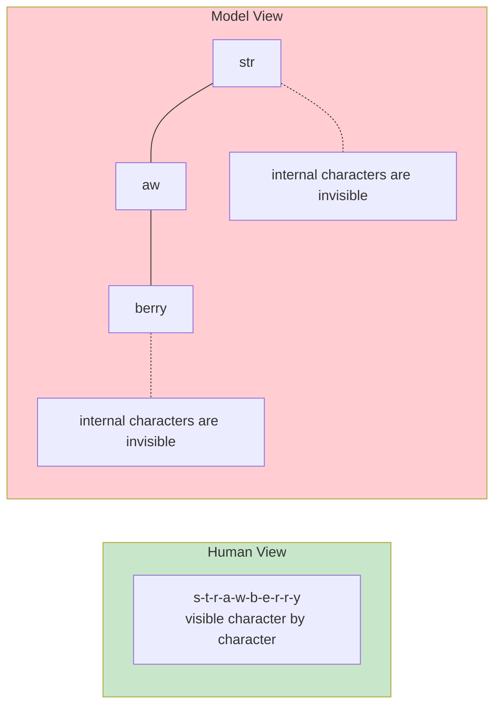
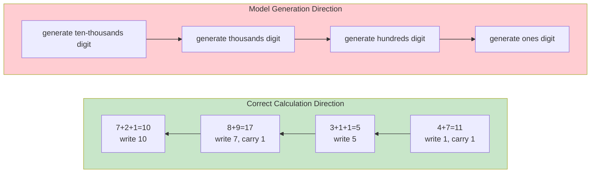
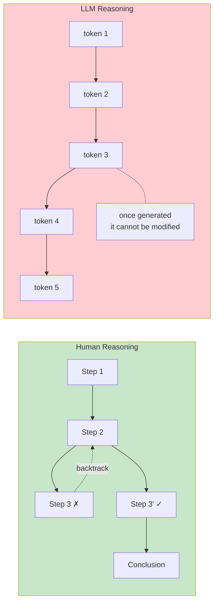
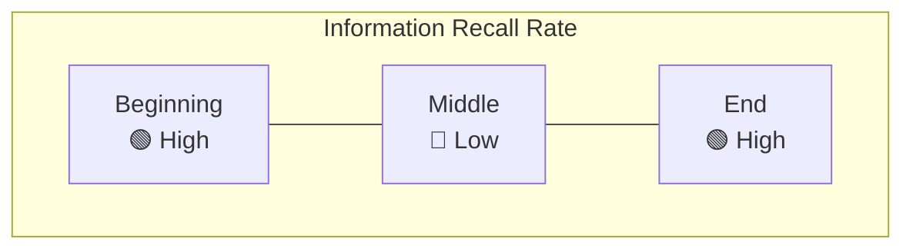
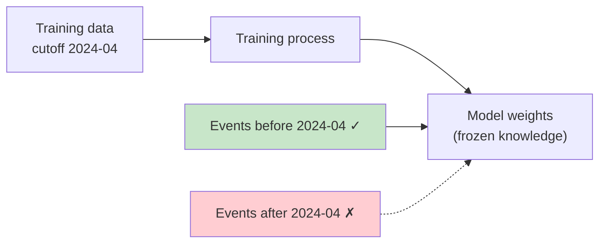
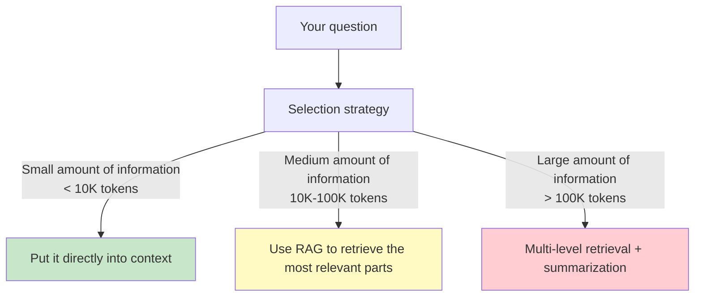
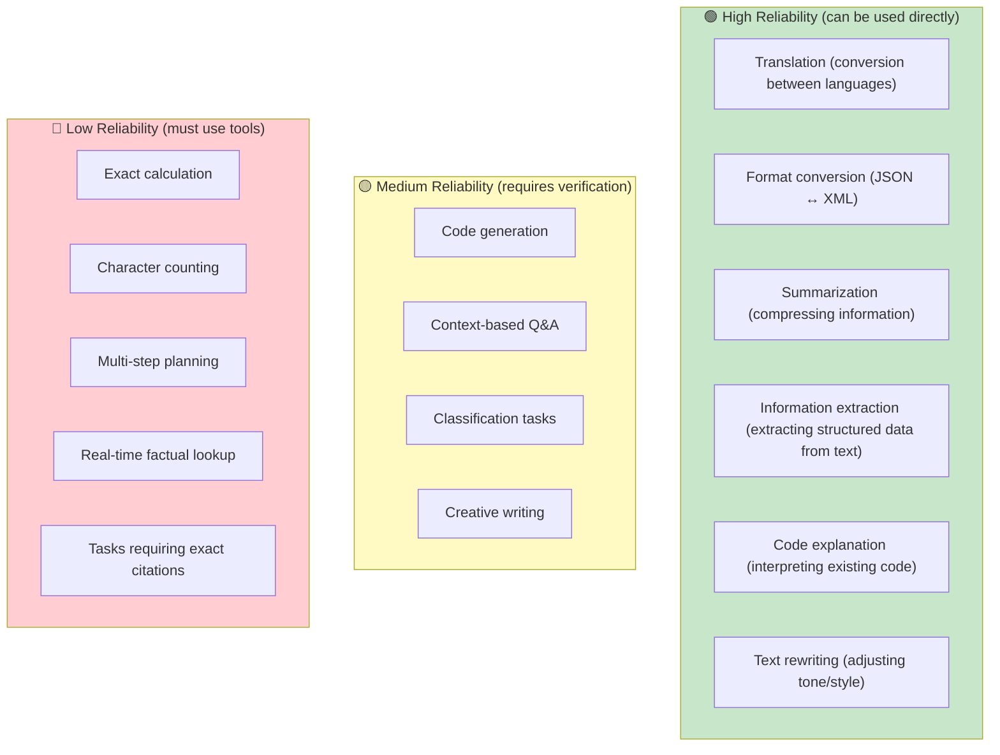
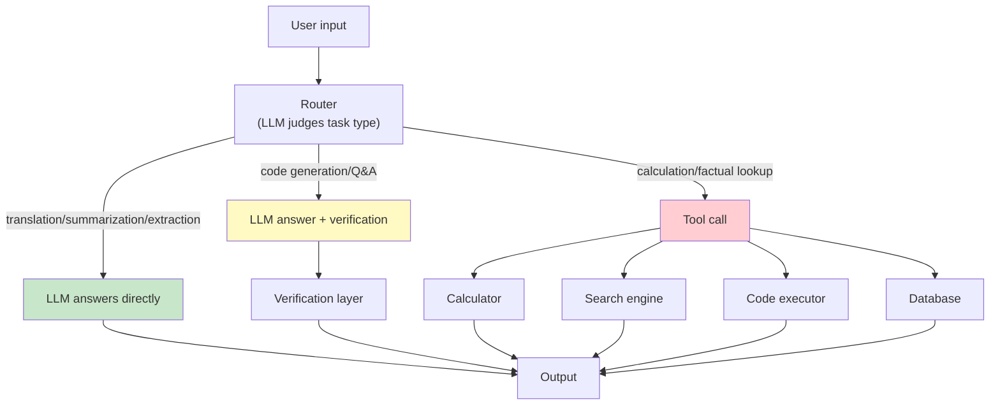

[← Previous Chapter](05-strengths.md) | [Table of Contents](../README.md) | [Next Chapter →](07-hallucination.md)

**中文**: [中文](../../chapters/06-limitations.md)

# Chapter 6: The Hard Limits of LLMs

> "It's not a bug, it's a ~~feature~~ fundamental architectural limitation."

In the previous chapter, we looked at the domains where LLMs excel. This chapter turns to the other side: **the things LLMs are inherently bad at**.

These are not "problems that have not been solved yet"; they are **architectural limitations**. If you understand their root causes, you can:

1. Avoid wasting time on scenarios that are doomed to fail
2. Design the right system architecture (let the LLM do what it is good at, and let tools handle the rest)
3. Ask the right questions in interviews and reviews

The core argument of this chapter is: **every "hard limit" can be traced back to how LLMs are trained or how inference works**. Once you understand the root cause, the solution naturally follows.

---

## 6.1 Counting Goes Wrong

### A Classic Failure Case

```
User: How many r's are in "strawberry"?
GPT-4: 2.

Correct answer: 3 (st-r-awbe-r-r-y)
```

This question once sparked heated discussion online. People were surprised that such a "smart" model could fail to count letters correctly. But if you understand tokenizers, the error is not surprising.

### Root Cause: The Tokenizer Breaks Character Boundaries

Recall Chapter 1: LLMs do not process text character by character. They process tokens.

```python
import tiktoken

enc = tiktoken.encoding_for_model("gpt-4")
tokens = enc.encode("strawberry")
print([enc.decode([t]) for t in tokens])
# Possible output: ['str', 'aw', 'berry']
```

When the model sees "strawberry", it does not see the 10 characters `s-t-r-a-w-b-e-r-r-y`; it sees the three tokens `str`-`aw`-`berry`.

**The model has never "seen" the individual character r.** It sees token fragments that contain r. To count the number of r's, the model needs to:

1. Know that "str" contains one r
2. Know that "aw" contains no r
3. Know that "berry" contains two r's
4. Add them together

This requires precise knowledge of the characters inside tokens, but during training, tokens are the smallest unit. The model was not trained to analyze the internal structure of tokens.



### Solution

```python
# Let the model count with code (tool use)
def count_char(text, char):
    return text.count(char)

# Or guide the model in the prompt to break down the word character by character
prompt = """
Please list each character in "strawberry" one by one, then count the number of r's.

Character list: s, t, r, a, w, b, e, r, r, y
Positions where r appears: 3rd, 8th, 9th
Number of r's: 3
"""
```

**Core principle**: For any task that requires character-level operations (counting, palindrome checks, word puzzles), do not trust the LLM's direct answer. Give it access to a code execution tool.

---

## 6.2 Arithmetic Is Unreliable

### Small Numbers Are Fine; Large Numbers Fail

```
Question: 7 + 5 = ?
Answer: 12 ✓

Question: 347 + 289 = ?
Answer: 636 ✓ (very likely)

Question: 7834 + 2917 = ?
Answer: 10741 ✗ (the correct answer is 10751)

Question: 38472 × 9513 = ?
Answer: 366,023,736 ✗ (the correct answer is 365,924,136)
```

### Root Cause: Pattern Matching Is Not Computation

LLMs do not "calculate" mathematics. Instead, they:

1. See "7 + 5 ="
2. In the training data, "7 + 5 = 12" has appeared countless times
3. "12" is the most likely next token

For small numbers, this kind of pattern matching produces the same result as real calculation. But for large numbers:

```
"7834 + 2917 = ?"
→ The model has never seen this exact addition problem in the training data
→ It tries to "infer" the answer from similar patterns
→ This is not calculation; it is guessing
```

The deeper problem: **multi-digit arithmetic requires carrying, an algorithm that must be processed from right to left**. But autoregressive models generate from left to right. When the model generates the "ten-thousands" digit, it does not yet know what carries will arise from the lower-order digits.



Calculation must proceed from right to left (low-order digits to high-order digits), but token generation proceeds from left to right (high-order digits to low-order digits). This is a fundamental directional conflict.

### Reliability Curve

| Operation Type | Number Range | Reliability |
|---------|---------|--------|
| Addition/subtraction | 1-100 | Very high (~99%) |
| Addition/subtraction | 100-10000 | Medium (~80%) |
| Addition/subtraction | 10000+ | Unreliable (~50%) |
| Multiplication | 1-12 (multiplication table) | Very high (~99%) |
| Multiplication | Two digits × two digits | Medium (~70%) |
| Multiplication | Three digits+ | Unreliable (<30%) |
| Division/square roots | Any | Unreliable |

### Solution

````python
# Option 1: code execution tool
# Let the LLM write code, then execute the code to get the result
"""
Question: Calculate 7834 + 2917

Let me use Python to calculate it:
```python
result = 7834 + 2917
print(result)  # 10751
```

The answer is 10751.
"""

# Option 2: Function Calling
tools = [{
    "type": "function",
    "function": {
        "name": "calculator",
        "description": "Perform exact mathematical operations",
        "parameters": {
            "type": "object",
            "properties": {
                "expression": {"type": "string", "description": "Mathematical expression"}
            }
        }
    }
}]
````

**Core principle**: Any task that requires an exact numerical result should be handed to a code executor or calculator tool, not left to the LLM's direct reasoning.

---

## 6.3 Long-Range Reasoning Breaks Down

### The Fatal Flaw of Autoregressive Generation: No Way Back

When humans do complex reasoning, they often:

1. First try one direction
2. Discover that it does not work
3. **Backtrack** and try another direction
4. **Compare back and forth** across multiple intermediate results

LLMs cannot do this. Autoregressive generation means: **once a token has been generated, it cannot be modified**.



### Error Accumulation

Worse, errors in multi-step reasoning **accumulate**. If a small mistake appears in step 3, every later step is built on top of that mistake.

```
Problem: A class has 30 students, 60% of whom are girls. Among the girls, 75% participated in the sports meet.
         Among the boys, half participated in the sports meet. What percentage of the class participated in the sports meet?

Ideal reasoning:
1. Number of girls = 30 × 60% = 18 ✓
2. Girls who participated in the sports meet = 18 × 75% = 13.5 → in reality this should be an integer...
   (the problem itself is flawed here, but we are focusing on the reasoning process)
3. Number of boys = 30 - 18 = 12 ✓
4. Boys who participated in the sports meet = 12 × 50% = 6 ✓
5. Total participants = 13.5 + 6 = 19.5
6. Percentage = 19.5 / 30 = 65%

Possible erroneous reasoning by an LLM:
1. Number of girls = 30 × 60% = 18 ✓
2. Girls who participated in the sports meet = 18 × 75% = 12 ✗ (calculation error)
3. Number of boys = 30 - 18 = 12 ✓
4. Boys who participated in the sports meet = 12 × 50% = 6 ✓
5. Total participants = 12 + 6 = 18 ✗ (based on the error in step 2)
6. Percentage = 18 / 30 = 60% ✗ (wrong final answer)
```

One wrong step can make every later step wrong.

### The "Lost in the Middle" Problem

Liu et al. (2023), in [_Lost in the Middle: How Language Models Use Long Contexts_](https://arxiv.org/abs/2307.03172), found a troubling phenomenon:

When the input contains a large amount of information, **the model recalls information at the beginning and end best, while information in the middle is the easiest to ignore**.



This is a side effect of the attention mechanism: the farther away a position is, the weaker attention becomes. Although attention can theoretically attend to any position, in practice models pay noticeably less attention to information in the middle.

### Solution

```python
# Option 1: Chain-of-Thought (CoT)
prompt = """
Please reason step by step:

Problem: ...

Step 1: First...
Step 2: Then...
Step 3: Next...
Final answer: ...
"""

# Option 2: decompose the task
# Do not ask the model to solve the entire problem at once
# Break a complex problem into multiple simple problems

# Option 3: verification steps
prompt = """
Please solve the following problem. After solving it, verify each step of your reasoning.

Problem: ...

Reasoning: ...
Verification: Let me check each step...
"""

# Option 4: counteract "Lost in the Middle"
# Put the most important information at the beginning or the end
# Or explicitly instruct the model to pay attention to a specific section
prompt = """
In the following document, the sections marked [Important Paragraph] contain the key information needed to answer the question:

[Document content, with key information highlighted using markers]

Based on the document above, answer: ...
"""
```

---

## 6.4 Time Cutoff

### Frozen Knowledge

An LLM's knowledge comes from its training data. That training data has a cutoff date. The model knows nothing about events that happened after the cutoff.

```
Question: Who won the 2025 Super Bowl?
Answer: (if the training data cutoff was early 2024) I cannot determine that...

More dangerous:
Question: What is the latest version of React?
Answer: React 18.2 (a confident answer, but it may already be outdated)
```

The second case is more dangerous: the model will not necessarily tell you that its information may be outdated. It will confidently give the newest information available at its training data cutoff, as if that were still "now".

### This Is Not a Bug; It Is Inevitable with Static Weights



The model's weights are fixed after training is complete. New information cannot be "injected" into existing weights unless the model is retrained or fine-tuned.

### Solution

| Approach | Applicable Scenario | Pros and Cons |
|------|---------|--------|
| RAG (Retrieval-Augmented Generation) | Requires real-time information | Flexible and updatable, but requires maintaining a retrieval system |
| Web Search tool | Requires the latest information | Real-time, but depends on search quality |
| Fine-tuning | Adds new knowledge in a specific domain | Expensive, inflexible, and may create knowledge conflicts |
| Periodic retraining | Keeps overall knowledge up to date | Extremely expensive |

```python
# Basic RAG pattern
def answer_with_rag(question):
    # 1. Retrieve the latest relevant documents
    docs = vector_store.search(question, top_k=5)

    # 2. Inject the retrieved documents into the prompt
    context = "\n\n".join([doc.text for doc in docs])

    prompt = f"""Answer the question based on the following reference materials. If the reference materials do not contain relevant information, say so.

Reference materials:
{context}

Question: {question}
"""
    # 3. Let the LLM answer based on the retrieved context
    return llm.generate(prompt)
```

---

## 6.5 Faithfulness Problem

### A Continuation Machine Must Continue

Recall the core argument from Chapter 1: an LLM is a continuation machine. Whatever the input is, it generates the "most likely continuation".

This means: **the model never truly "refuses to answer"**. Even when it "does not know" the answer, the text it generates simulates what "someone who knows the answer would say".

```
Question: What is the unified theory equation for quantum gravity?

The model will not say: "Humanity has not solved this problem yet."
The model may say: "According to such-and-such theory, the unified equation can be expressed as..." (then fabricate a plausible-looking equation)
```

### "I Don't Know" Is Also a Prediction

This is a subtle but important distinction:

```
When the model says "I don't know":
  ✗ It is not expressing real uncertainty
  ✓ It is predicting that, in this context, "I don't know" is the most likely continuation
```

Models trained with RLHF say "I don't know" more often, but that does not mean they have become more "honest". It only means they have learned which scenarios reward the answer "I don't know".

When the model answers confidently, you cannot tell from the answer itself whether it truly knows or is fabricating. Chapter 7 will discuss this problem in detail.

### Practical Impact

```python
# Dangerous pattern: directly trusting the model's answer
answer = llm.generate("What was Company XX's net profit in Q3 2024?")
# The model may return a precise number, but it could be entirely fabricated

# Safe pattern: retrieve first, then let the model answer based on retrieval results
docs = search("Company XX 2024 Q3 financial report")
answer = llm.generate(f"Answer based on the following financial report data: {docs}\n\nWhat was the net profit?")
# If the retrieved results contain the answer, the model's answer is very likely correct
# If the retrieved results do not contain the answer, the model is more likely to say "not found in the materials"
```

---

## 6.6 Context Window Limits

### The Cost of O(n^2)

The computational complexity of attention is O(n^2), where n is the context length. This means:

| Context Length | Relative Computation |
|---------------|-----------|
| 4K tokens | 1x |
| 16K tokens | 16x |
| 128K tokens | 1024x |
| 1M tokens | 62500x |

Although modern models support very long contexts (Claude supports 200K tokens, Gemini supports 1M+ tokens), longer context means more computation, higher latency, and greater cost.

### Long Context Does Not Equal Good Information Use

"Needle in a Haystack" tests show that even when a model's context window is large enough, its ability to find specific information declines as context length increases.

```python
# Basic idea of the "Needle in a Haystack" test
def needle_in_haystack_test(model, context_length, needle_position):
    """
    1. Generate "hay" of a specified length (irrelevant text)
    2. Insert a "needle" (key information) at a specified position
    3. Ask the model to find and recall this information
    4. Check recall accuracy
    """
    hay = generate_irrelevant_text(context_length)
    needle = "The secret code is: ALPHA-7749-ZULU"

    # Insert the needle at the specified position
    text = hay[:needle_position] + needle + hay[needle_position:]

    response = model.generate(
        f"{text}\n\nWhat is the secret code mentioned in the text above?"
    )

    return "ALPHA-7749-ZULU" in response
```

Typical result distribution:

```
Position \ Length |  4K   |  32K  | 128K  |  1M
------------------|-------|-------|-------|------
Beginning (0-10%) | 99%   | 98%   | 95%   | 90%
Early-middle (10-40%) | 98% | 95% | 85% | 70%
Middle (40-60%)   | 97%   | 88%   | 75%   | 55%
Late-middle (60-90%) | 98% | 90% | 80% | 65%
End (90-100%)     | 99%   | 97%   | 93%   | 85%
```

> Note: The table above contains illustrative data. Actual results vary by model, and the latest models have improved significantly on long-context tasks. But the trend that "the longer the context, the lower the information utilization rate" still holds.

### You Cannot Stuff Everything into Context

A common misconception is: "The model supports 1M tokens, so I can just stuff all the documents into it!"

The problems are:
1. **Cost**: more tokens mean higher cost (billing is based on tokens)
2. **Latency**: O(n^2) means that when context doubles, computation quadruples
3. **Information retrieval degradation**: key information is easier to ignore in long contexts
4. **Interference**: irrelevant information may affect the quality of the model's output



---

## 6.7 Reliability Framework

Putting together everything discussed above, we can build a **reliability framework** to help judge whether a task should be handled by an LLM.

### Reliability Levels



### Complete Reliability Table

| Task Type | Reliability | Root Cause | Solution |
|---------|--------|------|---------|
| Translation | 🟢 High | Trained on massive parallel corpora | Use directly |
| Summarization | 🟢 High | Compression is a training objective | Use directly |
| Format conversion | 🟢 High | Large amounts of format correspondence data | Use directly, with schema validation |
| Information extraction | 🟢 High | The answer is in the input | Use directly, with structured output |
| Code explanation | 🟢 High | Understanding > generation | Use directly |
| Code generation | 🟡 Medium | May contain logic errors | Needs test verification |
| Contextual Q&A | 🟡 Medium | May hallucinate | Require source citations |
| Classification | 🟡 Medium | Edge cases are unstable | few-shot + verification |
| Exact arithmetic | 🔴 Low | Pattern matching is not computation | Use code interpreter |
| Character operations | 🔴 Low | Tokenizer limitation | Use code tools |
| Real-time facts | 🔴 Low | Knowledge cutoff | RAG / web search |
| Long-range planning | 🔴 Low | No ability to backtrack | Decompose + verify |
| Exact citations | 🔴 Low | Tendency to hallucinate | Retrieve + validate |

### Design Principle

Based on this framework, the core principle of LLM system design is:

```
🟢 Task → LLM handles directly
🟡 Task → LLM handles + verification/confirmation
🔴 Task → LLM calls tools, tools return results
```

Expressed as an architecture diagram:



---

## Summary

None of the "hard limits" of LLMs are random bugs. They come from the model's fundamental architecture:

| Hard Limit | Root Cause | One-Sentence Summary |
|------|------|-----------|
| Cannot count characters correctly | Tokenizer breaks character boundaries | The model has never "seen" individual characters |
| Cannot calculate reliably | Pattern matching is not computation | Generation direction conflicts with carrying direction |
| Long-range reasoning breaks down | Autoregression has no backtracking | Once a token is written, it cannot be modified |
| Time cutoff | Static weights | New information after training cannot enter the model |
| Faithfulness problem | A continuation machine must continue | Even without knowing the answer, it generates text that "looks right" |
| Context limits | O(n^2) + information degradation | Longer does not mean better |

After understanding these limitations, the right approach is not to "find ways to make LLMs overcome these limitations", but to **design systems that route around them**:

> **Let LLMs do what they are good at (pattern recognition, transformation, extraction), and let tools do what LLMs are bad at (calculation, retrieval, verification).**

In the next chapter, we will discuss the best-known "hard limit" of LLMs in depth: hallucination.

---

## Further Reading

- [Liu et al., 2023: _Lost in the Middle: How Language Models Use Long Contexts_](https://arxiv.org/abs/2307.03172) — information loss in long contexts
- [Dziri et al., 2023: _Faith and Fate: Limits of Transformers on Compositionality_](https://arxiv.org/abs/2305.18654) — fundamental limits of compositional reasoning
- [Schick et al., 2023: _Toolformer: Language Models Can Teach Themselves to Use Tools_](https://arxiv.org/abs/2302.04761) — letting models learn to use tools
- [Press et al., 2022: _Measuring and Narrowing the Compositionality Gap_](https://arxiv.org/abs/2210.03350) — the compositional reasoning gap
- [Mirchandani et al., 2023: _Large Language Models Cannot Self-Correct Reasoning Yet_](https://arxiv.org/abs/2310.01798) — limitations of LLM self-correction

[← Previous Chapter](05-strengths.md) | [Table of Contents](../README.md) | [Next Chapter →](07-hallucination.md)
