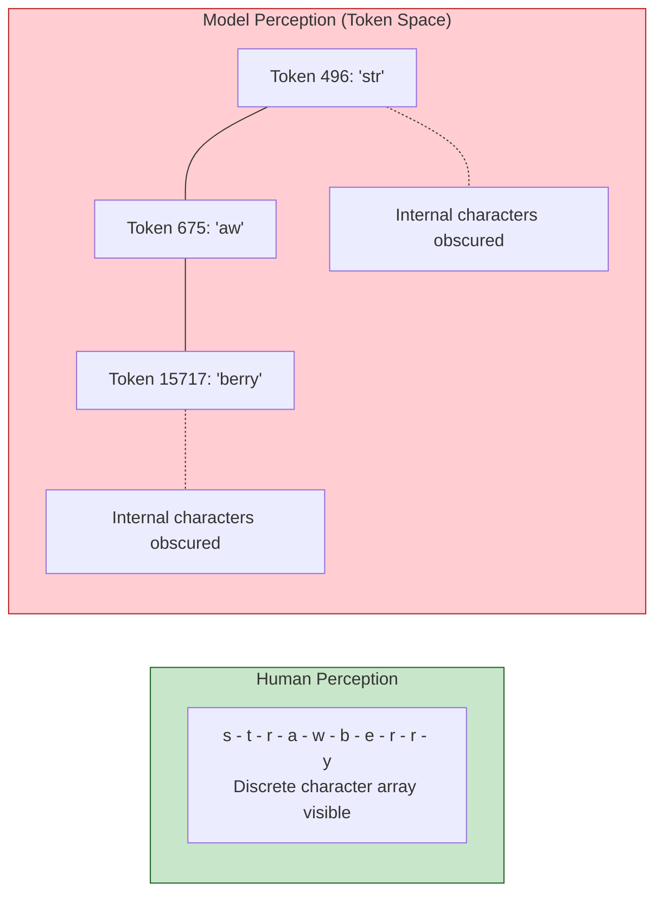
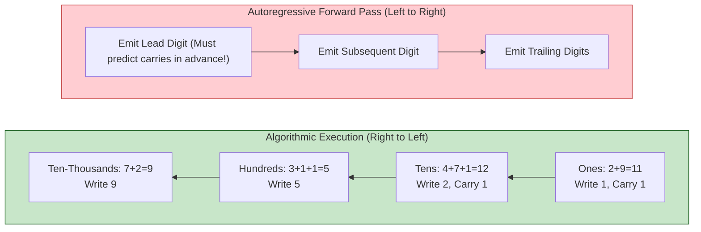
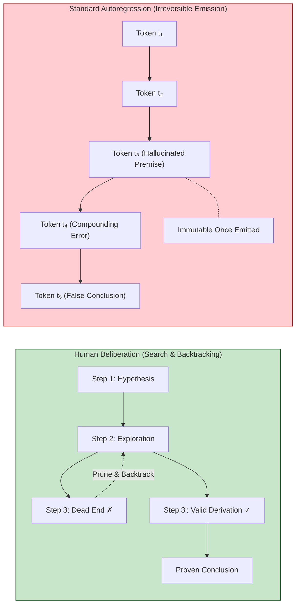
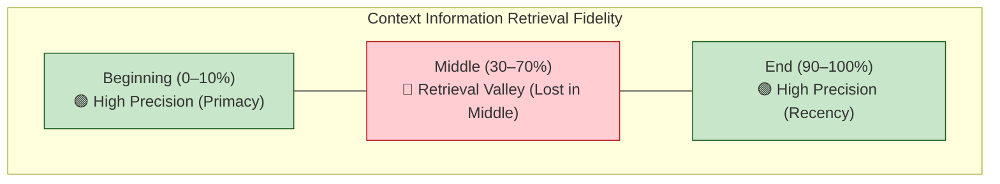
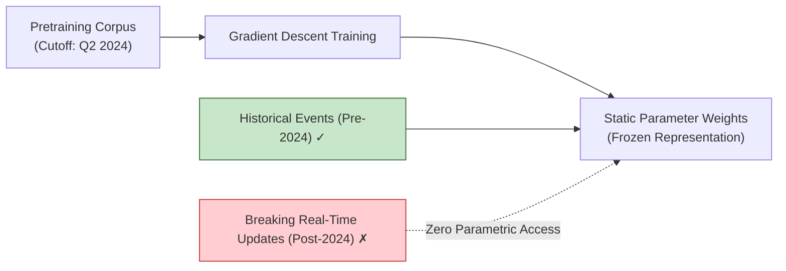
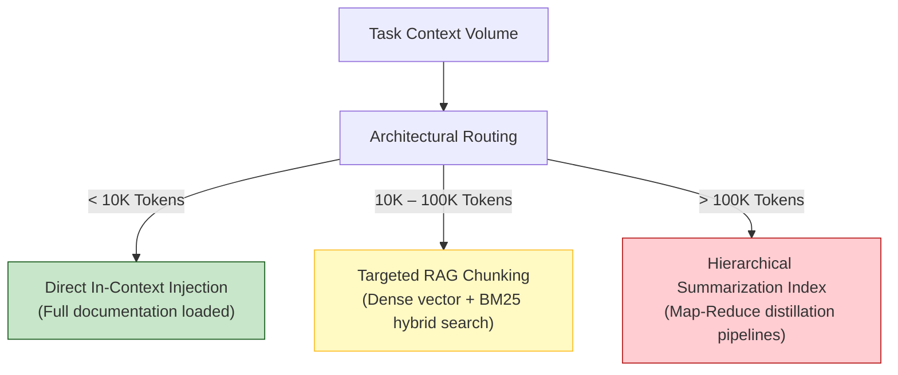
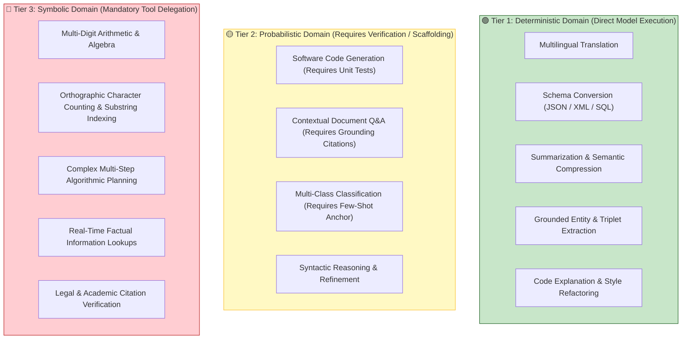
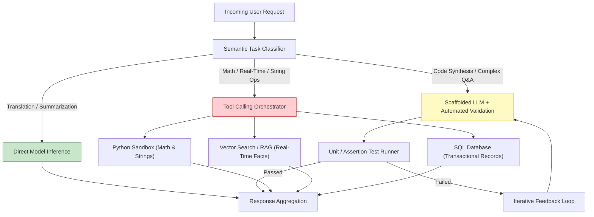
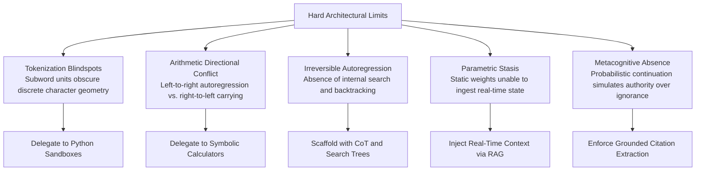

[← Previous Chapter](05-strengths.md) | [Table of Contents](../README.md) | [Next Chapter →](07-hallucination.md)

**中文**: [中文](../../chapters/06-limitations.md)

# Chapter 6: The Hard Limits of LLMs

> "It's not a bug; it's a fundamental architectural constraint."

In the preceding chapter, we surveyed the core operational domains where large language models excel. This chapter turns to the opposing side of the engineering ledger: **the tasks that autoregressive transformers are structurally incapable of executing reliably**.

These failure modes are not transient engineering glitches awaiting a minor patch; they are **intrinsic architectural boundaries** arising directly from next-token autoregression, subword tokenization, and static parameter weights. Internalizing their root causes provides three decisive advantages:

1. **Eliminate Doomed Architectural Patterns**: Avoid burning engineering cycles attempting to prompt an LLM past mathematical impossibility.
2. **Architect Resilient Hybrid Systems**: Delegate tasks along natural capability boundaries, assigning statistical synthesis to the LLM and deterministic logic to symbolic tools.
3. **Calibrate Evaluation Rigor**: Ask precise diagnostic questions when conducting architecture reviews and red-teaming production pipelines.

The governing thesis of this chapter: **every hard failure mode can be traced directly to the computational physics of the Transformer forward pass**. When you map the mathematical origin of a limitation, the correct architectural remedy becomes obvious.

---

## 6.1 Character-Level Blindspots: The Tokenization Bottleneck

### The Canonical Failure Case

```
User Query: How many times does the letter "r" appear in "strawberry"?
GPT-4 Output: 2.

Ground Truth: 3 (st-r-awbe-r-r-y)
```

This notorious puzzle baffled early observers: how can a system capable of synthesizing complex Rust async runtimes fail at elementary spelling? The answer lies entirely within the discrete mechanics of the subword tokenizer.

### Root Cause: Subword Segmentations Mask Character Geometry

As established in Chapter 1, an autoregressive language model never directly observes isolated ASCII or Unicode characters. It operates over discrete token IDs:

```python
import tiktoken

enc = tiktoken.encoding_for_model("gpt-4o")
tokens = enc.encode("strawberry")
print([enc.decode([t]) for t in tokens])
# Output: ['str', 'aw', 'berry']
```

When presented with `"strawberry"`, the transformer's embedding layer ingests three high-dimensional vector representations: `['str', 'aw', 'berry']`.

**The model has zero direct perception of the underlying 10-character sequence `s-t-r-a-w-b-e-r-r-y`.** To count the occurrence of the character `"r"`, the network must:

1. Retrieve the latent orthographic representation of `'str'` and infer that it contains one `"r"`.
2. Retrieve the latent representation of `'aw'` and verify zero `"r"` occurrences.
3. Retrieve `'berry'` and infer that it contains two `"r"` characters.
4. Sum these latent inferences across distinct forward-pass activations.

Because tokenizers are optimized to maximize information compression rather than preserve orthographic granularity, the model possesses no internal representation of character boundaries.



### Architectural Remedy: Tool Grounding and Character Expansion

```python
# Optimal Pattern: Offload character manipulation to a deterministic Python sandbox
def count_character_occurrences(text: str, target_char: str) -> int:
    """Exact string analysis via deterministic tool use."""
    return text.lower().count(target_char.lower())

# Prompt Scaffolding Pattern: Force orthographic serialization
prompt = """
Deconstruct the word "strawberry" into a space-delimited character sequence before counting:

Step 1: Character array -> s t r a w b e r r y
Step 2: Enumerate target matches -> Position 3 ('r'), Position 8 ('r'), Position 9 ('r')
Step 3: Total count -> 3
"""
```

**System Design Law**: Never entrust character-level operations (spelling validation, anagram decoding, string slicing, regex compilation, palindrome verification) to raw LLM generation. Delegate them to a deterministic code runtime.

---

## 6.2 Arithmetic Unreliability: Pattern Matching vs. Computational Carrying

### Small Integers Succeed; High-Precision Arithmetic Fails

```
Query: 7 + 5 = ?
Output: 12 ✓ (Exact recall from pretraining memory)

Query: 347 + 289 = ?
Output: 636 ✓ (Likely correct via high-density pattern interpolation)

Query: 78,342 + 29,179 = ?
Output: 107,421 ✗ (Actual ground truth: 107,521; off by a carry factor of 100)

Query: 38,472 × 9,513 = ?
Output: 366,023,736 ✗ (Actual ground truth: 365,984,136; hallucinated tail digits)
```

### Root Cause: Autoregression Conflicts with Carry-Propagation Geometry

Large language models do not compute arithmetic; they perform **statistical sequence completion**.

When evaluating `"7 + 5 ="`, the token `" 12"` has appeared millions of times in code repositories, textbooks, and mathematical corpora. It is emitted as the path of maximum likelihood.

However, for arbitrary multi-digit arithmetic:
- The exact equation is absent from the training distribution.
- The model attempts to approximate the numerical result via high-dimensional pattern interpolation.
- **Directional Conflict**: Addition and multiplication algorithms propagate carries **from right to left** (least significant to most significant digit). Yet autoregressive generation emits tokens strictly **from left to right** (most significant to least significant digit).



When an autoregressive model outputs the most significant digit (e.g., the ten-thousands place), it has not yet generated the lower-order tokens whose carrying operations determine whether that leading digit is incremented. It must effectively "guess" future carries in advance.

### Empirical Reliability Across Arithmetic Regimes

| Arithmetic Tier | Operand Range | Raw LLM Reliability | Architectural Risk |
|---|---|---|---|
| **Single-Digit / Small Ints** | $0 \le n \le 20$ | ~99.9% | Negligible (Pure lookup memorization) |
| **Two-Digit Operations** | $10 \le n \le 100$ | ~95.0% | Low (Slight risk under rare carrying) |
| **Multi-Digit Addition ($4+$ digits)** | $n > 1,000$ | ~60.0% – 75.0% | **Severe** (Carry misalignment) |
| **Multi-Digit Multiplication** | $3\text{ digits} \times 3\text{ digits}$ | < 30.0% | **Catastrophic** (Combinatorial error) |
| **Floating Point / Non-Integer** | Arbitrary precision | < 20.0% | **Unviable** |

### Architectural Remedy: The Computational Tool Call

```python
# System Design Pattern: Function Calling to Deterministic Math Engine
tools = [
    {
        "type": "function",
        "function": {
            "name": "execute_math_expression",
            "description": "Evaluates exact mathematical operations via symbolic algebra.",
            "parameters": {
                "type": "object",
                "properties": {
                    "expression": {
                        "type": "string",
                        "description": "The formal arithmetic expression (e.g. '78342 * 29179')"
                    }
                },
                "required": ["expression"]
            }
        }
    }
]
```

**System Design Law**: Any pipeline requiring numeric precision, financial balance aggregation, or scientific calculation must route arithmetic operations through a deterministic calculator or code interpreter.

---

## 6.3 Multi-Step Reasoning Failures and the Irreversibility of Autoregression

### The Fundamental Flaw: The Absence of Internal Backtracking

When a human mathematician or software engineer tackles a complex multi-step challenge, the cognitive process is intrinsically non-linear:

1. Formulate an initial hypothesis.
2. Advance intermediate derivations.
3. Detect a contradiction or dead end at step 4.
4. **Backtrack** to step 2, prune the invalid branch, and explore an alternate path.

Standard autoregressive generation possesses **zero native backtracking capabilities**. Once a token $x_t$ is emitted and appended to the context window, it becomes permanent conditioning context for all future tokens $x_{t+k}$:



### Compounding Error Cascades

In long reasoning chains, error probabilities compound exponentially:

$$\mathcal{P}(\text{Success}) = \prod_{i=1}^{k} \mathcal{P}(\text{Step } i \text{ is correct})$$

If a complex task requires a 10-step deductive chain, and the model exhibits a 90% per-step accuracy:

$$\mathcal{P}(\text{Success}) = 0.90^{10} \approx 34.8\%$$

A minor miscalculation or hallucinated premise in step 2 permanently derails the forward attention trajectory, turning the remaining eight steps into fluent rationalizations of an invalid premise.

### The "Lost in the Middle" Attention Phenomenon

Liu et al. ([2023](https://arxiv.org/abs/2307.03172)) exposed a structural degradation mode across long context windows: **models exhibit high recall at the extreme beginning (primacy effect) and extreme end (recency effect) of the context window, while information in the central 40–70% span suffers significant retrieval degradation**.



### Architectural Remedies

1. **Scaffold with Chain-of-Thought (CoT)**: Force the model to emit intermediate reasoning tokens into the context buffer before emitting the final answer, converting implicit computation into explicit sequence steps.
2. **Decompose Complex Workflows**: Break multi-stage workflows into discrete agentic loops where individual sub-tasks are validated independently.
3. **Context Ordering Optimization**: Place critical system instructions and high-priority retrieval needles at the absolute head and tail of the prompt payload.

---

## 6.4 Temporal Knowledge Cutoffs and Parametric Stasis

### The Frozen Weight Manifold

A foundation model's parametric world knowledge is strictly bounded by the temporal horizon of its pretraining corpus. Once gradient optimization halts, the parameter weights freeze:

```
User Query: "Who won the men's 100m sprint at the 2028 Olympic Games?"
Model (Training Cutoff 2024): "The 2028 Olympic Games have not yet occurred..."

Subtle Temporal Drift:
User Query: "What is the recommended routing pattern in Next.js?"
Model (Training Cutoff 2023): Confidently provides legacy Pages Router code (`pages/index.js`),
oblivious to the breaking paradigm shift introduced by the App Router (`app/page.js`).
```

The second failure mode is far more treacherous in production: the model does not signal epistemic uncertainty. Instead, it hallucinates outdated architectural recommendations with total linguistic confidence, treating historical conventions as contemporary ground truth.



### Knowledge Update Strategies

| Strategy | Latency & Economics | Grounding Fidelity | Production Trade-off |
|---|---|---|---|
| **RAG (Retrieval-Augmented Generation)** | Low cost; dynamic retrieval | High (verifiable citations) | Introduces retrieval infrastructure complexity |
| **Real-Time Web Tool Calling** | Pay-per-query; instant | High (external ground truth) | Dependent on external search engine latency |
| **Continual Parameter Fine-Tuning** | High compute cost | Variable (catastrophic forgetting risk) | Slow iteration cycle; prone to knowledge interference |
| **Periodic Foundation Retraining** | Millions of dollars | Comprehensive | Economically unviable for fast-moving domains |

```python
# Standard Architectural Mitigation: RAG Context Injection
def generate_grounded_response(query: str) -> str:
    # 1. Retrieve authoritative real-time context
    retrieved_chunks = vector_index.similarity_search(query, top_k=4)
    context_payload = "\n\n".join([f"Source [{i}]: {doc.page_content}" for i, doc in enumerate(retrieved_chunks)])

    # 2. Condition the model strictly on external ground truth
    prompt = f"""You are a technical assistant. Answer the query using ONLY the provided context. 
If the information is not contained within the sources, explicitly state that the documentation is unavailable.

Context Sources:
{context_payload}

Query: {query}
Answer:"""

    return llm_client.generate(prompt)
```

---

## 6.5 Epistemic Calibration and Confabulation

### A Continuation Machine Must Always Continue

As established in Chapter 1, an autoregressive language model is fundamentally a statistical sequence completion engine. Given a sequence of input tokens, the network *must* emit the most probable subsequent tokens according to its learned manifold.

This induces a critical architectural limitation: **the raw model possesses no innate metacognitive awareness of what it does not know**. When presented with an unanswerable or nonexistent premise, the forward pass simply samples tokens that match the structural cadence of an authoritative response:

```
Query: "Provide the exact mathematical formulation of the unified quantum gravity theorem proven in 2027."

Pathological Model Completion:
"The Unified Quantum Gravity Theorem (proved via non-commutative spacetime geometry) establishes that:
$$\oint_{\partial \mathcal{M}} \left( \nabla_\mu \psi^\dagger \gamma^\mu \psi + \frac{1}{16\pi G} \mathcal{R}_{\mu\nu} \star F^{\mu\nu} \right) = \hbar \kappa \Lambda$$
This demonstrates the complete convergence of string dualities..."
```

The mathematical equation is aesthetically flawless, syntactically valid LaTeX, and utterly fictitious.

### The Illusion of "I Don't Know"

A vital conceptual distinction:

```
When an aligned model states "I do not possess information regarding this topic":
  ✗ It has executed an internal epistemic introspection audit over its weight memory.
  ✓ Post-training RLHF conditioned the model to assign high probability to refusal tokens under low-confidence contexts.
```

Refusal tokens are probabilistic outputs generated by alignment masks, not reflections of true metacognitive certainty.

---

## 6.6 Context Window Economics and Degradation Dynamics

### The Quadratic Computational Frontier

Standard scaled dot-product attention scales with quadratic complexity $\mathcal{O}(N^2)$ relative to sequence length $N$:

| Context Span ($N$) | Relative Compute Load ($\mathcal{O}(N^2)$) | Memory Footprint (KV Cache) |
|---|---|---|
| **4,096 tokens (4K)** | $1\times$ | ~1 GB |
| **16,384 tokens (16K)** | $16\times$ | ~4 GB |
| **128,000 tokens (128K)** | $1,024\times$ | ~32 GB |
| **1,000,000 tokens (1M)** | $62,500\times$ | ~250 GB |

While architectural innovations (FlashAttention, PagedAttention, Multi-Head Latent Attention) make long context inference operationally feasible, processing hundreds of thousands of tokens drastically increases Time-to-First-Token (TTFT) and inference cost.

### The Degradation of Context Utilization

Rigorous Needle-in-a-Haystack benchmarks reveal that factual retrieval fidelity deteriorates as the context payload grows:

```python
def needle_in_haystack_diagnostic(client, total_tokens: int, depth_ratio: float) -> bool:
    """Stress-test contextual retrieval across varying depth ratios."""
    distractor_payload = generate_synthetic_technical_corpus(total_tokens)
    target_secret = "SECURITY_FLAG_7749_BETA"
    insertion_index = int(len(distractor_payload) * depth_ratio)

    full_context = (
        distractor_payload[:insertion_index] +
        f"\nCRITICAL_OVERRIDE: The active authorization token is {target_secret}.\n" +
        distractor_payload[insertion_index:]
    )

    response = client.generate(f"{full_context}\n\nQuery: What is the active authorization token?")
    return target_secret in response
```

### Context Utilization Strategy

Stuffing massive document corpora into the context window is an antipattern that introduces significant performance penalties:
1. **Financial Overhead**: Pricing scales linearly with input token counts.
2. **Latency Inflation**: Processing megabyte-scale prompt payloads introduces multi-second TTFT delays.
3. **Semantic Distraction**: Irrelevant distractor tokens degrade the signal-to-noise ratio, increasing the probability of attention diversion.



---

## 6.7 The Architectural Reliability Matrix

Synthesizing these mechanical limitations yields a formal **Reliability Matrix** for systems engineers.



### Comprehensive Capability Taxonomy

| Operational Workload | Reliability Tier | Root Architectural Cause | Engineering Remediation |
|---|---|---|---|
| **Translation** | 🟢 High | Saturated parallel training distribution | Direct inference |
| **Summarization** | 🟢 High | Native entropy compression objective | Direct inference with length constraint |
| **Schema Mapping** | 🟢 High | High-density structural correspondences | Structured outputs (Pydantic / JSON Mode) |
| **Information Extraction** | 🟢 High | Ground truth present in context window | Key-value few-shot delimiters |
| **Code Generation** | 🟡 Medium | Branching logic errors | Automated compiler/test execution loop |
| **Grounded Q&A** | 🟡 Medium | Risk of parametric leakage | Mandatory source citation verification |
| **Few-Shot Classification**| 🟡 Medium | Sensitivity to example ordering | Balanced exemplars with delimiter symmetry |
| **Multi-Digit Arithmetic** | 🔴 Low | Autoregression conflicts with carry direction | Offload to Python / Symbolic Math Engine |
| **Character Indexing** | 🔴 Low | Subword tokenizer obscures character boundaries | Offload to string-processing functions |
| **Real-Time Factual Lookup**| 🔴 Low | Static weight cutoff | Hybrid vector search / RAG pipeline |
| **Long-Range Planning** | 🔴 Low | Inability to backtrack during generation | Monte Carlo Tree Search / Agentic scaffolding |

### Production Routing Architecture



---

## Chapter Summary



Core takeaways:

1. **Failure modes are mathematical invariants, not temporary bugs**: Autoregressive architectures have structural blind spots that cannot be solved by prompting alone.
2. **Subword tokenization breaks character operations**: Character counting and string manipulation must be delegated to deterministic code.
3. **Autoregression conflicts with arithmetic geometry**: Math requires right-to-left carry propagation; generative transformers emit left-to-right. Use computational tools.
4. **Error compounding derails long reasoning chains**: Without backtracking, small early errors poison downstream generations. Scaffold multi-step reasoning with explicit verification loops.
5. **Static weights create knowledge cutoffs**: Ground models with real-time RAG rather than expecting weights to update dynamically.
6. **LLMs possess no native self-doubt**: Confidence is a stylistic artifact of pretraining, not a guarantee of truth.

In Chapter 7, we explore the most consequential failure mode in modern artificial intelligence: the mechanics, taxonomy, and mitigation of hallucinations.

---

## Further Reading

- [Lost in the Middle: How Language Models Use Long Contexts](https://arxiv.org/abs/2307.03172) — Liu et al., Stanford, 2023
- [Faith and Fate: Limits of Transformers on Compositionality](https://arxiv.org/abs/2305.18654) — Dziri et al., Allen Institute for AI, 2023
- [Toolformer: Language Models Can Teach Themselves to Use Tools](https://arxiv.org/abs/2302.04761) — Schick et al., Meta AI, 2023
- [Measuring and Narrowing the Compositionality Gap in Language Models](https://arxiv.org/abs/2210.03350) — Press et al., 2022
- [Large Language Models Cannot Self-Correct Reasoning Yet](https://arxiv.org/abs/2310.01798) — Huang et al., 2023

[← Previous Chapter](05-strengths.md) | [Table of Contents](../README.md) | [Next Chapter →](07-hallucination.md)
