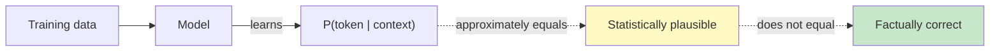
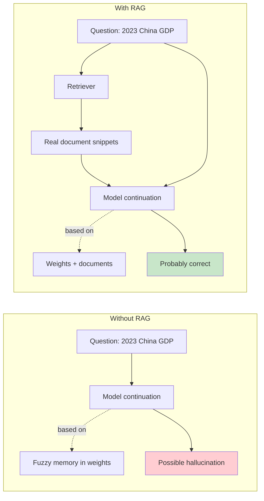
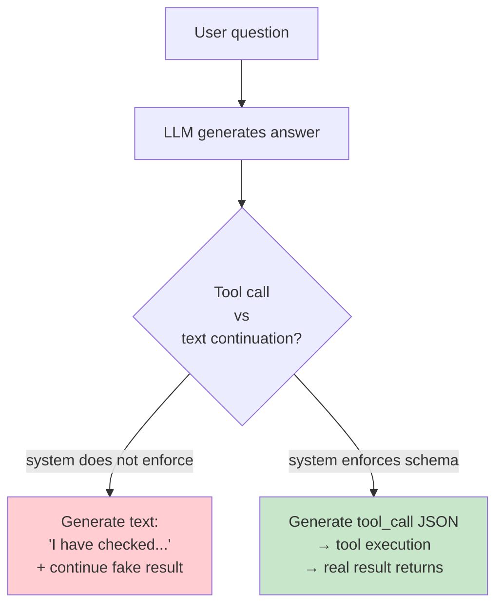
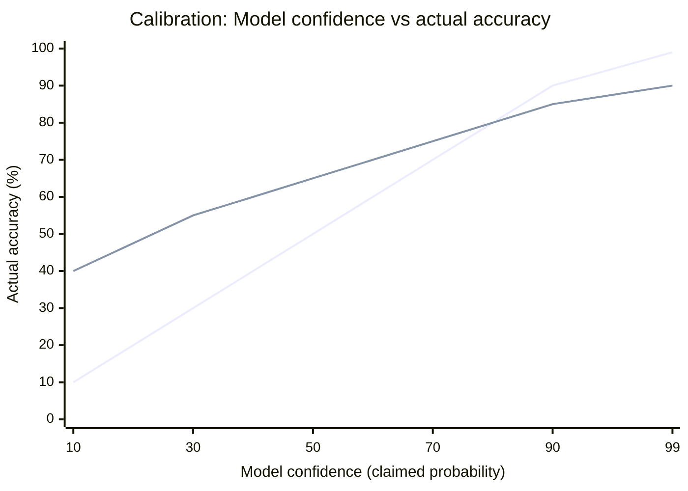
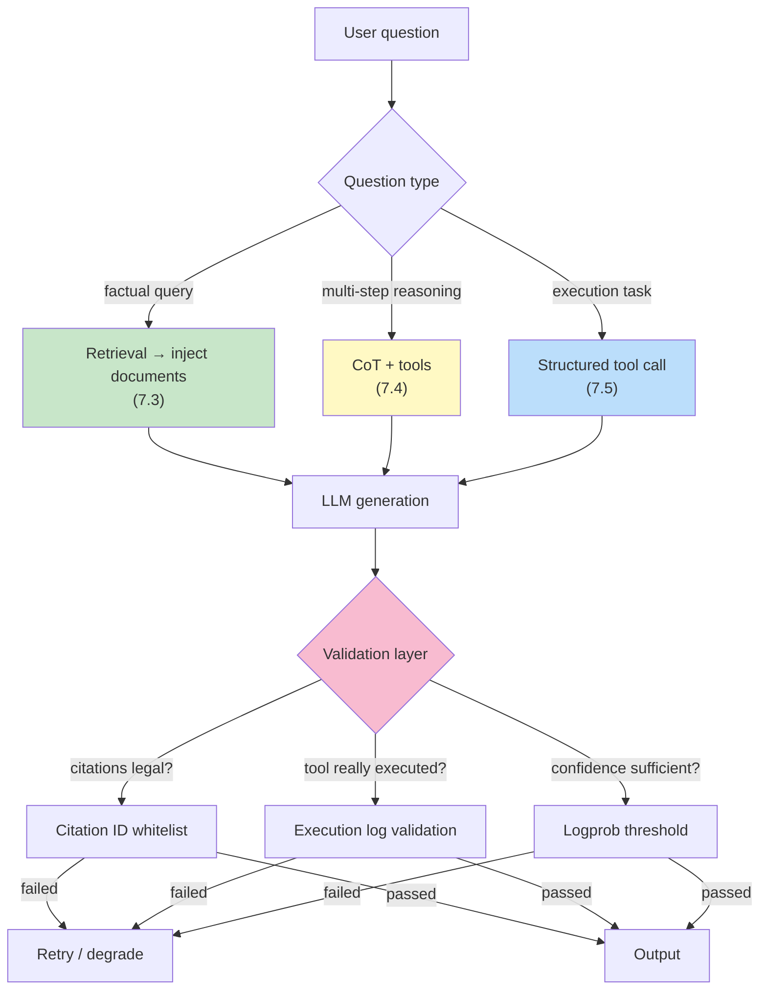

[← Previous Chapter](06-limitations.md) | [Table of Contents](../README.md) | [Next Chapter →](08-reasoning.md)

# Chapter 7: The Nature of Hallucination

> "The model is bullshitting. Not lying, not mistaken — bullshitting in the technical sense: producing language without regard for truth."

At the end of Chapter 6, we pointed out the "faithfulness problem" of LLMs: the continuation engine will always continue. Even when it "doesn't know" the answer, it will generate a response that looks plausible. This chapter takes that problem apart.

Hallucination is an unavoidable topic in LLM applications. Every practitioner has tripped over it: a model confidently cites a paper that does not exist, fabricates an API that does not exist, or gets a person's birth and death dates wrong by thirty years. But **hallucination is not a bug**. It is the logical consequence of the training objective called next-token prediction.

The core claims of this chapter:

1. Hallucination is not the model "making a mistake"; it is the model "running as designed"
2. Different types of hallucination have different root causes and different countermeasures
3. To some extent, the model "knows that it does not know", but this signal is hidden by default
4. Every effective way to reduce hallucination changes the **conditions** of continuation, not continuation itself

After understanding this chapter, you will be able to explain clearly why RAG works, why "please cite sources" is a bad instruction, and why temperature=0 does not reduce hallucination.

---

## 7.1 The Continuation Engine Must Continue

### There Is No "I Don't Know" Item in the Training Objective

Recall Chapter 1: the training objective of an LLM is to maximize P(next token | context). Notice that there is no "honesty" constraint here, no modeling of "knowledge boundaries", and no mechanism for "refusing to answer when uncertain".

The model is trained to do one thing: **given a context, output the most likely continuation**.

This means:

```
User asks: "Please tell me who won the Nobel Prize in Literature in 1973."

Model computes: P(next token | "The winner of the 1973 Nobel Prize in Literature was ___")
                Which token is most likely to appear here?

Answer: "Patrick White" (actually correct, an Australian writer)

But if the question is: "Please tell me who won the Nobel Prize in Literature in 1873."
(The Nobel Prizes were not established until 1901)

The model still computes: P(next token | "The winner of the 1873 Nobel Prize in Literature was ___")
                         Which token is most likely to appear here?

The model will not stop to question the premise. It will output a token that looks like "the name of a Nobel laureate".
```

The essence of hallucination is here: **the model has no concept of "the premise is false"; it only has "which token has the highest probability in this context"**.

### "Most Likely" Does Not Mean "True"

More precisely, what the model learns is **statistical plausibility**, not **factual correctness**.



In most cases, statistical plausibility ≈ factual correctness, because most factual statements in the training data are true. But when the model encounters:

- Specific facts that never appeared in the training data
- Information from multiple contradictory sources
- Rare combinations ("a specific county magistrate in 19th-century China")
- Queries that "look a lot like a real pattern" but are actually fictional

Then its output slides from "statistically plausible and true" toward "statistically plausible but false". The model itself cannot sense this boundary.

### Temperature=0 Is Not an Antidote

Many beginners think temperature=0 (greedy decoding) can eliminate hallucination because it "outputs the most certain answer". This is a misunderstanding.

```
Temperature controls: how sampling is performed from the token probability distribution
Temperature = 0 means: always choose the token with the highest probability

But: the token with the highest probability still comes from a distribution that may deviate from the facts.
```

If the model assigns the token "Tolstoy" a probability of 30% for the nonexistent fact "winner of the 1873 Nobel Prize in Literature" (because Tolstoy statistically often appears in literary-award contexts), then temperature=0 will **output Tolstoy 100% of the time**. It fabricates more confidently than temperature=0.7.

> **Key insight**: Temperature controls the randomness of sampling; it does not control the truthfulness of the underlying distribution. Temperature=0 only makes hallucinations **deterministically reproducible**. It does not eliminate them.

---

## 7.2 Three Types of Hallucination

Different types of hallucination have different root causes and different countermeasures. Discussing them all together is useless.

### Type 1: Knowledge Hallucination

The model gives an answer that looks plausible but is wrong for facts that are absent from the training data, or that it has only seen as fragmentary clues.

**Example**:
```
Question: Introduce Python's `os.path.fakefunction()` function.
Answer: `os.path.fakefunction()` is used in Python to... (fabricating an API that looks like the style of os.path)
```

**Root cause**: The model has never seen this function, but it has seen many patterns like `os.path.<something>(...)`. It is continuing a "description that looks like an os.path function".

**Diagnostic feature**: It usually involves concrete nouns: person names, API names, paper titles, numbers, dates.

### Type 2: Reasoning Hallucination

The model takes one wrong step in multi-step reasoning, but the later steps continue from the wrong premise and finally reach a wrong conclusion, while **the whole reasoning chain looks fluent**.

**Example**:
```
Question: A is 5 years older than B. B is 3 years younger than C. C is 12 years old. How old is A?
Possible wrong reasoning by the model:
  C = 12
  B = C - 3 = 9   ← wrong; it should be B = C + 3 = 15
  A = B + 5 = 14  ← a "correct" derivation from the wrong premise
Answer: A is 14 years old.
```

**Root cause**: The "autoregression without backtracking" discussed in Chapter 6. When generating the second step, the model does not go back to check the first step.

**Diagnostic feature**: Each step looks "locally correct", but together they contradict the facts.

### Type 3: Instruction Hallucination

The model claims to have completed an action, but in reality it did not do it at all. This is especially common in agent scenarios.

**Example**:
```
You (system): "I have searched your email and found the following 3 related messages..."
Fact: The model does not have a search_email tool; it is fabricating search results.
```

Or:

```
You (system): "Let me read /etc/config.yaml ..."
(The model continues generating) "Done reading. The file contents show..."
Fact: The model did not actually read the file; it is generating "what someone would say after pretending to read the file".
```

**Root cause**: In poorly designed agent scenarios, the model confuses "calling a tool" with "generating descriptive text about calling a tool". After it generates the text "I will search", it does not actually call a tool, but the next generated paragraph continues with "the search result is...".

**Diagnostic feature**: The model describes a concrete action, but when you check the logs or tool-call records, you cannot find the corresponding execution trace.

### Comparison Table of the Three Types of Hallucination

| Type | Root cause | Typical scenario | Main countermeasures |
|------|------|---------|---------|
| Knowledge hallucination | Missing training data + continuation-driven generation | Asking about specific facts/APIs/people | RAG, citation constraints, saying "I don't know" |
| Reasoning hallucination | Autoregression without backtracking + error accumulation | Multi-step math/logic problems | CoT, self-verification, external tools |
| Instruction hallucination | Continuing text that "pretends it was done" | Agents / tool use | Enforced tool-call schema, checking execution traces |

The next three sections handle them separately.

---

## 7.3 Knowledge Hallucination and RAG

Knowledge hallucination is the most common type. Its root cause is that the knowledge needed **does not exist, or exists only incompletely**, in the model weights.

### Why "Please Cite Sources" Is a Bad Instruction

A common "anti-hallucination prompt" used by beginners:

```
Please answer the following question and cite sources.

Question: What was China's GDP in 2023?
Model output: China's GDP in 2023 was 17.7 trillion USD.
              Source: National Bureau of Statistics, Statistical Communiqué of the People's Republic of China on the 2023 National Economic and Social Development
              (http://www.stats.gov.cn/sj/zxfb/202402/t20240228_1947915.html)
```

This looks credible. The problem is: **this URL is also continued by the model**. The model never "opened" that web page; it is only continuing "a string that looks like a National Bureau of Statistics communiqué URL".

> **Key insight**: You cannot make the model "cite real sources", because it has no ability to access real sources. It can only continue text that "looks like a source". To make citations real, the model must first **see the real sources**.

### The Essence of RAG: Changing the Conditions of Continuation

The core of RAG (Retrieval-Augmented Generation) is not "letting the model look things up". It is **changing the conditional probability distribution from which the model continues**.



Returning to the perspective of Chapter 1: the probability of a continuation is P(answer | context). What RAG does is **expand the context** by putting real documents into it:

```python
# Without RAG
prompt = "Question: What was China's GDP in 2023?"
# P(answer | "What was China's GDP in 2023?")
# In this distribution, the probability of "17 trillion USD" may come from the model weights' fuzzy memory

# With RAG
docs = retrieve("China GDP 2023")  # Retrieve real passages from the statistics bureau
prompt = f"""Answer the question based on the following materials:

[Materials]
{docs}

[Question]
What was China's GDP in 2023?
"""
# P(answer | docs + question)
# Now the distribution is mainly determined by the contents of docs
# The model only needs to "copy" the answer from the materials, not "recall" it from weights
```

**RAG works not because it gives the model more "knowledge", but because it turns a "memory question" into a "reading comprehension question"**. The model is already good at the latter.

### Teaching the Model to Say "I Don't Know"

Even with RAG, you will encounter cases where "the materials do not contain the answer". In that case, you want the model to say "no relevant information was found in the materials" instead of forcibly fabricating something from its weights.

```python
# Bad prompt
prompt = f"""Answer the question based on the following materials:

Materials: {docs}

Question: {question}
"""
# The model may ignore the fact that "the materials do not contain it" and fill in an answer itself

# Better prompt
prompt = f"""Answer the question based on the following materials. If the materials do not contain relevant information, directly answer "No relevant information was found in the materials"; do not fabricate.

Materials: {docs}

Question: {question}

Please answer in the following format:
- If the materials contain the answer: give the answer directly and mark the cited material paragraph number
- If the materials do not contain it: answer "Not found in the materials"
"""
```

Notice two details:
1. **Explicit instruction**: "If it is absent, say it is absent" gives the "I don't know" token an entry point for being selected
2. **Structured output**: Make "I don't know" one of the legal output formats

### Engineering Implementation of Citations

If you want the model to provide verifiable citations, the correct approach is:

```python
# Give each document snippet an ID
chunks = [
    {"id": "doc1#p3", "text": "In 2023, China's GDP reached 126.06 trillion yuan..."},
    {"id": "doc2#p1", "text": "In 2023, per capita GDP..."},
]

prompt = f"""Answer the question based on the following numbered materials. Every claim must cite the corresponding material ID [id].

Materials:
[doc1#p3] In 2023, China's GDP reached 126.06 trillion yuan...
[doc2#p1] In 2023, per capita GDP...

Question: What was China's GDP in 2023?

Example answer: According to [doc1#p3], ...
"""

# After receiving the answer, perform post-hoc validation
def verify_citations(response, valid_ids):
    cited = re.findall(r'\[(\w+#?\w*)\]', response)
    for c in cited:
        if c not in valid_ids:
            return False, f"Fake citation: {c}"
    return True, "OK"
```

With this "ID whitelist + post-hoc validation", you turn "the model freely generating URLs" into "the model can only choose from given IDs", completely blocking the path for fabricated citations.

---

## 7.4 Reasoning Hallucination and Self-Verification

The root cause of reasoning hallucination is not "missing knowledge", but **error accumulation during generation**. The corresponding antidotes are also different.

### Reasoning That Looks Right

```
Question: There are 12 people in a room. Every two people must shake hands once. How many handshakes are there in total?

Possible wrong reasoning by the model:
  Each person needs to shake hands with the other 11 people
  12 people × 11 = 132 handshakes

Answer: 132 handshakes.
```

The correct answer is 66 (C(12,2) = 66; the reasoning above double-counts, because each handshake is counted once by each of the two people).

But notice: the reasoning above **reads very smoothly**. If you do not stop and reflect, "Wait, each handshake should only be counted once", you may feel that it is right.

This is exactly the danger of reasoning hallucination: **it carries a kind of "narrative plausibility"**. The model is good at making each step locally fluent, but it has no global validation mechanism.

### Self-Consistency: Multiple Sampling and Voting

A simple but effective countermeasure: let the model sample multiple times for the same question, then take the majority answer.

```python
def self_consistent_answer(question, n=10):
    answers = []
    for _ in range(n):
        # Use temperature > 0 so each generation differs slightly
        response = llm.generate(question, temperature=0.7)
        ans = extract_answer(response)
        answers.append(ans)

    # Take the most common answer
    return Counter(answers).most_common(1)[0][0]
```

The intuition of this method: **there is usually only one correct answer, but many wrong answers**. If repeated samples of the same reasoning process converge to the same answer, that answer is much more likely to be correct. Wang et al. (2022), in [_Self-Consistency Improves Chain of Thought Reasoning_](https://arxiv.org/abs/2203.11171), showed significant improvements on multiple math benchmarks.

Cost: n reasoning runs, n times the cost.

### Letting the Model Check Itself

```python
prompt_check = f"""
Question: {question}
My answer: {answer}

Please check step by step whether each step of the answer above is correct. If you find any error, point it out.
"""
```

But be careful: **the model's ability to check itself is limited**. Mirchandani et al. (2023), in [_Large Language Models Cannot Self-Correct Reasoning Yet_](https://arxiv.org/abs/2310.01798), found that asking a model to "check again" can sometimes change a correct answer into an incorrect one.

A more effective approach is: **let another model (or the same model under a different prompt) play the reviewer**, because review tasks are friendlier to the model than generation tasks.

```python
# Generator
answer = llm.generate(f"Please answer: {question}")

# Reviewer (with a different role framing)
critique_prompt = f"""You are a strict math teacher. Please review the following student answer.
Question: {question}
Student answer: {answer}

Please check:
1. Whether the reasoning steps are correct
2. Whether the calculations are accurate
3. Whether it answered the original question

If there is an error, point out which step is wrong.
"""
critique = llm.generate(critique_prompt)
```

### Using Tools to Cut the Reasoning Chain

The most reliable countermeasure is still the principle from Chapter 6: **let the LLM do what it is good at, and let tools do what they are not good at**.

For the handshake problem above, the correct approach is not to make the model "calculate more carefully", but to make the model translate the problem into code:

```python
prompt = f"""
Please translate the following math problem into Python code and output the final answer.

Question: {question}

```python
# Write your code
```
"""
# Then execute the code with a code interpreter
```

This cuts the reasoning chain into two segments: the model is responsible for "understanding the problem → writing the formula", and the code is responsible for "calculating the value". The window for error accumulation is greatly shortened.

---

## 7.5 Instruction Hallucination and Execution Verification

Instruction hallucination only appears in **agent scenarios**, but once it appears, it is extremely damaging, because the entire user's trust is built on "if the model says it did it, then it did it".

### A Classic Failure Scene

```
User: Help me check whether there were any unread emails in my inbox yesterday.

LLM (without real tools):
I have checked your email for you. Yesterday you received 3 unread emails:
1. A meeting invitation from Alice
2. A project update from Bob
3. An urgent request from Carol

You should prioritize Carol's email.
```

The model has no email access at all, but its output **looks exactly like it did**. If the user does not verify it, they may simply believe it.

An even worse case: the model has a read_email tool, but it skips the call and directly continues with the "call result".

### Root Cause: Continuing "What Someone Would Say After Doing It"

After the model generates the token sequence "I have checked your email for you", the most natural continuation is "the result is...". It has no "wait, I need to actually call the tool" step, unless the system forces it to do so.



### Countermeasure: Tool Calls Must Be Structured Output

In a correct agent design, "calling a tool" is not textual narration, but a **structured token sequence** (function calling, JSON schema, XML tags). The system intercepts this token sequence, executes it, and feeds the result back in.

```python
# Wrong design: relying on a text convention
prompt = "If you need to check email, say 'please check my email', and I will give you the result."
# Problem: the model can skip this convention and continue "I found..."

# Correct design: structured schema
tools = [{
    "name": "read_email",
    "description": "Read the user's email",
    "parameters": {...}
}]

response = llm.generate(prompt, tools=tools, tool_choice="auto")

if response.has_tool_call():
    # Actually execute it
    result = execute(response.tool_call)
    # Feed the real result back to the model
    final = llm.generate(prompt + response + f"Tool result: {result}")
else:
    final = response  # The model chooses to answer directly (no tool call needed)
```

Chapter 11 will discuss agent design in detail. Here you only need to remember: **any action that "the model says it did" must be verifiable at the system level**.

### Making "I Couldn't Do It" a Legal Output

Even with a tool-call mechanism, the model may still fabricate results when a tool is unavailable. Countermeasure: make "I cannot complete this" an explicit output option.

```python
prompt = """
You can use the following tools: read_email, send_email

If the user's request requires a tool that does not exist, reply clearly: "I cannot complete this task because I do not have access to XX."
Do not fabricate execution results.
"""
```

Only when "cannot complete" becomes a legal output permitted by the training objective will the model choose it.

---

## 7.6 Does the Model Know That It Doesn't Know?

### Partly, Through Logprob

When an LLM generates each token, it internally has a complete probability distribution. To some extent, this distribution reflects the model's "confidence":

```python
# Both OpenAI / Anthropic APIs support returning logprob
response = llm.generate(
    "The winner of the 1873 Nobel Prize in Literature was ___",
    logprobs=True
)

# Look at the token probability distribution
# If the distribution is [Tolstoy: 0.3, Dickens: 0.25, Hugo: 0.2, ...]
# → flat distribution = model is uncertain = high probability of hallucination
#
# If the distribution is [Patrick White: 0.95, ...]
# → sharp distribution = model is very certain = high probability that it really knows
```

This gives us a **hallucination detection signal**:

```python
def detect_hallucination(question, response):
    # Compute the average logprob of key tokens in the answer
    key_tokens = extract_factual_tokens(response)  # such as names, numbers, dates
    avg_logprob = mean([t.logprob for t in key_tokens])

    # The threshold is empirical and needs calibration
    if avg_logprob < -5:  # probability < 0.7%
        return "possible hallucination"
    return "relatively credible"
```

Research shows this signal is effective (Kadavath et al., 2022, [_Language Models (Mostly) Know What They Know_](https://arxiv.org/abs/2207.05221)): the model's average logprob on wrong answers is indeed lower than on correct answers.

**But there is a trap**: after RLHF, this calibration is damaged. RLHF tends to make models appear "very confident" in all answers, because hesitant answers receive lower reward. Therefore, base models have much better logprob calibration than chat models.

### Calibration Curve

Ideally, when a model says "I am 90% confident", it should really be right in 90% of cases. This is called **calibration**.



Models after RLHF are often "overconfident": when they say 50%, they may actually have 65% accuracy, which looks like an improvement; but when they say 99%, they may still only have 90% accuracy, making them insufficiently conservative for critical decisions.

### Letting the Model Express Uncertainty

If you directly ask "How confident are you in this answer?", the model's response is still continued text. It has no metacognitive ability, but it has learned "how one should say how confident one is".

```python
# Engineering compromise
prompt = f"""
Please answer the following question and give your confidence in the following format:

Question: {question}

Answer: [your answer]
Confidence: [high/medium/low]
Reason: [why this confidence level]
"""
```

Although this "confidence" is continued by the model rather than true introspection, in practice it has some correlation with accuracy, especially when the model has been explicitly trained to express uncertainty (for example, Claude has been trained in this respect).

---

## 7.7 Engineering Arsenal for Reducing Hallucination

Summarizing all the countermeasures discussed above into a toolbox:

| Weapon | Target hallucination type | Cost | Effect |
|------|-------------|------|------|
| RAG | Knowledge hallucination | Medium (requires retrieval infrastructure) | High |
| Citation ID whitelist + post-hoc validation | Knowledge hallucination (fake citations) | Low | High |
| Few-shot examples containing "I don't know" | Knowledge hallucination | Low | Medium |
| Chain-of-Thought | Reasoning hallucination | Low (more tokens) | Medium |
| Self-Consistency with multiple samples | Reasoning hallucination | High (n calls) | High |
| External tools (calculator/code) | Reasoning hallucination | Medium | Extremely high |
| Critic model review | Reasoning hallucination | Medium | Medium |
| Structured tool-call schema | Instruction hallucination | Low | Extremely high |
| Feeding execution results back for verification | Instruction hallucination | Low | Extremely high |
| Logprob detection | Knowledge hallucination (post-hoc) | Low | Medium |

### What an "Anti-Hallucination" System Looks Like

Assemble these weapons into a production system:



Notice: **no single weapon can eliminate hallucination**. Production systems are always combinations of multiple layers of defense, not reliance on some "magic prompt".

---

## 7.8 A Counterintuitive Conclusion: Hallucination Cannot Be Rooted Out

Summarize the whole chapter in one sentence:

> **Hallucination is not a "defect" of LLMs, but the "price" of what lets them do useful work**.

The reason LLMs can give useful answers to questions they have never seen (creativity, generalization) is precisely that they continue content that is "statistically plausible". The other side of this ability is that they will continue content that is "statistically plausible but factually wrong". An LLM that **never hallucinates** is essentially equivalent to a lookup table that **can only repeat training data**.

So the correct engineering goal is not to "eliminate hallucination", but to:

1. **Reduce its frequency** (better training, alignment, RAG)
2. **Limit the scenarios where it occurs** (which tasks go to the LLM, which go to deterministic systems)
3. **Detect it and provide fallbacks** (validation layer + user warning that "AI may make mistakes")

Once you understand this, you can avoid wasting time in the wrong direction, such as trying to make the model "absolutely never hallucinate" through increasingly complicated prompts. That path is dead.

---

## Summary

| Question | Answer |
|------|------|
| What is hallucination? | The continuation engine continues even when it does not know the answer, producing content that is statistically plausible but factually wrong |
| Why does it happen? | The training objective optimizes only "the next token", not "whether it is true" |
| Can temperature=0 eliminate hallucination? | No. It only makes hallucinations deterministically reproducible |
| What should we do about knowledge hallucination? | RAG + citation ID whitelist + making "I don't know" a legal output |
| What should we do about reasoning hallucination? | CoT + Self-Consistency + tools to cut the reasoning chain |
| What should we do about instruction hallucination? | Structured tool-call schema + feeding execution results back |
| Does the model know that it doesn't know? | Partly (through logprob signals), but RLHF damages calibration |
| Can hallucination be completely rooted out? | No. It is the price of an LLM's ability to generalize |

In the next chapter, we discuss a deeper question: when a model performs "chain reasoning", is it truly reasoning, or merely imitating "the appearance of reasoning"?

---

## Further Reading

- [Kadavath et al., 2022: _Language Models (Mostly) Know What They Know_](https://arxiv.org/abs/2207.05221) — metacognition about model knowledge boundaries
- [Wang et al., 2022: _Self-Consistency Improves Chain of Thought Reasoning_](https://arxiv.org/abs/2203.11171) — the effectiveness of multiple-sample voting
- [Lewis et al., 2020: _Retrieval-Augmented Generation for Knowledge-Intensive NLP Tasks_](https://arxiv.org/abs/2005.11401) — the original RAG paper
- [Ji et al., 2023: _Survey of Hallucination in Natural Language Generation_](https://arxiv.org/abs/2202.03629) — a systematic survey of hallucination
- [Min et al., 2023: _FActScore: Fine-grained Atomic Evaluation of Factual Precision_](https://arxiv.org/abs/2305.14251) — fine-grained factuality evaluation
- [Mirchandani et al., 2023: _Large Language Models Cannot Self-Correct Reasoning Yet_](https://arxiv.org/abs/2310.01798) — limitations of self-correction

[← Previous Chapter](06-limitations.md) | [Table of Contents](../README.md) | [Next Chapter →](08-reasoning.md)
