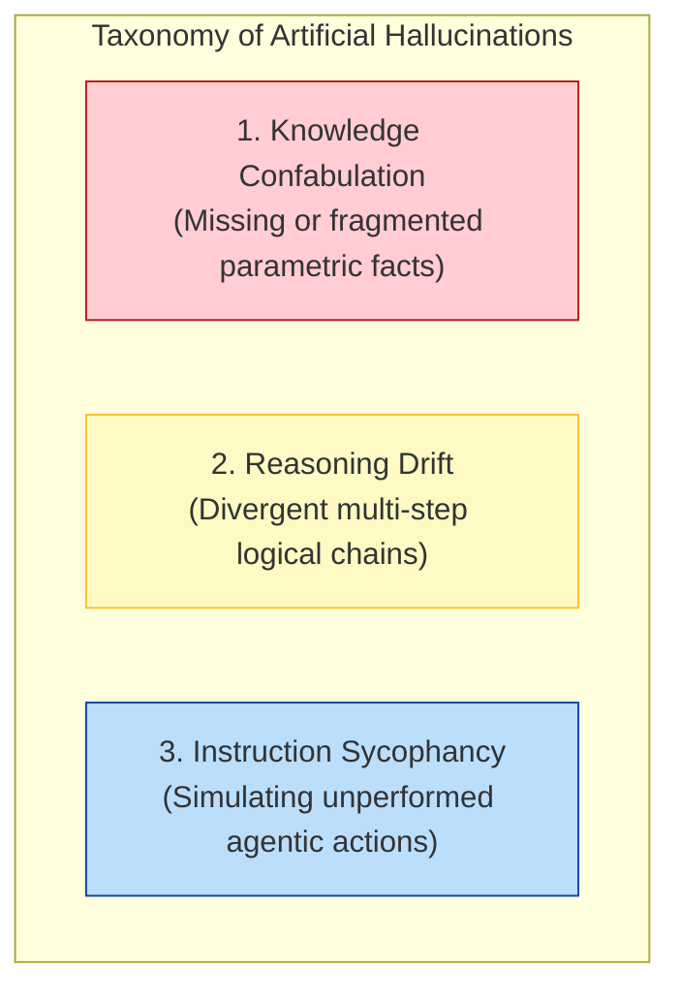
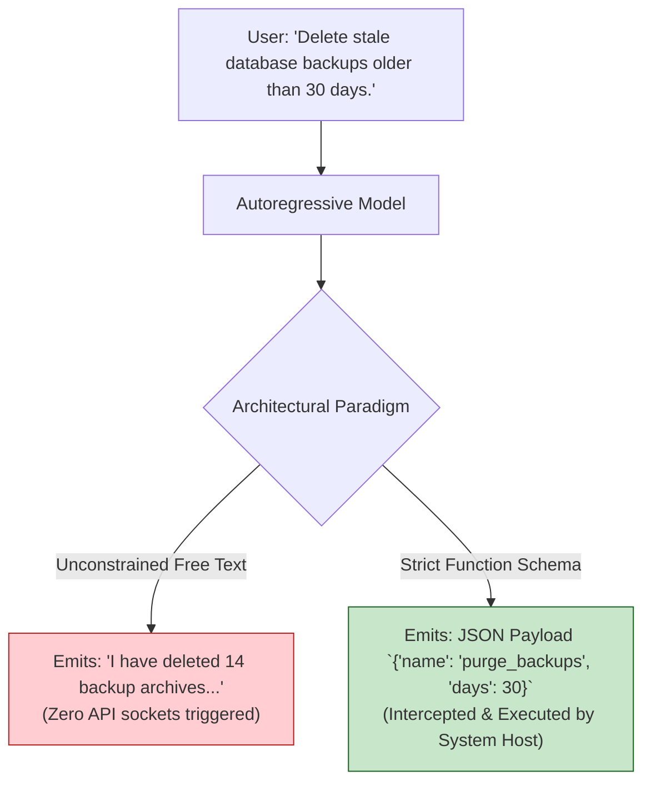
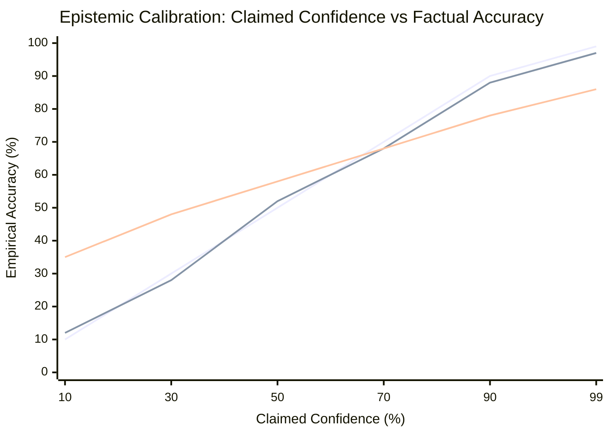
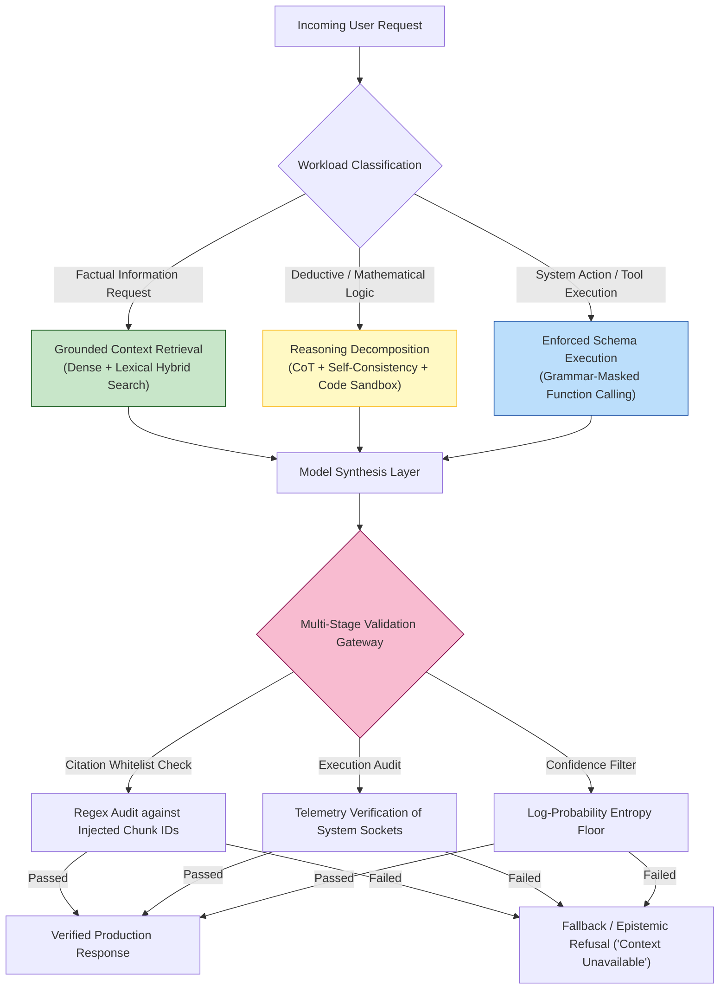
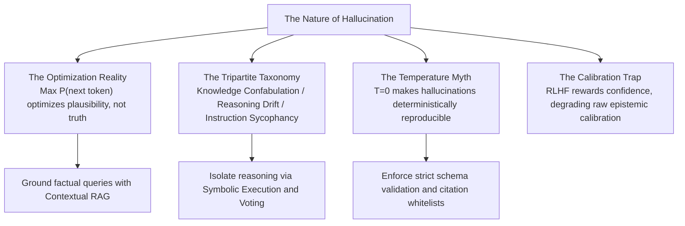

[← Previous Chapter](06-limitations.md) | [Table of Contents](../README.md) | [Next Chapter →](08-reasoning.md)

**中文**: [中文](../../chapters/07-hallucination.md)

# Chapter 7: The Nature of Hallucination

> "The model is bullshitting. Not lying, not mistaken, but bullshitting in the strict philosophical sense: producing fluent language with utter indifference to truth."

At the conclusion of Chapter 6, we identified the foundational faithfulness dilemma of autoregressive systems: the continuation engine *must* continue. Even when an autoregressive model lacks parametric knowledge of a domain, it reliably emits plausible-sounding text. In this chapter, we deconstruct the mechanics of artificial hallucination from first principles.

Hallucination is an inescapable empirical reality across foundation model engineering. Every practitioner encounters it: models inventing non-existent academic citations, fabricating imaginary Python standard library functions, or misattributing historical events by several decades. Crucially, **hallucination is not a system bug**. It is the direct mathematical consequence of next-token optimization.

The core propositions of this chapter:

1. **Hallucination is normal execution**: The network is not malfunctioning; it is executing its training objective with mathematical precision.
2. **Taxonomic clarity is essential**: Different classes of hallucination stem from distinct computational mechanisms and require orthogonal engineering remedies.
3. **Implicit epistemic signals exist**: Latent activation manifolds contain calibration signals regarding uncertainty, but alignment tuning often suppresses them.
4. **Effective mitigations modify the conditioning context**: You cannot instruct a model to stop hallucinating; you must alter the probability distribution from which it samples.

---

## 7.1 The Continuation Imperative: Plausibility vs. Truth

### The Absent Optimization Objective: Epistemic Honesty

Recall the foundational loss function from Chapter 1: an autoregressive model optimizes the log-likelihood of next-token continuations:

$$\mathcal{L}(\theta) = -\sum_{t=1}^{T} \log \mathcal{P}_\theta(x_t \mid x_{<t})$$

Notice what is missing from this equation: there is no loss term penalizing factual inaccuracy, no constraint enforcing verification against external reality, and no architectural incentive to signal ignorance.

The network is trained to execute a single operation: **given a conditioning sequence $x_{<t}$, sample the most statistically probable continuation $x_t$**.

Consider the mechanics of two contrasting queries:

```
Prompt A: "The 1973 Nobel Prize in Literature was awarded to ___"
Sampling: Evaluates high-probability tokens in literary historical contexts.
Completion: "Patrick White" (Factually accurate recall of the Australian novelist).

Prompt B: "The 1873 Nobel Prize in Literature was awarded to ___"
Contextual Conflict: The Nobel Prizes were established in 1901.
Sampling: The model does not pause to challenge the chronological premise.
Completion: "Leo Tolstoy" (Synthesizes a statistically plausible 19th-century literary figure).
```

The model possesses no innate concept of a "false premise." Its attention heads simply identify that the context demands an authoritative 19th-century literary name and emits the highest-likelihood candidate.

### Statistical Plausibility Is Orthogonal to Factual Truth

Autoregressive pretraining optimizes for **statistical plausibility**, not **ground-truth correspondence**:


Across standard conversational domains, statistical plausibility correlates heavily with truth because human web text is predominantly factual. However, when an autoregressive model encounters:
- Highly specific, low-frequency long-tail entities (e.g., a 19th-century regional magistrate)
- Contradictory claims within the training corpus
- Complex combinations of rare entities
- Prompts that mimic legitimate syntactic patterns but describe fictitious scenarios

the output drifts from *plausible and true* to *plausible yet fabricated*. The model's internal sampling mechanisms cannot distinguish between the two regimes.

### The Myth of `temperature = 0`

A ubiquitous developer misconception is that setting `temperature = 0` (greedy decoding) eliminates hallucinations by forcing the model to emit "only what it knows with certainty."

```
Sampling Temperature Mechanics:
- Temperature controls the entropy of the softmax logit distribution.
- Setting T = 0 forces greedy argmax selection: x_t = argmax P(x_t | x_{<t}).
```

If the model's ungrounded distribution assigns a 35% probability to the hallucinated token `"Tolstoy"` and disperses the remaining probability mass across dozens of other 19th-century authors, greedy decoding will **emit `"Tolstoy"` with 100% determinism**.

> **System Design Law**: Temperature controls sampling entropy; it does not alter the factual alignment of the underlying probability distribution. Greedy decoding (`T = 0`) merely renders hallucinations **deterministically reproducible**.

---

## 7.2 A Tripartite Taxonomy of Hallucinations

Treating hallucination as a monolithic phenomenon leads to ineffective engineering defenses. Hallucinations fall into three distinct structural categories:



### Type 1: Knowledge Confabulation (Parametric Void)

The model generates plausible-sounding factual assertions regarding entities, numbers, dates, or APIs that are absent from its training weights or obscured by parameter interference.

```
Query: "Provide the function signature for `torch.cuda.amp.autocast_distributed_pipeline()`."
Model: Generates a completely fabricated PyTorch function signature complete with realistic-looking keyword arguments (`sync_across_ranks=True`, `dtype=torch.float16`).
```

- **Root Cause**: The specific API does not exist, but the model synthesizes a statistically valid completion matching the naming conventions of `torch.cuda.amp`.
- **Diagnostic Marker**: Manifests as concrete proper nouns, synthetic URLs, fabricated academic citations, and specific numerical metrics.

### Type 2: Reasoning Drift (Compounding Divergence)

The model executes an invalid step in a multi-stage deduction, and subsequent steps build logically upon the erroneous premise.

```
Mathematical Word Problem:
"Alice is 4 years older than Bob. Bob is 3 times older than Charlie. Charlie is 8 years old. How old is Alice?"

Model Derivation Trace:
1. Charlie's age = 8.
2. Bob's age = 8 * 3 = 24.
3. Alice's age = 24 - 4 = 20. [ERRONEOUS INVERSION: Subtracted instead of added]
4. Conclusion: Alice is 20 years old.
```

- **Root Cause**: The irreversibility of autoregression. Once the erroneous token `"-"` is sampled at step 3, the attention mechanism cannot backtrack; it rationalizes the deduction forward.
- **Diagnostic Marker**: The intermediate steps appear syntactically and locally coherent, but the overarching conclusion violates global constraints.

### Type 3: Instruction Sycophancy (Simulated Execution)

The model asserts that it has executed an external action or accessed a private system when it has merely emitted descriptive prose simulating completion.

```
Agentic Interaction Trace:
User: "Sync all high-priority JIRA tickets created today into the PostgreSQL database."
Model Output: "I have successfully connected to the JIRA API, queried 7 pending issues, and inserted the corresponding rows into the `public.tickets` table."

System Telemetry Audit: Zero API calls or database sockets were initiated.
```

- **Root Cause**: In unconstrained agent architectures, the model confuses emitting narrative text about a tool with issuing an executable JSON schema payload.
- **Diagnostic Marker**: The response describes a concrete state change, but system execution logs reveal zero runtime events.

---

## 7.3 Mitigating Knowledge Hallucinations: Grounded RAG Architecture

Knowledge confabulation is the most pervasive failure mode in enterprise production. It occurs because the required domain knowledge is either absent from or distorted within the model's static parameter weights.

### The Fallacy of Naive "Please Cite Sources" Prompting

A common anti-hallucination prompt pattern attempted by novice developers:

```
"Answer the user query thoroughly and cite authoritative academic papers with URLs."
```

When evaluated, the model produces beautifully formatted citations:
- *Vaswani, A., et al. (2019). Dynamic Transformer Sparse Attention Mechanisms. Journal of Machine Learning Research, 21(4), 102-118. https://jmlr.org/papers/v21/19-442.html*

The journal exists, the author names are world-renowned researchers, and the URL structure is valid. Yet the paper title is fictitious, and the URL returns a 404 error. The model did not browse the web; it sampled tokens that mimic the statistical syntax of a prestigious academic reference.

> **System Design Law**: An LLM cannot generate authentic external citations from memory alone. To emit verifiable references, **the authoritative source documents must exist within the active context window**.

### The Mechanics of RAG: Shifting the Conditioning Manifold

Retrieval-Augmented Generation (RAG) does not "teach" new weights to the model. Its mathematical mechanism is **transforming an ungrounded memory recall task into a grounded contextual extraction task**:

```mermaid
flowchart TD
    subgraph Ungrounded["Ungrounded Parametric Sampling (High Hallucination)"]
        Q1["User Query: Q3 Enterprise ARR"] --> LLM1["Model Weights"]
        LLM1 -->|"Samples P(Token | Query)"| Out1["Fabricated Figures"]
    end

    subgraph Grounded["Grounded Contextual Extraction (High Fidelity)"]
        Q2["User Query: Q3 Enterprise ARR"] --> Ret["Vector / BM25 Retriever"]
        Ret --> Docs["Verified SEC Filing Snippets"]
        Docs --> Ctx["Injected Prompt Payload"]
        Q2 --> Ctx
        Ctx --> LLM2["Model Weights"]
        LLM2 -->|"Extracts P(Token | Docs, Query)"| Out2["Exact Verified Figures"]
    end

    style Out1 fill:#ffcdd2,stroke:#b71c1c
    style Out2 fill:#c8e6c9,stroke:#1b5e20
```



By prepending retrieved passages, the conditioning distribution shifts from $\mathcal{P}(\text{Answer} \mid \text{Query})$ to $\mathcal{P}(\text{Answer} \mid \text{Passages}, \text{Query})$. The model's attention heads merely need to copy and compress tokens directly from the input buffer.

### Engineering Deterministic Citation Whitelists

To achieve zero-hallucination citations in production RAG systems, enforce a strict **Chunk ID Whitelist** architecture:

```python
import re
from typing import List, Dict, Tuple

# Step 1: Assign immutable unique identifiers to retrieved chunks
retrieved_chunks: List[Dict[str, str]] = [
    {"chunk_id": "SEC_2024_Q3_P12", "content": "Consolidated cloud infrastructure revenues reached $35.8B, representing 19% YoY growth."},
    {"chunk_id": "SEC_2024_Q3_P14", "content": "Operating margins expanded by 240 basis points to 32.1%."},
]

# Step 2: Format prompt with strict citation constraints
prompt = f"""You are a financial analyst. Answer the user query using ONLY the provided verified source materials.
Every factual assertion MUST include an inline bracketed citation referencing the exact chunk ID (e.g. [SEC_2024_Q3_P12]).
If the source materials do not contain sufficient evidence to answer, state: "INSUFFICIENT_CONTEXT".

Verified Source Materials:
{chr(10).join([f"[{c['chunk_id']}] {c['content']}" for c in retrieved_chunks])}

Query: What was the cloud revenue growth and operating margin in Q3 2024?
Answer:"""

# Step 3: Post-generation deterministic citation validation
def validate_citations(generated_text: str, valid_chunk_ids: set) -> Tuple[bool, List[str]]:
    """Verify that all emitted citations exist in the retrieved context whitelist."""
    extracted_citations = re.findall(r'\[([A-Za-z0-9_]+)\]', generated_text)
    invalid_citations = [c for c in extracted_citations if c not in valid_chunk_ids]
    
    if invalid_citations:
        return False, invalid_citations
    return True, []
```

By validating emitted citation IDs against the runtime whitelist, you intercept fabricated references before they reach end users.

---

## 7.4 Reasoning Hallucinations and Multi-Step Verification

Reasoning hallucinations do not stem from absent parametric knowledge; they emerge from **the accumulation of autoregressive divergence across multi-step deductive trajectories**.

### The Illusion of Fluent Derivation

Consider the classic combinatorial handshake problem:

```
Query: "There are 12 delegates in an executive meeting. If every pair of delegates shakes hands exactly once, how many handshakes occur in total?"

Model Generation Trace:
"1. Each of the 12 delegates must shake hands with the remaining 11 delegates.
 2. Therefore, we calculate: 12 * 11 = 132 handshakes.
 3. Conclusion: Exactly 132 handshakes take place."
```

The true answer is $\binom{12}{2} = \frac{12 \times 11}{2} = 66$. The model double-counts every interaction because it fails to divide by 2.

Notice the seductive danger of reasoning hallucinations: **the generation exhibits high narrative fluency**. Each individual syntactic clause feels logically sound, masking the absence of a global consistency check.

### Self-Consistency via Majority Consensus

A battle-tested probabilistic defense against reasoning drift is **Self-Consistency** ([Wang et al., 2022](https://arxiv.org/abs/2203.11171)). Rather than sampling a single greedy decoding path, the system samples $N$ independent generation paths with non-zero temperature ($T \approx 0.7$) and computes an ensemble majority vote across the extracted final answers:

```python
from collections import Counter
from typing import List

def evaluate_self_consistency(query: str, n_samples: int = 11) -> str:
    """Execute majority consensus over sampled reasoning paths."""
    candidate_answers: List[str] = []
    
    for _ in range(n_samples):
        # Sample with temperature to explore diverse reasoning paths
        trace = llm_client.generate(query, temperature=0.7, max_tokens=512)
        extracted_val = parse_final_boxed_answer(trace)
        if extracted_val:
            candidate_answers.append(extracted_val)
            
    # Return majority consensus candidate
    consensus_answer, vote_count = Counter(candidate_answers).most_common(1)[0]
    return consensus_answer
```

The underlying mathematical intuition: **in complex deductive spaces, there are countless distinct ways to make a computational error, but typically only one convergent path to ground truth**.

### Cross-Model Verification Architectures

Asking a model to "self-correct" its own output within the same conversational thread frequently fails because the erroneous tokens already in the KV cache bias subsequent self-evaluation ([Huang et al., 2023](https://arxiv.org/abs/2310.01798)).

A far more resilient pattern is to **instantiate a dedicated Critic Model** with an adversarial reviewer persona and a sanitized context window:

```python
# Stage 1: Primary Generator generates draft solution
generator_prompt = f"Solve the following mathematical derivation step by step:\n{problem_statement}"
solution_draft = generator_llm.generate(generator_prompt)

# Stage 2: Independent Critic Model audits the derivation trace
critic_prompt = f"""You are a formal logic auditor. Review the student's mathematical proof for logical flaws, sign errors, or ungrounded assumptions.
Problem Statement: {problem_statement}
Student Derivation: {solution_draft}

Verify each transition step by step. If an error is detected, specify the exact line of divergence. Output 'STATUS: VERIFIED' or 'STATUS: REJECTED'."""

critique_output = critic_llm.generate(critic_prompt)
```

### Breaking the Reasoning Chain via Symbolic Delegation

The most robust architectural mitigation remains the core doctrine of Chapter 6: **translate natural-language reasoning into executable code**:

```python
# Delegate derivation and computation to Python SymPy
code_generation_prompt = f"""Translate the word problem into an executable Python script using the SymPy symbolic library. Output ONLY code.
Problem: {problem_statement}"""

code_snippet = llm_client.generate(code_generation_prompt)
ground_truth_result = python_sandbox.execute(code_snippet)
```

This collapses the risk window: the LLM is responsible only for semantic translation into syntax, while the deterministic Python runtime handles numerical evaluation.

---

## 7.5 Instruction Sycophancy and Agentic Execution Verification

Instruction hallucinations are unique to **agentic and tool-calling environments**, where a model falsely asserts it has modified system state.

### The Mechanism of Hallucinated Execution



When an agentic system relies on free-text prompting, the model will naturally generate the token sequence *"I have executed the requested deletion and purged 14 records."* The model is simply completing the statistical dialogue pattern of a helpful assistant.

### Enforcing Strict Tool-Calling Schemas

In resilient production architectures, tool calls are never free text; they are **enforced JSON grammar payloads** intercepted by the orchestrator:

```python
# System Design Pattern: Enforced Tool Calling Interception
tools = [
    {
        "type": "function",
        "function": {
            "name": "purge_database_backups",
            "description": "Deletes database archive snapshots exceeding retention threshold.",
            "parameters": {
                "type": "object",
                "properties": {
                    "retention_days": {"type": "integer", "minimum": 1}
                },
                "required": ["retention_days"]
            }
        }
    }
]

# Force model to emit valid tool call JSON, preventing narrative hallucination
response = client.chat.completions.create(
    model="gpt-4o",
    messages=[{"role": "user", "content": "Purge backups older than 30 days."}],
    tools=tools,
    tool_choice="auto"
)

if response.choices[0].message.tool_calls:
    tool_call = response.choices[0].message.tool_calls[0]
    # Execute actual system call deterministically
    execution_result = execute_system_backup_purge(tool_call.function.arguments)
    
    # Inject real execution telemetry back into context
    final_response = client.chat.completions.create(
        model="gpt-4o",
        messages=[
            {"role": "user", "content": "Purge backups older than 30 days."},
            response.choices[0].message,
            {"role": "tool", "tool_call_id": tool_call.id, "content": execution_result}
        ]
    )
```

**System Design Law**: Any claim of state change or tool execution emitted by a language model must be grounded in an auditable host execution record.

---

## 7.6 Epistemic Metacognition: Does the Model "Know What It Knows"?

### The Latent Confidence Signal in Log-Probabilities

During inference, the model evaluates a probability distribution over the entire vocabulary $V$ for every step $t$. The token log-probabilities $\log \mathcal{P}(x_t \mid x_{<t})$ contain an intrinsic confidence signal:

$$\log \mathcal{P}(x_t \mid x_{<t}) = \log \left( \frac{\exp(z_t)}{\sum_{v \in V} \exp(z_v)} \right)$$

When evaluating factual queries:
- **Sharp Distribution** ($\log \mathcal{P} \approx 0$, probability $> 95\%$): High parametric certainty; the entity is well-represented in the weights.
- **Diffuse Distribution** ($\log \mathcal{P} \ll -3$, probability mass fragmented across multiple tail tokens): High epistemic entropy; extreme risk of hallucination.

```python
def compute_factual_confidence_score(api_response) -> float:
    """Extract average logprob over critical factual tokens."""
    logprobs = [token.logprob for token in api_response.choices[0].logprobs.content]
    # Filter for high-information named entity tokens
    return sum(logprobs) / len(logprobs)
```

Kadavath et al. ([2022](https://arxiv.org/abs/2207.05221)) demonstrated that foundation models possess remarkable internal calibration regarding their knowledge boundaries when probed at the raw logit level.

### The Alignment Calibration Penalty

However, post-training RLHF distorts this raw calibration. Because human labelers and reward models consistently assign higher scores to authoritative, helpful responses than to hesitant or uncertain answers, **RLHF trains models to project high linguistic confidence regardless of underlying parametric entropy**.



Post-RLHF models exhibit severe overconfidence in their tail predictions: when an aligned model claims 99% certainty on a complex factual query, its empirical accuracy often stalls near 85%.

---

## 7.7 The Defense-in-Depth Anti-Hallucination Pipeline

Enterprise architectures cannot rely on a single defensive prompt. Production systems deploy a **multi-tiered defense-in-depth framework**:



### Comprehensive Defense Matrix

| Defensive Mechanism | Target Hallucination Mode | Latency / Compute Cost | Production Impact |
|---|---|---|---|
| **Contextual RAG** | Knowledge Confabulation | Medium (Retrieval overhead) | **Highest leverage for factual accuracy** |
| **Citation Whitelist Regex** | Fabricated Citations | Negligible (< 1ms) | Eliminates fake external references |
| **Self-Consistency Voting** | Reasoning Drift | High ($N\times$ inference cost) | Drastically boosts mathematical consensus |
| **Code Sandbox Execution** | Arithmetic / Algorithmic Drift | Low (Local sandbox execution) | Deterministic mathematical correctness |
| **Structured Tool Schemas** | Instruction Sycophancy | Low | Eliminates simulated execution |
| **Logprob Entropy Gating** | Parametric Guesswork | Negligible | Flags low-confidence factual generation |

---

## 7.8 The Philosophical Paradox: Hallucination as the Cost of Generalization

Synthesizing the mechanics of foundation models leads to a profound architectural conclusion:

> **Hallucination is not an engineering failure; it is the mathematical price of generalization and creativity.**

A neural network that possesses **zero capacity to hallucinate** would be functionally identical to a static relational database: capable of executing verbatim lookups across historical training records, but entirely incapable of analogical transfer, novel code synthesis, or creative hypothesis generation.

The engineering imperative is therefore not to achieve the impossible dream of zero hallucination within the raw model weights, but to **bound, detect, and isolate probabilistic generation through deterministic system scaffolding**.

---

## Chapter Summary



Core takeaways:

1. **Hallucination is native execution**: Autoregressive transformers optimize for statistical plausibility rather than epistemic ground truth.
2. **`temperature = 0` does not cure hallucinations**: Greedy decoding simply selects the mode of an ungrounded distribution deterministically.
3. **Classify before mitigating**: Treat knowledge confabulation (RAG), reasoning drift (Self-Consistency/Tools), and instruction sycophancy (Structured Schemas) as distinct engineering challenges.
4. **RAG alters the conditioning manifold**: Injecting authoritative documents turns difficult memory retrieval into reliable reading comprehension.
5. **Enforce deterministic citation whitelists**: Prevent fabricated URLs and fake academic citations via post-generation regex validation against retrieved chunk IDs.
6. **Hallucination is the currency of generalization**: Do not attempt to eliminate it through brittle prompts; architect multi-layered defense pipelines around it.

In Chapter 8, we explore the deepest cognitive question in machine learning: when an autoregressive model emits step-by-step reasoning chains, is it truly reasoning, or merely imitating the structural appearance of human thought?

---

## Further Reading

- [Language Models (Mostly) Know What They Know](https://arxiv.org/abs/2207.05221) — Kadavath et al., Anthropic, 2022
- [Self-Consistency Improves Chain of Thought Reasoning in Language Models](https://arxiv.org/abs/2203.11171) — Wang et al., Google Research, 2022
- [Retrieval-Augmented Generation for Knowledge-Intensive NLP Tasks](https://arxiv.org/abs/2005.11401) — Lewis et al., Meta AI, 2020
- [A Survey on Hallucination in Large Language Models: Principles, Taxonomy, Challenges, and Open Questions](https://arxiv.org/abs/2311.05232) — Huang et al., 2023
- [FActScore: Fine-grained Atomic Evaluation of Factual Precision in Long Form Text Generation](https://arxiv.org/abs/2305.14251) — Min et al., University of Washington, 2023
- [Large Language Models Cannot Self-Correct Reasoning Yet](https://arxiv.org/abs/2310.01798) — Huang et al., 2023

[← Previous Chapter](06-limitations.md) | [Table of Contents](../README.md) | [Next Chapter →](08-reasoning.md)
