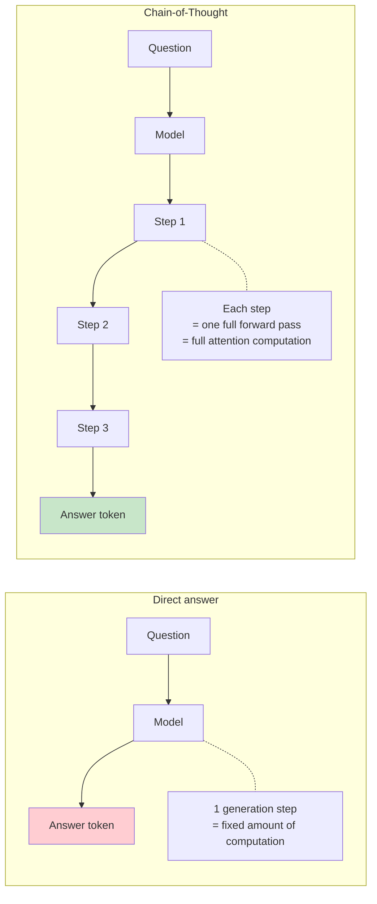
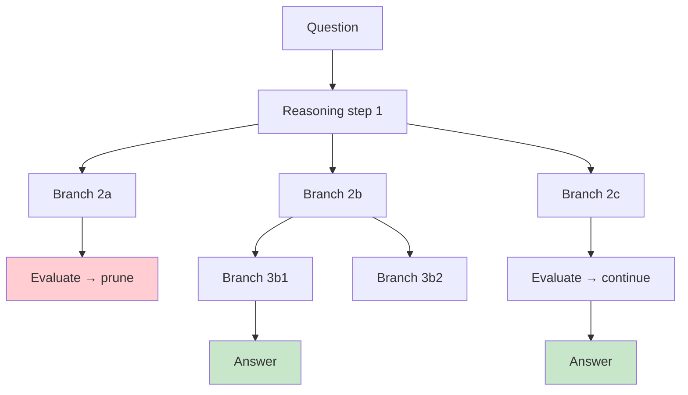
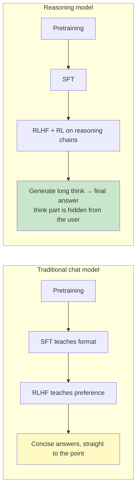
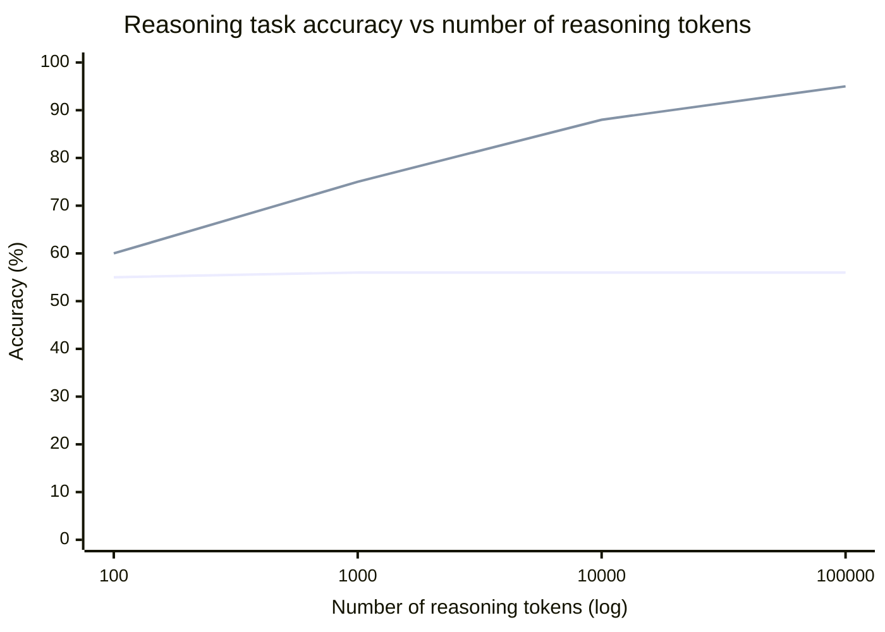
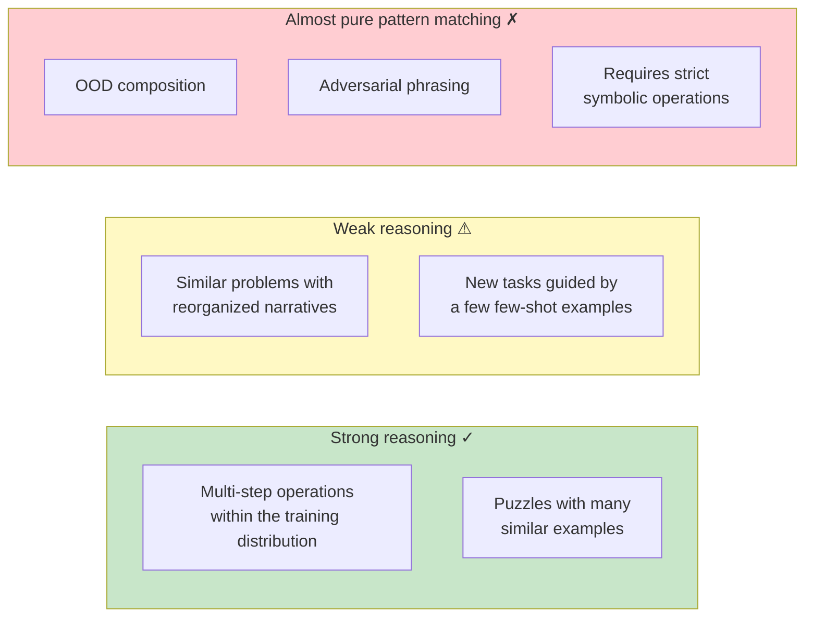
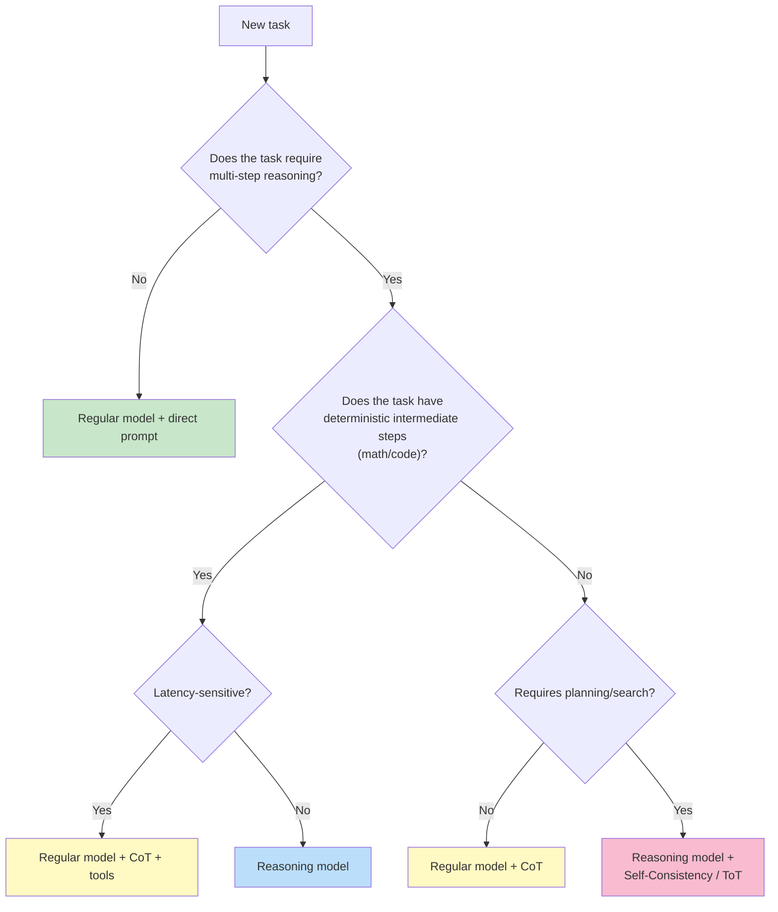

[← Previous Chapter](07-hallucination.md) | [Table of Contents](../README.md) | [Next Chapter →](09-prompting.md)

# Chapter 8: Reasoning or Imitation?

> "Asked to think step by step, the model writes down what 'thinking step by step' looks like — and gets the right answer more often. We don't fully understand why."

LLMs can solve math problems. LLMs can write programs. LLMs can derive logic. When you watch a model break a complex problem into steps, write out a reasoning process, and finally give the correct answer, it is hard not to feel that "it is thinking."

But if you have talked with models for a while, you must have seen the other side too:

- It can solve college entrance exam math problems, but cannot count how many letters are in a word
- It can write complex algorithm analysis, but get `9.11 vs 9.9 which is larger` wrong
- It can give you 50 lines of rigorous argument, then somehow fail at the final step

**Is it really reasoning, or advanced imitation?** This chapter will not pretend to give a final answer. This is one of the most active open questions in current AI research. But we can break the problem apart and look at what different perspectives can and cannot explain.

More importantly: **once you understand the mechanism of reasoning (whether or not it is "real" reasoning), you know how to maximize its effect in engineering**.

---

## 8.1 Chain-of-Thought: Giving the Model Scratch Paper

### A Discovery So Simple It Seems Incredible

In 2022, Wei et al. published [_Chain-of-Thought Prompting Elicits Reasoning in Large Language Models_](https://arxiv.org/abs/2201.11903). The paper's core finding can be expressed with two prompts:

```
Prompt A (ask directly):
Q: Roger has 5 tennis balls. He buys 2 more cans of tennis balls.
   Each can has 3 tennis balls. How many tennis balls does he have now?
A: 11 balls.  ← The model often answers incorrectly (for example, 17)

Prompt B (add "let's think step by step"):
Q: Roger has 5 tennis balls. He buys 2 more cans of tennis balls.
   Each can has 3 tennis balls. How many tennis balls does he have now?
A: Let's think step by step.
   Roger starts with 5 tennis balls.
   2 cans × 3 balls per can = 6 new tennis balls.
   5 + 6 = 11 balls.
   The answer is 11.  ← The probability that the model answers correctly rises significantly
```

Just adding the sentence "Let's think step by step" raised accuracy on the GSM8K math benchmark from about 18% to about 50%.

**This is an unusual finding**. You did not retrain the model, you did not give it new knowledge, you only changed one sentence in the prompt, and the ability "emerged."

### Why It Works: More Tokens = More Computation

The simplest explanation: **an LLM's "thinking" is computation over tokens**.



Every generated token is a complete forward pass, and the model can use all previously generated content for computation. If it directly generates the answer, the model only has the context of the "question" to use. If it first generates a piece of reasoning, then when it generates the final answer, it can use **the intermediate results it just generated itself**.

Put another way: **CoT lets the model perform a linear search / sequential computation over the token sequence**. Computation that originally had to be crammed into one forward pass is spread across N forward passes.

There is theoretical support for this. Feng et al. (2023), in [_Towards Revealing the Mystery behind Chain of Thought_](https://arxiv.org/abs/2305.15408), proved that for certain tasks whose computational complexity exceeds the expressive power of a single Transformer layer, CoT lets a Transformer theoretically express functions it otherwise could not express.

**Intuition**: a Transformer's "depth" is fixed (the number of layers). But with CoT, you can **trade token sequence length for depth**. Each new token is equivalent to an extra layer of "virtual depth."

### CoT Is Not Free

CoT has significant costs:

1. **Latency**: the number of tokens to generate goes from 1 to dozens or hundreds, significantly increasing TTFT (time to last token)
2. **Cost**: billing is token-based, so cost increases linearly
3. **It is not always effective**: on simple tasks, CoT can instead reduce accuracy (because the extra generated steps may themselves introduce errors)

```python
# A simple decision for when to use CoT
def should_use_cot(task):
    if is_factual_lookup(task):
        return False  # Direct recall is enough
    if is_simple_classification(task):
        return False  # The answer can be given in one step
    if requires_multi_step_reasoning(task):
        return True   # This is CoT's home turf
    if needs_arithmetic(task):
        return True   # CoT + tools
```

---

## 8.2 Several Variants of CoT

There is more than one way to use CoT. Understanding the differences between variants helps you choose the right tool for different scenarios.

### Zero-shot CoT: One Sentence Is Enough

```python
prompt = f"""Question: {question}

Let's think step by step.
"""
```

The simplest version. It does not require examples and works for most tasks. Try this first in production.

### Few-shot CoT: Demonstrate with Examples

```python
prompt = """
Q: Roger has 5 tennis balls and buys 2 cans with 3 balls per can. How many does he have in total?
A: Let's think step by step. Roger starts with 5. 2 × 3 = 6 new ones. 5 + 6 = 11. The answer is 11.

Q: The cafeteria had 23 apples, used 20 for lunch, then bought 6 more. How many does it have now?
A: Let's think step by step. 23 - 20 = 3 remaining. 3 + 6 = 9. The answer is 9.

Q: {actual_question}
A: Let's think step by step.
"""
```

The examples serve two purposes: **demonstrating the reasoning style** (what kind of phrasing to use for decomposition) + **implicitly defining the task** (telling the model this is a math problem, not something else).

Applicable scenario: the task format is relatively "non-mainstream," and the model is unlikely to guess what kind of reasoning structure you want.

### Self-Consistency: Sample Multiple Times and Vote

This was already mentioned in Chapter 7. It is especially effective on reasoning tasks, because the correct answer is unique and wrong answers are dispersed.

```python
def self_consistency(question, n=10):
    answers = [llm.generate_with_cot(question, temp=0.7) for _ in range(n)]
    return Counter(answers).most_common(1)[0][0]
```

The cost is n times as many calls, but the accuracy improvement is usually significant (+10-20% on GSM8K).

### Tree-of-Thoughts: Let the Model Explore Multiple Paths

Yao et al. (2023), in [_Tree of Thoughts_](https://arxiv.org/abs/2305.10601), proposed: do not make the model walk one straight path. Let it **expand multiple reasoning branches**, then evaluate, prune, and backtrack.



ToT works significantly better than direct CoT on tasks that require **backtracking** (the Game of 24, planning problems).

The cost is enormous. It may require dozens of model calls.

### CoT + Tools: An Echo of Chapter 7

The strongest combination: the model uses CoT to decompose the problem, and calls tools whenever a step needs a deterministic result.

```python
# Reason → write code → execute → continue reasoning
prompt = """
Solve the following problem. When exact computation is needed, write code with ```python ... ```, and I will execute it and give you the result.

Question: What is the sum of all prime numbers from 1 to 1000?

Let's think step by step.
"""

# The model may output:
# This requires traversing 1-1000 to find prime numbers. Let me use code:
# ```python
# def is_prime(n): ...
# print(sum(n for n in range(2, 1001) if is_prime(n)))
# ```
#
# (execute → 76127)
#
# The answer is 76127.
```

This is the most important design behind ChatGPT Code Interpreter / Claude Computer Use / Anthropic's Tool Use models.

---

## 8.3 Reasoning Models: Internalizing CoT into Training

Starting in 2024, a new class of models appeared in the AI industry: OpenAI's o1, DeepSeek's R1, Anthropic's Claude (with extended thinking), Google's Gemini Thinking, and others. They are collectively called **reasoning models**.

Their core change: **CoT is no longer a prompt-time trick, but has been trained into the model's default behavior**.

### Changes in the Training Process



Concretely, reasoning models have two key training differences:

1. **The reinforcement learning reward signal is "is the answer correct"**, not "is the answer liked by humans." This lets the model learn to optimize for "arriving at the correct answer," rather than "writing something that looks pleasant to read."

2. **During training, the model is encouraged to generate long reasoning chains**, even if it makes mistakes, hesitates, or backtracks along the way. The model is allowed to be "wrong first, right later," instead of pretending to be confident from the first token.

### Characteristics During Inference

Reasoning models also behave very differently during inference:

```
User: 12 + 13 + ... + 99 = ?

Regular model answers directly: 4914 (possibly wrong)

Reasoning model:
  <thinking>
  This is an arithmetic series sum.
  First term a = 12, last term l = 99
  Number of terms n = 99 - 12 + 1 = 88
  Sum S = n*(a+l)/2 = 88*(12+99)/2 = 88*111/2
  = 88*55.5
  Let me recalculate: 88 * 111 = 9768; 9768 / 2 = 4884

  I should double-check the number of terms. 99 - 12 = 87, +1 = 88. Correct.
  Sum = 4884
  </thinking>

  The answer is 4884.
```

Notice several key characteristics:
- The reasoning process can be very long (thousands to tens of thousands of tokens)
- The model will **self-correct** ("let me recalculate")
- The user sees a concise final answer, while the thinking process is hidden
- Accuracy on difficult problems is significantly higher than with regular models

### Test-time Compute: Trading Inference Time for Accuracy

Reasoning models introduced a new scaling dimension: **inference-time compute**.



> Note: illustrative chart. Actual data varies by task and model. The trend comes from OpenAI o1's public test results.

No matter how many tokens traditional models reason for, they do not become more accurate. They only want to "quickly give an answer." Reasoning models, by contrast, turn reasoning time into accuracy: the longer they think, the more accurate they become.

This is **a new dimension of scaling laws**. Chapter 3 discussed "training-time scaling" (more parameters, more data). This is "inference-time scaling": without retraining the model, you can improve capability **by giving it more thinking time**.

What does this mean in engineering?

```python
# API for a regular model
response = llm.generate(prompt)  # A few seconds, fixed cost

# API for a reasoning model
response = reasoning_llm.generate(
    prompt,
    thinking_budget=10000  # Allow it to think for at most 10000 tokens
)  # May take tens of seconds to minutes, but answer accuracy is significantly higher
```

**A new engineering tradeoff**: you can choose "expensive but accurate" or "cheap but fast," selecting the thinking budget by scenario.

### Reasoning Models Are Not Omnipotent

Do not mythologize them either. Reasoning models have no clear advantage in the following scenarios:

| Task Type | Reasoning Models vs Regular Models |
|---------|---------------------------|
| Math competitions, ICPC problems | Significant improvement (+30-50%) |
| Complex reasoning, planning | Significant improvement (+20-40%) |
| Factual Q&A | Almost no difference |
| Translation, summarization | Almost no difference (or even slightly worse, because of overthinking) |
| Creative writing | Usually worse (too analytical) |
| Real-time conversation | Not suitable (latency is too high) |

**Rule of thumb**: if an ordinary engineer would stop and write many steps on scratch paper when doing the task, a reasoning model will be useful. If it can be answered intuitively, a regular model is better.

---

## 8.4 Is This Real Reasoning? Two Positions

At this point, we have seen that LLMs can perform quite well on reasoning tasks through CoT, reasoning models, and other methods. The question is: **are they really "reasoning," or are they imitating reasoning in a more refined way?**

The academic community is clearly split on this. Let us look at the arguments for two positions.

### Position A: This Is Only Advanced Pattern Matching

Representative arguments supporting this position:

**Argument 1: Models are overly sensitive to "irrelevant changes"**

If you change the names of people and objects in a math problem, accuracy changes significantly. Mirzadeh et al. (2024), in [_GSM-Symbolic_](https://arxiv.org/abs/2410.05229), showed that simply replacing numbers or names can cause model performance on GSM8K to fluctuate by more than 10%.

If the model were really "reasoning," meaning it understood the problem's logical structure, these surface-level replacements should not affect it. But in practice they have a large effect. This suggests the model depends heavily on **specific phrasing patterns seen in the training data**.

**Argument 2: Long-tail problems collapse**

As soon as a problem becomes slightly "nonstandard," such as using a different narrative order, adding irrelevant information, or using uncommon units, model performance drops sharply. A person who can really reason would not be confused by these things.

**Argument 3: It cannot handle OOD (Out-of-Distribution)**

Models perform well within the training distribution, but collapse after even slight deviations. Dziri et al. (2023), in [_Faith and Fate_](https://arxiv.org/abs/2305.18654), proved that on compositional tasks such as multiplication, models perform close to 100% on digit lengths within the training range, but as soon as they exceed digit lengths seen during training, accuracy falls off a cliff to nearly 0%.

This is **a feature of pattern matching**, not **a feature of reasoning**. A real reasoning algorithm should generalize to arbitrarily large inputs.

### Position B: Pattern Matching Done Well Enough Is Reasoning

The opposite position also has arguments:

**Argument 1: Human reasoning also relies heavily on patterns**

Cognitive science has long pointed out that most human "reasoning" is pattern recognition + experience retrieval, not pure symbolic calculation. Chess masters rely on "chess intuition"; doctors rely on "intuition." These are all highly abstract forms of pattern matching. If we admit that humans are "reasoning," why does the same kind of ability in LLMs not count?

**Argument 2: Models really have learned internal "algorithms"**

Research in mechanistic interpretability (covered in detail in Chapter 13) has found that recognizable "circuits" do exist inside models. For example, induction heads learn a "copy-paste" algorithm, and modular arithmetic heads learn trigonometric representations. These are not surface-level pattern matching, but **internalized algorithmic structures**.

Nanda et al. (2023), in [_Progress measures for grokking via mechanistic interpretability_](https://arxiv.org/abs/2301.05217), showed that when a model learns modular arithmetic, it suddenly switches from "table lookup" to "computing with a Fourier transform." This is a real algorithm, not just statistics.

**Argument 3: Abilities learned through RL are hard to explain with only "pattern matching"**

During DeepSeek-R1's training process, without human demonstrations, the model **spontaneously** learned metacognitive behaviors like "hmm, let me check again" and "wait, there may be a problem here." These behaviors were not copied from the training data. They are strategies that **emerged** during RL optimization.

If this is only "imitation," it is hard to explain how it imitates a nonexistent sample.

### A Compromise View

Perhaps the question "is it really reasoning?" is itself the wrong question.

A more useful framing is: **LLM reasoning ability is continuous, task-dependent, and bounded**.



The engineering lesson: **do not get stuck on the philosophical question**. The question should not be "can it really reason," but "is its reasoning ability sufficient for my specific task, when will it fail, and how do I recover?"

---

## 8.5 System 1 vs System 2: A Useful Metaphor

In _Thinking, Fast and Slow_, Daniel Kahneman divides human thinking into two kinds:

- **System 1**: fast, automatic, intuitive, low energy
- **System 2**: slow, deliberate, reasoning, high energy

This distinction fits LLMs surprisingly well:

| | System 1 (intuition) | System 2 (reasoning) |
|---|---|---|
| **Humans** | Recognizing people in images, native-language conversation, riding a bike | Mental arithmetic, puzzles, planning |
| **LLM** | Direct answer (no CoT) | CoT, reasoning model |
| **Characteristics** | Fast, cheap, lower accuracy | Slow, expensive, higher accuracy |
| **Suitable for** | Intuitive, pattern-based tasks | Multi-step tasks that need checking |

### When to Use Which

```python
def choose_thinking_mode(task):
    """Decide whether to use System 1 or System 2"""

    # System 1 tasks
    if task in [
        "Translate a piece of text",
        "Extract entities",
        "Rewrite tone",
        "Sentiment classification",
        "Information extraction",
    ]:
        return "Direct call, no CoT"

    # System 2 tasks
    if task in [
        "Solve a math problem",
        "Debug code",
        "Plan a multi-step operation",
        "Weigh multiple options",
        "Complex legal/medical analysis",
    ]:
        return "CoT or reasoning model"

    # Gray area: depends on task difficulty
    return "Default to CoT, remove it when simple"
```

### A Counterintuitive Finding: System 1 Is Better on Some Tasks

Sprague et al. (2024), in [_To CoT or Not to CoT?_](https://arxiv.org/abs/2409.12183), systematically measured CoT's effect on different tasks. The conclusion is surprising:

- On math and symbolic reasoning tasks, CoT improves performance by 15-20% on average
- On commonsense Q&A, CoT has almost no effect
- On some factual tasks, CoT **instead reduces accuracy**

Why? Because for tasks the model can already get right intuitively, forcing it to write a reasoning process introduces new opportunities for error. It may dig a hole for itself in the intermediate steps.

> **Engineering principle**: CoT is not a free lunch. In production systems, you should **measure** whether it is effective on your specific task, rather than turning it on by default.

---

## 8.6 Engineering Practice for Reasoning

Organize everything in this chapter into an engineering decision framework:

### Decision Tree



### Cost-Accuracy Tradeoff Table

| Approach | Relative Cost | Relative Latency | Accuracy | Suitable Scenario |
|------|---------|---------|--------|---------|
| Regular model + direct answer | 1x | 1x | Baseline | Simple tasks, real-time conversation |
| Regular model + CoT | 2-3x | 2-3x | +10-20% | Medium reasoning tasks |
| Regular model + CoT + tools | 3-4x | 3-5x | +20-40% | Reasoning with computation |
| Self-Consistency (n=10) | 10-30x | 10-30x (parallelizable) | +10-20% | High-value offline tasks |
| Reasoning model | 5-20x | 10-100x | +20-50% | Difficult reasoning tasks |
| Reasoning + ToT | 50-100x | 100-1000x | +30-60% | Extremely difficult, async-capable |

### Several Common Mistakes

**Mistake 1: Adding "Let's think step by step" to every prompt**

Not every task needs CoT. On simple classification and intuitive judgment tasks, adding CoT slows responses and may reduce accuracy.

**Mistake 2: Using a reasoning model for real-time conversation**

Reasoning model latency is usually from tens of seconds to minutes. Putting it into an interactive chatbot will drive users crazy.

**Mistake 3: Thinking "the more detailed the CoT, the better"**

The longer the CoT, the larger the window for error accumulation. The best CoT is "just enough": neither too much nor too little. You can guide this through the prompt: "Please reason in concise steps."

**Mistake 4: Ignoring how the "thinking process" contaminates the final answer**

After a model makes a mistake in CoT, the final answer is likely to be based on that mistake. Engineering systems should add **independent verification of the final answer**, such as recomputing with tools or having another model review it.

---

## 8.7 An Open Question: The Ceiling of Reasoning

This chapter ends with an open question: **does LLM reasoning ability have a ceiling? If so, where is it?**

What we currently see:

1. CoT lets Transformers break through "the original architecture's expressive power limit" on some tasks
2. Reasoning models further and significantly improve accuracy on reasoning tasks through RL
3. Test-time compute provides a new scaling dimension

But at the same time:

1. Strict symbolic operations (large-number multiplication, formal logic, theorem proving) are still unreliable
2. OOD generalization ability is limited
3. Very long-horizon planning (dozens to hundreds of steps) still collapses easily

One view (supported by Yann LeCun and others): current architectures fundamentally cannot do "systematic reasoning," and new architectures (World Models, Energy-based models) are needed for a breakthrough.

Another view (supported by OpenAI, Anthropic, and others): through RL + longer thinking + tool use, current architectures can continue improving, with no obvious ceiling.

Chapter 15 will return to this topic. Here I only want to emphasize: **this is a real open question. Do not believe anyone who claims the answer is already known**.

---

## Summary

| Question | Answer |
|------|------|
| Why CoT works | It spreads the computation of 1 forward pass across N forward passes, equivalent to "trading token length for depth" |
| Effective but costly | Latency, cost, and possible introduction of new errors |
| What a reasoning model is | A model trained through RL to internalize "long thinking" into its default behavior |
| Test-time compute scaling | Giving more thinking time during inference can monotonically improve accuracy |
| Real reasoning or imitation | There is no final answer; in engineering, we can acknowledge that it has some reasoning ability while knowing its boundaries |
| System 1 vs System 2 | Use direct answers for simple tasks; use CoT/reasoning for complex tasks |
| When not to use CoT | Simple tasks, real-time conversation, and tasks the model already gets right intuitively |

In the next chapter, we move into Part III: turning the capabilities and boundaries understood in the first two parts into practical techniques for building LLM systems.

---

## Further Reading

- [Wei et al., 2022: _Chain-of-Thought Prompting_](https://arxiv.org/abs/2201.11903) — the pioneering work on CoT
- [Kojima et al., 2022: _Large Language Models are Zero-Shot Reasoners_](https://arxiv.org/abs/2205.11916) — the discovery of the phrase "Let's think step by step"
- [Yao et al., 2023: _Tree of Thoughts_](https://arxiv.org/abs/2305.10601) — letting models explore multiple reasoning paths
- [Feng et al., 2023: _Towards Revealing the Mystery behind CoT_](https://arxiv.org/abs/2305.15408) — theoretical analysis of CoT: increased expressive power
- [Mirzadeh et al., 2024: _GSM-Symbolic_](https://arxiv.org/abs/2410.05229) — the fragility of reasoning benchmarks
- [Dziri et al., 2023: _Faith and Fate_](https://arxiv.org/abs/2305.18654) — fundamental limitations of Transformers on compositional tasks
- [Sprague et al., 2024: _To CoT or Not to CoT?_](https://arxiv.org/abs/2409.12183) — CoT is not always effective
- [DeepSeek-AI, 2025: _DeepSeek-R1_](https://arxiv.org/abs/2501.12948) — training details of an open-source reasoning model
- [Snell et al., 2024: _Scaling LLM Test-Time Compute Optimally_](https://arxiv.org/abs/2408.03314) — scaling laws for inference-time compute

[← Previous Chapter](07-hallucination.md) | [Table of Contents](../README.md) | [Next Chapter →](09-prompting.md)
