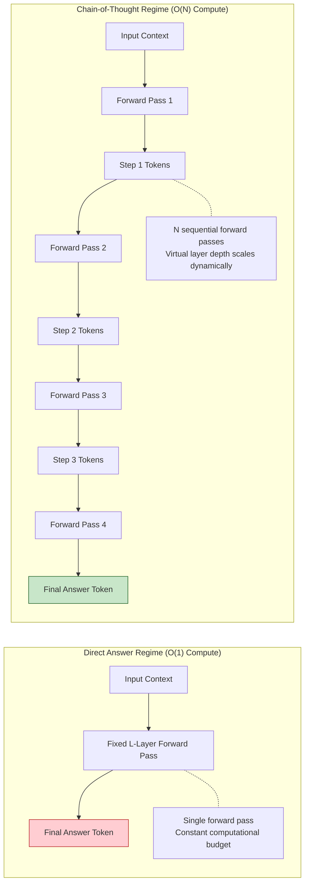
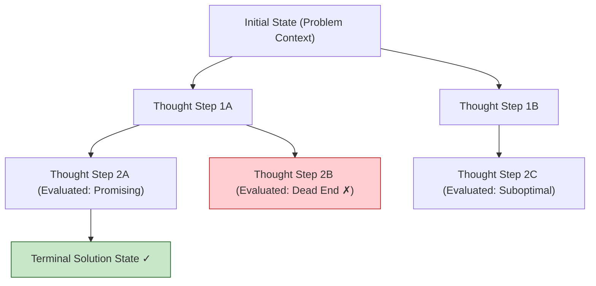
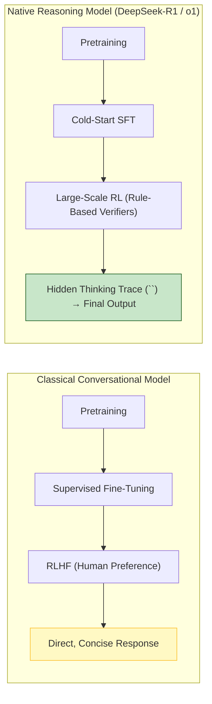
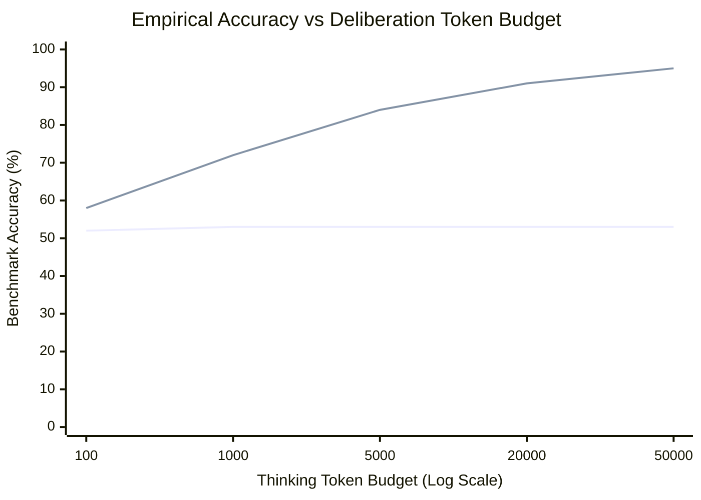
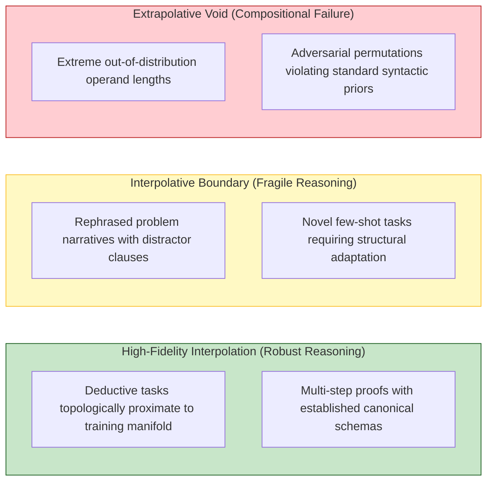
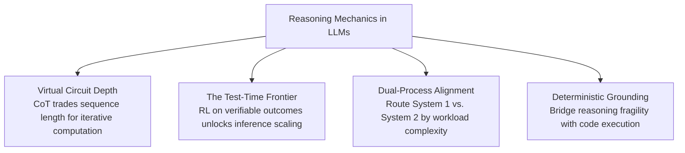

[← Previous Chapter](07-hallucination.md) | [Table of Contents](../README.md) | [Next Chapter →](09-prompting.md)

**中文**: [中文](../../chapters/08-reasoning.md)

# Chapter 8: Reasoning or Imitation?

> "Prompted to deliberate step by step, the network emits the lexical choreography of human thought — and arrives at ground truth with startling frequency. Why this occurs touches the deepest questions in computational cognition."

Large language models can solve Olympiad mathematics problems, synthesize multi-threaded systems software, and construct formal philosophical proofs. When observing a network decompose a multi-layered problem, articulate intermediate lemmas, backtrack from blind alleys, and arrive at a verified conclusion, the cognitive illusion is overwhelming: *the machine appears to be thinking*.

Yet practitioners frequently witness the brittle inverse:
- A model solves complex differential equations, yet fails to count the characters in `"strawberry"`.
- A model writes intricate asymptotic complexity proofs, yet confidently asserts that `9.11 > 9.9`.
- A model constructs fifty lines of rigorous mathematical deduction, only to bungle the elementary arithmetic on the final line.

**Is an autoregressive transformer genuinely executing algorithmic reasoning, or is it performing high-dimensional statistical mimicry?** 

This chapter does not offer easy platitudes. The nature of LLM reasoning remains one of the most vigorously contested frontiers in theoretical machine learning. However, by decomposing the computational physics of the forward pass, we can map what the architecture can and cannot achieve.

More importantly for the practicing engineer: **once you understand the structural mechanics of transformer reasoning, you can architect production pipelines that maximize deductive accuracy while bounding computational cost**.

---

## 8.1 Chain-of-Thought: Trading Sequence Length for Virtual Depth

### The Empirical Breakthrough

In 2022, Wei et al. published [*Chain-of-Thought Prompting Elicits Reasoning in Large Language Models*](https://arxiv.org/abs/2201.11903), followed closely by Kojima et al.'s [*Large Language Models are Zero-Shot Reasoners*](https://arxiv.org/abs/2205.11916). The core discovery can be illustrated through a simple contrast:

```
Direct Prompting Regime:
Query: "Roger owns 5 tennis balls. He purchases 2 cans of tennis balls, each containing 3 balls. How many tennis balls does he possess?"
Completion: "17 balls." ✗ (Raw forward pass fails to route the multi-stage calculation).

Chain-of-Thought Regime:
Query: "Roger owns 5 tennis balls. He purchases 2 cans of tennis balls, each containing 3 balls. How many tennis balls does he possess? Let's think step by step."
Completion: 
"1. Roger begins with 5 tennis balls.
 2. 2 cans with 3 balls each equate to 2 * 3 = 6 new tennis balls.
 3. Combining both amounts: 5 + 6 = 11 tennis balls.
 The final answer is 11." ✓ (Accurate deduction).
```

Simply injecting the single conditioning phrase `"Let's think step by step"` caused benchmark accuracy on the GSM8K mathematical reasoning suite to surge from 18% to over 50% on frontier checkpoints.

Zero parameters were fine-tuned; zero new facts were introduced. A single stylistic prompt modulation unlocked a massive latent capability jump.

### The Computational Physics: Tokens as Virtual Forward Passes

Why does emitting intermediate natural-language steps alter the network's reasoning capacity?

The foundational explanation: **a transformer's computation is bounded by its fixed layer depth per token**.



In a standard transformer with $L$ layers, calculating the probability of a single direct answer token $x_{\text{out}}$ permits exactly $L$ matrix multiplications and self-attention operations. If the target problem requires five sequential logical operations, the network is mathematically forced to compress five sequential functions into a single static forward pass.

When the model is conditioned to emit an $N$-token scratchpad before answering:
1. Each generated token executes a full $L$-layer forward pass.
2. The intermediate results are written into the KV cache as explicit context tokens.
3. Subsequent generation steps attend back across the entire history of intermediate computations.

Feng et al. ([2023](https://arxiv.org/abs/2305.15408)) demonstrated mathematically that **Chain-of-Thought enables fixed-depth transformers to solve computational complexity classes that are provably uncomputable within a single forward pass**.

> **Computational Insight**: CoT allows an engineer to **trade sequence length for effective circuit depth**. Generating 500 reasoning tokens across a 64-layer model executes the functional equivalent of a 32,000-layer dynamic computational graph.

### The Engineering Trade-offs of CoT

Deliberation is computationally expensive:

1. **Latency Inflation**: Time-to-First-Token (TTFT) and Time-to-Last-Token (TTLT) scale linearly with reasoning length.
2. **Economic Overhead**: API billing scales directly with the volume of reasoning tokens generated.
3. **Overthinking Regressions**: On intuitive or purely factual retrieval queries, forcing verbose intermediate reasoning introduces unnecessary error surfaces, degrading accuracy.

---

## 8.2 The Spectrum of Reasoning Scaffolding

Production engineering leverages multiple distinct reasoning scaffolding paradigms:

### Zero-Shot and Few-Shot CoT

- **Zero-Shot CoT**: Appends `"Let's think step by step"` or XML reasoning tags (`<scratchpad>`). Serves as the universal baseline.
- **Few-Shot CoT**: Provides structured input-scratchpad-output exemplars in the prompt, establishing precise decomposition schemas and formatting rules.

### Self-Consistency: Majority Voting over Reasoning Paths

As analyzed in Chapter 7, **Self-Consistency** ([Wang et al., 2022](https://arxiv.org/abs/2203.11171)) decodes multiple reasoning chains in parallel with temperature $T \approx 0.7$, taking the modal consensus of the final extracted answers:

$$\hat{y} = \arg\max_{a} \sum_{i=1}^{M} \mathbb{I}\left( \text{Extract}(r_i) = a \right)$$

This strategy resolves stochastic reasoning divergence on high-stakes offline batch workloads.

### Tree-of-Thoughts (ToT): Search and Backtracking

Yao et al. ([2023](https://arxiv.org/abs/2305.10601)) introduced **Tree-of-Thoughts (ToT)**, elevating reasoning from linear sequence generation to explicit tree search (Breadth-First Search or Depth-First Search with heuristic state evaluation):



ToT allows the orchestrator to prune dead ends and execute programmatic backtracking, solving combinatorial planning puzzles (such as the Game of 24) where linear autoregression fails.

### Program-Aided Language Models (PAL)

The most resilient scaffolding architecture couples CoT with a deterministic code sandbox. The model is instructed to emit intermediate reasoning steps as executable Python code, offloading numerical evaluation to the interpreter.

---

## 8.3 Frontier Reasoning Models: Internalizing Deliberation via Reinforcement Learning

Beginning in late 2024, a paradigm shift transformed foundation model architectures: the emergence of native **reasoning models** (OpenAI o1/o3, DeepSeek-R1, Claude 3.7 Sonnet with extended thinking).

These systems do not rely on prompt-time scaffolding; **they have internalized the capacity for recursive deliberation, self-correction, and exploration directly into their parameter weights via large-scale reinforcement learning**.



### The Architectural Shift: Outcome-Based Verification

Traditional RLHF optimizes for **human preference**: annotators reward polite, concise, authoritative-sounding answers. This frequently encourages superficial eloquence over deductive accuracy.

Native reasoning models replace subjective human reward models with **rule-based outcome verifiers**:
- **Mathematical Proofs**: Did the final derivation match the formal ground truth?
- **Competitive Programming**: Did the emitted code pass all hidden test assertions within latency and memory limits?

Under pure outcome-based reinforcement learning (such as GRPO), the model autonomously discovers optimal reasoning heuristics: exploring multiple alternative approaches, catching sign errors, testing edge cases, and backtracking when a derivation fails.

### Test-Time Compute: The Orthogonal Scaling Frontier

Reasoning models introduce a fundamental third dimension to scaling laws: **Test-Time Compute Scaling** ([Snell et al., 2024](https://arxiv.org/abs/2408.03314)).



Where classical foundation models exhibit flat scaling curves during inference, reasoning models exhibit log-linear performance gains as their allocated deliberation token budget expands.

### Production Engineering with Reasoning Models

```python
# Invoking native reasoning models with explicit test-time budgets
response = client.chat.completions.create(
    model="o3-mini",
    messages=[{"role": "user", "content": complex_cryptographic_proof_prompt}],
    reasoning_effort="high"  # Dynamically allocate thousands of test-time compute tokens
)
```

**Production Trade-off**: System architects can dynamically modulate cost, latency, and accuracy, allocating 50,000 deliberation tokens to critical architectural audits while routing interactive conversational queries to lightweight System 1 models.

## 8.4 Is This Real Reasoning? Two Positions

## 8.4 The Epistemological Debate: Algorithmic Reasoning or High-Dimensional Mimicry?

Are foundation models truly executing deductive reasoning, or are they performing extraordinarily sophisticated interpolation over human syntactic artifacts?

The theoretical AI community is divided into two competing paradigms:

### Position A: The Skeptical View (Stochastic Pattern Matching)

1. **Brittle Sensitivity to Surface Permutations**:
   Mirzadeh et al. ([2024](https://arxiv.org/abs/2410.05229)) introduced *GSM-Symbolic*, demonstrating that altering proper nouns or numeric constants on standard benchmarks causes accuracy to swing by more than 10%. If a network possessed a genuine symbolic concept of the underlying logical graph, superficial name substitutions would induce zero variance.
2. **Out-of-Distribution Compositional Collapse**:
   Dziri et al. ([2023](https://arxiv.org/abs/2305.18654)) proved that on compositional tasks (such as multi-digit multiplication or graph reachability), transformers achieve ~100% accuracy within their training distribution, but collapse toward 0% accuracy the moment input lengths exceed training bounds. Real algorithmic reasoning generalizes across arbitrary problem scales.

### Position B: The Emergentist View (Internalized Algorithmic Circuits)

1. **Mechanistic Circuit Emergence**:
   Mechanistic interpretability (explored in Chapter 13) confirms that transformers do not store text as inert lookup tables. Networks develop discrete functional sub-graphs: induction heads execute copy-paste algorithms, and modular arithmetic units implement discrete Fourier representations ([Nanda et al., 2023](https://arxiv.org/abs/2301.05217)).
2. **Autonomous Metacognitive Emergence under Pure RL**:
   During the training of DeepSeek-R1-Zero, models subjected to pure outcome-based reinforcement learning autonomously developed internal verification routines, self-correction triggers, and backtracking strategies without receiving human demonstrations. These strategies were not memorized; they were discovered as optimal mathematical policies for navigating high-dimensional search spaces.

### The Architectural Synthesis: Bounded Computational Manifolds



**System Design Principle**: Do not get mired in philosophical debates regarding machine consciousness. In production engineering, treat LLM reasoning as a **continuous, task-dependent, and bounded computational manifold**. Evaluate whether a model's deductive reliability is sufficient for your target distribution, and wrap brittle boundary zones with deterministic verification scaffolding.

---

## 8.5 Dual-Process Cognitive Architectures: System 1 vs. System 2

In *Thinking, Fast and Slow*, Daniel Kahneman established the dual-process cognitive framework:
- **System 1**: Fast, instinctive, associative, low-energy computation.
- **System 2**: Slow, deliberate, logical, high-energy computation.

This dichotomy maps cleanly onto modern foundation model architectures:

| Architectural Dimension | System 1 (Intuitive Reflex) | System 2 (Deliberative Computation) |
|---|---|---|
| **Human Analogy** | Facial recognition, native conversation | Long division, chess tactics, legal analysis |
| **Model Realization** | Single-pass forward generation (Direct decoding) | Chain-of-Thought / Native reasoning models |
| **Computational Dynamics** | Constant inference cost ($O(1)$ forward passes) | Elastic test-time compute ($O(N)$ forward passes) |
| **Optimal Domain** | Extraction, translation, stylistic refactoring | Mathematical proofs, algorithmic code debugging |

### The Hazard of Over-Deliberation

Sprague et al. ([2024](https://arxiv.org/abs/2409.12183)) demonstrated that applying heavy reasoning scaffolding to intuitive workloads produces negative returns:
- On mathematical derivation benchmarks, CoT improves accuracy by 15–25%.
- On commonsense extraction and translation tasks, CoT provides **zero measurable improvement** while increasing latency and cost.
- On straightforward factual retrieval, CoT **degrades accuracy**, as long-winded reasoning chains introduce new opportunities for compounding hallucination.

```python
# System Design Pattern: Dynamic Dual-Process Routing
def route_cognitive_workload(query: str, complexity_score: float) -> str:
    """Route requests along the System 1 / System 2 frontier."""
    if complexity_score < 0.3:
        # System 1: Low-latency, direct single-pass generation
        return standard_llm.generate(query, max_tokens=128)
    elif complexity_score < 0.7:
        # Scaffolded System 2: Standard LLM with Chain-of-Thought
        return standard_llm.generate(f"{query}\nLet's think step by step:", max_tokens=1024)
    else:
        # Native System 2: Frontier reasoning model with test-time compute
        return reasoning_llm.generate(query, reasoning_effort="high")
```

---

## 8.6 Production Engineering Decision Framework

```mermaid
flowchart TD
    Task["Incoming Production Workload"] --> Q1{"Requires Multi-Step Logical Deduction?"}

    Q1 -->|No| S1["Direct Single-Pass Model<br/>(Fast, Low Cost)"]
    Q1 -->|Yes| Q2{"Contains Exact Deterministic Steps<br/>(Arithmetic, SQL, Execution)?"}

    Q2 -->|Yes| S2["PAL Architecture<br/>(LLM Reasoning + Python Sandbox)"]
    Q2 -->|No| Q3{"Hard Real-Time Latency Ceiling?"}

    Q3 -->|Yes (< 2s)| S3["Standard Model + Structured CoT Prompt"]
    Q3 -->|No (Batch / Async)| Q4{"High-Stakes Combinatorial Search?"}

    Q4 -->|No| S4["Native Reasoning Model<br/>(o1 / DeepSeek-R1)"]
    Q4 -->|Yes| S5["Reasoning Model + Self-Consistency / ToT"]

    style S1 fill:#c8e6c9,stroke:#1b5e20
    style S2 fill:#bbdefb,stroke:#0d47a1
    style S3 fill:#fff9c4,stroke:#fbc02d
    style S4 fill:#b3e5fc,stroke:#0277bd
    style S5 fill:#f8bbd0,stroke:#880e4f
```

### Cost-Accuracy Trade-off Matrix

| Architecture Pattern | Relative Compute Cost | Inference Latency | Accuracy Impact on Complex Tasks | Ideal Production Workload |
|---|---|---|---|---|
| **Direct Inference** | $1\times$ | $1\times$ (Baseline) | Baseline | High-throughput conversational bots, classification |
| **Zero-Shot CoT** | $2\times – 3\times$ | $2\times – 3\times$ | $+15\% – 25\%$ | General multi-step analytical summaries |
| **PAL (CoT + Python Sandbox)** | $3\times – 4\times$ | $3\times – 5\times$ | $+30\% – 45\%$ | Financial reporting, statistical data extraction |
| **Self-Consistency ($N=10$)** | $10\times – 25\times$ | Parallelizable | $+20\% – 35\%$ | Offline document categorization, legal triage |
| **Native Reasoning Model** | $5\times – 20\times$ | $10\times – 50\times$ | $+30\% – 55\%$ | Complex codebase refactoring, security auditing |
| **Reasoning Model + ToT Search**| $50\times – 100\times$ | $100\times – 500\times$| $+40\% – 65\%$ | Autonomous scientific theorem search, SAT planning |

---

## 8.7 The Open Frontier: The Ceiling of Autoregressive Reasoning

Where does the ultimate ceiling of transformer reasoning lie?

Modern artificial intelligence is engaged in a profound debate regarding the limits of autoregression:
- **The Structural Skeptics (LeCun et al.)**: Next-token autoregression is fundamentally incapable of true world modeling, robust planning, and common-sense physics. True AGI requires non-generative architectures based on Joint Embedding Predictive Architectures (JEPA) and Energy-Based Models.
- **The Scaling Proponents (Sutskever, OpenAI, DeepSeek)**: Scaled test-time compute, coupled with deep reinforcement learning over verifiable outcome spaces, allows transformers to search vast reasoning graphs and transcend pretraining bounds.

We return to this overarching architectural inquiry in Chapter 15. For systems engineers today, the actionable imperative is clear: **exploit the vast deductive power of test-time compute while anchoring brittle boundary zones with deterministic code execution**.

---

## Chapter Summary



Core takeaways:

1. **CoT expands virtual model depth**: Emitting intermediate scratchpad tokens allows fixed-depth transformers to execute multi-step algorithms that cannot fit into a single forward pass.
2. **Native reasoning models internalize deliberation**: Systems like o1 and DeepSeek-R1 optimize reasoning trajectories via reinforcement learning against outcome verifiers rather than human preferences.
3. **Test-time compute is an orthogonal scaling vector**: Allocating more deliberation tokens during inference yields log-linear accuracy gains on complex reasoning benchmarks.
4. **Beware of overthinking regressions**: Enforcing Chain-of-Thought on intuitive or factual tasks inflates latency and increases hallucination risk.
5. **Pair reasoning with deterministic tools**: The most resilient architecture delegates semantic planning to the LLM and exact calculation to code environments.

In Part III, we translate these architectural principles into production practice, beginning with Chapter 9: the engineering mechanics of prompt design.

---

## Further Reading

- [Chain-of-Thought Prompting Elicits Reasoning in Large Language Models](https://arxiv.org/abs/2201.11903) — Wei et al., Google Research, 2022
- [Large Language Models are Zero-Shot Reasoners](https://arxiv.org/abs/2205.11916) — Kojima et al., University of Tokyo, 2022
- [Tree of Thoughts: Deliberate Problem Solving with Large Language Models](https://arxiv.org/abs/2305.10601) — Yao et al., Princeton, 2023
- [Towards Revealing the Mystery behind Chain of Thought: A Theoretical Perspective](https://arxiv.org/abs/2305.15408) — Feng et al., 2023
- [GSM-Symbolic: Understanding the Limitations of Mathematical Reasoning in Large Language Models](https://arxiv.org/abs/2410.05229) — Mirzadeh et al., Apple, 2024
- [Faith and Fate: Limits of Transformers on Compositionality](https://arxiv.org/abs/2305.18654) — Dziri et al., Allen Institute for AI, 2023
- [To CoT or Not to CoT? Chain-of-Thought Helps Mainly on Math and Symbolic Reasoning](https://arxiv.org/abs/2409.12183) — Sprague et al., 2024
- [DeepSeek-R1 Technical Report](https://arxiv.org/abs/2501.12948) — DeepSeek-AI, 2025
- [Scaling LLM Test-Time Compute Optimally can be More Effective than Scaling Model Parameters](https://arxiv.org/abs/2408.03314) — Snell et al., UC Berkeley, 2024

[← Previous Chapter](07-hallucination.md) | [Table of Contents](../README.md) | [Next Chapter →](09-prompting.md)
