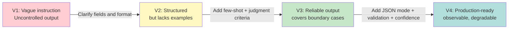
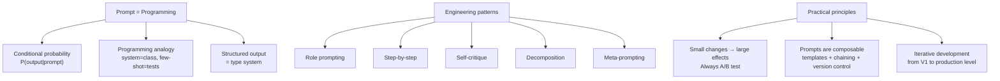

[← Previous Chapter](08-reasoning.md) | [Table of Contents](../README.md) | [Next Chapter →](10-knowledge.md)

**中文**: [中文](../../chapters/09-prompting.md)

# Chapter 9: Prompting Is Programming

> "The hottest new programming language is English."
> — Andrej Karpathy

If the first eight chapters were about understanding how the engine works, then from this chapter onward, we are learning how to drive. The prompt is the steering wheel in your hands.

**Core argument: a prompt is not "talking to AI"; it is programming in natural language.** Once you accept this perspective, the way you treat prompts changes fundamentally: from "just trying things" to "serious engineering practice."

---

## 9.1 A Prompt Is Not an Instruction; It Is Conditional Probability

### You Are Not "Telling" the Model What to Do

Most people treat prompts as instructions: "Help me write a poem," "Translate this into English," "Summarize this article." That understanding is not wrong, but it is shallow.

Recall the core formula from Chapter 1:

$$P(\text{output} \mid \text{prompt})$$

Every prompt you write essentially constructs a **conditional probability distribution**. You are not "commanding" the model to do something; you are building a probabilistic scene that makes the output you want the most likely continuation under that distribution.

### An Intuitive Analogy

Imagine walking into a theater. The lighting, set design, and costumes on stage are all part of the prompt. After seeing these conditions, the actor (the model) naturally steps into the corresponding role. You have not told the actor line by line what to say, but the set has already determined what kind of play they are most likely to perform.

```
Set = ancient palace     → the actor is likely to start performing a period drama
Set = modern office      → the actor is likely to start performing a workplace drama
Set = courtroom          → the actor is likely to start performing a legal drama
```

The system prompt is the stage set. The few-shot examples you write are clips from the first few scenes. The actor sees "this is how it was performed before" and continues in the same style.

### Small Changes, Large Effects

Because you are manipulating a high-dimensional probability distribution, tiny changes can produce large differences in the output. This is not a bug; it is an essential property of the system.

```python
# A seemingly tiny wording difference
prompt_a = "List 3 reasons why Python is popular."
prompt_b = "What are 3 reasons Python is popular?"

# The output styles may be completely different:
# prompt_a → tends to generate a numbered list ("1. ... 2. ... 3. ...")
# prompt_b → tends to generate a paragraph-style answer
```

Why? Because the token "List" frequently appears in training data before list-formatted text, activating attention patterns related to "list format." "What are" appears more often in question-answer dialogue, activating a different generation pattern.

Tokens exist in a high-dimensional space, and tiny perturbations may cross a decision boundary, causing the model to follow a completely different generation path. This is like the butterfly effect in chaotic systems: the choice of the first token cascades into every subsequent token.

---

## 9.2 The Programming Analogy for Prompts

Once you see prompts as programming, many programming concepts have direct counterparts:

| Programming Concept | Prompt Counterpart | Explanation |
|---------|------------|------|
| Class definition | System prompt | Defines behavior, persona, and constraints |
| Function call | User message | The concrete input |
| Unit test | Few-shot examples | Shows expected input-output pairs |
| Forced intermediate variables | CoT instruction | "Analyze first, then answer" |
| Return type | Output format spec | "Return in JSON format" |
| Determinism level | Temperature | 0 = fully deterministic, 1 = random |
| Function signature | Tool/function definition | Defines available tools and their parameters |
| Comments | Explanations in the prompt | Help the model understand intent |

### System Prompt = Class Definition

```python
# Class definition in programming
class CodeReviewer:
    """A strict code reviewer that focuses on security and performance."""

    def __init__(self):
        self.style = "direct and concise"
        self.focus = ["security", "performance", "readability"]
        self.language = "Chinese"

    def review(self, code: str) -> str:
        ...
```

```
# Equivalent System Prompt
You are a strict code reviewer.
- Style: direct and concise
- Focus: security, performance, readability
- Reply in Chinese
```

Both do the same thing: define the behavior pattern of an entity. The difference is that a class definition uses precise syntax, while a prompt uses natural language. The latter is more flexible, but also more ambiguous.

### Few-shot Examples = Unit Tests

```python
# Unit tests define expected behavior
def test_sentiment_analysis():
    assert analyze("This movie was amazing!") == "positive"
    assert analyze("The service attitude was terrible") == "negative"
    assert analyze("It was okay, just average") == "neutral"
```

```
# Equivalent few-shot prompt
Analyze the sentiment of the following reviews and output "positive", "negative", or "neutral".

Review: This movie was amazing!
Sentiment: positive

Review: The service attitude was terrible
Sentiment: negative

Review: It was okay, just average
Sentiment: neutral

Review: {new_review}
Sentiment:
```

Few-shot examples do more than show what the task is. They also implicitly define:
- **Output format**: one word, not a paragraph
- **Output range**: only three options
- **Boundary cases**: how to handle neutral expressions

This is why few-shot prompting is so powerful. It conveys the task definition, format requirements, and boundary-handling strategy at the same time, often with more precision than any natural-language description.

### CoT = Forced Intermediate Variables

```python
# Programming: decompose computation with intermediate variables
def complex_calc(a, b, c):
    step1 = a * b          # This step cannot be skipped
    step2 = step1 + c      # Depends on step1
    result = step2 ** 2    # Depends on step2
    return result
```

```
# Equivalent CoT prompt
Please answer by following these steps:
1. First, identify the key information in the problem
2. Then, list possible solution approaches
3. Next, perform the calculation step by step
4. Finally, provide the final answer

Problem: ...
```

When you ask the model in a prompt to "think first, then answer," you are essentially **forcing the model to generate intermediate tokens**. Recall the insight from Chapter 8: more tokens = more computation steps. CoT instructions turn a "one-shot" problem into one that requires multi-step derivation, giving the model more "computation space."

---

## 9.3 Structured Output = Type System

### Why Structured Output Is Needed

LLMs generate free text by default. In engineering systems, however, you almost always need **parseable output with a stable format**.

```python
# You want this
{"sentiment": "positive", "confidence": 0.92, "keywords": ["excellent", "recommend"]}

# The model may give you this
"The sentiment is positive with high confidence. Key words include 'excellent' and 'recommend'."

# Or this
"Based on my analysis, I would classify this as a POSITIVE review..."
```

Free-text output is like a programming language without a type system: anything can be written, but downstream consumers cannot parse it reliably.

### JSON Mode: The Most Basic Type Constraint

```python
from openai import OpenAI
client = OpenAI()

response = client.chat.completions.create(
    model="gpt-4o",
    response_format={"type": "json_object"},
    messages=[
        {"role": "system", "content": "Analyze the sentiment of the user review. Return JSON containing the sentiment and confidence fields."},
        {"role": "user", "content": "The food at this restaurant was average, but the waiter's attitude was very good."}
    ]
)

import json
result = json.loads(response.choices[0].message.content)
# {"sentiment": "mixed", "confidence": 0.78}
```

JSON mode guarantees that the output is valid JSON, but it does not guarantee the JSON structure. The model may return arbitrary fields.

### Function Calling: Structured Output with Type Signatures

Function calling goes one step further by defining an exact schema:

```python
from openai import OpenAI
client = OpenAI()

tools = [{
    "type": "function",
    "function": {
        "name": "analyze_sentiment",
        "description": "Analyze the sentiment of text",
        "parameters": {
            "type": "object",
            "properties": {
                "sentiment": {
                    "type": "string",
                    "enum": ["positive", "negative", "neutral", "mixed"],
                    "description": "Sentiment category"
                },
                "confidence": {
                    "type": "number",
                    "minimum": 0,
                    "maximum": 1,
                    "description": "Confidence from 0 to 1"
                },
                "keywords": {
                    "type": "array",
                    "items": {"type": "string"},
                    "description": "Key sentiment words"
                }
            },
            "required": ["sentiment", "confidence"]
        }
    }
}]

response = client.chat.completions.create(
    model="gpt-4o",
    tools=tools,
    tool_choice={"type": "function", "function": {"name": "analyze_sentiment"}},
    messages=[
        {"role": "user", "content": "The food at this restaurant was average, but the waiter's attitude was very good."}
    ]
)
```

This is like defining parameter types for a function: `sentiment` can only be one of four values, and `confidence` must be a number between 0 and 1.

### Constrained Decoding: Enforcing Syntax at the Token Level

The most aggressive approach is **constrained decoding**: while generating each token, directly mask tokens that do not satisfy the syntax.

```python
# Use the Outlines library for constrained decoding
# https://github.com/dottxt-ai/outlines
from pydantic import BaseModel, confloat
from enum import Enum
import outlines

class Sentiment(str, Enum):
    positive = "positive"
    negative = "negative"
    neutral = "neutral"
    mixed = "mixed"

class SentimentResult(BaseModel):
    sentiment: Sentiment
    confidence: confloat(ge=0, le=1)
    keywords: list[str]

model = outlines.models.transformers("meta-llama/Llama-3.1-8B-Instruct")
generator = outlines.generate.json(model, SentimentResult)

result = generator("Analyze the sentiment of the following review: The food at this restaurant was average, but the waiter's attitude was very good.")
# result is guaranteed to conform to the SentimentResult schema
```

How Outlines works: at each decoding step, it computes the set of legal tokens at the current position according to the JSON schema, then sets the probability of all other tokens to 0. This is equivalent to enforcing type checking at the token level.

### Why Structured Output Works

From a probabilistic perspective, structured output **shrinks the output space**.

```
No constraints: output space = all possible token sequences (infinite)
JSON mode: output space = all valid JSON (still very large)
Function calling: output space = JSON that conforms to the schema (much smaller)
Constrained decoding: output space = sequences that exactly match the syntax (smallest)
```

The smaller the output space, the lower the probability that the model will make mistakes. This is exactly the same principle as in programming: statically typed languages make errors easier to find than dynamically typed languages because the type system shrinks the space of legal programs.

---

## 9.4 Prompt Engineering Patterns

Just as software engineering has design patterns, prompt engineering has developed a set of proven patterns.

### Pattern 1: Role Prompting

**Core idea**: assign a role to activate the related knowledge and behavior patterns in the model's training data.

```
❌ Generic prompt:
Explain quantum entanglement.

✅ With role prompting:
You are a physics professor who is good at using simple analogies to explain complex concepts to undergraduates.
Please explain quantum entanglement.
```

Why does it work? The model's training data contains a large body of text from professors giving lectures. The role label "physics professor" activates related language patterns: the model is more likely to use analogies, explain step by step, and avoid excessive jargon.

But note: role prompting is not magic. Saying "you are the best mathematician in the world" will not make the model's arithmetic more accurate, because the role changes the **language pattern**, not the **underlying computational ability**.

### Pattern 2: Step-by-Step

**Core idea**: break a complex task into an explicit sequence of steps.

```
❌ One-shot:
Analyze what bugs this code has, then fix it.

✅ Step-by-step:
Please analyze this code according to the following steps:
1. First read the code and understand its intent
2. Find all possible bugs (list each one)
3. For each bug, explain what problem it would cause
4. Provide the complete fixed code
```

This pattern essentially **forces the generation of intermediate reasoning tokens**. The model cannot skip steps. It must complete the text for step 1 before it can start step 2.

### Pattern 3: Self-Critique

**Core idea**: have the model review its own output, find mistakes, and correct them.

```
Please answer using the following process:

1. [Initial answer] First provide your answer
2. [Self-critique] Check whether your answer has any of the following problems:
   - Factual errors
   - Logical gaps
   - Omitted key points
3. [Revised version] Based on the critique, provide the revised final answer
```

Why does this work? In the "critique" stage, the conditions the model sees have changed. It is no longer generating from scratch; it is judging an existing output. This is similar to rereading an essay after writing it: you can often catch problems you did not notice while drafting.

### Pattern 4: Decomposition

**Core idea**: decompose a complex task into multiple simple subtasks.

```
❌ One huge prompt:
Read these 10 papers, summarize the core contribution of each paper, compare their methodological differences,
identify research gaps, and then propose a new research direction.

✅ Decompose into a pipeline:
Prompt 1: Summarize the core contribution of each paper (process one paper at a time)
Prompt 2: Given all summaries, compare methodological differences
Prompt 3: Based on the comparison results, identify research gaps
Prompt 4: Based on the gaps, propose new directions
```

This pattern addresses a fundamental limitation of LLMs: autoregressive generation does not have global planning capability (Chapter 8). By manually decomposing the steps, we turn a "hard problem requiring global planning" into "multiple simple problems requiring only local reasoning."

### Pattern 5: Meta-Prompting

**Core idea**: have the model design the prompt itself.

```
I need an LLM to extract structured data from product reviews (product name, pros, cons, rating).
Please design an efficient prompt for this task, with the following requirements:
1. The output format is JSON
2. It can handle various review styles (short, verbose, sarcastic)
3. When information is insufficient, it outputs null instead of guessing
```

The deeper principle behind meta-prompting is that the model has seen many prompt engineering discussions and tutorials in its training data, so it "knows" what kinds of prompts are effective. Having it generate prompts uses this meta-knowledge.

---

## 9.5 Why Small Changes Can Have Very Different Effects

### The Butterfly Effect at the Token Level

Let us look at how tiny wording changes can produce large effects from the token perspective.

```python
import tiktoken
enc = tiktoken.encoding_for_model("gpt-4o")

# Two "almost the same" prompts
prompt_a = "Summarize the following text:"
prompt_b = "Summarize this text:"

tokens_a = enc.encode(prompt_a)
tokens_b = enc.encode(prompt_b)

print(f"Prompt A tokens: {tokens_a}")  # Different token sequence
print(f"Prompt B tokens: {tokens_b}")  # Different token sequence
```

Even when the semantics are the same, different wordings are different inputs in token space. This means they produce different hidden states after passing through the attention layers, and eventually different output probability distributions.

### The Cascading Effect of the First Token

One key property of autoregressive generation is that **each token choice depends on all previous tokens**. This means that if the first generated token is different, all subsequent tokens will be affected.

```
Prompt: "What is the capital of France? Please answer in one sentence."

Path A: "The" → "capital" → "of" → "France" → "is" → "Paris" → "."
Path B: "Paris" → "is" → "the" → "capital" → "of" → "France" → "..." → (a longer explanation)
```

Whether the first token is "The" or "Paris" determines the structure of the whole answer. A tiny prompt change may flip the probability ranking of the first token, even if only from 0.49 to 0.51.

### Word Order Affects Attention Patterns

Attention in Transformers is **position-sensitive**. The same words placed in different positions create different attention patterns:

```
Prompt A: "Please analyze the reasons first, then give suggestions"
Prompt B: "Please give suggestions, and analyze the reasons"

# In Prompt A, "analyze the reasons" appears first, so the model is more likely to analyze before giving suggestions
# In Prompt B, "give suggestions" appears first, so the model is more likely to give suggestions first
# This is not just because the model "understands the order"
# It is also because the distribution of attention weights is position-related
```

### Practical Principle: Always Do A/B Testing

Based on the analysis above, one hard rule is: **never assume one prompt is better than another; measure it**.

```python
# A simple prompt A/B testing framework
import asyncio
from openai import AsyncOpenAI

async def evaluate_prompt(client, prompt, test_cases, n_runs=5):
    """Run multiple test cases for a prompt and return the average score"""
    scores = []
    for case in test_cases:
        for _ in range(n_runs):
            response = await client.chat.completions.create(
                model="gpt-4o",
                messages=[
                    {"role": "system", "content": prompt},
                    {"role": "user", "content": case["input"]}
                ],
                temperature=0.3
            )
            output = response.choices[0].message.content
            score = case["scorer"](output)
            scores.append(score)
    return sum(scores) / len(scores)

# Usage
prompt_a = "You are a translation assistant. Please translate the user's input into English."
prompt_b = "Translate the following Chinese into idiomatic English. Preserve the tone and style of the original."

# Compare the two prompts on the same test set
```

---

## 9.6 Prompt Composability

### Template Variables: Parameters in Prompts

Good prompts are not hardcoded strings; they are parameterized templates.

```python
# Hardcoded — not reusable
prompt = "Please translate the following English into Chinese: Hello, how are you?"

# Templated — reusable
def build_translation_prompt(text: str, source_lang: str, target_lang: str) -> str:
    return f"""Please translate the following {source_lang} text into {target_lang}.
Requirements:
- Preserve the tone and style of the original
- Keep technical terms in the original language and add the translation in parentheses

Original:
{text}

Translation:"""

# Usage
prompt = build_translation_prompt(
    text="The attention mechanism allows the model to focus on relevant parts.",
    source_lang="English",
    target_lang="Chinese"
)
```

### Conditional Branches: Adjusting the Prompt Based on Input

```python
def build_analysis_prompt(text: str, text_type: str) -> str:
    base = "Analyze the sentiment tendency of the following text.\n\n"

    # Add guidance based on the text type
    if text_type == "review":
        base += "This is a product review. Focus on: product quality, service attitude, value for money.\n"
    elif text_type == "social_media":
        base += "This is a social media post. Note: it may contain sarcasm, internet slang, and emoji.\n"
    elif text_type == "news":
        base += "This is a news report. Note: distinguish factual statements from opinion expressions.\n"

    base += f"\nText: {text}\n\nAnalysis:"
    return base
```

### Prompt Chaining: Pipeline-Style Composition

```python
async def research_pipeline(topic: str, client) -> dict:
    """A three-step prompt chain"""

    # Step 1: Generate search keywords
    keywords_prompt = f"Generate 5 search keywords for the following research topic and return them as a JSON array:\nTopic: {topic}"
    keywords_response = await call_llm(client, keywords_prompt)
    keywords = json.loads(keywords_response)

    # Step 2: Generate a summary for each keyword (the previous step's output is this step's input)
    summaries = []
    for kw in keywords:
        summary_prompt = f"Write a 100-word summary about the topic \"{kw}\", focusing on the latest progress."
        summary = await call_llm(client, summary_prompt)
        summaries.append({"keyword": kw, "summary": summary})

    # Step 3: Synthesize all summaries (the previous steps' outputs are this step's input)
    synthesis_prompt = f"""Based on the following research summaries, write a comprehensive analysis report about \"{topic}\".

Summaries:
{json.dumps(summaries, ensure_ascii=False, indent=2)}

Requirements:
- Identify common themes
- Identify contradictions
- Point out research gaps
"""
    report = await call_llm(client, synthesis_prompt)

    return {"keywords": keywords, "summaries": summaries, "report": report}
```

### Version Control: Manage Prompts Like Code

Prompts should be managed like code:

```
prompts/
├── sentiment_analysis/
│   ├── v1.txt          # Initial version
│   ├── v2.txt          # Added few-shot examples
│   ├── v3.txt          # Added edge case handling
│   └── eval_results.json  # Evaluation results for each version
├── translation/
│   ├── v1.txt
│   └── v2.txt
└── prompt_registry.yaml   # Which version is used in production
```

```yaml
# prompt_registry.yaml
sentiment_analysis:
  production: v3
  staging: v4-experimental

translation:
  production: v2
  staging: v2
```

Key principles:
- **Every change must be recorded**: why it changed and what changed
- **Every version has evaluation results**: you cannot claim "it got better" based on intuition alone
- **Separate production and experimental versions**: like main and feature branches in code
- **Prompt review is just as important as code review**

---

## 9.7 Practice: From Bad Prompt to Good Prompt

Let us use a real task to demonstrate the full process of prompt iteration.

**Task**: Extract structured information from customer emails (customer name, issue category, urgency level, core request).

### V1: The Simplest Attempt

```
Extract key information from this email.

Email: {email_content}
```

**Problems**:
- Output format is uncertain (it may be a paragraph, list, JSON, and so on)
- "Key information" is vague; the requested fields are unclear
- There are no examples, so the model has to infer the desired format

**Actual output** (unreliable):
```
This email is from Mr. Zhang. He is dissatisfied with the product delivery delay and asks for it to be handled as soon as possible.
```

### V2: Make the Output Format Explicit

```
Extract information from the following customer email and return it in JSON format:
- customer_name: customer name
- category: issue category (refund/technical issue/complaint/inquiry/other)
- urgency: urgency level (high/medium/low)
- core_request: core request (summarized in one sentence)

Email: {email_content}
```

**Improvements**:
- Specific fields are defined
- The category range is constrained (enum)
- JSON format is required

**What problems remain**:
- The model may use Chinese quotation marks or produce malformed JSON
- The criteria for judging urgency are unclear
- Missing information is not handled

### V3: Add Few-Shot and Boundary Handling

```
You are a customer email analysis system. Extract structured information from emails.

Output format: strict JSON with the following fields:
- customer_name: string | null (if it cannot be determined)
- category: "refund" | "technical" | "complaint" | "inquiry" | "other"
- urgency: "high" | "medium" | "low"
- core_request: string (one sentence, no more than 50 characters)

Urgency criteria:
- high: mentions a deadline, legal action, major financial loss, or clearly expresses anger
- medium: expresses dissatisfaction but in an acceptable tone, or the issue affects normal use
- low: general inquiry, no time pressure

Example 1:
Email: I am Li Ming, order number #12345. I should have received the goods three days ago, but they still have not arrived! This is a gift for my client. If it does not arrive tomorrow, I want a refund!!!
Output: {"customer_name": "Li Ming", "category": "complaint", "urgency": "high", "core_request": "Order delayed and not delivered; requests next-day delivery or refund"}

Example 2:
Email: Hello, I would like to ask what the difference is between your enterprise edition and personal edition. Our company has about 50 people. Which plan is suitable?
Output: {"customer_name": null, "category": "inquiry", "urgency": "low", "core_request": "Asks about differences between enterprise and personal editions and plan choice for 50 people"}

Example 3:
Email: Your lousy software crashed again!! Last time you said it was fixed, but the same problem happened again today. Our whole team is waiting to use it, and it is seriously affecting project progress. Please give me a solution as soon as possible. — Manager Wang
Output: {"customer_name": "Manager Wang", "category": "technical", "urgency": "high", "core_request": "Software crashed again and affects team work; requests a solution as soon as possible"}

Now analyze this email:
{email_content}
Output:
```

**V3 improvements**:
1. **Role setting**: clearly defined as an "analysis system"
2. **Fields use English enums**: this avoids mixing Chinese and English and makes downstream parsing easier
3. **null handling**: explicitly defines behavior when information is missing
4. **Judgment criteria**: urgency has clear rules
5. **Three few-shot examples**: cover high/medium/low urgency and different categories
6. **Boundary case**: Example 2 shows returning null when the customer name is unknown

### V4: Production Level, with Defensive Measures

```python
SYSTEM_PROMPT = """You are a customer email analysis system. Your output will be parsed directly by a program and must be strictly valid JSON.

## Output Schema

```json
{
  "customer_name": "string | null",
  "category": "refund | technical | complaint | inquiry | other",
  "urgency": "high | medium | low",
  "core_request": "string (≤50 characters)",
  "confidence": "high | medium | low"
}
```

## Rules

1. Output only JSON, with no other text
2. If information cannot be determined, use null; do not guess
3. The confidence field reflects your confidence in the whole extraction result:
   - high: the information is clear and explicit
   - medium: some information requires inference
   - low: the email content is ambiguous or lacks key information
4. core_request must be a declarative sentence that summarizes the customer's core request

## Urgency Judgment

- **high**: explicit deadline | threat of legal action | mentions major financial loss | emotional agitation (multiple exclamation marks, uppercase letters)
- **medium**: expresses dissatisfaction | affects normal work | second contact about the same issue
- **low**: general inquiry | no time pressure | calm tone"""

FEW_SHOT_EXAMPLES = [
    # ... (same as V3, but placed in user/assistant turns in messages)
]

def analyze_email(email_content: str) -> dict:
    messages = [
        {"role": "system", "content": SYSTEM_PROMPT},
    ]
    # Add few-shot examples
    for ex in FEW_SHOT_EXAMPLES:
        messages.append({"role": "user", "content": ex["email"]})
        messages.append({"role": "assistant", "content": json.dumps(ex["output"], ensure_ascii=False)})
    # Add the actual input
    messages.append({"role": "user", "content": email_content})

    response = client.chat.completions.create(
        model="gpt-4o",
        messages=messages,
        temperature=0,  # Deterministic output
        response_format={"type": "json_object"},
    )

    result = json.loads(response.choices[0].message.content)

    # Post-processing: validate schema
    assert result["category"] in ["refund", "technical", "complaint", "inquiry", "other"]
    assert result["urgency"] in ["high", "medium", "low"]

    return result
```

**Further improvements in V4**:
1. **JSON mode enforcement**: `response_format={"type": "json_object"}`
2. **confidence field**: has the model report confidence so low-confidence results can be escalated to humans
3. **Temperature=0**: classification tasks need determinism
4. **Post-processing validation**: even with JSON mode, still validate the schema
5. **Few-shot examples placed in conversation turns**: more effective than putting them in the system prompt

### Summary of Iteration Lessons



**Core lessons**:
1. **Prompt development is an iterative process, just like software development**: no one writes a perfect prompt the first time
2. **Explicit > implicit**: the model will not guess what you mean; write everything clearly
3. **Few-shot examples are the most effective "documentation"**: three good examples beat a page of description
4. **Always prepare for failure**: add confidence, validation, and fallback strategies
5. **Measure, do not guess**: run evaluations on real data; do not iterate based on feeling

---

## Chapter Summary



Core takeaways:

1. **Prompts construct conditional probability distributions**, not natural-language instructions
2. **The programming analogy works**: System prompt = class definition, Few-shot = unit tests, CoT = intermediate variables
3. **Structured output is your most practical tool**: JSON mode, function calling, and constrained decoding strengthen constraints step by step
4. **Master the core patterns**: role prompting, step-by-step, self-critique, decomposition, meta-prompting
5. **Tiny changes may produce huge differences**: always let data speak, not intuition
6. **Prompt management should be like code management**: templating, version control, review process
7. **Iteration is the right process**: there is no perfect first version of a prompt

---

## Further Reading

- [Prompt Engineering Guide](https://www.promptingguide.ai/) — the most comprehensive prompt engineering guide
- [Chain-of-Thought Prompting Elicits Reasoning](https://arxiv.org/abs/2201.11903) — Wei et al. 2022, the original CoT paper
- [Self-Consistency Improves Chain of Thought Reasoning](https://arxiv.org/abs/2203.11171) — Wang et al. 2022
- [Large Language Models are Zero-Shot Reasoners](https://arxiv.org/abs/2205.11916) — Kojima et al. 2022, "Let's think step by step"
- [Outlines](https://github.com/dottxt-ai/outlines) — structured generation library
- [OpenAI Function Calling Guide](https://platform.openai.com/docs/guides/function-calling)
- [DSPy](https://github.com/stanfordnlp/dspy) — a programmatic prompt optimization framework
