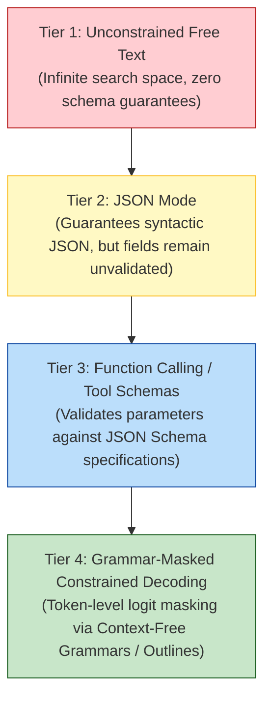
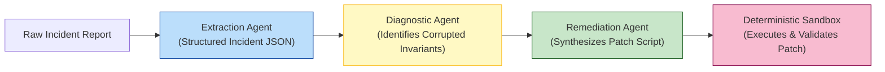
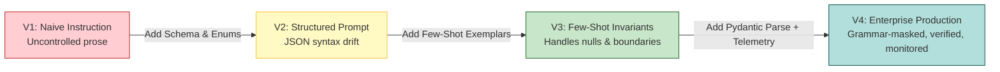
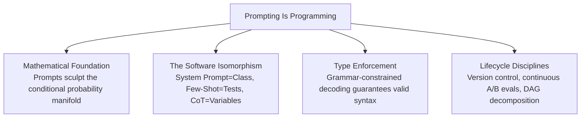

[← Previous Chapter](08-reasoning.md) | [Table of Contents](../README.md) | [Next Chapter →](10-knowledge.md)

**中文**: [中文](../../chapters/09-prompting.md)

# Chapter 9: Prompting Is Programming

> "The hottest new programming language is English."  
> — Andrej Karpathy

If the first eight chapters deconstructed the internal mechanics of the engine—next-token prediction, multi-head attention routing, empirical scaling, and post-training alignment—Part III focuses on the steering wheel: the engineering disciplines required to build resilient, production-grade applications.

The foundational premise of this chapter: **a prompt is not a conversational instruction; it is software source code written in natural language**. Once you adopt this mindset, prompt design transforms from ungrounded trial-and-error into rigorous systems engineering.

---

## 9.1 Prompts Are Not Instructions; They Are Conditional Probability Operators

### Constructing the Sampling Manifold

Most users treat prompts as intuitive commands: *"Write a poem," "Translate this document into French," "Summarize this technical architecture."* While linguistically convenient, this perspective is mathematically incomplete.

Recall the governing autoregressive equation from Chapter 1:

$$\mathcal{P}(\text{Output Sequence} \mid \text{Prompt Context})$$

Every character you inject into a prompt constructs a **high-dimensional conditioning manifold**. You are not issuing an imperative command to an agent; you are sculpting a probability landscape such that the desired output sequence becomes the path of maximum statistical likelihood.

### The Theatrical Set Metaphor

Consider an actor stepping onto a theatrical stage. The stage architecture, lighting temperature, props, and costumes constitute the system prompt. Upon entering the set, the actor instinctively embodies the behavioral patterns demanded by the environment:

```
Set A: 16th-Century Royal Court  ──► Actor speaks in archaic iambic pentameter
Set B: Intensive Care Unit       ──► Actor adopts clipped, urgent medical terminology
Set C: Silicon Valley Boardroom  ──► Actor engages in corporate strategic dialect
```

The system prompt sets the computational stage. The few-shot demonstrations provide the rehearsal footage of earlier scenes. The model observes the structural cadence and simply continues the performance.

### The Butterfly Effect in Token Space

Because an autoregressive prompt conditions a multi-billion-parameter softmax distribution, minor lexical perturbations can drastically divert generation trajectories:

```python
# A seemingly trivial lexical distinction
prompt_a = "List 3 structural benefits of Rust memory safety."
prompt_b = "What are 3 structural benefits of Rust memory safety?"

# Generation Divergence:
# prompt_a -> Emits a strict markdown numerical list ("1. Ownership model... 2. Borrow checker...")
# prompt_b -> Emits an introductory prose paragraph followed by conversational prose
```

Why does this occur?
- The leading imperative token `"List"` strongly correlates in pretraining corpora with numbered bullet syntax, priming the attention circuits for markdown lists.
- The interrogative token sequence `"What are"` correlates with open-ended conversational discourse, priming the network for explanatory prose.

Tokens occupy dense positions in high-dimensional vector space. A minor phrasing adjustment can shift the latent representation across a decision boundary, triggering a cascade where the first generated token permanently alters all subsequent token probabilities.

---

## 9.2 The Software Engineering Isomorphism

Viewing prompt engineering through the lens of formal software development reveals direct architectural parallels:

| Software Engineering Primitive | Prompt Engineering Primitive | Operational Function |
|---|---|---|
| **Class Interface / Struct** | **System Prompt** | Encapsulates behavioral invariants, personas, and constraints. |
| **Function Invocation** | **User Message Payload** | Injects dynamic runtime arguments into the template. |
| **Unit Test Suite** | **Few-Shot Demonstrations** | Establishes canonical input-output assertion pairs. |
| **Local Variables / Scratchpad** | **Chain-of-Thought Scaffolding** | Forces explicit intermediate computation into the KV cache. |
| **Static Return Type** | **JSON Schema / Structured Output** | Enforces parseable downstream schema guarantees. |
| **Stochasticity Flag** | **Temperature / Top-p** | Controls exploration entropy across the logit distribution. |
| **Function Signatures / FFI** | **Tool & Function Definitions** | Exposes external execution capabilities via JSON schemas. |

### System Prompts as Class Invariants

```python
# Traditional Object-Oriented Class Definition
class TechnicalCodeAuditor:
    """Strict static analysis agent specialized in memory safety and concurrency."""
    def __init__(self):
        self.tone = "objective_and_concise"
        self.audit_priorities = ["memory_leaks", "race_conditions", "deadlocks"]
        self.output_language = "Python"

    def audit(self, source_code: str) -> List[Issue]:
        ...
```

```
# Equivalent Production System Prompt
You are a Principal Security Auditor specialized in systems software.
- Operating Persona: Objective, concise, and uncompromising.
- Priority Invariants: Flag memory leaks, race conditions, and deadlocks.
- Formatting Rule: Emit structured markdown issues with exact line citations.
```

Both constructs define behavioral contracts. The traditional class enforces invariants via compiler checks; the system prompt enforces invariants via attention weight steering.

### Few-Shot Exemplars as Unit Assertions

```python
# Software Unit Test Suite
def test_sentiment_boundary():
    assert evaluate_sentiment("Flawless throughput under load.") == "positive"
    assert evaluate_sentiment("Database corrupted on initial boot.") == "negative"
    assert evaluate_sentiment("Standard performance; matches specs.") == "neutral"
```

```
# Equivalent Few-Shot Prompt Schema
Classify the operational sentiment of technical reviews as positive, negative, or neutral:

Input: "Flawless throughput under load."
Sentiment: positive

Input: "Database corrupted on initial boot."
Sentiment: negative

Input: "Standard performance; matches specs."
Sentiment: neutral

Input: {user_input}
Sentiment:
```

Few-shot exemplars provide immense disambiguation bandwidth:
1. **Schema Binding**: Explicitly restricts the output to single-token categorical labels.
2. **Vocabulary Restriction**: Constrains candidate classes to the exact target enum (`positive`, `negative`, `neutral`).
3. **Boundary Calibration**: Demonstrates how subtle neutral feedback should be categorized.

---

## 9.3 Structured Outputs as Type Systems

### The Fragility of Free-Text Generation

By default, autoregressive language models emit unconstrained text. In enterprise backend pipelines, however, downstream software requires deterministic, schema-validated JSON payloads:

```
Desired Backend Schema:
{"sentiment": "positive", "confidence": 0.94, "root_cause": "latency_resolved"}

Unconstrained Model Completions:
"The sentiment appears positive with high confidence. Root cause is latency resolution."
OR
"Based on my analysis: \n```json\n{\n  'sentiment': 'positive'...\n```"
```

Relying on regex heuristics to clean up conversational filler is fragile and computationally wasteful.

### The Progression of Output Constraints



### Constrained Decoding: Enforcing Syntax at the Logit Level

The most mathematically robust paradigm is **grammar-constrained decoding** (implemented via libraries such as *Outlines* or *llama.cpp*).

Rather than trusting the model to follow a prompt, the inference engine builds a Finite State Machine (FSM) from the Pydantic schema. At every step $t$, the engine constructs a binary logit mask that sets the probability of all invalid syntax tokens to zero:

```python
from enum import Enum
from pydantic import BaseModel, Field
import outlines

class SeverityLevel(str, Enum):
    P0 = "P0"
    P1 = "P1"
    P2 = "P2"

class IncidentTriage(BaseModel):
    service_name: str
    severity: SeverityLevel
    impacted_regions: list[str]
    root_cause_summary: str = Field(..., max_length=100)

# Build grammar-constrained generator
model = outlines.models.transformers("meta-llama/Llama-3.1-8B-Instruct")
generator = outlines.generate.json(model, IncidentTriage)

# Generated output is mathematically guaranteed to parse into the IncidentTriage Pydantic model
result = generator("Alert: Redis cluster in us-east-1 disconnected; checkout service returning 500 errors.")
```

**Probabilistic Principle**: Constrained decoding compresses the search space from $100,000+$ vocabulary tokens to the handful of syntactically valid transitions permitted by the FSM. Pruning the search space dramatically reduces generation errors.

---

## 9.4 Architectural Prompt Design Patterns

Just as software engineering developed Gang-of-Four architectural patterns, prompt engineering has established a set of core compositional patterns:

### Pattern 1: Persona and Role Conditioning

- **Core Concept**: Explicitly initialize the attention state with domain-specific authority to activate expert terminology and stylistic norms.
- **Production Template**:
  ```
  You are a Staff Database Reliability Engineer analyzing PostgreSQL execution plans.
  Evaluate the provided EXPLAIN ANALYZE output for sequential scans, high-cost nested loops, and memory spill events.
  ```

### Pattern 2: Explicit Algorithmic Serialization

- **Core Concept**: Convert implicit multi-step deductions into explicit, sequential prompt phases.
- **Production Template**:
  ```
  Execute the analysis according to the following strict sequence:
  Phase 1: Parse the stack trace and identify the origin thread.
  Phase 2: Identify the root cause exception and list corrupted invariants.
  Phase 3: Synthesize a minimal reproduction script.
  Phase 4: Emit the final patch.
  ```

### Pattern 3: Dual-Pass Critique and Revision

- **Core Concept**: Force the network to evaluate its own initial draft in a separate pass before emitting the final answer.
- **Production Template**:
  ```
  Step 1 [Draft Solution]: Generate an initial implementation of the algorithm.
  Step 2 [Self-Critique]: Inspect the draft for asymptotic time complexity, edge cases (empty arrays, integer overflow), and race conditions.
  Step 3 [Final Patch]: Emit the refined implementation resolving all critique findings.
  ```

### Pattern 4: Pipeline Decomposition (Chaining)

- **Core Concept**: Break monolithic prompts into discrete, single-responsibility LLM invocations connected by verified data pipelines.
- **Production Template**:
  ```
  Stage 1 (Extraction LLM): Convert customer transcript into raw issue parameters (JSON).
  Stage 2 (Deterministic Code): Query internal knowledge base via vector search.
  Stage 3 (Synthesis LLM): Generate verified remediation email from retrieved documentation.
  ```

### Pattern 5: Meta-Prompting (System-Guided Optimization)

- **Core Concept**: Leverage frontier-class models to author, refine, and stress-test candidate prompts against specific operational criteria.

## 9.5 Token-Level Sensitivity and Empirical Evaluation

### The Physics of Token Perturbation

Why does minor lexical phrasing trigger divergent behavior across foundation models?

```python
import tiktoken
tokenizer = tiktoken.encoding_for_model("gpt-4o")

prompt_a = "Summarize the technical architecture:"
prompt_b = "Summarize this technical architecture:"

tokens_a = tokenizer.encode(prompt_a)
tokens_b = tokenizer.encode(prompt_b)

# Inspect token IDs:
# prompt_a -> [37750, 279, 4426, 7578, 25]
# prompt_b -> [37750, 428, 4426, 7578, 25]
```

Although human readers interpret `"the"` and `"this"` as semantically interchangeable determiners, token ID `279` and token ID `428` yield distinct embedding vectors $\mathbf{x}_1 \in \mathbb{R}^{d}$. As these vectors propagate through 64 to 96 transformer layers, the subtle positional and semantic differences alter attention weights across all downstream tokens.

### Autoregressive Branching

In greedy or low-temperature decoding, the probability ranking of the very first generated token dictates the downstream syntactic trajectory:

```
Conditioning Prompt: "State the capital of Japan in one sentence."

Trajectory A (starts with token 'Tokyo'):
"Tokyo" -> "is" -> "the" -> "capital" -> "and" -> "most" -> "populous" -> "prefecture" -> "of" -> "Japan."

Trajectory B (starts with token 'The'):
"The" -> "capital" -> "city" -> "of" -> "Japan" -> "is" -> "Tokyo."
```

A 0.02 probability shift between `"Tokyo"` and `"The"` at step $t=1$ permanently alters every subsequent query-key interaction in the KV cache.

### The Empirical Imperative: Continuous A/B Benchmarking

Given token sensitivity, engineering teams must abandon subjective prompt evaluation in favor of **automated regression harnesses**:

```python
import asyncio
from typing import Callable, Dict, List
from openai import AsyncOpenAI

async def evaluate_prompt_candidate(
    client: AsyncOpenAI,
    candidate_prompt: str,
    eval_dataset: List[Dict[str, str]],
    scoring_fn: Callable[[str, str], float]
) -> float:
    """Benchmark prompt accuracy across verified test distribution."""
    accumulated_scores = []
    
    for exemplar in eval_dataset:
        response = await client.chat.completions.create(
            model="gpt-4o",
            messages=[
                {"role": "system", "content": candidate_prompt},
                {"role": "user", "content": exemplar["input"]}
            ],
            temperature=0.0
        )
        prediction = response.choices[0].message.content
        metric = scoring_fn(prediction, exemplar["ground_truth"])
        accumulated_scores.append(metric)
        
    return sum(accumulated_scores) / len(accumulated_scores)
```

---

## 9.6 Prompt Composability and the Software Lifecycle

### Dynamic Templating and Parameterization

Production prompts must never exist as hardcoded string literals. They should be engineered as modular, typed templates:

```python
from jinja2 import Template

TRANSLATION_TEMPLATE = Template("""
Translate the following {{ source_language }} text into idiomatic {{ target_language }}.
Operating Constraints:
- Preserve technical register and formal syntactic structure.
- Retain domain acronyms in {{ source_language }} (e.g., {{ glossary_terms | join(', ') }}).

Source Text:
{{ source_text }}

Verified Translation:
""".strip())
```

### Directed Acyclic Graph (DAG) Execution Chains

Complex tasks should not be forced into a single monolithic generation pass. They should be factored into sequential multi-stage pipelines:



### PromptOps: Version Control and CI/CD

Enterprise prompts require the same operational rigor as production microservices:

```
deployments/prompts/
├── triage_service/
│   ├── v1.0.0.yaml          # Initial prompt baseline
│   ├── v1.1.0.yaml          # Added boundary enums for billing incidents
│   ├── v1.2.0.yaml          # Outlines Pydantic grammar integration
│   └── regression_suite.json # Golden evaluation test assertions
└── registry.yaml            # Environment deployment mappings (prod -> v1.2.0)
```

**PromptOps Principles**:
1. **Immutable Semantic Versioning**: Every prompt mutation is committed to version control with explicit rationale and diff metadata.
2. **Automated CI/CD Gateways**: Pull requests updating a prompt must execute the regression test suite and maintain a threshold pass rate before merging.
3. **Telemetry & Tracing**: Every production generation log includes the prompt template hash, model checkpoint ID, temperature, and latency metrics.

---

## 9.7 Production Case Study: Iterative Refinement of an Incident Triage Engine

To illustrate the evolution from naive prompting to resilient production engineering, consider an enterprise workflow: **extract structured triage parameters from raw customer support escalations**.

### Iteration 1: The Naive Instruction (Fragile & Ambiguous)

```
Extract key incident details from this customer email:
{email_body}
```

**Failure Modes**: Uncontrolled prose format, missing entity bounds, inconsistent terminology, zero schema parseability.

### Iteration 2: Schema Definition with Format Constraints

```
Extract incident information from the customer email and output valid JSON:
- customer_identifier: string
- incident_category: refund | outage | security | general_inquiry
- severity_tier: P0 | P1 | P2
- technical_summary: concise summary of the issue

Email: {email_body}
```

**Remaining Vulnerabilities**: Stochastic markdown wrapper injection (````json ... ````), unhandled missing entities (`"None"` vs `null`), ambiguous criteria for severity classification.

### Iteration 3: Few-Shot Disambiguation with Explicit Invariants

```
You are an Automated Incident Triage System. Extract structured parameters into strict JSON.

Schema Definition:
- customer_id: string | null (set to null if absent)
- incident_category: "billing" | "security" | "service_outage" | "inquiry"
- severity: "P0" (system down, data loss) | "P1" (degraded core feature) | "P2" (minor defect, general query)
- summary: string (single declarative sentence <= 100 characters)

Example 1:
Input: "Our production cluster in eu-central-1 is returning 502 Bad Gateway! Checkouts are completely offline. - Sarah (Acme Corp, Org #9841)"
Output: {"customer_id": "Org #9841", "incident_category": "service_outage", "severity": "P0", "summary": "EU production cluster returning 502 with checkouts offline"}

Example 2:
Input: "Hi there, does your enterprise tier support SAML 2.0 SSO integration? Thanks."
Output: {"customer_id": null, "incident_category": "inquiry", "severity": "P2", "summary": "Inquiry regarding SAML 2.0 SSO enterprise support"}

Process Input:
{email_body}
Output:
```

### Iteration 4: Production Grade with Pydantic Validation and Confidence Telemetry

```python
from enum import Enum
from typing import Optional, Literal
from pydantic import BaseModel, Field, ValidationError
from openai import OpenAI

class CategoryEnum(str, Enum):
    BILLING = "billing"
    SECURITY = "security"
    OUTAGE = "service_outage"
    INQUIRY = "inquiry"

class SeverityEnum(str, Enum):
    P0 = "P0"
    P1 = "P1"
    P2 = "P2"

class IncidentTriagePayload(BaseModel):
    customer_id: Optional[str] = Field(None, description="Extracted customer organization identifier")
    category: CategoryEnum
    severity: SeverityEnum
    summary: str = Field(..., max_length=120)
    confidence_level: Literal["high", "medium", "low"]
    rationale: str = Field(..., max_length=200)

SYSTEM_PROMPT = """You are an automated triage classifier. Extract incident telemetry from customer escalations.
Emit output conforming strictly to the requested JSON Schema. If customer_id cannot be found, assign null."""

def execute_incident_triage(escalation_text: str, client: OpenAI) -> IncidentTriagePayload:
    """Execute schema-validated incident classification with fallback."""
    try:
        response = client.beta.chat.completions.parse(
            model="gpt-4o-mini",
            messages=[
                {"role": "system", "content": SYSTEM_PROMPT},
                {"role": "user", "content": escalation_text}
            ],
            response_format=IncidentTriagePayload,
            temperature=0.0
        )
        parsed_result = response.choices[0].message.parsed
        
        # Human escalation gate for low confidence or P0 severity
        if parsed_result.confidence_level == "low" or parsed_result.severity == SeverityEnum.P0:
            notify_human_oncall_engineer(parsed_result, escalation_text)
            
        return parsed_result

    except ValidationError as err:
        logger.error(f"Schema validation failure: {err}")
        return execute_deterministic_fallback(escalation_text)
```

### Lifecycle Progression



---

## Chapter Summary



Core takeaways:

1. **Prompts are conditional probability operators**: You do not command language models; you construct high-dimensional conditioning manifolds.
2. **The software engineering analogy is exact**: Treat system prompts as class invariants, few-shot demonstrations as unit test assertions, and CoT instructions as intermediate variable registers.
3. **Enforce structured outputs via grammar constraints**: Leverage Pydantic and token-level logit masks (Outlines) rather than relying on unstructured text parsing.
4. **Master core compositional patterns**: Role conditioning, algorithmic serialization, self-critique loops, and pipeline decomposition.
5. **Treat prompts as versioned source code**: Establish automated regression suites, semantic versioning, and CI/CD pipelines under PromptOps.

In Chapter 10, we explore how to anchor foundation models in external enterprise knowledge: the mechanics and architectures of Retrieval-Augmented Generation (RAG).

---

## Further Reading

- [Prompt Engineering Guide](https://www.promptingguide.ai/) — Comprehensive reference for prompt patterns and techniques
- [Chain-of-Thought Prompting Elicits Reasoning in Large Language Models](https://arxiv.org/abs/2201.11903) — Wei et al., Google Research, 2022
- [Large Language Models are Zero-Shot Reasoners](https://arxiv.org/abs/2205.11916) — Kojima et al., University of Tokyo, 2022
- [Outlines: Fast and Reliable Structured Generation](https://github.com/dottxt-ai/outlines) — Finite-state machine constrained decoding
- [DSPy: Compiling Declarative Language Model Calls into State-of-the-Art Pipelines](https://arxiv.org/abs/2310.03714) — Khattab et al., Stanford University, 2023
- [OpenAI Structured Outputs Guide](https://platform.openai.com/docs/guides/structured-outputs) — Native JSON schema enforcement

[← Previous Chapter](08-reasoning.md) | [Table of Contents](../README.md) | [Next Chapter →](10-knowledge.md)
