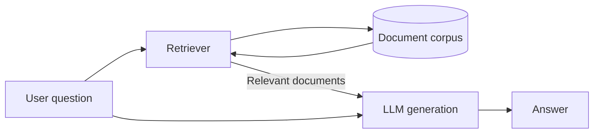
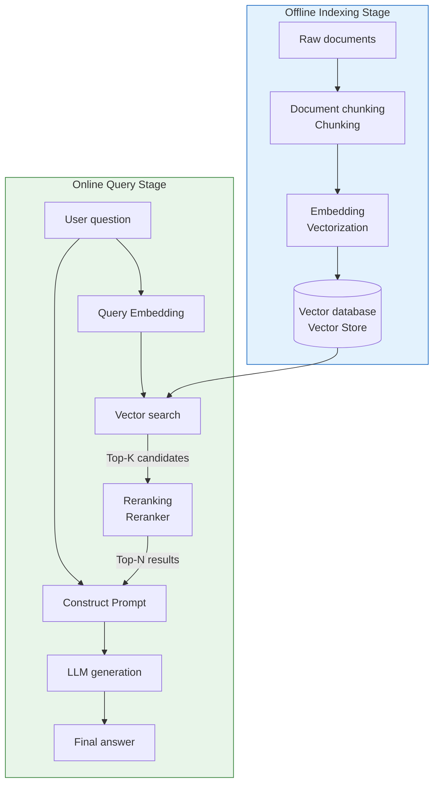
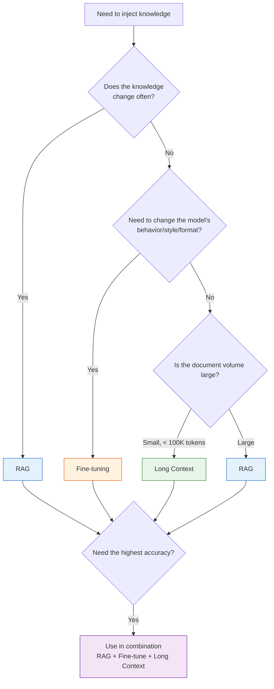
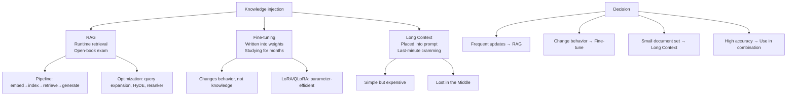

[← Previous Chapter](09-prompting.md) | [Table of Contents](../README.md) | [Next Chapter →](11-agents.md)

**中文**: [中文](../../chapters/10-knowledge.md)

# Chapter 10: Three Paths for Knowledge Injection

> "An LLM without external knowledge is like a brilliant person with amnesia — great at thinking, terrible at remembering."

An LLM's training data has a cutoff date, its parameters have finite capacity, and its context window has a length limit. When your application needs the model to answer questions about "things it does not know," you need to **inject knowledge**.

**Core argument: RAG, fine-tuning, and long context are three fundamentally different ways to inject knowledge, each suited to different scenarios. Choosing the wrong one is not just a matter of poor results; it means heading in the wrong direction.**

---

## 10.1 Three Ways to Inject Knowledge

### An Exam Analogy

The best analogy for understanding the three approaches is an exam:

| Approach | Analogy | Where the knowledge lives | Update cost |
|------|------|-----------|---------|
| **RAG** | Open-book exam: bring reference books into the exam room | External database (retrieved at runtime) | Low (just update the database) |
| **Fine-tuning** | Studying for months: knowledge committed to memory | Model weights (written during training) | High (requires retraining) |
| **Long Context** | Last-minute cramming before the exam: read the whole book once | Prompt context (passed in on each call) | None (just swap the document) |

### RAG (Retrieval-Augmented Generation)



**Core idea**: Do not store knowledge in the model; look it up when needed.

```python
# The simplest RAG implementation
def rag_answer(question: str, documents: list[str]) -> str:
    # 1. Retrieve relevant documents
    relevant_docs = retrieve(question, documents, top_k=3)

    # 2. Pass the retrieved documents and the question to the LLM together
    prompt = f"""Answer the user's question based on the following reference materials. If the materials do not contain relevant information, say "I'm not sure."

Reference materials:
{chr(10).join(relevant_docs)}

Question: {question}
Answer:"""

    return call_llm(prompt)
```

**Advantages**: Knowledge can be updated in real time; sources can be traced through citations; the model does not need retraining.
**Disadvantages**: Depends on retrieval quality; adds latency; retrieval failure means answer failure.

### Fine-tuning

**Core idea**: Use additional training to write knowledge or behavior patterns into model weights.

```python
# Fine-tuning data format (SFT)
training_data = [
    {
        "messages": [
            {"role": "system", "content": "You are a medical customer support assistant who answers questions about our products."},
            {"role": "user", "content": "What is the dosage for product X?"},
            {"role": "assistant", "content": "The recommended dosage for product X is twice daily, one tablet each time. Take it after meals."}
        ]
    },
    # ... more training examples
]
```

**Advantages**: Changes the model's behavior, style, or format; no extra retrieval is needed at inference time; low latency.
**Disadvantages**: High training cost; knowledge updates require retraining; easy to overfit.

### Long Context

**Core idea**: Put all relevant information directly into the prompt.

```python
# A naive long-context implementation
def answer_with_full_context(question: str, all_docs: str) -> str:
    prompt = f"""The following is the complete product documentation:

{all_docs}

Answer based on the documentation above: {question}"""

    return call_llm(prompt)  # May consume 100K+ tokens
```

**Advantages**: The simplest option: no retrieval pipeline, no training, and all information is in the context.
**Disadvantages**: Expensive because it is billed by token; constrained by length limits; vulnerable to the "lost in the middle" problem.

---

## 10.2 RAG in Depth

RAG is the most commonly used method for knowledge injection. Let's break down each part.

### Complete RAG Pipeline



### Embedding: Turning Text into Vectors

An embedding model maps a piece of text into a high-dimensional vector space. Texts with similar meanings are close to each other in that space.

```python
from openai import OpenAI
client = OpenAI()

def get_embedding(text: str) -> list[float]:
    response = client.embeddings.create(
        model="text-embedding-3-small",
        input=text
    )
    return response.data[0].embedding

# Semantically similar texts -> close vector distances
v1 = get_embedding("Python is a programming language")
v2 = get_embedding("Python is a computer programming language")
v3 = get_embedding("The weather is nice today")

import numpy as np
def cosine_sim(a, b):
    return np.dot(a, b) / (np.linalg.norm(a) * np.linalg.norm(b))

print(cosine_sim(v1, v2))  # ~0.95 (very similar)
print(cosine_sim(v1, v3))  # ~0.30 (unrelated)
```

A good embedding model needs:
- **Discriminative power**: similar texts are close, dissimilar texts are far
- **Robustness**: synonyms and word-order changes should not significantly change the vector
- **Cross-lingual capability**: if your data is multilingual

### Chunking: The Most Underestimated Engineering Decision

Chunking is the process of cutting long documents into smaller pieces. This seemingly simple step often determines the performance ceiling of a RAG system.

```python
# Strategy 1: Fixed-size splitting (simple but crude)
def fixed_size_chunks(text: str, chunk_size: int = 500, overlap: int = 50) -> list[str]:
    chunks = []
    start = 0
    while start < len(text):
        end = start + chunk_size
        chunks.append(text[start:end])
        start = end - overlap  # Overlap keeps the context continuous
    return chunks

# Strategy 2: Semantic splitting (by natural boundaries such as paragraphs and headings)
def semantic_chunks(text: str) -> list[str]:
    # Split by headings
    sections = re.split(r'\n#{1,3}\s', text)

    chunks = []
    for section in sections:
        if len(section) > MAX_CHUNK_SIZE:
            # Split long paragraphs further by sentence
            sentences = re.split(r'[。！？\n]', section)
            current_chunk = ""
            for sent in sentences:
                if len(current_chunk) + len(sent) > MAX_CHUNK_SIZE:
                    chunks.append(current_chunk)
                    current_chunk = sent
                else:
                    current_chunk += sent
            if current_chunk:
                chunks.append(current_chunk)
        else:
            chunks.append(section)
    return chunks

# Strategy 3: Recursive splitting (LangChain default)
# First split by \n\n; if too long, split by \n; if still too long, split by .; finally split by character
```

**Tradeoffs in chunk size**:

| Chunk too small | Chunk too large |
|-----------|-----------|
| Loses context (who does "he" refer to?) | Dilutes relevance (only one sentence in a large passage is useful) |
| High retrieval precision, but incomplete recall | Retrieved, but the LLM must find the answer in long text |
| Suitable for precise factual queries | Suitable for questions that need complete arguments |

**Practical advice**: Start with 500-1000-token chunks, add 10-20% overlap, and then adjust based on evaluation results.

### Vector Search: HNSW vs IVF

The core problem in vector retrieval is quickly finding the most similar top-K items among millions of vectors. The time complexity of exact search (brute-force comparison) is O(n), which is unacceptable at scale. That is why we use approximate nearest neighbor (ANN) algorithms.

**HNSW (Hierarchical Navigable Small World)**:
- Builds a multilayer graph structure, where each layer acts as a "shortcut path" over the layer below
- Starts searching from the top layer and refines the search layer by layer
- Advantages: fast search (millisecond-level), high recall
- Disadvantages: large memory footprint (all vectors plus the graph structure are in memory)
- Suitable for: datasets up to the million-vector scale

**IVF+PQ (Inverted File Index + Product Quantization)**:
- IVF: first clusters the vector space, then searches only within relevant clusters
- PQ: compresses high-dimensional vectors into short codes, reducing storage and computation
- Advantages: memory-efficient, can handle hundreds of millions of vectors
- Disadvantages: recall is slightly lower than HNSW
- Suitable for: large-scale datasets

```python
# Use FAISS to build a vector index
import faiss
import numpy as np

dimension = 1536  # Dimension of text-embedding-3-small
n_vectors = 100000

# HNSW index
index_hnsw = faiss.IndexHNSWFlat(dimension, 32)  # 32 = number of neighbors per node
index_hnsw.add(vectors)

# IVF+PQ index (suitable for larger scale)
nlist = 100  # Number of clusters
m = 48       # Number of PQ subvectors
quantizer = faiss.IndexFlatL2(dimension)
index_ivfpq = faiss.IndexIVFPQ(quantizer, dimension, nlist, m, 8)
index_ivfpq.train(vectors)
index_ivfpq.add(vectors)

# Search
query_vector = get_embedding("How do you deploy a RAG system?")
distances, indices = index_hnsw.search(
    np.array([query_vector]).astype('float32'), k=10
)
```

### Hybrid Search: Vectors + Keywords

The weakness of pure vector search is that it is not good at **exact matches** (product names, error codes, people's names). The weakness of BM25 (classic keyword search) is that it does not understand semantics ("how to lose weight" and "weight loss methods" use different wording).

Solution: combine the two.

```python
# Pseudocode for hybrid search
def hybrid_search(query: str, top_k: int = 10) -> list[Document]:
    # Vector search: semantic matching
    vector_results = vector_store.search(
        embedding=get_embedding(query),
        top_k=top_k * 2
    )

    # BM25 search: keyword matching
    bm25_results = bm25_index.search(
        query=query,
        top_k=top_k * 2
    )

    # Reciprocal Rank Fusion (RRF) to merge rankings
    scores = {}
    k = 60  # RRF constant
    for rank, doc in enumerate(vector_results):
        scores[doc.id] = scores.get(doc.id, 0) + 1 / (k + rank + 1)
    for rank, doc in enumerate(bm25_results):
        scores[doc.id] = scores.get(doc.id, 0) + 1 / (k + rank + 1)

    # Sort by merged score
    ranked = sorted(scores.items(), key=lambda x: x[1], reverse=True)
    return [get_doc(doc_id) for doc_id, _ in ranked[:top_k]]
```

### Reranker: Fine Ranking

Vector search and BM25 are both "two-tower models": the query and document are encoded independently, and then their vectors are compared. This is fast but coarse.

A cross-encoder reranker concatenates the query and document as input, letting the model see their **interaction** and produce a more accurate relevance score.

```python
# Rerank with a cross-encoder
from sentence_transformers import CrossEncoder

reranker = CrossEncoder('BAAI/bge-reranker-v2-m3')

def rerank(query: str, documents: list[str], top_n: int = 5) -> list[str]:
    # Construct [query, doc] pairs
    pairs = [[query, doc] for doc in documents]

    # Cross-encoder scoring
    scores = reranker.predict(pairs)

    # Sort by score
    ranked = sorted(zip(documents, scores), key=lambda x: x[1], reverse=True)
    return [doc for doc, _ in ranked[:top_n]]
```

**Why not use a cross-encoder for search directly?** Because it is too slow. A cross-encoder has to concatenate the query with every document and run the model once. One million documents means one million model runs. In practice, the pattern is always: first use a fast method (vector/BM25) to roughly select the top 100, then use a cross-encoder to fine-rank the top 10.

---

## 10.3 RAG Optimization

After the basic RAG pipeline is in place, there are many ways to optimize it.

### Query Expansion: Improving the Retrieval Entry Point

User queries are often not precise enough, or they do not match the wording used in the documents.

```python
def expand_query(original_query: str) -> list[str]:
    """Have the LLM generate multiple search queries"""
    prompt = f"""The user asked the following question:
{original_query}

Please generate 3 different search queries to help find relevant information.
Each query should express the same information need from a different angle.
Only output the queries, one per line."""

    expanded = call_llm(prompt)
    queries = [original_query] + expanded.strip().split('\n')
    return queries

# Example:
# Original query: "How does Python handle large files?"
# After expansion:
# - "How does Python handle large files?"
# - "Python memory optimization methods for reading large files"
# - "Python streaming file processing"
# - "Best practices for processing GB-scale files in Python"
```

### HyDE: Hypothetical Document Embeddings

A clever trick: instead of searching directly with the query, first ask the LLM to generate a "hypothetical answer," then search using the embedding of that answer.

```python
def hyde_search(query: str, vector_store) -> list[str]:
    """Hypothetical Document Embeddings"""
    # Step 1: Ask the LLM to generate a hypothetical answer
    hypothetical_answer = call_llm(
        f"Please answer the following question (even if you are not completely sure):\n{query}"
    )

    # Step 2: Search with the embedding of the hypothetical answer
    # Reason: the hypothetical answer is closer to the real document in semantic space
    # (while the query is usually a short question and differs greatly from document wording)
    embedding = get_embedding(hypothetical_answer)
    results = vector_store.search(embedding, top_k=10)

    return results
```

**Why does it work?** Queries and documents have different "shapes" in semantic space: a query is an interrogative sentence, while a document is declarative. HyDE converts the query into a declarative form and reduces this "shape difference."

Reference paper: [Precise Zero-Shot Dense Retrieval without Relevance Labels](https://arxiv.org/abs/2212.10496) (Gao et al. 2022)

### Small-to-Big: Retrieve Small Chunks, Return Big Chunks

```python
# Problem: small chunks retrieve precise matches, but do not contain enough context
# Solution: use small chunks for retrieval, return big chunks

class SmallToBigRetriever:
    def __init__(self):
        self.small_chunks = {}  # chunk_id -> small text (used for retrieval)
        self.parent_chunks = {} # chunk_id -> parent_chunk_id (mapping)
        self.big_chunks = {}    # parent_chunk_id -> big text (used for return)

    def index(self, document: str):
        # First split into big chunks (for example, 2000 tokens)
        big_chunks = split_into_chunks(document, size=2000)
        for big_id, big_text in enumerate(big_chunks):
            self.big_chunks[big_id] = big_text

            # Then split each big chunk into small chunks (for example, 200 tokens)
            small_chunks = split_into_chunks(big_text, size=200)
            for small_text in small_chunks:
                small_id = len(self.small_chunks)
                self.small_chunks[small_id] = small_text
                self.parent_chunks[small_id] = big_id

                # Only index the embedding of the small chunk
                self.vector_store.add(get_embedding(small_text), small_id)

    def search(self, query: str, top_k: int = 3) -> list[str]:
        # Retrieve with small chunks
        small_ids = self.vector_store.search(get_embedding(query), top_k=top_k)

        # Return the corresponding big chunks (deduplicated)
        parent_ids = list(set(self.parent_chunks[sid] for sid in small_ids))
        return [self.big_chunks[pid] for pid in parent_ids]
```

### Agentic RAG: Letting the Model Decide Whether to Retrieve

Traditional RAG retrieves every time. But some questions do not need retrieval ("1+1=?"), while others need multiple retrievals ("compare the financial health of company A and company B").

```python
def agentic_rag(question: str) -> str:
    """The model decides for itself whether retrieval is needed"""
    tools = [{
        "type": "function",
        "function": {
            "name": "search_knowledge_base",
            "description": "Search for relevant information in the knowledge base. Use this when you need to look up specific facts, data, or document content.",
            "parameters": {
                "type": "object",
                "properties": {
                    "query": {"type": "string", "description": "Search query"}
                },
                "required": ["query"]
            }
        }
    }]

    messages = [
        {"role": "system", "content": "You are an assistant. If you need to look up information, use the search_knowledge_base tool. If you already know the answer, answer directly."},
        {"role": "user", "content": question}
    ]

    # Loop: the model may call tools multiple times
    while True:
        response = client.chat.completions.create(
            model="gpt-4o", messages=messages, tools=tools
        )

        if response.choices[0].finish_reason == "stop":
            return response.choices[0].message.content

        # Execute tool calls
        for tool_call in response.choices[0].message.tool_calls:
            query = json.loads(tool_call.function.arguments)["query"]
            results = search_knowledge_base(query)
            messages.append(response.choices[0].message)
            messages.append({
                "role": "tool",
                "tool_call_id": tool_call.id,
                "content": json.dumps(results, ensure_ascii=False)
            })
```

---

## 10.4 Fine-tuning in Depth

### When You Should Fine-tune

A key realization: **fine-tuning is for changing behavior, not injecting facts**.

```
✅ Scenarios suitable for fine-tuning:
- Change output style (formal -> conversational, English -> Chinese medical terminology)
- Change output format (free text -> specific JSON schema)
- Learn domain-specific reasoning patterns (legal reasoning, medical diagnosis workflows)
- Reduce refusals (let the model handle legitimate tasks that would otherwise be refused)

❌ Scenarios unsuitable for fine-tuning:
- Inject the latest facts (use RAG)
- Remember the content of specific documents (use RAG or long context)
- Give the model new "abilities" (fine-tuning can only adjust the expression of existing abilities)
```

### SFT (Supervised Fine-tuning)

The most direct method is to prepare instruction-response pairs and let the model learn from them.

```python
# Use the OpenAI fine-tuning API
from openai import OpenAI
client = OpenAI()

# 1. Prepare training data (JSONL format)
# training_data.jsonl:
# {"messages": [{"role": "system", "content": "..."}, {"role": "user", "content": "..."}, {"role": "assistant", "content": "..."}]}
# {"messages": [...]}
# ...

# 2. Upload the training file
file = client.files.create(
    file=open("training_data.jsonl", "rb"),
    purpose="fine-tune"
)

# 3. Create a fine-tuning job
job = client.fine_tuning.jobs.create(
    training_file=file.id,
    model="gpt-4o-mini-2024-07-18",
    hyperparameters={"n_epochs": 3}
)

# 4. Use the fine-tuned model
response = client.chat.completions.create(
    model=job.fine_tuned_model,  # ft:gpt-4o-mini:my-org:...
    messages=[...]
)
```

### LoRA / QLoRA: Parameter-Efficient Fine-tuning

Full fine-tuning modifies all model parameters, which is very expensive. LoRA (Low-Rank Adaptation) modifies only a small subset of them.

**Core idea**: Do not modify the weight matrix W directly. Instead, add a low-rank decomposition ΔW = BA, where B and A have much smaller dimensions than W.

```python
# Use Hugging Face PEFT + TRL for LoRA fine-tuning
from transformers import AutoModelForCausalLM, AutoTokenizer
from peft import LoraConfig, get_peft_model
from trl import SFTTrainer, SFTConfig

# Load the base model
model = AutoModelForCausalLM.from_pretrained(
    "meta-llama/Llama-3.1-8B-Instruct",
    torch_dtype="auto",
    device_map="auto"
)
tokenizer = AutoTokenizer.from_pretrained("meta-llama/Llama-3.1-8B-Instruct")

# Configure LoRA
lora_config = LoraConfig(
    r=16,                    # Rank (higher means more expressive, but also larger)
    lora_alpha=32,           # Scaling factor
    target_modules=["q_proj", "v_proj", "k_proj", "o_proj"],  # Which layers get LoRA
    lora_dropout=0.05,
    task_type="CAUSAL_LM"
)

model = get_peft_model(model, lora_config)
print(f"Trainable parameters: {model.print_trainable_parameters()}")
# Typical output: trainable params: 13M || all params: 8B || trainable%: 0.16%

# Training
training_config = SFTConfig(
    output_dir="./lora-output",
    num_train_epochs=3,
    per_device_train_batch_size=4,
    learning_rate=2e-4,
    logging_steps=10,
)

trainer = SFTTrainer(
    model=model,
    args=training_config,
    train_dataset=dataset,
    tokenizer=tokenizer,
)

trainer.train()
```

**QLoRA** goes one step further: the base model is loaded with 4-bit quantization, and only the LoRA parameters are trained. A single 24 GB consumer GPU can fine-tune a 70B model.

### Common Fine-tuning Mistakes

1. **Too little data**: It is hard to get results with fewer than 100 examples. At least 500-1000 high-quality examples are recommended.
2. **Poor data quality**: 100 high-quality examples > 10,000 low-quality examples. Every example should be "the ideal answer you want the model to output."
3. **Overfitting**: Training loss is very low, but performance gets worse: the model has memorized the training data and lost generalization ability.
4. **Wrong task definition**: Fine-tuning with the mindset of "teaching facts" (you should use RAG).
5. **Wrong evaluation metric**: Looking only at loss instead of actual output quality.

---

## 10.5 Long Context

### Context Lengths of Modern Models

| Model | Context length |
|------|-----------|
| GPT-4o | 128K tokens |
| Claude Opus/Sonnet | 200K tokens |
| Gemini 1.5 Pro | 2M tokens |
| Llama 3.1 | 128K tokens |

128K tokens is roughly equivalent to a 300-page book. 2M tokens is roughly equivalent to 10 books.

### The Temptations and Traps of Long Context

**Temptation**: Put all documents directly into the prompt. No RAG pipeline, no chunking, no vector database. Simple!

**Trap 1: Lost in the Middle**

Research by [Liu et al. 2023](https://arxiv.org/abs/2307.03172) found that model performance drops significantly when relevant information appears in the **middle** of a long context. Models are better at using information near the beginning and the end.

```
Information position:  [Beginning] <- Good performance
                       [Middle]    <- Poor performance  <- "Lost in the Middle"
                       [End]       <- Good performance
```

**Trap 2: Cost**

```python
# Cost comparison
# Suppose GPT-4o is used: $2.50 per 1M input tokens

# RAG approach: pass only 3 relevant chunks (about 1,500 tokens)
rag_cost_per_query = 1500 / 1_000_000 * 2.50  # $0.00375

# Long-context approach: pass the whole document (100K tokens)
long_context_cost_per_query = 100_000 / 1_000_000 * 2.50  # $0.25

# Long context is 67 times more expensive
```

**Trap 3: Latency**

Processing 100K tokens has much higher latency than processing 1K tokens. In interactive user scenarios, this difference is obvious.

### When Long Context Is the Right Choice

Despite these drawbacks, long context is optimal in some scenarios:

- **The document set is small, and every query needs global understanding** (for example, analyzing all clauses in a contract)
- **Rapid prototyping**: first validate feasibility with long context, then decide whether to invest in a RAG pipeline
- **Strong dependencies across contexts**: RAG chunking would break these dependencies

---

## 10.6 Decision Framework



### Real-World Examples of Using Them Together

Real-world systems often **combine all three**:

```
Customer service system:
- Fine-tuning: Make the model use the company's tone and terminology (behavior layer)
- RAG: Retrieve the latest product documentation and FAQ (knowledge layer)
- Long Context: Put the complete history of the current conversation into the prompt (session layer)
```

```
Code assistant:
- Fine-tuning: Make the model familiar with the company's coding standards (behavior layer)
- RAG: Retrieve relevant code files and documentation (knowledge layer)
- Long Context: Put the current file and related files into the prompt (context layer)
```

### A Simple Decision Checklist

Before choosing an approach, answer these questions:

1. **Knowledge update frequency?** Daily -> RAG; monthly -> either can work; almost never changes -> fine-tune or long context
2. **Need source citations?** Yes -> RAG (naturally supports citations)
3. **Need to change model behavior?** Yes -> fine-tune
4. **How large is the total document volume?** < 100K tokens -> long context; > 100K -> RAG
5. **Latency requirements?** Strict -> fine-tune (no extra retrieval); loose -> RAG
6. **Budget?** If passing the full document on every query is too expensive -> RAG

---

## 10.7 Intuition for Embeddings

### Semantic Similarity = Close Vector Distance

Embeddings map text into a high-dimensional space. In this space, texts with similar meanings are close together, while unrelated texts are far apart.

```
Schematic in high-dimensional space (projected down to 2D):

        "Python programming"  •
                              • "Python tutorial"
     "Java programming" •
                    • "Introduction to programming"

                                    • "Today's weather"
                                  • "Tomorrow's temperature"
```

### Contrastive Learning: Push Close, Pull Apart

Embedding models are usually trained with **contrastive learning**:

```
Training signal:
- (query, positive_doc) -> push closer (reduce distance)
- (query, negative_doc) -> pull apart (increase distance)

For example:
- ("How to learn Python", "Python beginner tutorial") -> push closer
- ("How to learn Python", "Today's stock market")     -> pull apart
```

Mathematically, the commonly used loss function is InfoNCE:

$$\mathcal{L} = -\log \frac{\exp(\text{sim}(q, d^+) / \tau)}{\sum_{i} \exp(\text{sim}(q, d_i) / \tau)}$$

where $\tau$ is the temperature parameter, $d^+$ is the positive sample, and $d_i$ includes the positive sample and all negative samples.

### Why Cosine Similarity Works

Cosine similarity measures whether the directions of two vectors are aligned, ignoring length:

$$\cos(\theta) = \frac{\mathbf{a} \cdot \mathbf{b}}{|\mathbf{a}| \cdot |\mathbf{b}|}$$

Why is direction more important than length? Because embeddings encode **semantic direction**. If a long text and a short text are talking about the same thing, their vector directions should align, even though their lengths (magnitudes) may differ.

### Choosing an Embedding Model

The [MTEB Leaderboard](https://huggingface.co/spaces/mteb/leaderboard) is a useful reference for choosing embedding models. But note:

1. **Domain match**: First place on a general benchmark is not necessarily the best fit for your domain. Vertical domains such as medicine, law, and code may need specialized embedding models.
2. **Dimension and speed**: Higher-dimensional vectors are more expressive, but storage and search costs are higher. 768 dimensions is usually a good balance.
3. **Multilingual support**: If your data is in Chinese, make sure the selected model performs well on Chinese (BAAI/bge series, Cohere multilingual).
4. **Do you need to train your own?** In most cases, off-the-shelf models are enough. Only consider training your own embedding model when your domain terminology is extremely specialized (such as semiconductor manufacturing terminology).

---

## Chapter Summary



Core takeaways:

1. **The three approaches are fundamentally different**: RAG is retrieval, fine-tuning is training, and long context is filling the prompt
2. **RAG is the most general choice**: supports updates, supports citations, and has controllable cost
3. **Fine-tuning changes behavior; it does not inject facts**: this is the most common misuse
4. **Long context is simple but costly**: high cost, lost-in-the-middle failures, and high latency
5. **Chunking is RAG's hidden bottleneck**: it is worth spending serious time on your chunking strategy
6. **Hybrid search > pure vector search**: BM25 + vectors + reranker is the current best practice
7. **Real-world systems often combine all three**: it is not an either-or choice

---

## Further Reading

- [Retrieval-Augmented Generation for Knowledge-Intensive NLP Tasks](https://arxiv.org/abs/2005.11401) — Lewis et al. 2020, the original RAG paper
- [Lost in the Middle](https://arxiv.org/abs/2307.03172) — Liu et al. 2023
- [Precise Zero-Shot Dense Retrieval without Relevance Labels (HyDE)](https://arxiv.org/abs/2212.10496) — Gao et al. 2022
- [LoRA: Low-Rank Adaptation of Large Language Models](https://arxiv.org/abs/2106.09685) — Hu et al. 2021
- [QLoRA: Efficient Finetuning of Quantized LLMs](https://arxiv.org/abs/2305.14314) — Dettmers et al. 2023
- [MTEB: Massive Text Embedding Benchmark](https://arxiv.org/abs/2210.07316) — Muennighoff et al. 2022
- [FAISS](https://github.com/facebookresearch/faiss) — Facebook's vector search library
- [LangChain RAG Tutorial](https://python.langchain.com/docs/tutorials/rag/)
- [Hugging Face TRL](https://github.com/huggingface/trl) — A toolkit for training language models
