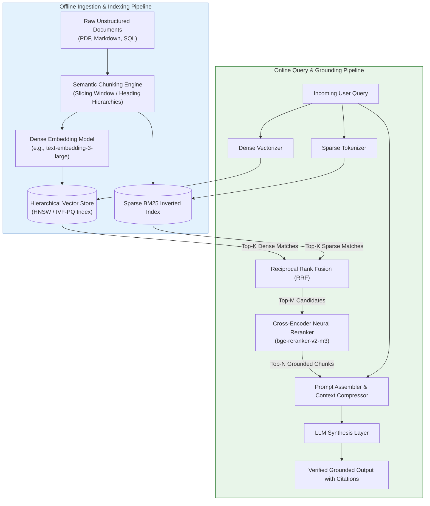
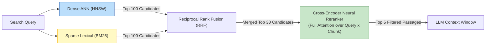
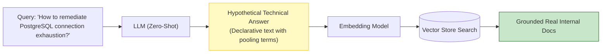
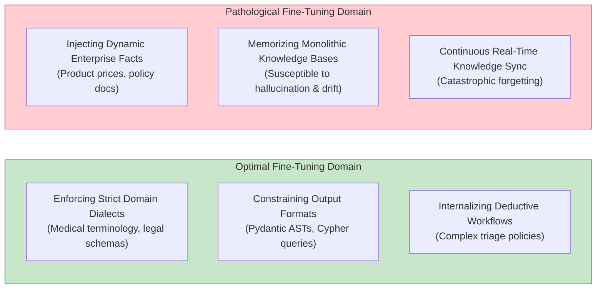
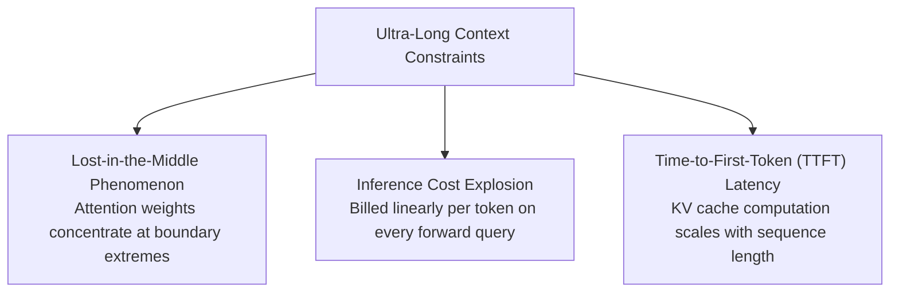
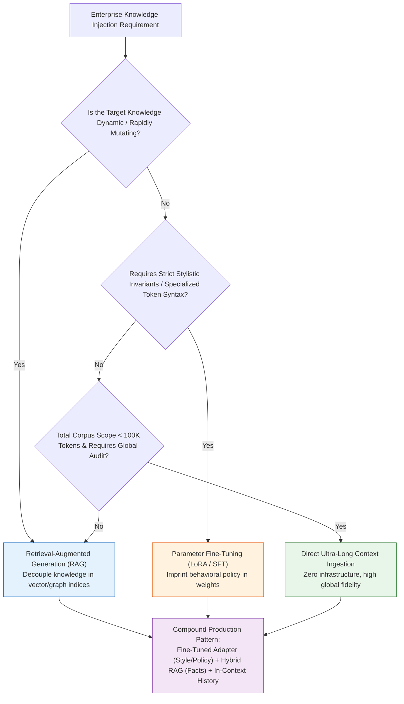
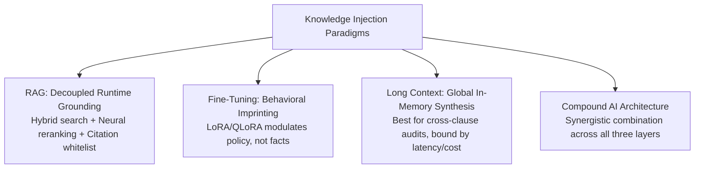

[← Previous Chapter](09-prompting.md) | [Table of Contents](../README.md) | [Next Chapter →](11-agents.md)

**中文**: [中文](../../chapters/10-knowledge.md)

# Chapter 10: Three Paths for Knowledge Injection

> "A foundation model devoid of external grounding resembles a brilliant scholar afflicted with amnesia: possessing profound deductive faculties, yet unable to recall yesterday's enterprise ledger."

Foundation models operate under three fundamental constraints: static training cutoff horizons, finite parameter memory capacities, and bounded context windows. When an enterprise application demands that a model reason over dynamic, private, or real-time proprietary data, the system must execute **knowledge injection**.

**Central Thesis: Retrieval-Augmented Generation (RAG), parameter fine-tuning, and ultra-long context windows represent three mathematically distinct paradigms for knowledge injection. Selecting the wrong path does not merely yield suboptimal performance; it anchors the system in an unsustainable engineering architectural dead end.**

---

## 10.1 The Tripartite Taxonomy of Knowledge Injection

### The Academic Examination Metaphor

To understand the operational trade-offs of these three paradigms, consider the analogy of an academic examination:

| Dimension | Retrieval-Augmented Generation (RAG) | Supervised Fine-Tuning (SFT) | Ultra-Long Context Windows |
|---|---|---|---|
| **Cognitive Analogy** | **Open-Book Examination**: Consults external technical manuals at runtime. | **Intensive Cramming**: Internalizes syntactic reflexes into neural memory over months. | **Total Working Memory**: Ingests the entire textbook directly into active working memory. |
| **Knowledge Locus** | External Vector Database / Search Index | Synaptic Model Weights ($\mathbf{W} \in \mathbb{R}^{d_1 \times d_2}$) | In-Memory Attention KV Cache |
| **Update Latency** | Instantaneous ($O(1)$ database insertion) | High (Requires compute cluster re-training) | Zero (Dynamic payload swapping) |
| **Primary Domain** | Dynamic factual retrieval, private documentation | Specialized formatting, stylistic tone, reasoning policies | Global document synthesis, multi-clause legal audits |
| **Hallucination Risk** | Bounded by retrieved grounding citations | High (Susceptible to parametric drift) | Medium (Vulnerable to attention dilution) |

```mermaid
flowchart TD
    subgraph RAG["Retrieval-Augmented Generation (Runtime Grounding)"]
        R1["User Query"] --> R2["Retriever"]
        R2 --> R3[("External Knowledge Store")]
        R3 --> R2
        R2 -->|"Top-K Passages"| R4["Inference LLM"]
        R1 --> R4
        R4 --> R5["Grounded Output + Citations"]
    end

    subgraph SFT["Fine-Tuning (Parametric Imprinting)"]
        S1["Domain Corpora"] --> S2["Backpropagation Training"]
        S2 --> S3["Modified Weights (W + ΔW)"]
        S4["User Query"] --> S3
        S3 --> S5["Stylized Output"]
    end

    subgraph LongContext["Long Context (KV Cache Ingestion)"]
        L1["Complete 1M-Token Corpus"] --> L2["Direct KV Attention Cache"]
        L3["User Query"] --> L2
        L2 --> L4["Synthesized Output"]
    end

    style RAG fill:#e3f2fd,stroke:#1565c0
    style SFT fill:#fff3e0,stroke:#e65100
    style LongContext fill:#e8f5e9,stroke:#2e7d32
```



---

## 10.2 Retrieval-Augmented Generation (RAG) Architecture and Vector Mechanics

RAG decouples knowledge storage from parametric reasoning: the foundation model functions as an inference engine, while external storage serves as the system of record.

### The Complete Production RAG Pipeline



### Embedding Mechanics: High-Dimensional Semantic Geometry

An embedding model $f_\theta: \mathcal{X} \to \mathbb{R}^d$ maps variable-length natural language sequences into a dense continuous metric space:

$$\mathbf{v} = \frac{f_\theta(\text{text})}{\|f_\theta(\text{text})\|_2}$$

Semantic similarity is evaluated via the inner product (cosine similarity over normalized unit vectors):

$$\text{sim}(\mathbf{u}, \mathbf{v}) = \cos(\theta) = \mathbf{u} \cdot \mathbf{v} = \sum_{i=1}^{d} u_i v_i$$

### Chunking Strategies: The Critical Engineering Bottleneck

Chunking partitions monolithic text into discrete retrieval units. An optimal chunk preserves atomic semantic context while remaining sufficiently narrow to prevent relevance dilution.

```python
import re
from typing import List

def semantic_markdown_chunker(
    text: str,
    max_chunk_tokens: int = 512,
    overlap_tokens: int = 64
) -> List[str]:
    """Hierarchical chunking respecting markdown heading boundaries and paragraph continuity."""
    # Partition along top-level structural markdown headers
    structural_sections = re.split(r'\n(?=#{1,3}\s)', text)
    processed_chunks: List[str] = []
    
    for section in structural_sections:
        if len(section.split()) <= max_chunk_tokens:
            processed_chunks.append(section.strip())
        else:
            # Fallback to sliding window token decomposition with overlap
            paragraphs = section.split('\n\n')
            current_buffer = ""
            for para in paragraphs:
                if len((current_buffer + para).split()) > max_chunk_tokens:
                    if current_buffer:
                        processed_chunks.append(current_buffer.strip())
                    current_buffer = para[-overlap_tokens:] + "\n\n" + para
                else:
                    current_buffer += "\n\n" + para
            if current_buffer:
                processed_chunks.append(current_buffer.strip())
                
    return processed_chunks
```

#### Chunk Sizing Trade-offs

| Strategy | Advantages | Failure Modes |
|---|---|---|
| **Micro-Chunks ($< 128$ tokens)** | High vector resolution; minimizes noise. | Shatters semantic context; coreferent pronouns lose antecedent grounding. |
| **Macro-Chunks ($> 1024$ tokens)** | Retains complete structural arguments and context. | Dilutes dense vector representations; clutters context window with irrelevant noise. |
| **Optimal Production Baseline** | **$384–512$ tokens with $10–20\%$ overlap**. | Strikes the empirical balance between semantic specificity and surrounding context. |

### Approximate Nearest Neighbor (ANN) Indexing: HNSW vs. IVF-PQ

Exact nearest neighbor search scales as $\mathcal{O}(N \cdot d)$, creating unacceptable latency across million-vector enterprise corpora. Production vector engines deploy Approximate Nearest Neighbor (ANN) index structures:

1. **Hierarchical Navigable Small World (HNSW)**:
   - Constructs a multi-layered geometric skip-graph over dense vectors.
   - Top layers execute coarse multi-hop traversal; bottom layers execute fine-grained local beam search.
   - **Characteristics**: Sub-millisecond query latency and high recall ($>98\%$), at the cost of high RAM consumption ($\sim 1.5–2\times$ raw vector memory).
2. **Inverted File with Product Quantization (IVF-PQ)**:
   - Partitions vector space via Voronoi clustering (IVF) and compresses sub-vectors into low-bit discrete byte centroids (PQ).
   - **Characteristics**: High compression ratios ($4\times–16\times$ RAM savings), suitable for billion-scale corpora, with a minor penalty to raw recall ($90–95\%$).

### Hybrid Sparse-Dense Search and Neural Reranking

Pure dense vector search struggles with **exact keyword lookups** (alphanumeric product SKUs, function identifiers, specific legal clause codes). Conversely, sparse lexical search (BM25) fails on **semantic paraphrasing**.

Production engines deploy **Hybrid Search with Reciprocal Rank Fusion (RRF)**:

$$\text{RRF\_Score}(d \in D) = \sum_{m \in \{\text{Dense}, \text{Sparse}\}} \frac{1}{k + r_m(d)}$$

where $k \approx 60$ is a smoothing constant, and $r_m(d)$ denotes the ordinal rank of document $d$ within retriever $m$.



The combined candidate pool is subsequently scored by a **Cross-Encoder Neural Reranker** (such as `BAAI/bge-reranker-large`), which evaluates all cross-attention interactions between query and candidate tokens.

---

## 10.3 Advanced Retrieval Paradigms

Beyond the standard retrieval loop, advanced production systems leverage dynamic query transformation and multi-scale chunk architectures:

### Hypothetical Document Embeddings (HyDE)

User queries are typically short, abstract questions, whereas target document chunks are declarative paragraphs. This creates a geometric mismatch in dense embedding space.

**HyDE** ([Gao et al., 2022](https://arxiv.org/abs/2212.10496)) instructs an LLM to hallucinate a plausible hypothetical answer to the query first, then embeds that synthetic document to execute dense retrieval against the vector database:



### Hierarchical Small-to-Big Retrieval (Parent Document Retriever)

To resolve the tension between small chunks (optimal for retrieval precision) and large passages (optimal for generative context), the **Parent Document Retriever** indexes fine-grained 128-token child chunks in the vector store, each maintaining a foreign key reference to a parent 1024-token document:

```python
class HierarchicalParentRetriever:
    """Index fine child chunks for vector search; resolve to parent chunks for LLM context."""
    def __init__(self, vector_client, doc_store):
        self.vector_client = vector_client
        self.doc_store = doc_store  # Key-value mapping: parent_id -> full text

    def search(self, query: str, top_k: int = 4) -> List[str]:
        # Step 1: Execute ANN search on granular 128-token child embeddings
        child_matches = self.vector_client.search(query, top_k=top_k * 3)
        
        # Step 2: Extract distinct parent chunk IDs
        unique_parent_ids = list(dict.fromkeys([m.metadata["parent_id"] for m in child_matches]))
        
        # Step 3: Fetch full parent context windows (1024 tokens each)
        return [self.doc_store.get(pid) for pid in unique_parent_ids[:top_k]]
```

### Agentic and Adaptive RAG

Rather than executing a hardcoded retrieval pass for every interaction, **Agentic RAG** empowers the model to determine whether external retrieval is warranted, formulate multi-hop search queries, and evaluate retrieval sufficiency:

```python
# Adaptive RAG Tool Loop
tools = [
    {
        "type": "function",
        "function": {
            "name": "query_enterprise_knowledge_base",
            "description": "Execute hybrid vector/lexical retrieval across internal engineering documentation.",
            "parameters": {
                "type": "object",
                "properties": {
                    "search_query": {"type": "string", "description": "Optimized declarative search query."}
                },
                "required": ["search_query"]
            }
        }
    }
]
```

## 10.4 Supervised Fine-Tuning: Modulating Behavioral Manifolds, Not Memorizing Facts

### The Core Architectural Axiom

The most widespread anti-pattern in enterprise machine learning is attempting to teach foundation models new factual knowledge via fine-tuning:

> **Fine-tuning modulates the behavioral manifold (syntax, tone, domain reasoning policies, output schemas); it is fundamentally unsuitable for parametric fact injection.**



Attempting to force an LLM to memorize exact entity relationships via gradient descent leads to catastrophic forgetting of pretraining priors and high factual hallucination rates when probed on tail distributions.

### Parameter-Efficient Fine-Tuning (PEFT): LoRA and QLoRA

Full-parameter fine-tuning ($\Delta \mathbf{W} \in \mathbb{R}^{d \times k}$) updates hundreds of billions of parameters, requiring massive multi-GPU clusters. **Low-Rank Adaptation (LoRA)** ([Hu et al., 2021](https://arxiv.org/abs/2106.09685)) constrains weight updates by factoring the delta matrix into two low-rank matrices:

$$\mathbf{W}_{\text{adapted}} = \mathbf{W}_0 + \Delta \mathbf{W} = \mathbf{W}_0 + \frac{\alpha}{r} (\mathbf{B} \cdot \mathbf{A})$$

where $\mathbf{W}_0 \in \mathbb{R}^{d \times k}$ remains frozen, $\mathbf{B} \in \mathbb{R}^{d \times r}$, $\mathbf{A} \in \mathbb{R}^{r \times k}$, and rank $r \ll \min(d, k)$ (typically $r \in \{8, 16, 32\}$).

```python
# Enterprise PEFT Implementation via Hugging Face PEFT + TRL
from transformers import AutoModelForCausalLM, AutoTokenizer
from peft import LoraConfig, get_peft_model
from trl import SFTTrainer, SFTConfig

base_model = AutoModelForCausalLM.from_pretrained(
    "meta-llama/Llama-3.1-8B-Instruct",
    torch_dtype="auto",
    device_map="auto"
)
tokenizer = AutoTokenizer.from_pretrained("meta-llama/Llama-3.1-8B-Instruct")

lora_config = LoraConfig(
    r=16,
    lora_alpha=32,
    target_modules=["q_proj", "k_proj", "v_proj", "o_proj", "gate_proj", "up_proj", "down_proj"],
    lora_dropout=0.05,
    bias="none",
    task_type="CAUSAL_LM"
)

peft_model = get_peft_model(base_model, lora_config)
peft_model.print_trainable_parameters()
# Trainable params: ~20M (0.25% of total 8B parameter footprint)
```

**QLoRA** ([Dettmers et al., 2023](https://arxiv.org/abs/2305.14314)) compresses $\mathbf{W}_0$ into 4-bit NormalFloat (NF4) with double quantization, enabling fine-tuning of 70B parameter checkpoints on a single workstation GPU without metric degradation.

---

## 10.5 Ultra-Long Context Windows: Capabilities, Economics, and Attention Mechanics

Modern foundation models routinely support context windows ranging from 128K to 2M+ tokens (Google Gemini 1.5 Pro, Claude 3.7 Sonnet).

### The Perils of In-Context Knowledge Dumping

While ingesting an entire document repository directly into the context window eliminates retrieval pipelines, it introduces three major architectural bottlenecks:



1. **Lost in the Middle**:
   Liu et al. ([2023](https://arxiv.org/abs/2307.03172)) demonstrated that attention mechanisms prioritize information located at the beginning ($x_1 \dots x_{500}$) and end ($x_{N-500} \dots x_N$) of context windows. Retrieval accuracy drops sharply when critical factual needles are situated within the central $20\%–80\%$ span of million-token prompts.
2. **Economic Asymmetry**:
   Passing 500,000 tokens on every conversational turn across thousands of concurrent users yields exponential API compute costs compared to targeted 1,000-token RAG injections.

### When Long Context is the Optimal Strategy

Long context is the superior choice when:
- **Global Synthesis is Mandatory**: Generating a unified thematic audit across an entire codebase, legal deposition, or scientific book.
- **Cross-Sectional Semantic Dependencies**: Situations where chunking would sever critical semantic coreferences and cross-clause conditions.
- **Rapid Zero-Infrastructure Prototyping**: Validating prompt efficacy before investing in indexing infrastructure.

---

## 10.6 The Enterprise Compound AI Decision Matrix

Enterprise architectures rarely rely on a single knowledge injection path. Production systems deploy a **Compound AI Architecture** combining all three paradigms:



### Production Workload Synergy

```
Enterprise Medical Assistant Architecture:
- Behavior Layer (Fine-Tuning): Imprints HIPAA compliance, clinical communication standards, and structured SOAP note formats into LoRA adapters.
- Knowledge Layer (Hybrid RAG): Dynamically retrieves real-time clinical drug interaction databases, insurance formularies, and patient medical records.
- Session Layer (Long Context): Maintains the full longitudinal conversational history and multi-visit clinical records in active working memory.
```

---

## 10.7 Mathematical Foundations of Dense Embeddings and Contrastive Learning

### Semantic Geometry: Vector Directionality over Magnitude

In dense representation space $\mathbb{R}^d$, semantic relationships are characterized by directional alignment rather than Euclidean distance. Normalized cosine similarity evaluates angular divergence independently of vector length:

$$\cos(\theta) = \frac{\mathbf{q} \cdot \mathbf{d}}{\|\mathbf{q}\|_2 \|\mathbf{d}\|_2}$$

### Contrastive Optimization: The InfoNCE Objective

Dense embedding networks are optimized via **contrastive multi-negative loss** (InfoNCE):

$$\mathcal{L}_{\text{InfoNCE}} = -\log \frac{\exp\left(\frac{\text{sim}(\mathbf{q}, \mathbf{d}^+)}{\tau}\right)}{\exp\left(\frac{\text{sim}(\mathbf{q}, \mathbf{d}^+)}{\tau}\right) + \sum_{j=1}^{K} \exp\left(\frac{\text{sim}(\mathbf{q}, \mathbf{d}_j^-)}{\tau}\right)}$$

where $\mathbf{d}^+$ denotes the ground-truth relevant passage, $\{\mathbf{d}_j^-\}_{j=1}^K$ represents in-batch hard negative distractors, and $\tau$ denotes the softmax temperature parameter. 

The optimization forces semantically related query-document pairs into high-density topological clusters while repelling dissimilar textual representations across the high-dimensional hypersphere.

---

## Chapter Summary



Core takeaways:

1. **Decouple facts from behavior**: Use RAG for dynamic enterprise knowledge; use Fine-Tuning for specialized domain dialects, policies, and schemas.
2. **Chunking dictates retrieval bounds**: Optimize chunk boundaries around structural markdown headers and semantic paragraph units ($384–512$ tokens with overlap).
3. **Deploy hybrid search with reranking**: Fuse dense ANN retrieval (HNSW) with sparse lexical search (BM25) via Reciprocal Rank Fusion, followed by a cross-encoder neural reranker.
4. **LoRA enables parameter efficiency**: Freeze foundational base weights and train rank-$r$ residual matrices $\Delta \mathbf{W} = \mathbf{B} \cdot \mathbf{A}$.
5. **Beware of long-context traps**: Account for Lost-in-the-Middle attention dilution and inference cost scaling before discarding retrieval infrastructure.

In Chapter 11, we elevate these static grounding techniques into autonomous systems: the architecture, planning loops, and tool ecosystems of AI Agents.

---

## Further Reading

- [Retrieval-Augmented Generation for Knowledge-Intensive NLP Tasks](https://arxiv.org/abs/2005.11401) — Lewis et al., Meta AI, 2020
- [Lost in the Middle: How Language Models Use Long Contexts](https://arxiv.org/abs/2307.03172) — Liu et al., Stanford University, 2023
- [Precise Zero-Shot Dense Retrieval without Relevance Labels (HyDE)](https://arxiv.org/abs/2212.10496) — Gao et al., 2022
- [LoRA: Low-Rank Adaptation of Large Language Models](https://arxiv.org/abs/2106.09685) — Hu et al., Microsoft Research, 2021
- [QLoRA: Efficient Finetuning of Quantized LLMs](https://arxiv.org/abs/2305.14314) — Dettmers et al., University of Washington, 2023
- [MTEB: Massive Text Embedding Benchmark](https://arxiv.org/abs/2210.07316) — Muennighoff et al., 2022
- [Hugging Face TRL: Transformer Reinforcement Learning](https://github.com/huggingface/trl)

[← Previous Chapter](09-prompting.md) | [Table of Contents](../README.md) | [Next Chapter →](11-agents.md)
