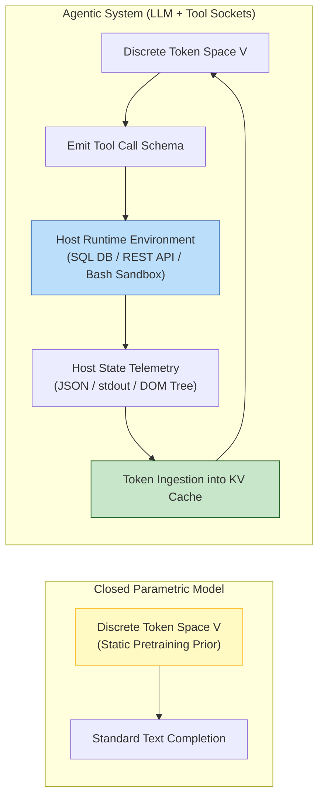
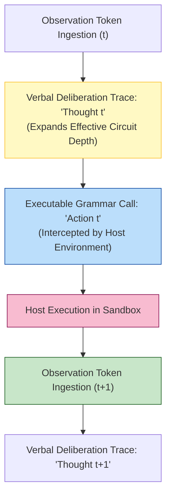
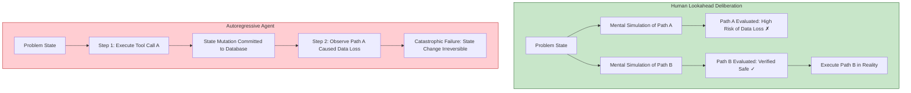
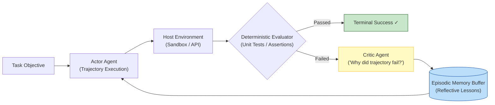
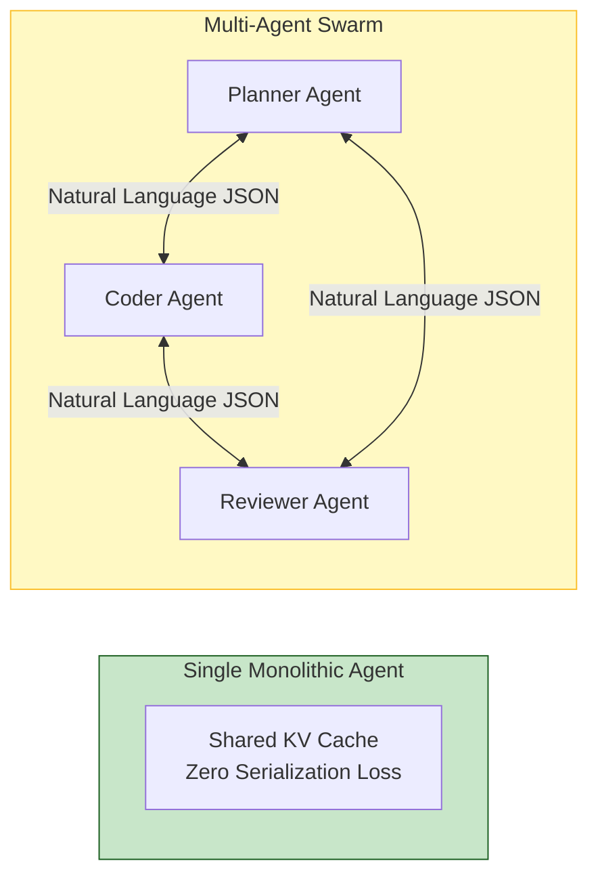
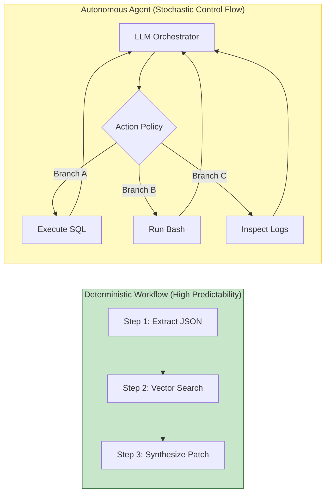
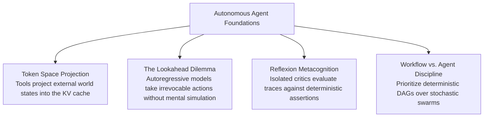

[← Previous Chapter](10-knowledge.md) | [Table of Contents](../README.md) | [Next Chapter →](12-evaluation.md)

**中文**: [中文](../../chapters/11-agents.md)

# Chapter 11: First Principles of Autonomous Agents

> "An agent is simply a while-loop bound to a tool invocation socket — an elegant reduction that is both practically true and conceptually incomplete."

"Agent" has become the most overloaded term in modern artificial intelligence. From early open-loop scripts like AutoGPT to sophisticated multi-turn protocols like Anthropic Computer Use and OpenAI Operator, virtually every autonomous pipeline claims the mantle of an agent.

Rather than debating semantic taxonomy, this chapter derives the mechanics of agents from first principles: extending the foundational insights of Chapter 9 (prompting as software programming) and Chapter 10 (grounded knowledge injection).

Core architectural principles:

1. **The essence of an agent is extending an autoregressive model's discrete token space into the non-stationary physical and digital world.**
2. **The fundamental failure mode of agents stems from autoregressive blindness: language models generate sequentially without native lookahead tree search.**
3. **Most enterprise tasks branded as 'agents' are far more reliably implemented as deterministic workflows.**
4. **The most resilient production agents are deliberately minimalist.**

---

## 11.1 Deconstructing the Agent: Extending the Token Space

### The Minimal Architecture

Stripping away framework abstractions reveals the irreducible core of an autonomous agent:

$$\text{Agent} = \text{Autoregressive Policy (LLM)} + \text{Tool Interfaces} + \text{State Feedback Loop}$$

```python
def minimal_agent_loop(task_objective: str, tool_registry: list, max_iterations: int = 10) -> str:
    """The irreducible execution loop of an autonomous agent."""
    conversation_state = [{"role": "user", "content": task_objective}]
    
    for step in range(max_iterations):
        # Step 1: Deliberate and evaluate next action
        response = llm_policy.generate(conversation_state, tools=tool_registry)
        
        # Step 2: Check terminal completion state
        if response.is_terminal_completion():
            return response.final_text
            
        # Step 3: Intercept and execute structured tool call
        execution_result = dispatch_system_tool(response.tool_call)
        
        # Step 4: Inject environmental observation back into context
        conversation_state.append(response.as_message())
        conversation_state.append({"role": "tool", "content": execution_result})
        
    return "Iteration limit exceeded without convergence."
```

Every major agent framework—LangChain, AutoGPT, CrewAI, and native Computer Use protocols—is structurally isomorphic to this execution loop, augmented with memory serialization, concurrency scaffolding, and telemetry hooks.

### Tool Invocation as State Projection

Recall the governing premise of Chapter 1: foundation models operate strictly within a discrete vocabulary token space $\mathcal{V}$.

A base language model is an epistemically closed system: its inference cannot interact with anything outside its context window. Tool calling bridges this boundary, projecting external world state $\mathcal{S}$ directly into token space:



**Tool invocation does not grant 'agency' to a neural network; it translates environmental state transitions into token sequences that condition the next forward pass.**

- A PostgreSQL query translates database tables into structured JSON tokens.
- A headless browser translates web DOM nodes into accessibility tree tokens.
- A Python interpreter translates runtime exceptions into stack trace tokens.

Understanding tool use as token projection clarifies key engineering constraints:
1. **Serialization Density**: Tool observations must be concise; verbose raw DOM or multi-megabyte log streams saturate the KV cache with high-entropy noise.
2. **Strict Schema Constraints**: Tool calls must be generated as grammar-constrained JSON rather than free text to eliminate syntax parsing failures.

---

## 11.2 The ReAct Paradigm: Interleaved Thought and Action

### Theoretical Mechanics

The foundational paradigm governing agentic execution is **ReAct** (Reasoning + Acting) ([Yao et al., 2022](https://arxiv.org/abs/2210.03629)), which mandates that an agent generate an explicit verbal deliberation trace ($\text{Thought}_t$) prior to emitting an executable payload ($\text{Action}_t$):

```
Goal: "Diagnose why microservice 'checkout-api' is experiencing 504 Gateway Timeouts in us-central-1."

Trace Sequence:
Thought: I must first query recent latency telemetry for 'checkout-api' across regions.
Action: query_metrics(service="checkout-api", metric="p99_latency", region="us-central-1")
Observation: {"p99_latency_ms": 14200, "upstream_dependency": "redis-auth"}

Thought: The latency spike is localized to us-central-1 and correlates with 'redis-auth'. I will inspect connection pool exhaustion on redis-auth.
Action: query_logs(service="redis-auth", filter="ERR_CONN_POOL_EXHAUSTED")
Observation: {"error_count": 412, "active_connections": 1000, "pool_max": 1000}

Thought: Root cause identified: redis-auth connection pool is saturated at max capacity (1000). I can now synthesize the incident remediation report.
Action: complete_investigation(summary="Redis connection pool saturation in us-central-1")
```



### Why Deliberation Traces Are Architecturally Essential

Why does forcing the generation of an explicit `Thought` token block prevent catastrophic agent failure?

Recall the computational complexity analysis from Chapter 8: **generating intermediate tokens provides virtual depth to the feedforward attention stack**. When an agent directly emits a tool payload without preceding deliberation tokens, it is forced to compress intent classification, parameter validation, and dependency resolution into a single forward pass. Emitting a verbal scratchpad allows the network to route its attention across historical observations before selecting the tool schema.

---

## 11.3 The Fundamental Architectural Dilemma: Autoregressive Blindness

### The Lookahead Planning Deficit

Human engineers rarely execute production debugging by trying arbitrary actions at random. Humans construct internal mental models, simulate the probable downstream state transitions of several competing hypotheses, prune risky branches, and execute only when confident:

$$\text{Human Action Policy} \sim \arg\max_{\pi} \mathbb{E}_{\tau \sim \pi} \left[ \sum_{t=0}^{H} \mathcal{R}(s_t, a_t) \right]$$

Conversely, an autoregressive language model chooses actions **one token at a time based strictly on historical context $\mathcal{H}_t$**:

$$\mathcal{P}(a_t \mid \mathcal{H}_t) = \prod_{i=1}^{k} \mathcal{P}(a_{t, i} \mid \mathcal{H}_t, a_{t, <i})$$

An LLM agent cannot natively perform tree search across unexecuted future actions without external algorithmic scaffolding. It 'thinks' about the next step by physically taking it in the host environment.



### The Taxonomy of Agentic Failure Modes

1. **Pathological Exploration Loops**:
   When a tool call returns an error or an empty result, the agent frequently repeats the identical invocation with trivial syntactic variations, trapped in an autoregressive deadlock.
2. **Combinatorial Inefficiency**:
   Lacking global planning, an agent will iteratively download, parse, and write 50 files sequentially via individual API calls rather than emitting a single vectorized batch command.
3. **Irreversible Blast-Radius Mutations**:
   Executing state-altering commands (e.g., `DROP TABLE`, `rm -rf`, modifying firewall routing rules) without prior lookahead verification can corrupt enterprise production systems.

---

## 11.4 Mitigating the Lookahead Blindspot: Architectural Guardrails

While autoregression cannot be redesigned at inference time, systems engineering provides four architectural compensations:

### Pattern 1: Decoupled Plan-and-Execute

Instead of allowing the agent to improvise step-by-step actions, the orchestrator forces the model to synthesize a complete structural plan before granting execution permissions:

```python
# Stage 1: Synthesize High-Level Architectural Plan
planner_prompt = f"""Task Objective: {task_objective}
Synthesize a declarative step-by-step execution plan.
For each step, define:
1. Target Tool & Exact Arguments
2. Success Assertion Criterion
3. Fallback Remediation Strategy
Do NOT execute tool calls. Output strictly JSON."""

execution_plan = planner_llm.generate(planner_prompt)

# Stage 2: Execute and Validate Linearly
for step in execution_plan.steps:
    result = execute_step_with_assertion(step)
    if not step.assertion_fn(result):
        trigger_remediation_subroutine(step.fallback)
```

By decoupling planning from execution, the plan remains a mutable text artifact in memory that can be audited, modified, or rejected before mutating environmental state.

### Pattern 2: Human-in-the-Loop (HITL) Blast-Radius Gates

High-risk tool categories must be guarded by cryptographic or interactive permission gates:

```python
CRITICAL_TOOL_INVARIANTS = {
    "purge_database_records": {"risk_tier": "HIGH", "requires_mfa": True},
    "modify_security_group": {"risk_tier": "HIGH", "requires_mfa": True},
    "fetch_telemetry_logs": {"risk_tier": "LOW", "requires_mfa": False}
}

def dispatch_system_tool(tool_invocation: ToolCall) -> str:
    metadata = CRITICAL_TOOL_INVARIANTS.get(tool_invocation.name, {"risk_tier": "HIGH"})
    
    if metadata["risk_tier"] == "HIGH":
        approval_token = request_operator_authorization(tool_invocation)
        if not approval_token.is_valid():
            return "Execution aborted: Operator denied authorization."
            
    return execute_sandboxed_driver(tool_invocation)
```

### Pattern 3: Search Space and Loop Depth Pruning

Production agents should never be provisioned with unconstrained tool registries. Tool definitions must be dynamically filtered based on workload classification:

```python
# Restrict candidate tools to a strict task-specific domain
def resolve_tool_registry(task_category: str) -> list[dict]:
    registry_map = {
        "database_triage": [query_sql, explain_plan, fetch_table_schema],
        "log_analysis": [grep_logs, fetch_trace_spans, count_error_occurrences],
        "code_patching": [read_source_file, apply_diff_patch, run_test_suite]
    }
    return registry_map.get(task_category, [fallback_read_only_tool])
```

## 11.5 Reflexion: Closed-Loop Metacognitive Optimization

### The Metacognitive Iteration Cycle

Shinn et al. ([2023](https://arxiv.org/abs/2303.11366)) formalized **Reflexion**, an architecture that equips autonomous agents with dynamic episodic memory buffers and heuristic self-evaluation:



```python
def execute_reflexive_agent(task: str, max_trials: int = 3) -> str:
    """Execute iterative task resolution with reflective memory feedback."""
    episodic_reflections: list[str] = []
    
    for trial in range(max_trials):
        # Inject accumulated heuristic lessons from previous failed trials
        trial_context = construct_reflexion_context(task, episodic_reflections)
        execution_trace = run_react_agent(trial_context)
        
        # Verify correctness using deterministic assertions
        evaluation_result = verify_task_assertions(execution_trace)
        if evaluation_result.is_successful:
            return execution_trace.final_output
            
        # Failure: Invoke isolated Critic to synthesize root-cause diagnosis
        critique_prompt = f"""Task Objective: {task}
Failed Execution Trace: {execution_trace.formatted_log}
Diagnostic Failure Reason: {evaluation_result.error_message}

Analyze the trajectory failure. Identify the exact divergence step and emit 2 concise, actionable guidelines for the next trial."""

        reflection = critic_llm.generate(critique_prompt)
        episodic_reflections.append(f"Trial {trial + 1} Lesson: {reflection}")
        
    return "Task resolution aborted: Maximum trials exceeded."
```

### The Architectural Imperative of Critic Isolation

As established in Chapter 7, asking a model to evaluate its own mistakes within the same conversational thread yields severe cognitive sycophancy: the network tends to rationalize erroneous tool parameters already committed to its KV cache.

**Production Invariant**: The Critic must operate under a **sanitized, isolated context window**—ideally instantiated on a distinct frontier model checkpoint—evaluating the Actor's trace strictly against deterministic environment assertions.

---

## 11.6 Multi-Agent Orchestration: The Hidden Economics of Coordination

The industry frequently attempts to solve agent instability by distributing responsibilities across multi-agent collectives (e.g., CrewAI, AutoGen).



While modular specialization is theoretically appealing, production deployment reveals steep hidden costs:

1. **Context Serialization Tax**:
   Every inter-agent handoff requires serializing state into natural language prompts. This translation introduces semantic loss and consumes massive token budgets.
2. **Error Contagion and Hallucination Cascades**:
   If Agent A emits a subtle factual confabulation, downstream Agent B accepts it as verified truth. The entire swarm compounds the hallucination with high statistical confidence.
3. **Attribution and Telemetry Breakdown**:
   Root-cause analysis in a swarm of five interacting agents becomes an intractable distributed debugging challenge.

> **Anthropic's Architectural Maxim**: *"Start with the simplest possible design. Optimize a single well-grounded agent before introducing multi-agent orchestration."*

---

## 11.7 Workflows vs. Autonomous Agents: The Determinism Spectrum

A critical systems distinction proposed by Anthropic ([2024](https://www.anthropic.com/research/building-effective-agents)) separates deterministic workflows from stochastic agents:

- **Workflows**: Systems where the execution path is **statically engineered as a Directed Acyclic Graph (DAG)**. Foundation models execute local reasoning within fixed steps, but cannot alter the control flow.
- **Autonomous Agents**: Systems where the **control flow is dynamic**. The model autonomously determines which subroutines to invoke, loops dynamically, and decides when to terminate.



### The Architectural Decision Matrix

| Dimension | Deterministic Workflow | Autonomous Agent |
|---|---|---|
| **Control Flow** | Hardcoded by systems engineers (DAG) | Dynamically routed by the model |
| **Execution Reliability** | High ($> 99\%$ reproducibility) | Stochastic ($70\%–90\%$ baseline convergence) |
| **Observability** | Linear trace telemetry | Multi-turn branching trajectories |
| **Optimal Domain** | ETL pipelines, standard document QA | Open-ended codebase exploration, security auditing |

**Production Rule of Thumb**: If you can draw the end-to-end task as a deterministic flowchart, build a **Workflow**. Reserve **Autonomous Agents** exclusively for open-ended problem topologies where the next action cannot be statically predicted.

---

## 11.8 Production Agent Architectural Patterns

```mermaid
flowchart TD
    Req["Incoming Workload Specification"] --> Q1{"Is Execution Flow Statically Determinable?"}

    Q1 -->|Yes| P1["Deterministic DAG Workflow<br/>(Sequential Chaining / Map-Reduce)"]
    Q1 -->|No, Finite Intent Classes| P2["Router Pattern<br/>(LLM Classifier Dispatches to Fixed Workflows)"]
    Q1 -->|No, Open Exploration| Q2{"Expected Trajectory Horizon?"}

    Q2 -->|Short (< 8 Tool Steps)| P3["ReAct Loop<br/>(Single-Agent Tool Interleaving)"]
    Q2 -->|Medium (10–30 Steps)| P4["Decoupled Plan-and-Execute<br/>(Hierarchical Planner + Execution Workers)"]
    Q2 -->|Extensive + Parallelizable| P5["Orchestrator-Workers<br/>(Dynamic Partitioning across Parallel Nodes)"]

    style P1 fill:#c8e6c9,stroke:#1b5e20
    style P2 fill:#c8e6c9,stroke:#1b5e20
    style P3 fill:#fff9c4,stroke:#fbc02d
    style P4 fill:#bbdefb,stroke:#0d47a1
    style P5 fill:#f8bbd0,stroke:#880e4f
```

### The Five Canonical Patterns

1. **Router**: Classifies user intent and routes execution to specialized downstream pipelines.
2. **ReAct Tool-Augmented LLM**: Single-turn loop interleaving thoughts and actions for localized problem solving.
3. **Plan-and-Solve**: Upfront generation of a declarative execution plan, executed linearly with assertion gates.
4. **Orchestrator-Workers**: Central coordinator partitions an open-ended objective into parallel sub-tasks dispatched to stateless worker LLMs.
5. **Reflexive Evaluator**: Integrates an adversarial Critic and environment assertions to iteratively refine draft outputs.

---

## 11.9 Enterprise Production Readiness Checklist

Deploying autonomous agents into enterprise production requires strict systems engineering controls:

### Tool Interface Design
- [ ] Tool schemas are defined via strict Pydantic JSON specifications (no unvalidated free text).
- [ ] Tool descriptions explicitly state trigger preconditions, parameter invariants, and side effects.
- [ ] Host errors return structured, actionable remediation feedback to the agent.
- [ ] High-blast-radius operations require interactive MFA confirmation tokens.

### Control Flow and Loop Safety
- [ ] Hard maximum step limit enforced ($H \le 15$).
- [ ] Duplicate action detection aborts cyclical execution loops.
- [ ] Strict per-tool and end-to-end execution timeout floors.
- [ ] Graceful terminal failure states allowing the agent to emit an explicit refusal.

### Security and Sandboxing
- [ ] Code execution occurs inside isolated, ephemeral container environments with zero host network access.
- [ ] Tool outputs are sanitized to neutralize indirect prompt injection payloads.
- [ ] Least-privilege access tokens provisioned per invocation.
- [ ] Complete immutable audit logging of every tool payload and parameter set.

---

## 11.10 The Simplicity Axiom: Why Minimalist Architectures Prevail

Complex agent architectures fail not because foundation models lack intelligence, but because **stochastic complexity compounds exponentially across multi-step execution graphs**:

$$\mathcal{P}(\text{Success}) = \prod_{t=1}^{H} \mathcal{P}(\text{Step } t \text{ Valid})$$

If an agent requires 20 autonomous steps and each individual decision maintains a 95% success rate, the end-to-end convergence probability is only $0.95^{20} \approx 35.8\%$.

By constraining tool registries, shortening execution horizons, and replacing stochastic agent loops with deterministic workflow DAGs wherever possible, systems architects achieve rock-solid production reliability.

---

## Chapter Summary



Core takeaways:

1. **Agents project reality into token space**: Tool invocation is the mechanism by which non-stationary environmental states become text tokens that condition the forward pass.
2. **ReAct enforces virtual depth**: Emitting an explicit `Thought` block prior to `Action` routing expands effective computational capacity.
3. **Autoregression lacks native lookahead**: Compensate for missing tree search via upfront Plan-and-Execute separation and Human-in-the-Loop authorization gates.
4. **Isolate the Critic in Reflexion loops**: Prevent cognitive rationalization by running self-evaluation in separate contexts against programmatic assertions.
5. **Default to deterministic workflows**: 90% of enterprise requirements are solved more reliably by hardcoded DAG workflows than by autonomous multi-agent swarms.

In Chapter 12, we address the ultimate prerequisite for enterprise deployment: how to build rigorous, automated evaluation pipelines for generative AI systems.

---

## Further Reading

- [ReAct: Synergizing Reasoning and Acting in Language Models](https://arxiv.org/abs/2210.03629) — Yao et al., Princeton & Google Research, 2022
- [Reflexion: Language Agents with Verbal Reinforcement Learning](https://arxiv.org/abs/2303.11366) — Shinn et al., Northeastern & MIT, 2023
- [Toolformer: Language Models Can Teach Themselves to Use Tools](https://arxiv.org/abs/2302.04761) — Schick et al., Meta AI, 2023
- [Building Effective Agents](https://www.anthropic.com/research/building-effective-agents) — Anthropic Engineering, 2024
- [Voyager: An Open-Ended Embodied Agent with Large Language Models](https://arxiv.org/abs/2305.16291) — Wang et al., 2023
- [Generative Agents: Interactive Simulacra of Human Behavior](https://arxiv.org/abs/2304.03442) — Park et al., Stanford University, 2023
- [AgentBench: Evaluating LLMs as Agents](https://arxiv.org/abs/2308.03688) — Liu et al., Tsinghua University, 2023

[← Previous Chapter](10-knowledge.md) | [Table of Contents](../README.md) | [Next Chapter →](12-evaluation.md)
