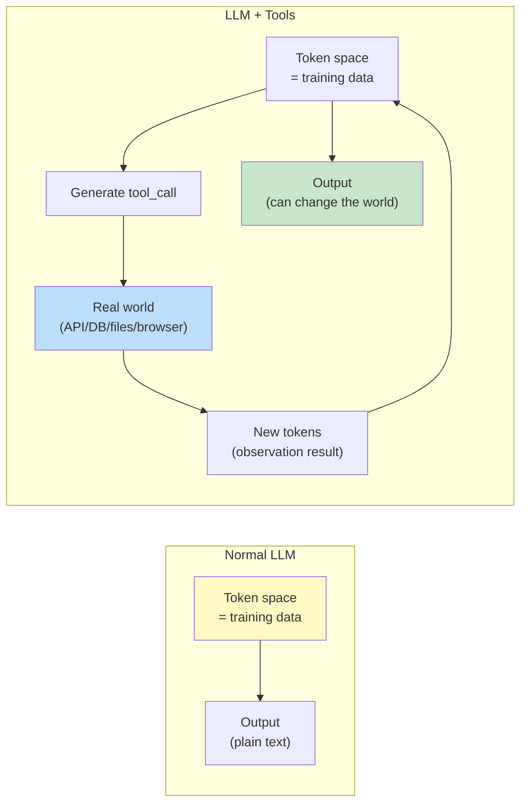
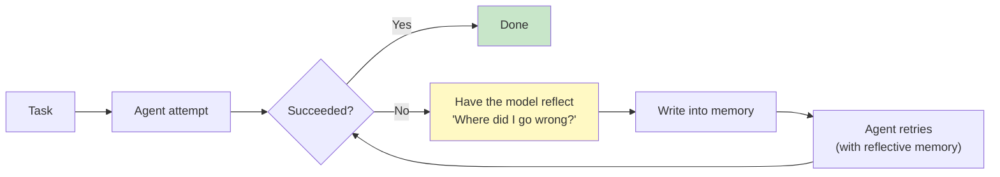
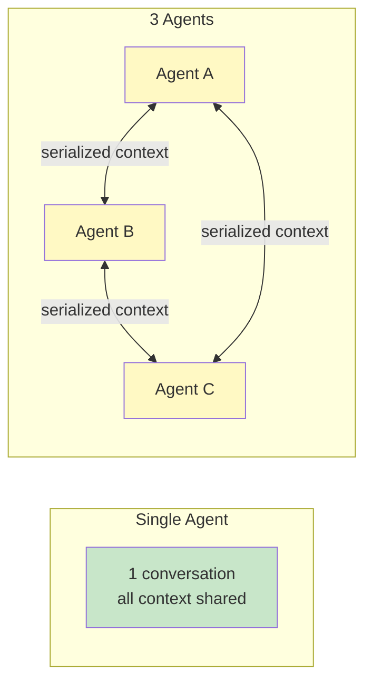
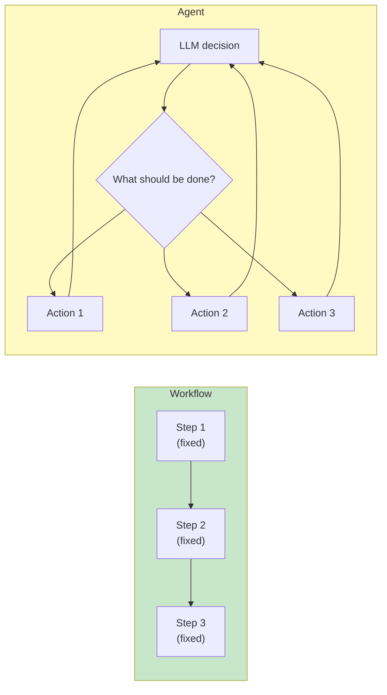
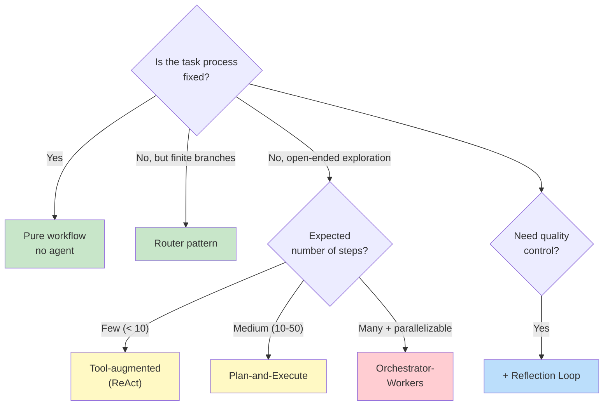

[← Previous Chapter](10-knowledge.md) | [Table of Contents](../README.md) | [Next Chapter →](12-evaluation.md)

# Chapter 11: First Principles of Agents

> "An agent is just a while loop with a tool call." - This is most of the truth in practice, but also only half of it.

"Agent" has been the most overused word of the past two years. From AutoGPT to LangChain agents, then to OpenAI's GPTs and Anthropic's Computer Use, every project calls itself an agent, but their definitions all differ.

This chapter does not argue over terminology. We will do something more useful: starting from the perspectives established in Chapters 9 and 10 - "prompting is programming" and "knowledge injection" - we will **derive** what an agent is, when it is needed, and how to design one without letting it go off the rails.

Core claims:

1. **The essence of an agent is extending the LLM's token space into the real world**
2. **The fundamental difficulty of agents is that autoregressive models lack "lookahead planning" ability**
3. **Most systems advertised as "agents" are actually solvable with a single prompt**
4. **The best agent designs are often the simplest**

After reading this chapter, you will have a clear criterion for "when to use an agent, and when not to", and you will know the most common root causes of failure in production agent systems.

---

## 11.1 What Is an Agent: Starting from Token Space

### A Minimal Definition

Leaving aside all the fancy terminology, an agent can be defined like this:

> **Agent = LLM + Tool Use + Loop**
>
> An LLM does the following in a loop: observe → think → call a tool → receive a new observation → continue.

```python
def minimal_agent(task, tools, max_steps=10):
    history = [task]
    for _ in range(max_steps):
        response = llm.generate(history, tools=tools)
        if response.is_final_answer():
            return response.text
        # Otherwise it is a tool call
        result = execute(response.tool_call)
        history.append(response)
        history.append(result)
    return "Max steps reached"
```

This is the "skeleton" of an agent. **All agent frameworks - LangChain, AutoGPT, CrewAI, Anthropic Computer Use - are essentially variants of this 7-line loop**, refined around tool sets, loop control, and error recovery.

### First-Principles View: Tool Use Extends Token Space

Recall Chapter 1: what an LLM does is "continue text in token space".

The token space of an ordinary LLM is closed - it only contains things seen in the training data. But when you give an LLM tools:



**Tool use is not "letting AI use tools" - it is turning the real world into tokens that the LLM can read and write**.

- Call a database query → the JSON returned by the database enters the token sequence
- Browse a web page → DOM text enters the token sequence
- Execute a piece of code → stdout enters the token sequence
- Send an email → "email sent" enters the token sequence

The LLM is still only continuing text in token space. But that token space has been extended by tools far beyond the scope of the training data.

Understanding this lets you explain many design choices:

- Why tool output format matters → it must become tokens the LLM can "understand"
- Why browser automation is hard → web page DOM is a huge, noisy token stream
- Why function calling is more reliable than textual conventions → structured tokens are easier to control than free text

---

## 11.2 ReAct: The Think-Act-Observe Loop

### The Classic Pattern

ReAct (Reasoning + Acting) was proposed by Yao et al. (2022) in [_ReAct: Synergizing Reasoning and Acting in Language Models_](https://arxiv.org/abs/2210.03629). It defines the standard structure of an agent loop:

```
Thought: I need to find information about X. Search first.
Action: search("X")
Observation: Search returned [...]
Thought: The results mention Y. I need to look up the exact definition of Y.
Action: search("Y")
Observation: ...
Thought: I now have enough information to answer the original question.
Action: finish("Final answer")
```

Each loop step contains:
- **Thought**: the model reasons out loud (an echo of CoT in agent scenarios)
- **Action**: call a tool
- **Observation**: the result returned by the tool

ReAct's key insight: **making the model reason explicitly before calling a tool works much better than calling tools directly**.

Why? Return to Chapter 8: CoT gives the model "scratch paper". In agent scenarios, what needs to be written on the "scratch paper" is "which tool should I use now, why, and with what parameters". Without this step, the model easily calls tools chaotically.

### Modern Implementations

Anthropic and OpenAI's function calling interfaces are essentially syntactic sugar for ReAct:

```python
# Anthropic style
response = client.messages.create(
    model="claude-opus-4-7",
    tools=[{
        "name": "search",
        "description": "Search the internet",
        "input_schema": {...}
    }],
    messages=[{"role": "user", "content": "What are the latest developments in X?"}]
)

# The model may return:
# - thinking block: <thinking>I need to search X...</thinking>  ← Thought
# - tool_use block: {"name": "search", "input": {"query": "X"}}  ← Action
#
# After executing it, feed the tool_result back in:
client.messages.create(
    model="claude-opus-4-7",
    messages=[
        ...previous,
        {"role": "user", "content": [
            {"type": "tool_result", "tool_use_id": ..., "content": "..."}  # ← Observation
        ]}
    ]
)
```

The pattern has not changed - thinking/tool_use/tool_result just use a structured schema instead of plain text.

---

## 11.3 The Fundamental Difficulty of Agents: No Lookahead Planning

### Autoregression = Taking One Step at a Time

Chapters 6 and 8 have already mentioned this problem repeatedly: autoregressive generation means the model "takes one step and then sees", without real lookahead.

In agent scenarios, this problem is **magnified**. Each step an agent takes may cost seconds to minutes (tool calls), and each step changes world state (which may not be reversible).

```mermaid
flowchart TD
    subgraph HumanPlanning["How humans act"]
        H1["See the task"] --> H2["Think through the overall process"]
        H2 --> H3["Mentally simulate<br>the possible outcome of each step"]
        H3 --> H4["Find that one path<br>will fail"]
        H4 --> H5["Switch to another path"]
        H5 --> H6["Start executing"]
    end

    subgraph Agent["LLM Agent"]
        A1["See the task"] --> A2["Step 1: do this first"]
        A2 --> A3["Execute → see result"]
        A3 --> A4["Step 2: do this next"]
        A4 --> A5["Execute → see result"]
        A5 --> A6["Step 3 reveals the path was wrong"]
        A6 --> A7["But irreversible things have already been done..."]
    end

    style HumanPlanning fill:#c8e6c9
    style Agent fill:#ffcdd2
```



An LLM agent does not have the ability to "simulate in its mind". Its way of "thinking of the next step" is to actually do it.

This leads to several typical failures:

**Failure 1: Inefficient detours**

```
Task: Convert all .csv files in /tmp/data to .json

Agent behavior:
  Thought: First see what is in /tmp/data
  Action: list_files("/tmp/data")
  Observation: [a.csv, b.csv, c.csv, ..., z.csv]  // 26 files
  Thought: Process a.csv
  Action: read_file("/tmp/data/a.csv")
  Action: write_file("/tmp/data/a.json", ...)
  Thought: Process b.csv
  Action: read_file("/tmp/data/b.csv")
  ...

(A single line of bash could actually do this)
```

**Failure 2: Getting stuck in a loop**

```
Task: Find the file that contains "secret"

Agent behavior:
  Action: search_in_file("a.txt", "secret")
  Observation: not found
  Action: search_in_file("a.txt", "secret")  // Tries the same thing again
  Observation: not found
  Action: search_in_file("a.txt", "Secret")  // Changes case and keeps circling
  ...
```

**Failure 3: Irreversible errors**

```
Task: Clean up the temporary directory

Agent behavior:
  Thought: Clean old files under /tmp
  Action: delete_files("/tmp/old_*")
  Observation: Deleted 500 files
  Thought: Wait, that pattern included the user's work files...

(Cannot be undone)
```

These are not cases of a poorly written prompt - they are **structural problems of autoregressive agents**.

---

## 11.4 Several Strategies for Mitigating the Lookahead Problem

They cannot eliminate it, but they can mitigate it.

### Strategy 1: Have the Agent Write a Plan First

```python
prompt = f"""Task: {task}

Before starting execution, please first write a complete execution plan. Include:
1. What each step will do
2. The expected result of each step
3. If a step fails, what the fallback plan is

After writing the plan, wait for my confirmation before starting execution.
"""
```

This expands the scale of "autoregressive generation" from tokens to **plan units**. When the model generates the "plan" section, it is still autoregressive, but the content being generated is a "description of the future", not actual execution - if it is wrong, it can be rewritten.

Cost: one more round of conversation; the plan itself may be inaccurate. But it is better than executing directly.

### Strategy 2: Human-in-the-Loop

Dangerous actions must require human confirmation:

```python
DANGEROUS_TOOLS = ["delete_file", "send_email", "execute_payment", "rm", "drop_table"]

def execute_with_approval(tool_call):
    if tool_call.name in DANGEROUS_TOOLS:
        approval = ask_user(f"About to execute: {tool_call}\nConfirm? (y/n)")
        if not approval:
            return "User refused execution"
    return execute(tool_call)
```

This is not a technical problem; it is a product problem. Anthropic Computer Use and Claude Code both have similar "permission prompt" mechanisms - giving users a kill switch.

### Strategy 3: Limit the Search Space

Do not give an agent too many tools, and do not give it too much freedom. **The tighter the constraints, the less likely it is to run off course**.

```python
# Bad: give 30 tools and let the model choose by itself
tools = [...30 tools...]

# Better: first decide the "tool subset" based on task type
def get_tools_for_task(task_type):
    if task_type == "data_analysis":
        return [read_csv, run_sql, plot]
    if task_type == "web_research":
        return [search, fetch_url, summarize]
    ...

tools = get_tools_for_task(classify(user_request))
```

This is actually turning the problem of "agent improvisation" **partly back into "routing + constrained agent"**. The latter is more controllable.

### Strategy 4: Limit Loop Depth and Width

```python
def safe_agent_loop(task, max_steps=10, max_same_action_repeat=3):
    history = []
    action_counts = Counter()

    for step in range(max_steps):
        response = llm.generate(history)
        if response.is_final():
            return response

        # Detect repetition
        action_key = (response.tool_call.name, response.tool_call.input)
        action_counts[action_key] += 1
        if action_counts[action_key] > max_same_action_repeat:
            return f"Repeated action detected, forced exit: {action_key}"

        result = execute(response.tool_call)
        history.append((response, result))

    return "Reached maximum number of steps"
```

Do not let the agent decide when to stop by itself - its judgment is unreliable.

---

## 11.5 Reflection: Letting the Agent Inspect Itself

### Let the Agent Self-Criticize

Shinn et al. (2023)'s [_Reflexion_](https://arxiv.org/abs/2303.11366) proposes an intuitively simple pattern:



```python
def reflexive_agent(task, max_attempts=3):
    reflections = []
    for attempt in range(max_attempts):
        history = [task] + reflections
        result = run_agent(history)

        if evaluate(result, task):  # Success
            return result

        # Failure → have the model reflect
        reflection = llm.generate(f"""
        Task: {task}
        My attempt: {result}
        I did not complete the task. Please reflect:
        - Which step did I get wrong?
        - What should I do next time?
        Please give 1-2 specific lessons.
        """)
        reflections.append(f"Lesson from last time: {reflection}")

    return "All attempts failed"
```

This pattern works because: **reviewing is easier than generating** - this is the asymmetry already discussed in Chapter 7.

### Use Carefully: Limits of Self-Review

But remember the warning from Chapter 7: the model's ability to self-review is limited. If the critic and actor are the same model in the same conversation context, the quality of reflection will drop significantly - it tends to defend its own mistakes.

More reliable approaches:

- Use a **different model** as the critic (for example, Sonnet as actor and Opus as critic)
- Or **clear the context**, so the critic cannot see the actor's "train of thought" and only sees inputs and outputs
- Or use a **deterministic verifier** (unit tests, assertions, schema checks) instead of a model critic

---

## 11.6 Multi-Agent: The Benefits and Costs of Division of Labor

### The Temptation of "Multiple Agents"

An intuitive idea: since a single agent is hard to manage, divide the work - one specialized for research, one specialized for coding, one specialized for review, collaborating with each other. CrewAI, AutoGen, and Anthropic's agent protocol are all pushing in this direction.

Theoretical benefits:
- **Focus**: each agent only does what it is good at, making prompts more focused
- **Parallelism**: independent tasks can proceed simultaneously
- **Explainability**: clear division of labor makes debugging easier

### The Costs in Reality

But in real production systems, the costs of multi-agent setups are often underestimated:

**Cost 1: Communication cost explodes**



Every agent switch requires "translating" context into a form that another agent can understand. Information is lost and error is added in the middle.

**Cost 2: Error contagion**

If Agent A's output contains a hallucination and Agent B treats it as true, the error will be amplified further. The "reasoning hallucination" from Chapter 7 becomes "collaborative hallucination" in multi-agent systems - a group of agents confidently moving forward on a false premise.

**Cost 3: Evaluation difficulty**

If a single agent makes a mistake, you can see the complete conversation. If multiple agents collaborate and make a mistake, you have to trace "whose fault it was" - perhaps A's output had a problem, perhaps B misunderstood it, perhaps the protocol itself was flawed.

**Cost 4: Cost and latency**

Every agent is an LLM call. Collaboration among 3 agents = at least 3x the calls, possibly more. If you want parallelism, engineering complexity also rises.

### Anthropic's Rule of Thumb

Anthropic's engineering article ([_Building Effective Agents_](https://www.anthropic.com/research/building-effective-agents)) summarized it this way:

> **Start with the simplest solution. Only introduce complexity when it is truly needed.**
>
> Most systems reported as "agents" actually only need:
> - A smart prompt
> - Or a "prompt + tools" loop
> - Or several prompts chained together (a workflow, not an agent)

Do not adopt a multi-agent framework just because it "sounds advanced". Build a single agent well first; only divide the work when you encounter a specific bottleneck.

---

## 11.7 Workflow vs Agent: A Commonly Confused Distinction

### The Key Difference

The same Anthropic article proposes a useful distinction:

- **Workflow**: the process is **predefined**. Which tool and which prompt to use at each step are hard-coded by engineers. The LLM only makes local decisions at each step.
- **Agent**: the process is **dynamic**. The LLM decides what to do next, which tool to use, and when to stop.



### Decision Table

| Dimension | Workflow | Agent |
|------|---------|-------|
| Control flow | Defined by engineers | Decided by the LLM |
| Predictability | High | Low |
| Debuggability | High | Low |
| Flexibility | Low | High |
| Applicable scenarios | Stable task structure | Open-ended task structure |
| Failure modes | Cannot handle edge cases | Runs off course, loops forever, takes the wrong path |

**Rule of thumb**:
- If you can **draw the task's flowchart**, use a workflow
- Use an agent only when **the process itself must change dynamically based on intermediate results**

90% of products advertised as "agents" are actually workflows - and they are more reliable precisely because they are workflows.

### An Example

Task: read a PDF uploaded by the user and answer questions about its content.

**Workflow implementation**:
```
Step 1: PDF → text
Step 2: text → chunks
Step 3: chunks → embeddings → vector database
Step 4: user question → embedding → retrieve top-k chunks
Step 5: chunks + question → LLM → answer
```

**Agent implementation**:
```
Give the LLM tools: extract_pdf_text, chunk_text, search_chunks, answer_question
Let the LLM decide the call order by itself
```

Which is better? **In almost all cases, the workflow is better** - it is fast, cheap, and predictable. An agent only has an advantage when user questions are very diverse and require different retrieval strategies.

---

## 11.8 Agent Design Patterns

Putting the previous content together, here are several effective agent design patterns:

### Pattern 1: Router

The simplest "agent" - dispatch to different workflows based on input.

```python
def router(user_input):
    classification = llm.classify(user_input, ["coding", "research", "qa"])
    if classification == "coding":
        return coding_workflow(user_input)
    elif classification == "research":
        return research_workflow(user_input)
    else:
        return qa_workflow(user_input)
```

The control flow is written by humans; the decisions are made by the LLM. Simple and reliable.

### Pattern 2: Tool-Augmented LLM (Single-Loop ReAct)

The most common true agent pattern: one LLM, a set of tools, and a loop. This is the standard usage of Anthropic Tool Use and OpenAI Function Calling.

Suitable for: open-ended task structures that require a small number of tool calls (< 10 steps).

### Pattern 3: Plan-and-Execute

Have the LLM write a complete plan first, then execute each step separately.

```python
def plan_and_execute(task):
    plan = llm.generate(f"Write a step-by-step plan for the following task: {task}")
    results = []
    for step in plan.steps:
        result = execute_step(step)
        results.append(result)
    return synthesize(results)
```

Suitable for: tasks that can be planned in advance and have little dependency between steps.

### Pattern 4: Orchestrator-Workers

An "orchestrator LLM" decides what needs to be done, and multiple "worker LLMs" execute in parallel. Results are then summarized.

Suitable for: tasks that can be parallelized (such as batch-processing multiple documents).

### Pattern 5: Reflection Loop

Actor generates → Critic reviews → Actor improves → repeat until it passes.

Suitable for: tasks with clear quality standards (code, articles).

### Selection Reference



---

## 11.9 Engineering Checklist for Production Agents

Before pushing an agent to production, go through this checklist:

### Tool Design

- [ ] Tools have clear, LLM-friendly descriptions (not docstrings written for humans)
- [ ] Tool inputs have JSON schema (not free text)
- [ ] Tool outputs are readable by the LLM (structured, not too long)
- [ ] Tool error messages suggest "how to fix it" (rather than only saying it failed)
- [ ] Dangerous tools have an independent permission layer (confirmation/approval)

### Control Flow

- [ ] There is a maximum step limit
- [ ] There is repeated action detection
- [ ] There are timeout mechanisms (per tool call + overall)
- [ ] There is a retry strategy after failure (with backoff)
- [ ] There is a "give up" mechanism (allowing the agent to gracefully say "I can't do this")

### Observability

- [ ] Every step has complete logs (thought + action + observation)
- [ ] Token usage, latency, and cost are recorded
- [ ] Errors are classified (tool error vs model error vs user error)
- [ ] There are tracing tools (such as LangSmith, Langfuse, or self-built tooling)

### Safety

- [ ] Prompt injection defense (against malicious instructions from tool outputs)
- [ ] Sensitive data is not leaked to tools (PII filtering)
- [ ] Tool permissions are minimized (do not give the agent root)
- [ ] Important actions have audit logs
- [ ] There is a kill switch

### Evaluation

- [ ] There is a representative task set (not a single demo)
- [ ] There is automated success-rate evaluation
- [ ] There are cost/latency baselines
- [ ] Regression tests can be run after prompt changes

Chapter 12 will discuss evaluation specifically.

---

## 11.10 Counterintuitive: The Best Agents Are Often the Simplest

Looking back at the claim from the beginning of this chapter: **the best agent designs are often the simplest**.

The reason complex agent systems fail is almost never that "the model is not strong enough" - it is complexity itself:

- Too many tools → the model chooses the wrong one
- Too many steps → errors accumulate
- Too many roles → communication is distorted
- Too many abstractions → debugging becomes impossible

And the reason simple agents succeed:

- Few tools + clear descriptions → the model chooses correctly
- Few steps + each step verifiable → errors can be discovered
- Single LLM + complete context → decisions stay consistent
- Clear control flow → debugging is easy

In agent design, **Occam's razor matters more than "AI thinking"**. If a workflow can solve it, do not use an agent; if a single agent can solve it, do not use multiple agents; if 5 tools are enough, do not give it 50.

---

## Summary

| Question | Answer |
|------|------|
| What is the essence of an agent? | LLM + Tools + Loop. It extends the LLM's token space into the real world |
| What is the fundamental difficulty of agents? | Autoregressive generation = taking one step at a time, without real lookahead planning |
| How can the lookahead problem be mitigated? | Explicit planning, human-in-the-loop, and limiting the tool set and loop depth |
| What is ReAct? | A Thought-Action-Observation loop that makes the model reason explicitly before calling tools |
| Is Reflection effective? | Yes, but avoid "reviewing itself" - the critic should be isolated from the actor |
| Should multi-agent be used? | Use it cautiously. Communication cost and error contagion often exceed the benefits of division of labor |
| Workflow vs Agent | Use a workflow if the process can be predefined; use an agent only when dynamic decisions are truly needed |
| Design principle | Simpler is better. Complexity is the main root cause of agent failure |

In the next chapter, we discuss a seriously underestimated part: **evaluation**. An agent without evals is essentially a demo.

---

## Further Reading

- [Yao et al., 2022: _ReAct: Synergizing Reasoning and Acting_](https://arxiv.org/abs/2210.03629) - the pioneering work behind the ReAct paradigm
- [Shinn et al., 2023: _Reflexion_](https://arxiv.org/abs/2303.11366) - reflection-based agents
- [Schick et al., 2023: _Toolformer_](https://arxiv.org/abs/2302.04761) - teaching models to use tools
- [Anthropic, 2024: _Building Effective Agents_](https://www.anthropic.com/research/building-effective-agents) - an engineering guide against overcomplication
- [Wang et al., 2023: _Voyager: An Open-Ended Embodied Agent with LLMs_](https://arxiv.org/abs/2305.16291) - exploration of long-term agents
- [Park et al., 2023: _Generative Agents_](https://arxiv.org/abs/2304.03442) - agents that simulate human behavior
- [Liu et al., 2023: _AgentBench_](https://arxiv.org/abs/2308.03688) - an agent evaluation benchmark

[← Previous Chapter](10-knowledge.md) | [Table of Contents](../README.md) | [Next Chapter →](12-evaluation.md)
