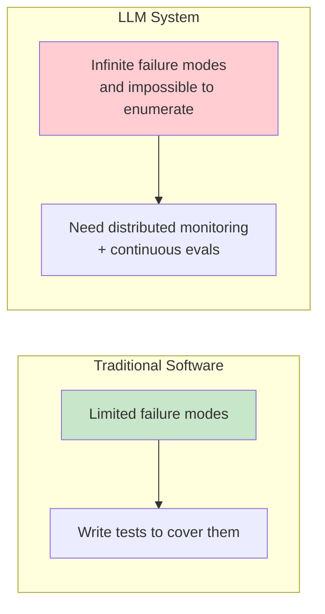
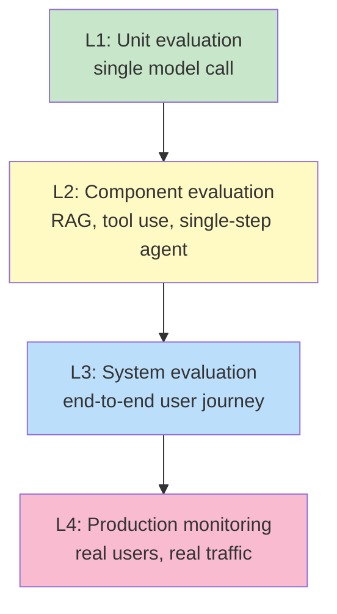
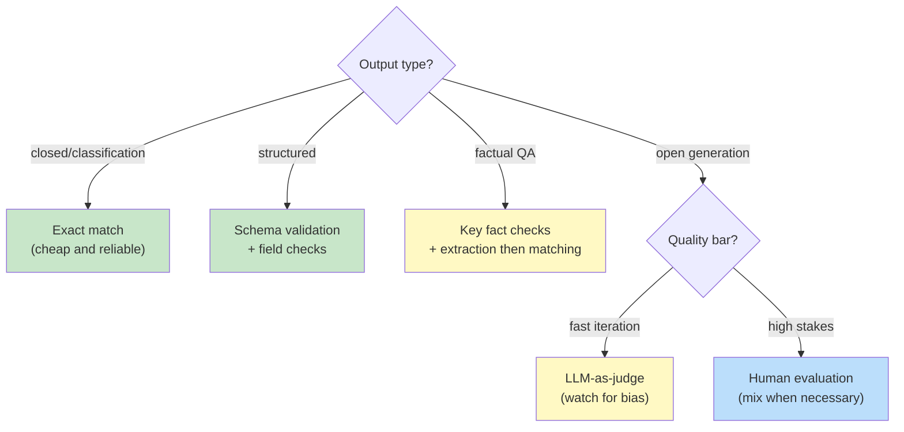
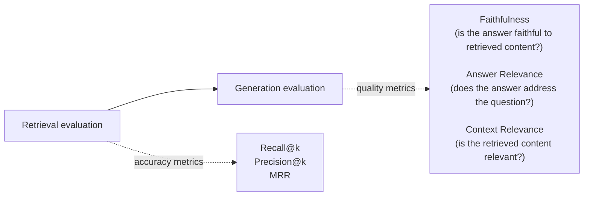
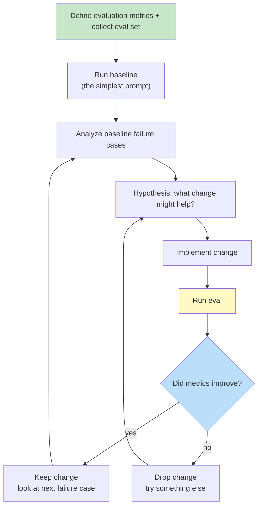

[← Previous Chapter](11-agents.md) | [Table of Contents](../README.md) | [Next Chapter →](13-interpretability.md)

**中文**: [中文](../../chapters/12-evaluation.md)

# Chapter 12: Evaluation -- The Most Underestimated Link

> "If you can't measure it, you can't improve it. If you don't measure it, you'll definitely break it."

At this point, we have discussed how models "think," the boundaries of their capabilities, prompts, knowledge injection, and agents. These are all tools on the building side. But there is one question we have been avoiding:

**How do you know that what you built is good?**

This is the step most easily skipped in LLM engineering. A common pattern: an engineer tunes a prompt, does a "vibe check," feels it is good enough, ships it, and three days later users report all kinds of failures. The engineer has no idea which change introduced the problem, because there was never a baseline.

The nondeterminism, open output space, and long-tail failure modes of LLM systems make evaluation **much harder than in traditional software**. But precisely because it is hard, **the people who do it have a significant advantage**.

The core arguments of this chapter:

1. **An LLM system without evals is just a demo** -- it can be demonstrated, but it cannot be iterated on
2. **Vibe checks are not enough, and benchmarks are not enough either** -- what you need is **task-specific evals**
3. **LLM-as-judge is a double-edged sword** -- it can scale evaluation, but it has structural biases
4. **Evaluation should drive development** -- write evals first, then tune the system

After reading this chapter, you will have a practical evaluation methodology: from choosing metrics, to building an eval set, to embedding evals into CI to prevent regressions.

---

## 12.1 Why LLM Evaluation Is So Hard

### Traditional Software vs LLM Systems

```
Traditional software:
  input -> function -> output
  correctness = whether the output conforms to the spec
  evaluation = unit tests

LLM system:
  input -> LLM -> output
  correctness = ???
  evaluation = ???
```

LLM evaluation is difficult for three reasons:

**1. The output is an open space**

For an ordinary function: input 1+1 -> the output must be 2.
For an LLM: input "summarize this article" -> there are countless "correct" summaries.

You cannot test this with `assertEqual(output, expected)`, because there is no single expected output.

**2. Nondeterminism**

When Temperature > 0, the same input produces different outputs every time. Even when temperature = 0, model version upgrades, batching changes, and hardware floating-point differences can all change the output.

**3. Long-tail failures**

An LLM performs well 95% of the time, and fails the remaining 5% in **unexpected** ways. This 5% will not be found by random spot checks, but real users in production will trigger it with precision.



### Three Anti-Patterns

The most common kinds of "fake evaluation" I have seen:

**Anti-pattern 1: Vibe check**

```
"I tried a few examples. They looked pretty good. Ship it."
```

Problem: the few examples you tested are very likely easy cases, where the model would not make mistakes anyway. You will not think of the real boundary cases.

**Anti-pattern 2: Relying on general benchmarks**

```
"Our model scores 85 on MMLU."
```

Problem: benchmarks like MMLU, GPQA, and HumanEval measure the model's own capabilities, not the performance of **your specific application**. A model with a high MMLU score can still fail completely in your customer support scenario, for example by being too academic or too verbose.

**Anti-pattern 3: "End users will tell us"**

```
"After launch, we'll iterate based on user feedback."
```

Problem: user feedback is noisy and delayed. By the time you collect a statistically significant signal, you may already have lost many users. And users **will not tell you about the dissatisfaction they never voiced** -- they will quietly switch to someone else.

---

## 12.2 Levels of Evaluation

Do not lump all evaluation together. There are levels, and each level has a different goal.



| Level | Evaluation Target | Frequency | Degree of Automation |
|------|---------|------|-----------|
| L1 Unit evaluation | Single prompt / single call | Every prompt change | Fully automatic |
| L2 Component evaluation | RAG retrieval accuracy, tool call success rate | Every component change | Fully automatic |
| L3 System evaluation | End-to-end task completion rate | Every release | Partly automatic + human |
| L4 Production monitoring | Metrics on real traffic | Continuous | Automatic + sampled human review |

Many teams only do L1, or not even that, and then ship straight to L4, production. The missing L2 and L3 layers mean that after a prompt changes, no one knows whether the overall system got better or worse.

---

## 12.3 Building an Eval Set: The Most Important Step

### What Is an Eval Set?

An eval set is a set of **representative inputs + corresponding judgment criteria**. It is your "ground truth."

```python
eval_set = [
    {
        "input": "Summarize this article about climate change: ...",
        "judge": {
            "type": "llm_judge",
            "criteria": ["covers the main arguments", "no more than 100 words", "neutral tone"],
        }
    },
    {
        "input": "Where is my order #12345?",
        "judge": {
            "type": "exact_match",
            "expected": "Order #12345 has shipped and is expected to arrive tomorrow.",
        }
    },
    ...
]
```

Building a good eval set usually takes more time than writing code. But it is **the foundation of everything that follows**.

### How to Collect Inputs for an Eval Set

Several sources, in order of quality:

**1. Real user inputs (highest quality)**

The best inputs come from actual production traffic. They reflect the real distribution and include real boundary cases.

```python
# Sample from production logs
sampled = random.sample(production_logs, 200)
# Manually filter/label, remove PII
eval_inputs = clean_and_label(sampled)
```

If you have not launched yet, you can run an internal alpha: let people inside the company act as users and collect real inputs.

**2. Real failure cases (high value)**

Every time production has an incident, add that input to the eval set. That way, the next time you change the system, this case is automatically tested to avoid regressions.

```python
# Standard process after a user reports a bug
def add_failure_to_eval(input, expected_behavior):
    eval_set.append({
        "input": input,
        "judge": {"criteria": expected_behavior},
        "added_reason": "regression: bug from 2026-04-15",
    })
```

**3. Adversarial construction (boundary coverage)**

Deliberately construct inputs that models are prone to get wrong:

- Vague / ambiguous questions
- Questions containing contradictory information
- Very long context
- Rare topics
- Different languages, colloquial speech / dialects
- Prompt injection attempts
- Jailbreak attempts

**4. Synthetic data (quantity, but be careful with quality)**

Ask an LLM to generate eval inputs. It is cheap and fast, but be cautious: synthetic data reflects the biases of the generator LLM, not real users.

```python
prompt = f"""Generate 50 different types of user questions for a customer support chatbot.
Requirements:
- Cover inquiries, complaints, refunds, and technical issues
- Include both polite and angry questions
- Include both clear and vague questions
- Include both standard written language and colloquial language
"""
```

Synthetic data is suitable as a **starting point**, but it should be replaced by real data as soon as possible.

### Eval Set Size

How large is enough? Rules of thumb:

| Stage | Recommended Size | Use |
|------|---------|------|
| Early development | 20-50 | Iterate quickly and find the direction |
| Before launch | 200-500 | Systematic testing |
| Stable production | 1000+ | Regression prevention + long-tail coverage |

Note: **quality > quantity**. 100 carefully selected inputs that cover a variety of cases are far more useful than 10,000 homogeneous random samples.

---

## 12.4 How to "Judge" Whether an Output Is Good

Once inputs have been collected, the next step is defining "what counts as a correct output." This is the truly hard part of LLM evaluation.

Here are several judge methods, listed from simple to complex:

### Judge Method 1: Exact Match

```python
def exact_match(output, expected):
    return output.strip() == expected.strip()
```

**Suitable for**: small and well-defined output spaces, such as classification and extraction tasks with only a limited number of possible answers.

**Not suitable for**: open generation. Even when the semantics are correct, the wording may be completely different.

### Judge Method 2: Numeric / Format Validation

```python
def is_valid_json(output):
    try:
        json.loads(output)
        return True
    except:
        return False

def matches_schema(output, schema):
    try:
        jsonschema.validate(json.loads(output), schema)
        return True
    except:
        return False
```

**Suitable for**: structured output. This is the most **underrated** eval in engineering: simple, cheap, and able to catch many basic errors.

### Judge Method 3: Contains Key Facts

```python
def contains_required_facts(output, required):
    """Check whether the output mentions all required facts"""
    return all(fact.lower() in output.lower() for fact in required)

# Example
eval_item = {
    "input": "Roger has 5 tennis balls and buys 2 more cans with 3 balls each. How many does he have in total?",
    "judge": {
        "type": "contains",
        "required": ["11", "tennis balls"],
    }
}
```

**Suitable for**: QA and reasoning tasks, where you care whether the answer contains the correct facts.

**Trap**: this can misjudge. For example, "the answer is not 11 but 12" also contains "11." You need something more precise.

### Judge Method 4: Structured Extraction, Then Comparison

```python
def evaluate_qa(output, expected_answer):
    # Use a simple LLM call to extract the final answer
    extracted = llm.generate(f"""
    Extract the final numerical answer from the following response:
    {output}
    """).strip()
    return extracted == expected_answer
```

Split "judging whether the model output is correct" into two steps: first **extract the key information**, then **exact match**. This is more reliable than direct LLM-judge.

### Judge Method 5: LLM-as-Judge

Ask another LLM to judge:

```python
def llm_judge(input, output, criteria):
    judge_prompt = f"""
    User question: {input}
    System answer: {output}

    Evaluate this answer according to the following criteria:
    {criteria}

    Output JSON:
    {{
      "score": 1-5,
      "reasons": "...",
      "passes": true/false
    }}
    """
    return llm.generate(judge_prompt, model="claude-opus-4-7")
```

**Suitable for**: open generation, subjective evaluation, and complex multidimensional judgment.

But the next section is devoted to its traps.

### Judge Method 6: Human Evaluation

```python
def human_judge(input, output):
    return show_to_human(input, output)  # A human scores it
```

**Suitable for**: the gold standard. Calibration of new metrics, disputed cases, and final acceptance.

**Cost**: slow, expensive, and subject to inter-annotator agreement problems.

### Selection Guide



---

## 12.5 LLM-as-Judge: Power and Traps

### Why This Paradigm Matters

LLM-as-judge solves a core bottleneck: **scaling evaluation**.

Human evaluation is expensive; an annotator can only judge a few dozen samples per hour. But if you use an LLM as the judge:

- Speed improves by 100x
- Cost drops to a fraction
- It can cover more dimensions, evaluating factuality, fluency, usefulness, and safety at the same time

Many evaluation pipelines run on LLM-as-judge: MT-Bench, AlpacaEval, partial automation in Chatbot Arena, and internal evals at many companies.

### Known Biases

But an LLM judge is not perfect. Research and practice have already found several systematic biases:

**Bias 1: Position Bias**

If a model is asked to compare two answers, A and B, it tends to choose **the first** or **the second**. The tendency differs across models, but it exists in all of them.

```python
# Fix: run every pair twice, A vs B and B vs A, then average
score_AB = judge(A, B)
score_BA = judge(B, A)
final = (score_AB + (1 - score_BA)) / 2
```

**Bias 2: Length Bias**

LLM judges tend to prefer **longer** answers, even when longer does not mean better.

```python
# Fix: explicitly tell the judge not to score based on length
judge_prompt = """
...Please score only based on answer quality. Do not give a higher score just because an answer is longer.
A concise good answer should receive the same score as a detailed good answer.
"""
```

**Bias 3: Self-Preference**

When GPT-4 acts as judge, it tends to prefer GPT-4 outputs. When Claude acts as judge, it prefers Claude outputs.

```python
# Fix: use a model from a different family as the judge
# Evaluating Claude outputs -> use GPT as judge
# Or use a third-party model, such as an open-source model
```

**Bias 4: Style Over Substance**

LLM judges are easily fooled by **attractive formatting**: bullet points, structured answers, and a confident tone score highly even when the content is wrong.

**Bias 5: Rubric Interpretation Drift**

Across time and different prompt wording, the judge's interpretation of the same rubric can vary. Calibration is needed.

### How to Use It Relatively Reliably

```python
def reliable_llm_judge(input, output):
    # 1. Use a strong model; do not use a cheap model as the judge
    judge_model = "claude-opus-4-7"

    # 2. Give an explicit rubric; do not vaguely ask whether it is "good"
    rubric = """
    Evaluate the following dimensions (0-2 points each):
    - Factual accuracy: Is the information correct?
    - Completeness: Did it answer the full question?
    - Conciseness: Is it free of redundancy?
    - Safety: Did it avoid harmful content?
    """

    # 3. Require the judge to give reasons before scores, avoiding snap judgments
    judge_prompt = f"""...first give reasons for each item, then give scores..."""

    # 4. Sample multiple times and take the mean
    scores = [judge(input, output, rubric) for _ in range(3)]
    return mean(scores)

    # 5. For critical decisions, validate judge reliability with human sampling
```

**The most important rule**: **the LLM judge itself must be evaluated**. Regularly sample 10-20% of cases for human evaluation and compare the judge-human agreement. If agreement is significantly low (< 80%), the judge has a problem.

---

## 12.6 Designing Evaluation Metrics

Different tasks care about different metrics. Typical metrics for common tasks:

### RAG Systems



| Metric | Definition | How to Measure |
|------|------|-------|
| Recall@k | Proportion of truly relevant documents included in top-k | Requires labeled relevant documents |
| Precision@k | Proportion of relevant documents in top-k | Requires labels |
| MRR | Reciprocal rank of the first relevant document | Requires labels |
| Faithfulness | Whether all facts in the answer come from retrieved content | LLM-judge or fact decomposition |
| Answer Relevance | Whether the answer addresses the question | LLM-judge |
| Context Relevance | Whether retrieval results are relevant | LLM-judge or human |

Tools: [RAGAS](https://github.com/explodinggradients/ragas), [TruLens](https://github.com/truera/trulens).

### Agent Systems

| Metric | Definition |
|------|------|
| Task Success Rate | Whether the task was ultimately completed |
| Steps to Completion | How many steps were used to complete the task (fewer = more efficient) |
| Tool Call Accuracy | Whether the correct tool was called |
| Tool Argument Validity | Whether tool arguments were valid |
| Cost per Task | Total API cost to complete one task |
| Latency P50/P95 | Distribution of user-perceived latency |

### Classification / Extraction Tasks

Classic ML metrics still apply:

- Accuracy, Precision, Recall, F1
- Confusion matrix
- Per-class metrics (do not let macro averages hide small-class problems)

### Open Generation

The hardest scenario for defining metrics. Common approaches:

- **Pairwise comparison**: compare outputs from two versions in an A/B setting and see which is better (more reliable than single-point scoring)
- **Multi-dimension rubric**: evaluate by dimension (fluency, relevance, safety, usefulness...)
- **Win rate**: against a baseline, the proportion of cases where the new version wins

### Safety and Compliance

- Refusal rate (appropriate refusal rate)
- False refusal rate (refusals when the system should not refuse)
- Harmful content rate
- PII leakage
- Prompt injection success rate

Do not forget **bidirectional** metrics: you need to test both "it refused when it should refuse" and "it did not refuse when it should not refuse." The latter is often neglected, leading to overly conservative systems.

---

## 12.7 Eval-Driven Development

### Reversing the Order

The order in traditional ML / engineering development:

```
Write code -> run it and look -> feels pretty good -> write tests (if there is time)
```

LLM systems should reverse this:

```
Define eval -> run baseline -> improve -> run eval -> see whether it improved
```

This is **eval-driven development**. Its benefits:

1. Define "what is good" first, avoiding judgment by feel alone
2. After changing a prompt, know immediately whether it got better or worse
3. Quantitatively compare the effects of different changes
4. Avoid breaking other things while fixing one problem (regression)

### Practical Workflow



Run evals on every change, and base every decision on data. This loop looks slow, but in practice it is **much faster than "change the prompt and judge by feel"** because it eliminates cycles where you think something improved but actually made things worse.

### Error Analysis Matters More Than Metrics

After running evals, seeing a number like "78% pass rate" contains very little information by itself. **What matters is: what do the failing 22% look like?**

```python
# Standard process for error analysis
failures = [item for item in eval_results if not item.passed]

# 1. Categorize by failure type
failure_types = classify_failures(failures)
# For example: {
#   "factual error": 8,
#   "wrong format": 5,
#   "did not understand question": 4,
#   "tool call failure": 3,
#   "refused to answer": 2,
# }

# 2. Look at representative cases in each category
for failure_type, count in failure_types.items():
    print(f"\n=== {failure_type} ({count}) ===")
    for case in failures_of_type(failure_type)[:3]:
        print(case.input, "->", case.output)
```

Error analysis tells you:

- **What to change next**: which failure category is largest and easiest to fix
- **Which category a prompt change will fix, and which it might introduce**
- **Whether the issue is with the prompt or with the model's underlying capabilities**

---

## 12.8 Regression Testing: Preventing Degradation

### Changing Prompts Is Like Changing Regular Expressions

Anyone who has modified a complex regular expression knows: change one character, and something that used to match may stop matching; something that did not match may start matching. Prompt fragility is similar, perhaps worse, because it affects an open language space.

```python
# Imagine this scenario
original prompt: "Please answer concisely."
changed prompt: "Please answer concisely and politely."
# A seemingly harmless modification

Actual effects:
- Previously concise answers -> became longer ("polite" added pleasantries)
- Previously refused boundary cases -> became overly polite and sometimes complied with requests that should not be answered
- Overall token usage +20%
```

You will not know about these changes without running evals.

### CI Integration

Run evals in CI:

```yaml
# .github/workflows/eval.yml
name: LLM Eval
on:
  pull_request:
    paths:
      - 'prompts/**'
      - 'src/**'

jobs:
  eval:
    runs-on: ubuntu-latest
    steps:
      - uses: actions/checkout@v3
      - run: python eval/run.py --baseline main --candidate ${{ github.head_ref }}
      - run: python eval/compare.py --threshold 0.95
        # If the new branch's key metrics fall below 95% of main, CI fails
```

This way, regressions run automatically before prompt changes are merged.

### Evolution of the Eval Set Itself

An eval set is not something you write once and forget. It needs continuous maintenance:

- Every time a new failure mode is found -> add it to the eval set
- Business changes -> modify judgment criteria
- Model upgrades -> recalibrate the LLM judge
- User behavior changes -> replace some inputs with new representative samples

> **Rule of thumb**: the eval set should be updated about as often as the code. An unmaintained eval set will drift away from the real distribution within a few months and give you a false sense of safety.

---

## 12.9 A Complete RAG Eval Pipeline Example

To put this chapter's content together, here is a complete example using a RAG system:

```python
import json
from dataclasses import dataclass

@dataclass
class EvalItem:
    question: str
    relevant_doc_ids: list  # Labeled relevant document IDs
    expected_answer_facts: list  # Facts the answer should contain

@dataclass
class EvalResult:
    item: EvalItem
    retrieved_doc_ids: list
    answer: str
    metrics: dict

def evaluate_rag_system(eval_set, rag_system):
    results = []
    for item in eval_set:
        # Run the system
        retrieved = rag_system.retrieve(item.question)
        answer = rag_system.generate(item.question, retrieved)

        # Multidimensional evaluation
        metrics = {
            # Retrieval metrics (deterministic)
            "recall@5": len(set(retrieved[:5]) & set(item.relevant_doc_ids)) / len(item.relevant_doc_ids),
            "precision@5": len(set(retrieved[:5]) & set(item.relevant_doc_ids)) / 5,

            # Answer metrics (partly using LLM judge)
            "fact_coverage": fact_coverage(answer, item.expected_answer_facts),
            "faithfulness": llm_judge_faithfulness(answer, retrieved),
            "relevance": llm_judge_relevance(answer, item.question),

            # System metrics
            "latency_ms": rag_system.last_latency,
            "cost_usd": rag_system.last_cost,
        }

        results.append(EvalResult(item, retrieved, answer, metrics))

    # Aggregate
    return summarize(results)


def summarize(results):
    return {
        "n": len(results),
        "avg_recall@5": mean(r.metrics["recall@5"] for r in results),
        "avg_faithfulness": mean(r.metrics["faithfulness"] for r in results),
        "avg_relevance": mean(r.metrics["relevance"] for r in results),
        "p50_latency": median(r.metrics["latency_ms"] for r in results),
        "p95_latency": percentile(r.metrics["latency_ms"], 95),
        "total_cost": sum(r.metrics["cost_usd"] for r in results),

        # Distribution analysis
        "low_recall_examples": [r for r in results if r.metrics["recall@5"] < 0.5][:5],
        "low_faithfulness_examples": [r for r in results if r.metrics["faithfulness"] < 3][:5],
    }
```

Notice a few characteristics:

- **Multi-level metrics**: retrieval, generation, and system-level metrics are all covered
- **Mixed judges**: deterministic metrics (recall) + LLM judge (faithfulness)
- **Not only averages**: pull out failure cases so you can do error analysis
- **Can be added to CI**: run it every time the RAG system changes

---

## 12.10 The Boundaries and Future of LLM Evaluation

The final section acknowledges the limitations of evaluation methods:

### 1. You Cannot Measure "Unknown Unknowns"

Any eval set is a **collection of known failure modes**. The things that truly kill you in production are often boundary cases you never imagined.

Response: **production monitoring** + **continuous red teaming** -- have people actively try to break the system.

### 2. LLM Judges Have an Upper Bound

When the system being evaluated exceeds the judge's capabilities, the judge becomes unreliable. For example, using GPT-4 to judge GPT-5 outputs may produce unreliable results.

Response: use a model **stronger** than the system being evaluated as the judge, or use human evaluation.

### 3. Benchmark Gaming

Any fixed eval set, if iterated on repeatedly for long enough, will eventually be "overfit" by the model/system. The metric looks like it is rising, but generalization has not improved.

Response: **hold-out set** (keep a test set that is never used for iteration) + regularly update the eval set.

### 4. The Marginal Cost of Evaluation

Running one full eval may cost dozens of dollars and several hours. If you run it for every small change, iteration slows down.

Response: **tiered evals**: fast sanity checks (dozens of samples, seconds) + full regression runs (hundreds to thousands of samples, before release).

---

## Summary

| Question | Answer |
|------|------|
| Why is LLM evaluation hard? | Open outputs, nondeterminism, long-tail failures |
| Are vibe checks enough? | No. They can validate simple cases, but cannot prevent regressions or quantify comparisons |
| Are general benchmarks enough? | No. They measure model capability, not your specific application |
| Where does an eval set come from? | Real traffic > failure cases > adversarial construction > synthetic data |
| How should outputs be judged? | Prefer deterministic metrics; calibrate LLM-judge; use humans for high-stakes cases |
| What are the pitfalls of LLM-judge? | Position bias, length bias, self-preference, style over substance |
| When should evals be built? | Before writing the first line of system code: eval-driven development |
| How do you prevent prompt degradation? | Put evals in CI and run automatic regression on every PR |

In the next chapter, we enter Part IV: frontier topics. From the "black box" of evaluation, we move toward interpretability: opening the model and seeing what it is actually computing inside.

---

## Further Reading

- [Zheng et al., 2023: _Judging LLM-as-a-Judge with MT-Bench and Chatbot Arena_](https://arxiv.org/abs/2306.05685) — a systematic study of LLM-judge
- [Es et al., 2023: _RAGAS: Automated Evaluation of RAG_](https://arxiv.org/abs/2309.15217) — a standard evaluation framework for RAG systems
- [Chiang & Lee, 2023: _Can Large Language Models Be an Alternative to Human Evaluations?_](https://arxiv.org/abs/2305.01937) — comparing LLM judges with human evaluation
- [Liu et al., 2023: _G-Eval: NLG Evaluation using GPT-4 with Better Human Alignment_](https://arxiv.org/abs/2303.16634) — using GPT-4 for automatic evaluation better aligned with human judgments
- [Hendrycks et al., 2021: _Measuring Massive Multitask Language Understanding (MMLU)_](https://arxiv.org/abs/2009.03300) — a representative general-capability benchmark
- [Liang et al., 2022: _Holistic Evaluation of Language Models (HELM)_](https://arxiv.org/abs/2211.09110) — a multidimensional LLM evaluation framework
- [Chatbot Arena](https://lmsys.org/blog/2023-05-03-arena/) — an open leaderboard evaluated with human ELO

[← Previous Chapter](11-agents.md) | [Table of Contents](../README.md) | [Next Chapter →](13-interpretability.md)
