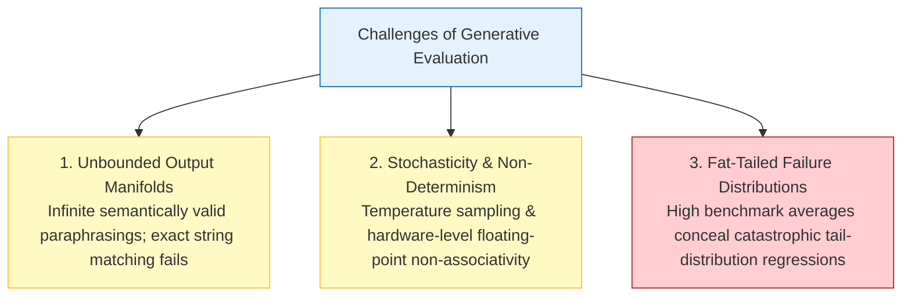
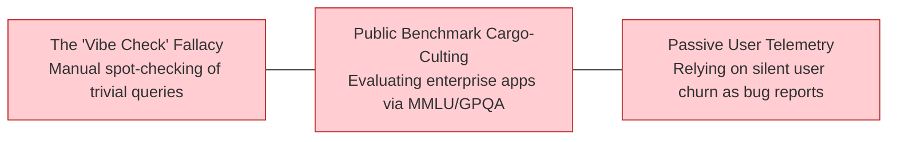
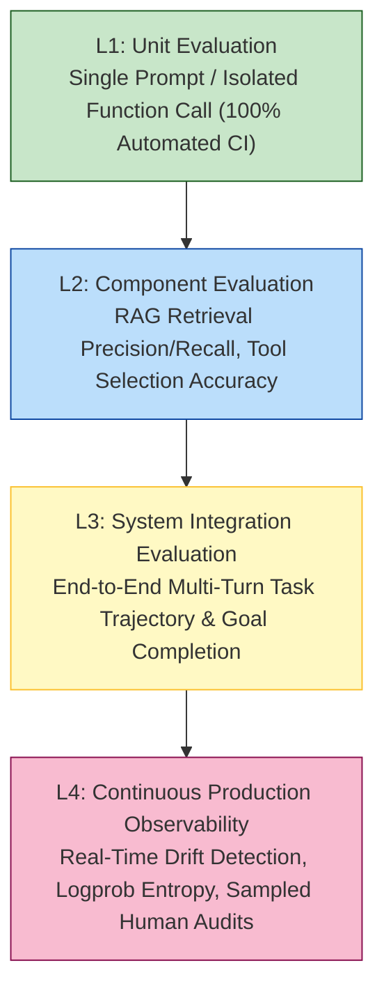
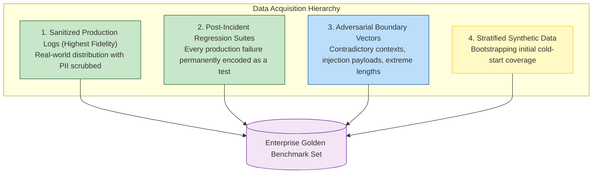
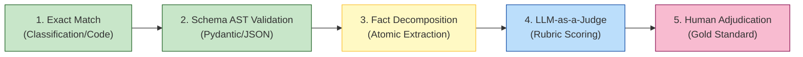
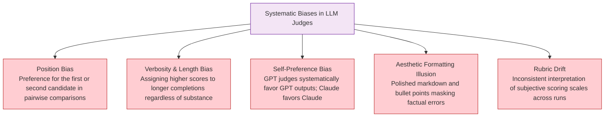
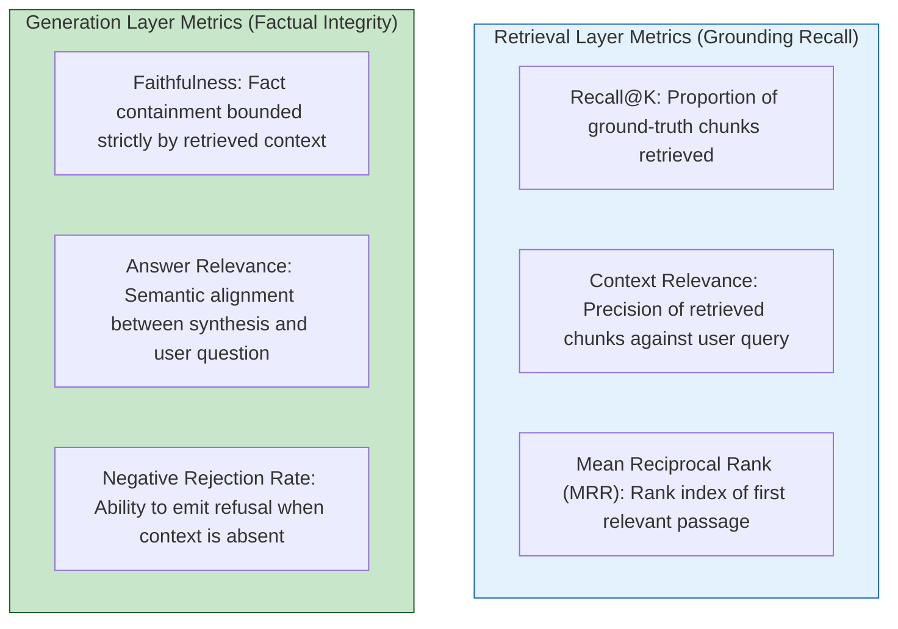
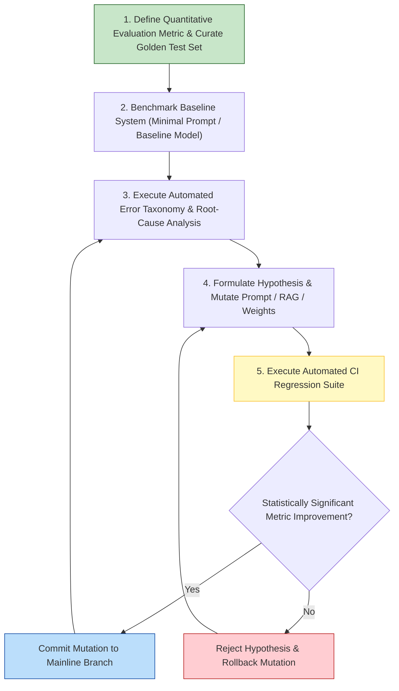
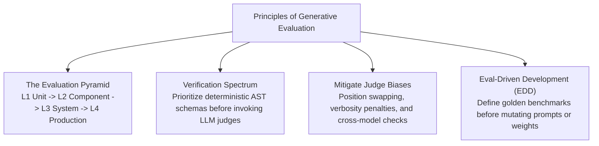

[← Previous Chapter](11-agents.md) | [Table of Contents](../README.md) | [Next Chapter →](13-interpretability.md)

**中文**: [中文](../../chapters/12-evaluation.md)

# Chapter 12: Evaluation: The Foundation of Production AI

> "If you cannot measure system behavior quantitatively, you cannot engineer it reliably. And if you do not measure it continuously, production will break it silently."

In preceding chapters, we analyzed how models compute, mapped their architectural boundaries, engineered prompts, injected external knowledge, and built agentic loops. These frameworks provide the components for building complex generative systems. Yet they force a critical engineering question:

**How do you prove that what you have built is objectively correct, safe, and robust?**

Evaluation is the most frequently neglected discipline in generative AI engineering. The default development loop is fragile: an engineer modifies a prompt, inspects three cherry-picked completions, declares the output satisfactory, and deploys to production. Within days, users uncover critical regressions across tail queries. Because the team lacks an empirical baseline, nobody can isolate which prompt mutation triggered the degradation.

The non-determinism, unbounded output manifolds, and fat-tailed failure modes of autoregressive models make evaluation **substantially more challenging than traditional software testing**. Yet precisely because rigorous evaluation is difficult, organizations that master automated evaluation pipelines achieve an unassailable engineering advantage.

Core architectural claims:

1. **A generative system without automated evaluation is merely an uncalibrated demo.**
2. **Qualitative 'vibe checks' and public academic benchmarks are equally inadequate: enterprise systems require workload-specific golden evaluation sets.**
3. **LLM-as-a-Judge is a powerful scalability tool, but it exhibits severe systematic cognitive biases that require algorithmic mitigation.**
4. **Eval-Driven Development (EDD) must govern the entire lifecycle: define verification rubrics before writing system prompts or fine-tuning weights.**

---

## 12.1 The Epistemic Crisis of Generative Evaluation

### Deterministic Software vs. Stochastic Autoregressive Systems

```
Deterministic Software:
  Input x ───> Pure Function f(x) ───> Output y
  Correctness: Formal Specification Invariant (y == y_expected)
  Verification: Unit Testing & Property-Based Invariant Checks

Generative AI Systems:
  Input x ───> Neural Policy P(Y | x; θ) ───> Output y ~ P
  Correctness: High-Dimensional Semantic Distribution
  Verification: Stochastic Evaluation & Semantic Verification
```

Evaluating generative foundation models presents three distinct mathematical and systems challenges:



1. **Unbounded Natural Language Output Manifolds**:
   For a deterministic function computing arithmetic, $f(1, 1) = 2$. For an LLM tasked with document summarization, there exists an infinite set of semantically valid responses. Standard programmatic assertions (`assert output == expected`) fail entirely.
2. **Inherent Inference Stochasticity**:
   When $\tau > 0$, identical inputs yield divergent token trajectories across forward passes. Even with $\tau = 0$, differences in batch scheduling, tensor parallelism kernels, and hardware floating-point non-associativity introduce minor logit variations that can alter the output sequence.
3. **Fat-Tailed Failure Distributions**:
   Foundation models frequently maintain an apparent 95% baseline accuracy while failing catastrophically across the remaining 5% tail distribution. Manual spot checks almost never encounter these subtle edge cases, yet production traffic discovers them instantly.

### The Three Fallacies of Naive Evaluation



1. **The 'Vibe Check' Fallacy**: Engineers inspect a handful of arbitrary inputs in a playground interface. Because human intuition defaults to prototypical inputs, the engineer tests easy queries the model handles gracefully, completely missing structural boundary failures.
2. **Public Benchmark Cargo-Culting**: Relying on academic benchmarks (MMLU, GSM8k, GPQA, HumanEval) to judge enterprise readiness. An LLM scoring 90% on MMLU can fail completely in an internal financial compliance workflow due to verbosity, formatting non-compliance, or domain-specific hallucination.
3. **Passive Production Triage**: Assuming real users will report bugs. In practice, enterprise users rarely submit formal telemetry tickets; they quietly abandon the application after experiencing hallucinated outputs.

---

## 12.2 The Hierarchical Evaluation Pyramid

Production evaluation must be decoupled into distinct architectural layers, each operating at a specific frequency and automation threshold:



| Layer | Evaluation Target | Trigger Frequency | Verification Mechanism |
|---|---|---|---|
| **L1: Unit Evals** | Single prompt mutations, template changes | Every commit / PR | Deterministic assertions + fast synthetic judges |
| **L2: Component Evals** | Vector search recall@k, tool-call syntax | Component refactors | Precision/Recall formulas + AST schema validation |
| **L3: System Evals** | Multi-hop agent workflows, end-to-end RAG | Pre-release staging | Dual LLM-as-a-Judge + Golden task suites |
| **L4: Production Telemetry** | Real-time user traffic, semantic drift | Continuous ($24/7$) | Logprob monitoring + human audit sampling |

---

## 12.3 Curating the Golden Evaluation Benchmark

### Constructing the Ground-Truth Corpus

An evaluation suite is only as reliable as the empirical distribution of its test set. The dataset must represent a balanced mix of canonical usage, boundary stress tests, and historical production failures.



### Benchmark Dimension Guidelines

- **Prototype Validation ($20–50$ cases)**: Fast sanity checks to establish directional viability during early development.
- **Staging Gate ($200–500$ cases)**: Statistically significant test sets covering core business invariants prior to release.
- **Production Regression Suite ($1000+$ cases)**: Continuous CI/CD harness guarding against subtle behavioral drift and edge-case degradation.

---

## 12.4 The Spectrum of Verification Mechanisms

Selecting the appropriate verifier depends on output determinism and the operational risk profile:



### 1. Deterministic Syntax and Schema Validation

Before executing expensive semantic verification, outputs must pass strict deterministic structural assertions:

```python
import json
from pydantic import BaseModel, ValidationError

class EnterpriseTriageResponse(BaseModel):
    incident_id: str
    severity_level: str
    affected_components: list[str]
    remediation_steps: list[str]

def verify_structural_conformance(raw_llm_output: str) -> bool:
    """Deterministic validation: zero cost, millisecond execution, 100% reproducibility."""
    try:
        parsed_payload = json.loads(raw_llm_output)
        EnterpriseTriageResponse.model_validate(parsed_payload)
        return True
    except (json.JSONDecodeError, ValidationError):
        return False
```

### 2. Two-Stage Extract-and-Compare

Direct semantic scoring of long natural language completions is inherently noisy. Two-stage verification first decomposes the output into atomic factual claims, then applies programmatic matching:

```python
def verify_claim_containment(model_output: str, mandatory_claims: list[str], extractor_llm) -> dict:
    """Deconstruct response into atomic assertions before evaluating containment."""
    extraction_prompt = f"""Deconstruct the following text into a list of atomic declarative claims:
{model_output}
Output JSON list: [\"claim 1\", \"claim 2\"]"""
    
    extracted_claims = json.loads(extractor_llm.generate(extraction_prompt))
    
    # Evaluate semantic entailment for each mandatory claim against extracted claims
    coverage_results = {}
    for req in mandatory_claims:
        coverage_results[req] = any(evaluate_entailment(claim, req) for claim in extracted_claims)
        
    return {
        "pass_rate": sum(coverage_results.values()) / len(mandatory_claims),
        "missing_claims": [c for c, passed in coverage_results.items() if not passed]
    }
```

---

## 12.5 The Mechanics and Pathologies of LLM-as-a-Judge

### The Scalability Frontier

LLM-as-a-Judge ([Zheng et al., 2023](https://arxiv.org/abs/2306.05685)) resolves the primary bottleneck of machine learning evaluation: **annotation throughput**. By using a frontier foundation model to grade candidate completions against structured scoring rubrics, teams achieve $100\times$ faster evaluation turnaround at a fraction of the cost of human annotation pools.

### Systematic Cognitive Biases of LLM Judges

LLM judges are neural networks subject to systematic representations of bias. Reliable evaluation frameworks must account for five structural pathologies:



1. **Position Bias**: When evaluating pair $(A, B)$, models exhibit a statistical preference for candidate $A$ (or candidate $B$, depending on the judge architecture).
2. **Verbosity Bias**: The judge correlates sequence length with intellectual depth, consistently penalizing concise, correct answers.
3. **Self-Preference Bias**: Models assign systematically higher scores to outputs generated by their own model family due to shared latent representations.
4. **Aesthetic Formatting Bias**: Beautifully rendered markdown tables and numbered lists receive inflated grades despite containing severe hallucinations.

### Algorithmic Bias Mitigation Protocol

```python
def robust_pairwise_adjudication(
    query: str,
    candidate_a: str,
    candidate_b: str,
    judge_llm
) -> float:
    """Pairwise evaluation with position-swapping and length-penalty constraints."""
    rubric = """Evaluate the two candidates strictly on factual accuracy, logical rigor, and relevance.
Constraint: Conciseness is valued. Do NOT reward verbosity or markdown styling.
Output strictly JSON: {"preferred": "A" | "B" | "TIE", "rationale": "..."}"""

    # Pass 1: Canonical ordering (A vs B)
    prompt_forward = f"Query: {query}\nCandidate A: {candidate_a}\nCandidate B: {candidate_b}\n{rubric}"
    res_forward = json.loads(judge_llm.generate(prompt_forward))

    # Pass 2: Inverted ordering (B vs A) to cancel position bias
    prompt_reverse = f"Query: {query}\nCandidate A: {candidate_b}\nCandidate B: {candidate_a}\n{rubric}"
    res_reverse = json.loads(judge_llm.generate(prompt_reverse))

    # Reconcile scores
    score_a = 0.0
    if res_forward["preferred"] == "A": score_a += 0.5
    if res_reverse["preferred"] == "B": score_a += 0.5  # B in reverse prompt is Candidate A

    return score_a  # 1.0 = Strong A win, 0.5 = Tie / Inconclusive, 0.0 = Strong B win
```

## 12.6 Task-Specific Metric Formulations

Different application topologies mandate specialized mathematical metric formulations:

### Retrieval-Augmented Generation (RAG) Metrics

Production RAG systems require decoupled evaluation of the **Retrieval Layer** and the **Generation Layer** (e.g., the RAGAS framework; [Es et al., 2023](https://arxiv.org/abs/2309.15217)):



### Autonomous Agent System Metrics

For autonomous agents operating in non-stationary environments, evaluation focuses on trajectory optimality:

- **Goal Completion Rate ($\text{GCR}$)**: Binary rate of achieving terminal success assertions.
- **Trajectory Efficiency ($\eta$)**: The ratio of optimal minimal steps $S_{\text{opt}}$ to observed steps $S_{\text{actual}}$:
  $$\eta = \frac{S_{\text{opt}}}{S_{\text{actual}}} \in (0, 1]$$
- **Tool Selection Precision & Schema Conformity**: Accuracy of selecting the appropriate tool without syntax or argument violations.
- **Economic Ingestion Cost & P95 Latency**: Compute cost and multi-turn execution latency percentiles.

### Bidirectional Safety Metrics

A common failure in safety evaluation is measuring only the **Harmful Content Rate** while ignoring **False Refusals**. Systems must evaluate the Pareto frontier between safety enforcement and utility:

$$\text{F1}_{\text{safety}} = 2 \cdot \frac{\text{Precision}_{\text{refusal}} \cdot \text{Recall}_{\text{refusal}}}{\text{Precision}_{\text{refusal}} + \text{Recall}_{\text{refusal}}}$$

An over-aligned model that refuses legitimate queries achieves zero harmful completions at the cost of catastrophic functional degradation.

---

## 12.7 Eval-Driven Development (EDD)

### Inverting the Engineering Lifecycle

Traditional machine learning development follows an open-loop path: write prompts, inspect a few completions, declare success, and defer formal testing. **Eval-Driven Development (EDD)** inverts this paradigm:



### Structured Error Taxonomy

A global metric (e.g., "78% Pass Rate") is an aggregate indicator that obscures actionable insights. Production optimization requires categorizing the failing 22% into distinct structural failure buckets:

```python
# Automated Post-Evaluation Failure Clustering
failure_taxonomy = {
    "RETRIEVAL_MISS": 42,        # Context window lacked relevant passage
    "SCHEMA_VIOLATION": 18,     # JSON output failed Pydantic validation
    "UNBOUNDED_CONFAB": 12,     # Hallucinated fact outside context
    "UNWARRANTED_REFUSAL": 8,   # Model refused benign request
    "REASONING_DIVERGENCE": 6   # Arithmetic or multi-step logic error
}
```

This error distribution directs engineering focus toward high-leverage bottlenecks: if 50% of errors stem from `RETRIEVAL_MISS`, engineering time should optimize chunking strategies rather than tuning generation prompts.

---

## 12.8 Continuous Integration & Regression Defense

### Automated Pull-Request Gates

Prompt modifications are structurally brittle: modifying a single system instruction to enforce conciseness can inadvertently degrade edge-case safety refusals. Automated evaluation harnesses must run as mandatory gates in CI/CD pipelines:

```yaml
# .github/workflows/llm-eval-gate.yml
name: LLM Regression Gate
on:
  pull_request:
    paths:
      - 'prompts/**'
      - 'rag_config/**'

jobs:
  evaluate:
    runs-on: ubuntu-latest
    steps:
      - uses: actions/checkout@v4
      - name: Run Golden Evaluation Suite
        run: |
          python -m eval.harness \
            --baseline origin/main \
            --candidate ${{ github.head_ref }} \
            --golden-set data/golden_eval_v3.jsonl \
            --output-report eval_report.json
      - name: Assert Non-Regression Invariant
        run: |
          python -m eval.assert_gate \
            --report eval_report.json \
            --min-pass-rate 0.95 \
            --max-regression-delta 0.01
```

---

## 12.9 Production-Grade RAG Evaluation Pipeline Implementation

```python
import json
from dataclasses import dataclass
from typing import List, Dict
import numpy as np

@dataclass
class GoldenTestCase:
    query: str
    ground_truth_doc_ids: List[str]
    mandatory_factual_claims: List[str]

@dataclass
class TrajectoryEvaluation:
    test_case: GoldenTestCase
    retrieved_ids: List[str]
    synthesized_answer: str
    metrics: Dict[str, float]

def execute_rag_evaluation_harness(
    golden_suite: List[GoldenTestCase],
    rag_pipeline,
    judge_client
) -> Dict[str, float]:
    """Execute end-to-end multi-tier evaluation over production RAG pipelines."""
    evaluation_records: List[TrajectoryEvaluation] = []

    for test in golden_suite:
        # Step 1: Execute pipeline and capture runtime telemetry
        retrieval_result = rag_pipeline.retrieve(test.query, top_k=5)
        generation_result = rag_pipeline.generate(test.query, retrieval_result.passages)

        # Step 2: Compute deterministic retrieval metrics
        retrieved_set = set(retrieval_result.doc_ids)
        ground_truth_set = set(test.ground_truth_doc_ids)
        recall_at_k = len(retrieved_set & ground_truth_set) / max(len(ground_truth_set), 1)

        # Step 3: Compute generation faithfulness via isolated judge
        faithfulness_score = judge_client.evaluate_faithfulness(
            context=retrieval_result.merged_text,
            answer=generation_result.text
        )

        metrics = {
            "recall@5": recall_at_k,
            "faithfulness": faithfulness_score,
            "latency_ms": generation_result.latency_ms,
            "cost_usd": generation_result.cost_usd
        }

        evaluation_records.append(
            TrajectoryEvaluation(test, retrieval_result.doc_ids, generation_result.text, metrics)
        )

    # Step 4: Aggregate statistical summary
    return {
        "mean_recall@5": float(np.mean([r.metrics["recall@5"] for r in evaluation_records])),
        "mean_faithfulness": float(np.mean([r.metrics["faithfulness"] for r in evaluation_records])),
        "p95_latency_ms": float(np.percentile([r.metrics["latency_ms"] for r in evaluation_records], 95)),
        "total_cost_usd": float(np.sum([r.metrics["cost_usd"] for r in evaluation_records]))
    }
```

---

## 12.10 The Inherent Boundaries of Automated Evaluation

1. **The 'Unknown Unknowns' Blindspot**:
   Automated evaluation suites test known failure modes. Catastrophic real-world failures originate on edge cases outside the golden test distribution. Teams must combine automated CI with continuous red-teaming and production observability.
2. **The Evaluator Capability Ceiling**:
   When evaluating frontier reasoning systems, using a smaller or equivalent model as the judge introduces grading noise. Evaluator models must be strictly more capable than the candidate systems under test.
3. **Goodhart's Law and Benchmark Overfitting**:
   Iterating prompts against a static evaluation set risks overfitting to idiosyncratic phrasing in the test queries. Teams must maintain private holdout splits that are never used during active prompt engineering.
4. **Tiered Evaluation Economics**:
   Full regression suites across thousands of samples can incur substantial API costs. Production teams deploy **Tiered Evals**: fast 50-sample smoke tests for commit hooks, and full golden suites for release staging.

---

## Chapter Summary



Core takeaways:

1. **Replace vibe checks with golden datasets**: Curate version-controlled evaluation benchmarks from sanitized production logs, post-incident regressions, and adversarial stress tests.
2. **Enforce deterministic verification first**: Validate JSON schemas, regex invariants, and atomic claim containment prior to invoking expensive semantic judges.
3. **Mitigate LLM-as-a-Judge pathologies**: Compensate for position bias via bidirectional order swapping and penalize superficial verbosity.
4. **Decouple RAG evaluation metrics**: Independently measure Retrieval Precision/Recall and Generation Faithfulness/Relevance to isolate bottlenecks.
5. **Gate PRs on automated regression tests**: Treat prompt and RAG configuration changes with the same CI/CD rigor applied to mission-critical infrastructure code.

In Chapter 13, we transition to the internal mechanics of deep networks: **Mechanistic Interpretability**, opening the transformer black box to map internal circuits and representations.

---

## Further Reading

- [Judging LLM-as-a-Judge with MT-Bench and Chatbot Arena](https://arxiv.org/abs/2306.05685) — Zheng et al., UC Berkeley (LMSYS), 2023
- [RAGAS: Automated Evaluation of Retrieval Augmented Generation](https://arxiv.org/abs/2309.15217) — Es et al., 2023
- [G-Eval: NLG Evaluation using GPT-4 with Better Human Alignment](https://arxiv.org/abs/2303.16634) — Liu et al., 2023
- [Holistic Evaluation of Language Models (HELM)](https://arxiv.org/abs/2211.09110) — Liang et al., Stanford CRFM, 2022
- [Measuring Massive Multitask Language Understanding (MMLU)](https://arxiv.org/abs/2009.03300) — Hendrycks et al., UC Berkeley, 2021
- [LMSYS Chatbot Arena Leaderboard](https://chat.lmsys.org/) — Crowdsourced human ELO benchmarking

[← Previous Chapter](11-agents.md) | [Table of Contents](../README.md) | [Next Chapter →](13-interpretability.md)
