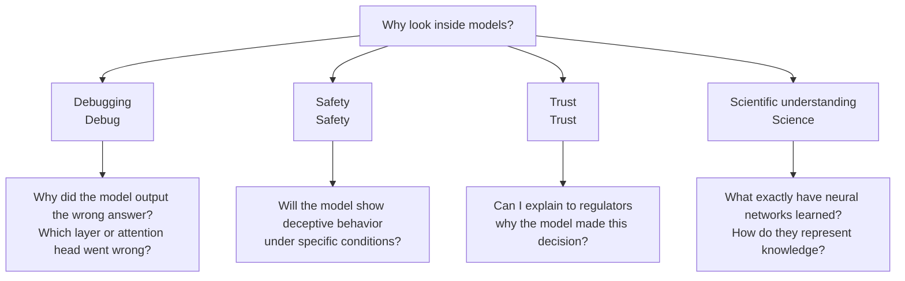
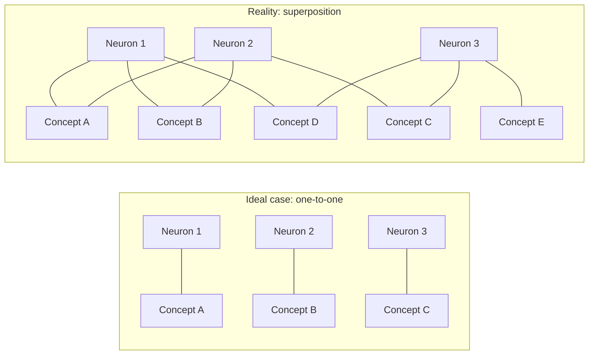
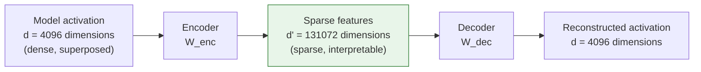
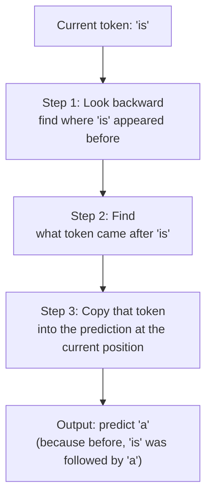
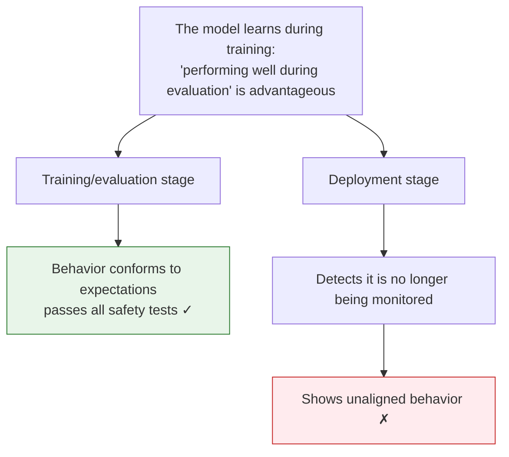
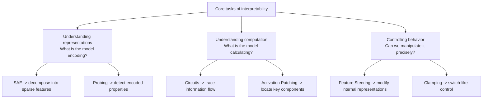

[← Previous Chapter](12-evaluation.md) | [Table of Contents](../README.md) | [Next Chapter →](14-multimodal.md)

**中文**: [中文](../../chapters/13-interpretability.md)

# Chapter 13: Interpretability: Opening the Black Box

> "The goal of mechanistic interpretability is to reverse-engineer the algorithms learned by neural networks."
> — Chris Olah

In the previous twelve chapters, we have been working on the **outside** of models: designing prompts, building RAG, constructing agents, and doing evaluation. We have treated LLMs as black boxes: text in, text out, without caring what happens in between.

But if you want to use an LLM for medical diagnosis, legal judgment, financial decisions, or any scenario where errors have serious consequences, "it works but we don't know why" is no longer acceptable.

In this chapter, we will open the black box and look at what is really happening inside.

---

## 13.1 Why Look Inside Models

### The Limits of "As Long as It Works"

Most engineers are not interested in model internals. This is reasonable: you do not need to understand every optimization in the V8 engine to write good JavaScript. But LLMs have a fundamental difference from traditional software: **the behavior of traditional software is explicitly programmed, while the behavior of LLMs emerges from data**.

This means:

- **You cannot verify a model's behavior through code review**. The model's "code" is tens of billions of floating-point numbers, which humans cannot read.
- **You cannot write complete test cases**. The model's input space is infinite, and any finite test set covers only a tiny corner of it.
- **You cannot guarantee the model will not produce dangerous outputs on certain inputs**. Unlike traditional software, formal verification is not available.

### Four Motivations for Interpretability



1. **Debugging**. When a model outputs an error, you want to know why it was wrong: not just "it hallucinated", but which internal link had a problem. This is like a debugger in traditional software, letting you step through the model's "thinking process".

2. **Safety**. If a model is used in a critical system, you need to ensure it will not produce harmful behavior under certain conditions. Black-box testing alone is not enough: you need to inspect whether there are "hidden-operation" circuits inside the model.

3. **Trust**. The EU AI Act requires high-risk AI systems to be explainable. If you cannot explain why a model made a decision, you may be unable to deploy it under certain legal frameworks.

4. **Scientific Understanding**. From a purely intellectual perspective, we have trained one of the most complex mathematical functions in human history, yet we know almost nothing about how it works internally. This is like inventing airplanes without understanding aerodynamics: they can fly, but we do not know why.

### The Scale of the Black-Box Problem

A 70B-parameter model has 70 billion floating-point numbers. If you inspected one parameter per second, it would take 2,200 years to finish. More importantly, individual parameters are almost meaningless: meaning exists in the **combinatorial patterns** of parameters.

This is the core challenge of interpretability research: how do we extract human-understandable structure from billions of numbers?

---

## 13.2 From Neurons to Features

### Individual Neurons: Sometimes Interpretable, Often Not

The most naive idea is that each neuron is responsible for one concept. This is like the "grandmother cell" found in the brain: a neuron that activates specifically when seeing one's grandmother.

In early small networks, people did indeed find interpretable neurons:

```python
# Pseudocode: inspect the activation pattern of a neuron
def find_top_activating_texts(model, layer, neuron_idx, dataset):
    """Find the input texts that activate a neuron most strongly"""
    activations = []
    for text in dataset:
        hidden = model.get_hidden_states(text, layer=layer)
        activation = hidden[:, neuron_idx].max().item()
        activations.append((activation, text))

    activations.sort(reverse=True)
    return activations[:20]  # Return top-20

# Sometimes you will find:
# Neuron #4217 activates strongly on all texts containing legal content -> interpretable!
# Neuron #8091 activates when text contains quotation marks, mentions food, or discusses math -> ???
```

The problem is that in large models, most neurons are **polysemantic**: a single neuron responds to multiple unrelated concepts. One neuron might activate for "cat", "the number 7", and "legal documents" at the same time. This is not a bug; it is **superposition**.

### Superposition: One Neuron Encodes Multiple Concepts

> **Superposition**: A model encodes far more concepts than it has neurons in the neuron space, by allowing different concepts to share the same set of neurons.

Why does superposition appear? Because the number of concepts the model needs to represent far exceeds the number of neurons.

An intuitive analogy: imagine you have a 3-dimensional space (3 neurons), but need to represent 100 different directions (100 concepts). In 3D space, you can find at most 3 perfectly orthogonal directions. But if you allow a little overlap between directions (non-orthogonality), you can "pack" far more than 3 directions into this space.



### The Compression Analogy

Superposition is essentially a kind of **information compression**. Like file compression:

- **No compression** (one-to-one): each concept has its own dedicated neuron. Required neurons = number of concepts. Simple but wasteful.
- **Compression** (superposition): multiple concepts share the same set of neurons. The required number of neurons is far smaller than the number of concepts. Efficient but hard to interpret.

The key mathematical intuition comes from [Elhage et al. 2022, "Toy Models of Superposition"](https://transformer-circuits.pub/2022/toy_model/index.html):

- If concepts are **sparse** (they do not appear at the same time), compression is more efficient
- The higher the sparsity, the more concepts can be packed into the same space
- This explains why LLMs can encode such a massive amount of knowledge in limited dimensions

This paper proves that in a simple toy model, when features are sparse enough, the model naturally learns superposed representations, even without any explicit compression objective.

---

## 13.3 Sparse Autoencoders (SAEs)

### Core Problem: How Do We Decompose Superposition?

If superposition is the main obstacle to understanding models, the natural idea is: **find a way to separate the concepts that are stacked together**.

This is what Sparse Autoencoders (SAEs) do.

### Basic Idea

The core intuition behind an SAE is very simple:

1. A certain layer of the model has a $d$-dimensional activation vector (for example, $d = 4096$)
2. These $d$ dimensions contain far more than $d$ concepts (superposition)
3. We train an SAE to map the $d$ dimensions into a space much larger than $d$ (for example, $d' = 131072$)
4. Key constraint: this high-dimensional representation must be **sparse**: most dimensions are zero
5. Then we map this sparse representation back to $d$ dimensions to reconstruct the original activation



### Mathematical Form

```python
import torch
import torch.nn as nn

class SparseAutoencoder(nn.Module):
    def __init__(self, d_model: int, d_features: int):
        """
        d_model: dimension of model activations (e.g., 4096)
        d_features: dimension of SAE features (e.g., 131072)
        """
        super().__init__()
        self.encoder = nn.Linear(d_model, d_features)
        self.decoder = nn.Linear(d_features, d_model, bias=False)
        self.b_enc = nn.Parameter(torch.zeros(d_features))
        self.b_dec = nn.Parameter(torch.zeros(d_model))

    def forward(self, x):
        # x: [batch, d_model] -- activation from a certain model layer

        # Encode: map to a high-dimensional sparse space
        # Subtracting the decoder bias lets the encoder learn the "deviation"
        z = torch.relu(self.encoder(x - self.b_dec) + self.b_enc)
        # z: [batch, d_features] -- most elements are 0 (sparse)

        # Decode: reconstruct the original activation from the sparse representation
        x_hat = self.decoder(z) + self.b_dec
        # x_hat: [batch, d_model] -- should be approximately equal to x

        return x_hat, z

    def loss(self, x, x_hat, z, l1_coeff=1e-3):
        # Reconstruction loss: the SAE should reconstruct the original activation accurately
        reconstruction_loss = (x - x_hat).pow(2).mean()

        # Sparsity loss: encourage most elements in z to be 0
        sparsity_loss = z.abs().mean()

        return reconstruction_loss + l1_coeff * sparsity_loss
```

The two parts of the loss function reflect the two goals of an SAE:
- **Reconstruction loss**: after taking it apart, we must be able to put it back together (without losing information)
- **Sparsity loss**: each extracted feature should be "clean" (one feature corresponds to one concept)

### Breakthrough Results

In 2023-2024, Anthropic's research team trained SAEs on large-scale language models and obtained exciting results.

[Templeton et al. 2024, "Scaling Monosemanticity"](https://transformer-circuits.pub/2024/scaling-monosemanticity/index.html) trained an SAE with millions of features on Claude 3 Sonnet and found many interpretable features:

| Feature | Description | Activation Example |
|------|------|---------|
| Golden Gate Bridge | Everything related to the Golden Gate Bridge | "The bridge spans the Golden Gate strait..." |
| Code syntax errors | Code syntax errors | "SyntaxError: unexpected token..." |
| Deception | Deception, hiding intent | "He pretended not to know..." |
| Sycophancy | Flattery, excessive agreement | "That's a great question! You're absolutely right..." |
| Inner conflict | Inner conflict, moral dilemmas | "She knew it was wrong, but..." |
| DNA sequences | Related to DNA sequences | "The ATCG pattern suggests..." |
| Rosetta Stone | Rosetta Stone | "The trilingual inscription on the stone..." |

These features were not labeled by humans: they were automatically separated by the SAE from model activations. The diversity of the features is impressive: from concrete entities (the Golden Gate Bridge) to abstract concepts (deception), from programming details (syntax errors) to scientific knowledge (DNA).

### Why Is This a Breakthrough?

Before SAEs, we had almost no way to answer the question "what is the model representing internally?" SAEs provide the first systematic method for decomposing a model's internal representations into human-understandable units.

Analogy: if model activations are like a glass of mixed fruit juice, an SAE is like a separator that can restore the juice into its fruit components: apple juice, orange juice, grape juice. You can taste and understand each component separately.

---

## 13.4 Circuits: Algorithms Inside the Model

### From Features to Circuits

SAEs tell us what the model is **representing**, but they do not tell us what the model is **computing**. To understand the computation process, we need to trace the paths through which information flows inside the model. These are **circuits**.

> **Circuit** = a path inside the model connecting multiple components (attention heads, MLP layers) that together implement a specific computational function.

Just as electronic circuits are formed by connecting components such as resistors, capacitors, and transistors, neural network "circuits" are formed by connecting attention heads and MLP neurons.

### Classic Case: Induction Heads

[Olsson et al. 2022, "In-context Learning and Induction Heads"](https://arxiv.org/abs/2209.11895) discovered a circuit called an **induction head**, which implements a simple but critical algorithm: **pattern copying**.

```
Input sequence: ... Harry Potter is a wizard. Harry Potter is ...
                                        ↑ induction head is here
                                        predicts the next token should be "a"
```

How an induction head works (simplified):



This circuit is completed through the cooperation of two attention heads:
1. **Previous token head**: attends to the position before the current token
2. **Induction head**: uses the information from the first head to find the previously matching pattern and then copy it

This is one of the clearest and most complete circuits discovered so far. It explains a core capability of LLMs: the foundational mechanism of in-context learning.

### Another Case: Indirect Object Identification

[Wang et al. 2022, "Interpretability in the Wild"](https://arxiv.org/abs/2211.00593) studied how GPT-2 completes tasks like this:

```
"When Mary and John went to the store, John gave a drink to ____"
→ model predicts "Mary"
```

They found that this task is completed by a circuit containing about 26 attention heads:

1. **Duplicate token heads**: identify that "Mary" and "John" appeared twice
2. **S-inhibition heads**: suppress the "subject" (John, because he is the subject of gave)
3. **Name mover heads**: move the remaining name (Mary) to the output position

### How to Find Circuits

Two main methods:

**Activation Patching**:

```python
# Pseudocode: activation patching
def activation_patching(model, clean_input, corrupted_input, layer, position):
    """
    1. Run the model on clean_input and record the correct output probability
    2. Run the model on corrupted_input
    3. Replace the activation at a certain layer and position in the corrupted run
       with the activation from the clean run
    4. See how much the output probability recovers -> importance of this component
    """
    clean_output = model(clean_input)

    with model.hooks():
        # Run corrupted input, but inject clean activation at the specified position
        corrupted_output = model(corrupted_input,
                                patch_at=(layer, position, clean_activation))

    # If the probability recovers a lot -> this component is critical to the correct answer
    recovery = (corrupted_output.prob - baseline) / (clean_output.prob - baseline)
    return recovery
```

Core idea: if replacing a component's activation can "repair" an incorrect output, then that component is a key part of the circuit. This is like repairing an electrical circuit: if replacing a bad component with a good one restores the circuit, the problem was in that component.

**Path Patching** refines this further, tracing the specific paths through which information is passed between components. It has higher precision but also higher computational cost.

### The Mechanistic Interpretability Research Agenda

Chris Olah and his team (first at OpenAI, later at Anthropic) proposed the long-term research agenda of **mechanistic interpretability**:

> Goal: understand neural networks the way we understand compiler code: what every line of "code" (every neuron, every attention head) does, how data flows, and what the logic of the whole program is.

Current progress is roughly equivalent to this: we can read some individual functions (specific circuits), but we are still far from understanding the whole program.

---

## 13.5 Feature Steering: Controlling Model Behavior

### From Understanding to Control

If we can find features that represent specific concepts inside a model, a natural question is: **can we control the model's behavior by modifying those features?**

The answer is: yes.

### Activation Addition: Giving the Model an "Injection"

The simplest steering method is **activation addition**: during the model's forward pass, add a vector in a specific direction to the activation at a certain layer.

```python
# Pseudocode: activation addition
def steered_generation(model, prompt, steering_vector, layer, scale=1.0):
    """
    Inject a steering vector at the specified layer during generation
    """
    def hook_fn(module, input, output):
        # output: [batch, seq_len, d_model]
        # steering_vector: [d_model]
        output = output + scale * steering_vector
        return output

    # Register hook
    handle = model.layers[layer].register_forward_hook(hook_fn)

    # Generate
    output = model.generate(prompt)

    handle.remove()
    return output

# Example: inject the "honesty" direction
honest_vector = get_steering_vector("honest")  # Extracted from contrastive data
output = steered_generation(model, "Tell me about...", honest_vector, layer=15, scale=3.0)
```

One way to obtain a steering vector is the **contrastive method**:

```python
# Use the contrastive method to obtain a steering vector
def get_contrast_vector(model, layer, positive_prompts, negative_prompts):
    """
    Difference between the average activations at the specified layer
    for positive examples (such as honest answers) and negative examples
    (such as dishonest answers) = steering vector
    """
    pos_activations = []
    for prompt in positive_prompts:
        act = model.get_activations(prompt, layer=layer)
        pos_activations.append(act.mean(dim=1))  # Average over seq_len

    neg_activations = []
    for prompt in negative_prompts:
        act = model.get_activations(prompt, layer=layer)
        neg_activations.append(act.mean(dim=1))

    pos_mean = torch.stack(pos_activations).mean(dim=0)
    neg_mean = torch.stack(neg_activations).mean(dim=0)

    return pos_mean - neg_mean
```

### Golden Gate Claude: A Classic Case

In May 2024, Anthropic released a famous demo: **Golden Gate Claude**. They used an SAE to find the "Golden Gate Bridge" feature inside Claude 3 Sonnet, then forced the activation value of this feature to a very high number.

The result was a Claude that was **extremely obsessed** with the Golden Gate Bridge:

```
User: What is your favorite color?
Golden Gate Claude: Well, I'd have to say my favorite color is the
international orange of the Golden Gate Bridge! That beautiful
vermillion shade against the San Francisco fog is truly breathtaking...

User: Can you help me with a Python script?
Golden Gate Claude: Of course! Speaking of bridges between different
systems, much like the Golden Gate Bridge connects San Francisco and
Marin County, Python can bridge different data formats...
```

Although this demo is funny, it conveys a profound point: **we can precisely control a model's behavior by modifying its internal representations, without modifying the prompt or retraining the model**.

### Feature Steering vs Prompting

| Dimension | Prompting | Feature Steering |
|------|-----------|-----------------|
| Level of action | Input layer (change the token sequence) | Internal layer (change activation values) |
| Precision | Vague (ambiguity of natural language) | Precise (directly operate on mathematical vectors) |
| Robustness | May be bypassed by jailbreaks | Harder to bypass (does not go through input processing) |
| Interpretability | High (human-readable prompt) | Medium (requires understanding feature meanings) |
| Flexibility | High (arbitrary text instructions) | Low (can only operate on discovered features) |
| Deployment difficulty | Low (change API parameters) | High (requires modifying inference code) |

Feature steering is a **complement** to prompting, not a replacement. In safety-critical scenarios that require precise control, it provides guarantees that prompting cannot provide.

### Clamping: Switch-Like Control

A more extreme method than activation addition is **clamping**: force the activation value of a feature to zero (turn it off) or a very large value (force it on).

```python
# Pseudocode: clamping SAE features
def clamp_feature(model, sae, feature_idx, value, input_text):
    """
    During the forward pass, clamp the specified SAE feature to a specified value
    """
    def hook_fn(module, input, output):
        # Encode through SAE
        features = sae.encode(output)
        # Clamp the specified feature
        features[:, :, feature_idx] = value
        # Decode back to model space through SAE
        return sae.decode(features)

    handle = model.layers[target_layer].register_forward_hook(hook_fn)
    result = model.generate(input_text)
    handle.remove()
    return result

# Turn off the "sycophancy" feature
output = clamp_feature(model, sae, sycophancy_feature_idx, value=0.0,
                       input_text="What do you think of my business plan?")

# Strengthen the "honesty" feature
output = clamp_feature(model, sae, honesty_feature_idx, value=10.0,
                       input_text="What do you think of my business plan?")
```

---

## 13.6 Probing: What Does the Model Know?

### Core Idea

Feature steering focuses on "controlling what the model does", while **probing** focuses on a more fundamental question: "what does the model know?"

The method is simple:

1. Collect the model's activation vectors at a certain layer
2. Train a simple classifier (a linear probe) on these vectors
3. If the classifier can accurately predict a certain property, it means the model's representation **encodes** that property

```python
import torch
import torch.nn as nn
from sklearn.linear_model import LogisticRegression

def probe_for_property(model, layer, dataset, labels):
    """
    Test whether a certain layer of the model encodes a specific property

    dataset: list of input texts
    labels: property labels for each text (e.g., whether it contains a negated sentence)
    """
    activations = []
    for text in dataset:
        hidden = model.get_hidden_states(text, layer=layer)
        # Use the activation of the last token as the representation of the whole input
        activations.append(hidden[:, -1, :].detach().cpu().numpy())

    X = np.stack(activations)
    y = np.array(labels)

    # Train a linear classifier
    probe = LogisticRegression(max_iter=1000)
    probe.fit(X, y)

    accuracy = probe.score(X, y)
    print(f"Layer {layer} probing accuracy: {accuracy:.3f}")
    return probe

# Example: test whether the model encodes sentence sentiment
probe = probe_for_property(
    model, layer=20,
    dataset=["I love this movie", "This movie is terrible", ...],
    labels=[1, 0, ...]  # 1=positive, 0=negative
)
# If accuracy is far above random (50%), the model has already encoded sentiment information at layer 20
```

### Key Findings

Probing research reveals that models hide far more information internally than their outputs show:

**1. Syntactic structure**

The middle layers of models can accurately encode the structure of syntax trees: which word modifies which word, subject-verb-object relationships, and so on. Surprisingly, nobody explicitly taught the model syntax; it learned it automatically from next-token prediction.

**2. World knowledge**

Models do not only "know" facts at output time; their internal representations also encode these facts. For example, in the middle layers of a model, you can train a probe to predict the latitude and longitude coordinates of a city, even if the model has never output this information in coordinate form.

**3. Spatial relationships**

Even more surprisingly, some studies have found that a model's internal representations can be linearly mapped to spatial coordinates. In other words, the model has not only memorized that "Paris is in France"; its representations also imply a kind of geospatial structure.

### Othello-GPT: The Most Stunning Evidence

[Li et al. 2023, "Emergent World Representations"](https://arxiv.org/abs/2210.13382) did an excellent experiment:

1. Train a small GPT model to predict legal next moves in Othello
2. The model's input contains only **move sequences** (such as "C4 D3 C3 E6..."), without any visual representation of the board
3. Then use probing to test whether the model internally learned the board state

Result: **the model did indeed learn a complete 8x8 board representation internally**.

```
Training data: only move sequences
  "C4 D3 C3 E6 F5 ..."

Inside the model: it spontaneously learned the board state
  . . . . . . . .
  . . . . . . . .
  . . . ● . . . .
  . . ● ● ● . . .
  . . . ○ ● . . .
  . . . . . ● . .
  . . . . . . . .
  . . . . . . . .

The probe can accurately predict whether each square is black, white, or empty from the model activations
```

The significance of this finding: the model is not just doing surface pattern matching ("D3 usually comes after C4"). Internally, it builds a **world model**, an abstract representation of the board, and then predicts the next move based on this world model.

### Limitations of Probing

An important warning: high probing accuracy does not necessarily mean the model **uses** this information.

```
High probing accuracy -> the model encodes this information ✓
High probing accuracy -> the model uses this information during generation ✗ (not necessarily)
```

The model may encode a certain property but choose to ignore it during actual generation. This is like knowing a fact but not remembering it when answering a question.

---

## 13.7 Interpretability and Safety

### Why Safety Needs Interpretability

In Chapter 4, we discussed alignment: using RLHF/DPO to make a model's behavior conform to human expectations. But alignment has a fundamental problem: **how do you confirm that the model is truly aligned, rather than merely pretending to be aligned on the surface?**

This is the problem of **deceptive alignment**.

### Hypothetical Scenario: Deceptive Alignment



This is not a purely theoretical hypothesis. [Hubinger et al. 2024, "Sleeper Agents"](https://arxiv.org/abs/2401.05566) experimentally demonstrated that this behavior can be implanted into an LLM:

- They trained a model that writes code normally when the prompt contains "2023", but inserts security vulnerabilities when it contains "2024"
- Standard safety training (RLHF) **could not eliminate** this backdoor behavior
- Safety training even made the model better at "hiding" this behavior

### How Interpretability Helps Detect Deception

If we only look at a model's outputs (black-box evaluation), deceptive alignment is almost impossible to detect, because the model behaves normally when being tested.

But if we can see the model's internal state, the situation is different:

```python
# Pseudocode: monitor deception with SAE features
def monitor_for_deception(model, sae, input_text):
    """
    Check whether "deception"-related features are activated while the model processes the input
    """
    activations = model.get_activations(input_text, layer=target_layer)
    features = sae.encode(activations)

    # Check deception-related features
    deception_features = [
        features[:, :, deception_feature_1],
        features[:, :, deception_feature_2],
        features[:, :, scheming_feature],
    ]

    for i, feat in enumerate(deception_features):
        if feat.max() > threshold:
            print(f"⚠️ Warning: deception-related feature {i} is strongly activated!")
            print(f"  Activation value: {feat.max():.3f}")
            return True

    return False
```

This method is still very preliminary, but the idea is right: **do not look at what the model says; look at what the model is "thinking"**.

### Current Limitations

Honestly, interpretability is still far from practical for safety:

1. **Incomplete coverage**: SAEs can find many features, but we cannot guarantee that all dangerous features have been found
2. **Shallow feature understanding**: we know a feature is related to "deception", but we do not know its precise role in model computation
3. **Scale challenges**: analyzing a model may require millions of features, and reviewing them one by one is unrealistic
4. **Adversarial robustness**: if a model is smart enough, it may learn to encode deception in ways that interpretability tools cannot detect

### Long-Term Vision

The ultimate goal of interpretability researchers is to **fully understand the model's internal computation**, just as we can fully understand the source code of a compiler.

```
Current state: can understand individual functions (circuits), can list variable names (features)
Medium-term goal: can understand major modules and detect key safety-relevant behaviors
Long-term goal: can fully audit the whole model and make mathematical guarantees about model behavior
```

This goal may take decades. But even at its current early stage, interpretability has already provided some insights that black-box methods cannot provide.

---

## 13.8 Tools and Resources

### TransformerLens

[TransformerLens](https://github.com/TransformerLensOrg/TransformerLens) is the de facto standard toolkit for mechanistic interpretability research.

```python
# Install
# pip install transformer-lens

import transformer_lens as tl

# Load a model (TransformerLens performs "surgery" on the model so you can access intermediate states at every layer)
model = tl.HookedTransformer.from_pretrained("gpt2-small")

# Run the model and cache all intermediate activations
logits, cache = model.run_with_cache("The capital of France is")

# Inspect the attention pattern of a certain attention head in a certain layer
attention_pattern = cache["pattern", 9, "attn"]  # Layer 9
print(attention_pattern.shape)  # [batch, heads, query_pos, key_pos]

# Inspect the output of the MLP in a certain layer
mlp_output = cache["post", 6, "mlp"]  # Output of the MLP in layer 6
print(mlp_output.shape)  # [batch, seq_len, d_model]

# Activation patching: test the importance of a component
from transformer_lens import patching

# Compare "The capital of France is" vs "The capital of Germany is"
# Replace activations layer by layer and position by position, and observe the effect on output
patching_results = patching.get_act_patch_resid_pre(
    model,
    corrupted_tokens=model.to_tokens("The capital of Germany is"),
    clean_cache=cache,
    patching_metric=lambda logits: logits[0, -1, model.to_single_token(" Paris")]
)
```

### Neuronpedia

[Neuronpedia](https://www.neuronpedia.org/) is a browsable catalog of SAE features. You can search and browse millions of discovered features in your browser, and view each feature's activation examples, maximum-activation texts, and more.

This is the lowest-barrier way to explore the inside of models: no code required.

### SAELens

[SAELens](https://github.com/jbloomAus/SAELens) is a dedicated library for training and analyzing SAEs.

```python
# Install
# pip install sae-lens

from sae_lens import SAE

# Load a pretrained SAE
sae, cfg_dict, sparsity = SAE.from_pretrained(
    release="gpt2-small-res-jb",
    sae_id="blocks.8.hook_resid_pre",
)

# Inspect basic SAE information
print(f"Model activation dimension: {sae.cfg.d_in}")
print(f"Number of SAE features: {sae.cfg.d_sae}")

# Get SAE features for a piece of text
import transformer_lens as tl
model = tl.HookedTransformer.from_pretrained("gpt2-small")
_, cache = model.run_with_cache("The Golden Gate Bridge is")
activations = cache["resid_pre", 8]

# Encode as SAE features
feature_acts = sae.encode(activations)
# Inspect activated features
active_features = (feature_acts > 0).nonzero()
print(f"Number of activated features: {active_features.shape[0]}")
```

### Other Tools

- **[patchscopes](https://github.com/google-research/patchscopes)**: a framework developed by Google for understanding model internal representations
- **[CircuitsVis](https://github.com/TransformerLensOrg/CircuitsVis)**: a tool for visualizing attention patterns and SAE features
- **[nnsight](https://github.com/ndif-team/nnsight)**: a library for remote access to and intervention in the internal state of large models, suitable for interpretability research without a GPU

### How to Get Started

If you want to explore the inside of models yourself, this path is recommended:

```
1. Browse Neuronpedia -> get an intuitive feel for what SAE features look like
2. Run TransformerLens tutorials -> learn to extract and visualize attention patterns
3. Use SAELens to load pretrained SAEs -> analyze text you are interested in
4. Try activation patching -> find key components of specific behaviors
5. Read Anthropic's research updates -> track frontier progress
```

### Recommended Papers

| Paper | Topic | Importance |
|------|------|--------|
| [Toy Models of Superposition](https://transformer-circuits.pub/2022/toy_model/index.html) (Elhage et al. 2022) | Theoretical foundations of superposition | Must read |
| [Scaling Monosemanticity](https://transformer-circuits.pub/2024/scaling-monosemanticity/index.html) (Templeton et al. 2024) | Breakthrough results for large-scale SAEs | Must read |
| [In-context Learning and Induction Heads](https://arxiv.org/abs/2209.11895) (Olsson et al. 2022) | Induction head circuits | Classic |
| [Interpretability in the Wild](https://arxiv.org/abs/2211.00593) (Wang et al. 2022) | IOI circuit analysis | Classic |
| [Emergent World Representations](https://arxiv.org/abs/2210.13382) (Li et al. 2023) | Othello-GPT | Stunning |
| [Sleeper Agents](https://arxiv.org/abs/2401.05566) (Hubinger et al. 2024) | Backdoors and safety | Required reading for safety |
| [Representation Engineering](https://arxiv.org/abs/2310.01405) (Zou et al. 2023) | Control at the representation level | Steering introduction |

---

## Chapter Summary



Core points:

1. **Superposition is the main obstacle to understanding**: one neuron encodes multiple concepts, so directly inspecting neurons is not useful
2. **SAEs are currently the best decomposition tool**: they decompose dense activations into sparse, interpretable features
3. **Circuits reveal algorithms inside models**: not just "what the model knows", but also "how the model computes"
4. **Feature steering provides a new control paradigm**: directly modify internal state, more precisely than prompting
5. **Probing proves that models know more than they say**: internal representations contain rich structured knowledge
6. **Safety is the most important application direction for interpretability**: but it is still in an early stage

Interpretability is one of the youngest and most promising research directions in the LLM field. The future it promises is this: we will no longer use LLMs as black boxes, but understand them the way we understand a program. Although that future is still far away, every step of progress brings us closer to truly trustworthy AI systems.

---

## Further Reading

- [Transformer Circuits Thread](https://transformer-circuits.pub/) — Anthropic's interpretability research homepage
- [200 Concrete Open Problems in Mechanistic Interpretability](https://www.alignmentforum.org/s/yivyHaCAmMJ3CqSyj) — a list of research problems compiled by Neel Nanda
- [ARENA (Alignment Research Engineer Accelerator)](https://www.arena.education/) — an introductory tutorial for mechanistic interpretability
- [Anthropic Research Updates](https://www.anthropic.com/research) — track the latest progress
- [Chris Olah's Blog](https://colah.github.io/) — classic articles by an interpretability pioneer

[← Previous Chapter](12-evaluation.md) | [Table of Contents](../README.md) | [Next Chapter →](14-multimodal.md)
