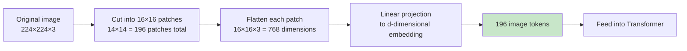
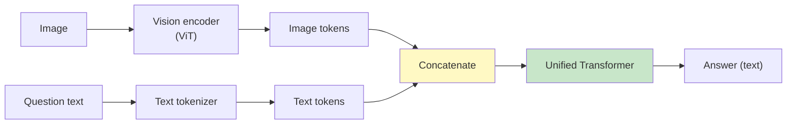
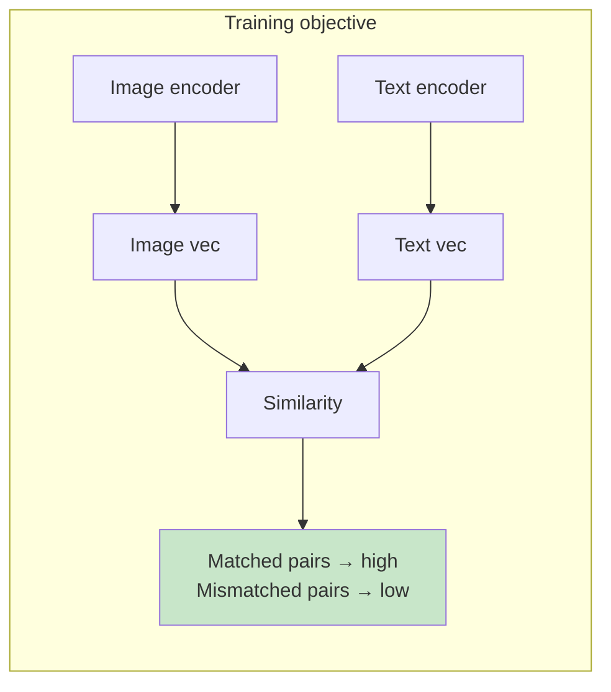
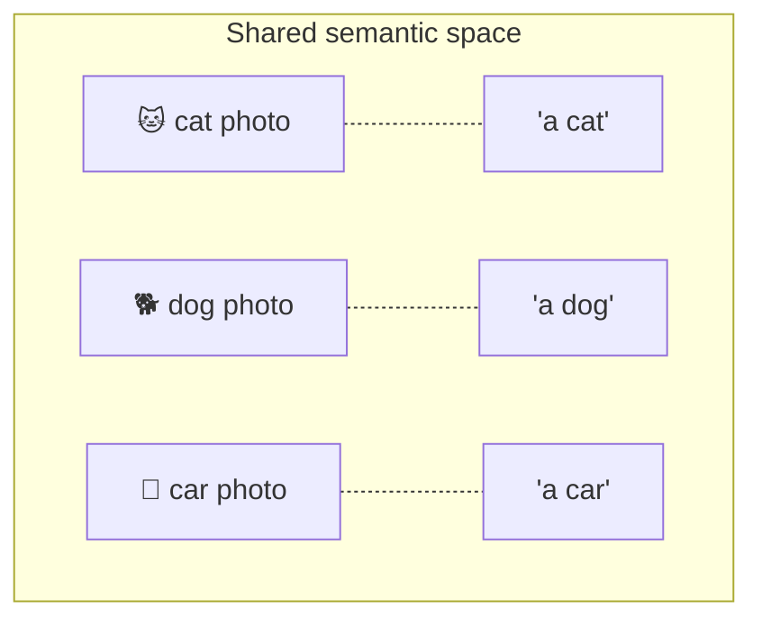
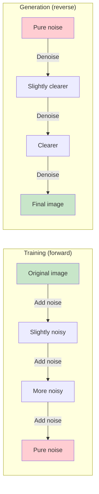
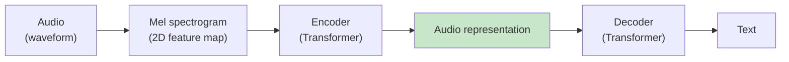
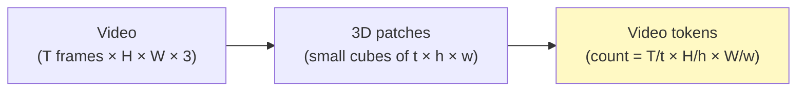
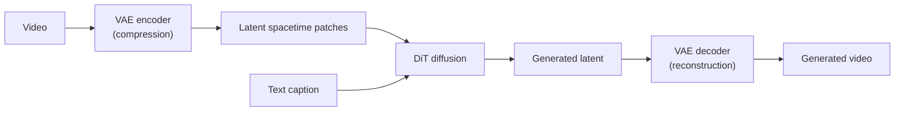
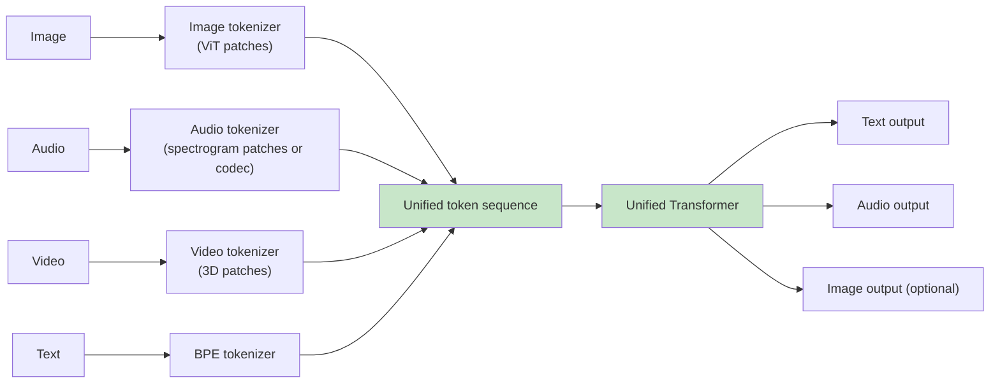

[← Previous Chapter](13-interpretability.md) | [Table of Contents](../README.md) | [Next Chapter →](15-future.md)

**中文**: [中文](../../chapters/14-multimodal.md)

# Chapter 14: Multimodality: Beyond Text

> "Once you tokenize it, it's text. The question is just what counts as 'it'."

In Chapter 1, we said that LLMs do only one thing: predict the next token. This chapter pushes that argument to the limit: **as long as you can turn it into tokens, an LLM can process it**: images, audio, video, 3D models, and protein sequences are all the same in principle.

This is the core idea behind multimodal models. They are not "an image module bolted onto an LLM"; they **convert images (or audio, or video) into token sequences and feed them into the same transformer**. Once you accept this perspective, multimodality is no longer mysterious. It is a natural extension of text LLMs.

The core arguments of this chapter:

1. **Multimodality is essentially an extension of tokenization**: images become visual tokens, audio becomes audio tokens.
2. **CLIP is the foundation of everything**: it taught models that "images and text can share the same semantic space."
3. **The way images/audio are generated is fundamentally different**: the mainstream path is diffusion, not next-token prediction.
4. **Omni models are the trend**: one model understands and generates all modalities.

After reading this chapter, you will understand GPT-4o's "image understanding," Sora's video generation, Whisper's speech recognition, and Suno's music generation. They look different, but underneath they are different implementations of the same set of ideas.

---

## 14.1 Turning Images into Tokens: Vision Transformer

### A Review of Text Tokenization

In Chapter 1, we already learned that a tokenizer cuts text into discrete units, and each unit maps to a vector (embedding).

```
"hello world"
  → tokenizer
  → ["hello", " world"]
  → embedding
  → [vec_hello, vec_world]  (two d-dimensional vectors)
```

This sequence of vectors is the transformer's input.

### How Do Images Become Tokens?

The most direct idea: cut the image into "blocks," and treat each block as a token. This is exactly what **Vision Transformer (ViT)** does (Dosovitskiy et al., 2020, [_An Image is Worth 16x16 Words_](https://arxiv.org/abs/2010.11929)).



The concrete steps:

1. **Patchify**: cut a 224×224 image into 14×14 = 196 small patches, each 16×16 pixels.
2. **Flatten + project**: each patch is 16×16×3 = 768 dimensions, then passed through a linear layer into the transformer's hidden dimension.
3. **Add positional encodings**: let the model know where each patch was in the original image (image patches have no "natural order").
4. **Feed into the transformer**: process them just like text tokens.

**Core insight**: ViT does not need any "image-specific" network structure (no CNNs, no convolutions). It treats an image as a "two-dimensional token sequence" and lets the transformer learn how to understand it.

Practice has shown that when there is enough data, ViT can outperform classic CNNs on image tasks. And, crucially, **it uses the same kind of architecture as a text transformer**.

### Vision-Language Model: Concatenating Image and Text Tokens

Once images are tokens too, the design of a VLM (Vision-Language Model) becomes obvious:

```
Input: [image token1, ..., image token196, text token1, ..., text tokenN]
                ↓
        The same Transformer
                ↓
Output: text tokens (generated answer)
```



GPT-4V, Claude 3, Gemini, and LLaVA are all variants of this structure. The differences are in:

- Which vision encoder is used (ViT, CLIP's vision tower, or a custom encoder).
- How image tokens are projected into the LLM's embedding space (linear layer, MLP, cross-attention).
- How many image-text pairs the model was trained on, and what quality they had.

But **the core idea is "turn images into tokens and concatenate them before the text"**. When you see Claude "look at an image and answer," this is what is happening behind the scenes.

---

## 14.2 CLIP: The Foundation of Image-Text Alignment

### A Shockingly Simple Training Objective

OpenAI's CLIP (2021, [_Learning Transferable Visual Models From Natural Language Supervision_](https://arxiv.org/abs/2103.00020)) changed multimodality. Its training objective is almost unbelievably simple:

> Given a batch of image-text pairs (image, caption), make the "matched pairs" close together in embedding space and the "mismatched pairs" far apart.



The concrete form (contrastive loss):

```python
# A batch of N image-text pairs
images, captions = batch  # N of each

# Encode
image_embs = vision_encoder(images)   # N × d
text_embs = text_encoder(captions)    # N × d

# Normalize
image_embs = normalize(image_embs)
text_embs = normalize(text_embs)

# Similarity matrix N × N
sim = image_embs @ text_embs.T  # entry [i,j] = similarity between image i and caption j

# Diagonal entries are matched pairs and should be high; all other entries should be low
# Use a symmetric cross-entropy loss
labels = arange(N)  # image i should match caption i
loss = (cross_entropy(sim, labels) + cross_entropy(sim.T, labels)) / 2
```

**What does this objective produce?** A **shared semantic space**: images and text are mapped into the same vector space, where the embedding of the sentence "a dog running on the beach" is very close to the embedding of an actual image of "a dog running on the beach."

### Why This Is the "Foundation"

CLIP's impact goes far beyond image classification:

**Application 1: Zero-shot image classification**

No classifier needs to be trained. You only need to turn candidate labels into text:

```python
labels = ["a photo of a cat", "a photo of a dog", "a photo of a car"]
text_embs = clip.encode_text(labels)
img_emb = clip.encode_image(test_image)

predicted_label = labels[argmax(img_emb @ text_embs.T)]
```

CLIP turns a "classification problem" into a "text retrieval problem."

**Application 2: A "scoring function" for image generation**

How does a diffusion model know whether "the generated image matches the prompt"? Use CLIP: encode the generated image and the prompt separately, then check their similarity. This was a core mechanism in early DALL-E and Stable Diffusion.

**Application 3: The vision encoder for VLMs**

Many VLMs use CLIP's vision tower directly as their image encoder. Because CLIP has already learned "concepts inside images," aligned with text, which is exactly what VLMs need.

**Application 4: Retrieval (image search, text-to-image search)**

Encode all images and query text into the same space, and vector retrieval can work across modalities. Pinterest, Google Image Search, and e-commerce "search by image" use similar mechanisms.

### Intuition for the Shared Semantic Space



After CLIP is trained, an "image embedding" and the "corresponding text description embedding" are not merely similar. They almost overlap. This means that in this space, **the boundary between modalities is dissolved**. The concept "cat" maps to the same location whether expressed as an image or as text.

All modern multimodal models use this insight.

---

## 14.3 Image Generation: Why Not Next-Token?

### A Seemingly Natural Idea

Since images can become token sequences, can't image generation be the same as text generation? Let an LLM predict one token at a time, and finally restore the token sequence back into an image.

People have indeed taken this path (DALL-E 1, Parti), but **today's mainstream image generation does not work this way**. The reason lies in the special nature of images.

### What Makes Image Tokens Special

Text tokens have several properties:
- **Discrete**: there is only a finite vocabulary.
- **Clear order**: left to right.
- **Each token carries a lot of information**: one token = one word.

Image tokens are different:
- They **can be discrete** (quantized with VQ-VAE) or continuous.
- Their **order is arbitrary by convention** (raster scan, Z-curve...).
- **Each token carries little information**: one patch only has a few pixels, and means little without surrounding patches.

Even worse: **the dependency structure of images is two-dimensional and global**. A pixel is strongly correlated with all the pixels above, below, left, and right; the top-left and bottom-right of an image often also have long-range dependencies (such as symmetry).

Autoregressively scanning from top-left to bottom-right breaks this two-dimensional global structure. Once earlier content is fixed, later generated content cannot go back and revise it.

### Diffusion: "Developing" an Image from Noise

Mainstream image generation takes another path: **diffusion**.



The intuition:

1. **During training**: take a clean image, gradually add noise, and train a network to "look at the image at noise step t and predict the image at step t-1."
2. **During generation**: start from pure noise, repeatedly call this network, gradually denoise, and eventually obtain a clear image.

The whole generation process is **global-to-global**: every denoising step sees the entire image and modifies the entire image. This naturally fits the two-dimensional global structure of images.

The implementation of `text-to-image` is to encode the text prompt (using CLIP or a similar model) and use it as conditional input to the denoising network:

```python
def text_to_image(prompt, n_steps=50):
    text_emb = clip.encode_text(prompt)
    image = random_noise()
    for t in reversed(range(n_steps)):
        image = denoiser(image, t, condition=text_emb)
    return image
```

### DiT: Putting Transformers into Diffusion

Early diffusion used U-Net as the denoising network. The recent trend is to use Transformers, called **DiT (Diffusion Transformer)** (Peebles & Xie, 2022, [_Scalable Diffusion Models with Transformers_](https://arxiv.org/abs/2212.09748)).

The benefits of DiT:
- It uses the same architecture as LLMs → it can absorb all the scaling experience from transformers.
- It supports attention → it handles long-range dependencies better.
- It can extend to video (by adding attention along the time dimension).

OpenAI's Sora, Stability AI's Stable Diffusion 3, and Google's Imagen 3 all use DiT architectures.

> **Key trend**: architecturally, text generation (autoregressive transformer) and image generation (diffusion transformer) are converging. Both are transformers; the difference is the training objective.

### The Return of Autoregressive Image Generation

Recently, there has also been work "reviving" autoregressive image generation (such as LlamaGen, some Anthropic experiments, and follow-ups to Google's Parti). They use smarter tokenization methods (improvements on VQ-VAE) to make next-token prediction on images approach the quality of diffusion.

Which path will ultimately win is still being contested. But in engineering today, diffusion is still what you will most often deal with.

---

## 14.4 Audio: Listening and Speaking

### Listening: Whisper

OpenAI's Whisper (2022, [_Robust Speech Recognition via Large-Scale Weak Supervision_](https://arxiv.org/abs/2212.04356)) is the de facto standard for open-source ASR (Automatic Speech Recognition). Its design is also very transformer-like:



Key points:
- The input is not the raw waveform, but a **mel-spectrogram**: a 2D representation of "how frequency changes over time."
- The spectrogram is cut into time blocks, and each block is treated as a token (similar to a ViT patch).
- Encoder-Decoder architecture (rare: most modern LLMs are decoder-only), with the decoder outputting text tokens.

Whisper's training data: 680,000 hours of multilingual audio + subtitles scraped from the internet. Scale drives its robustness. It can handle all kinds of accents, background noise, and domain terminology.

### Speaking: Two Approaches to TTS

Text-to-Speech (TTS) has the reverse goal: text → audio.

**Approach 1: Tokenize audio, then use next-token prediction**

Representative works: Tortoise TTS, Bark, Meta's Voicebox, and some Anthropic experiments.

```python
# Use an audio tokenizer (such as EnCodec or SoundStream) to cut audio into discrete tokens
audio_tokens = audio_tokenizer.encode(reference_voice)

# Train an LLM to learn: text → audio_tokens
prompt = f"<text>{input_text}</text>"
generated_audio_tokens = llm.generate(prompt)

# Decode back into waveform
audio = audio_tokenizer.decode(generated_audio_tokens)
```

**Approach 2: Directly generate acoustic features + vocoder**

Representatives: Tacotron and the FastSpeech family.

```
text → Acoustic Model → mel-spectrogram → Vocoder → waveform
```

The first approach is more modern and closer to the direction of a "unified architecture"; the second is more traditional but mature in engineering.

Recent GPT-4o voice and Gemini Live take a more radical path: **end-to-end audio conversation**: audio input → LLM processes it directly → audio output, with no "text" relay in the middle. This avoids the problem that "text relay loses emotion, rhythm, and pauses."

---

## 14.5 Video: The Most Expensive Modality

Video can be understood as "images + a time dimension." The tokenization idea is 3D patches:



The problem of exploding count: for a 5-second, 24fps, 1024×1024 video, if you cut it into 8×16×16 patches, the token count is:

```
(5*24/8) × (1024/16) × (1024/16) = 15 × 64 × 64 ≈ 60000 tokens
```

A 1-minute video is at the million-token level. This is why video generation (Sora, Veo, Kling, Runway) is extremely expensive: every second of video is a huge attention computation.

### Sora's Core Idea

OpenAI's Sora (2024) applied DiT + 3D patches + large-scale training:

1. **Unified representation**: images and videos are both represented as "spacetime patch" sequences (an image = the degenerate single-frame case).
2. **DiT architecture**: diffusion over spacetime patches.
3. **VAE compression**: first compress video into a latent space (to save computation), then run diffusion in the latent space.
4. **Massive training data**: web videos + synthetic (generated by other models) captions.



**The current engineering reality of video generation**:

- Generating a few seconds of video takes tens of seconds to minutes.
- High resolution is extremely expensive (one generated HD video may cost several dollars in API cost).
- Physical consistency remains challenging (liquids, cloth, long-term face consistency).
- Long videos (>1 minute) degrade significantly in quality.

Video is "the most expensive modality and the biggest opportunity." Market demand is enormous (film and television, advertising, education, games), but the technology is not yet mature enough for large-scale application.

---

## 14.6 Omni Models: One Model Understands Everything

### The Trend

The trend since 2024: **a single model handles all modalities at the same time**. Not a combination of "text model + vision model + audio model," but all modalities mixed together from the training stage.

Representatives: GPT-4o (OpenAI), Gemini (Google), Claude (Anthropic's vision support), Llama 3.2 vision, and the Qwen-VL family.

### Why Omni Is the Trend

**Benefit 1: Knowledge transfer across modalities**

If a model has learned "pictures of cats," "text descriptions of cats," and "recordings of cats meowing" at the same time, its understanding of the concept "cat" will be deeper than that of a unimodal model.

**Benefit 2: Cross-modal tasks become natural**

"Listen to an audio clip, look at a related image, and write a textual summary." An omni model can do this in one pass, without intermediate conversion.

**Benefit 3: Fewer models, simpler deployment**

One model, one set of weights, and one API can cover multimodal needs.

### Architecture of an Omni Model



Shared across modalities:
- The same transformer.
- The same attention.
- The same hidden dimension.

The only differences are at the two ends:
- **Input end**: each modality has its own tokenizer.
- **Output end**: choose the decoder according to the task (text tokens, audio tokens, image latent).

### What This Means in Engineering

For application developers:

**1. You no longer need to stitch models together**

Previously, to build "image question answering," you either used a commercial API (GPT-4V) or stitched together BLIP/CLIP + LLM yourself. Now Claude / Gemini / GPT-4o can handle it with a single API.

**2. Multimodal prompting is a new skill**

```python
# Example Anthropic API
response = client.messages.create(
    model="claude-opus-4-7",
    messages=[{
        "role": "user",
        "content": [
            {"type": "image", "source": {...}},  # image
            {"type": "image", "source": {...}},  # another image
            {"type": "text", "text": "Compare the differences between these two images."},
        ]
    }]
)
```

All the prompt engineering principles discussed in Chapter 9 still apply. The prompt is just multimodal now.

**3. Evaluation must also be multimodal**

The eval framework from Chapter 12 needs to be extended. For example, VLM evals usually include:
- VQA (Visual Question Answering) accuracy.
- Image caption quality (BLEU, CIDEr, human evaluation).
- OCR accuracy (recognizing text in images).
- Chart understanding.
- Multi-image reasoning.

---

## 14.7 The Engineering Reality of Multimodal Systems

Bringing this chapter down to practice, here are several things worth knowing:

### 1. Different Modalities Have Different Costs

| Modality | Cost of 1 token (roughly) |
|------|-----------------------|
| Text | 1x |
| Image (about 1000 tokens each) | 1000x |
| Video (about 100,000 tokens per minute) | 100000x |
| Audio (about 1500 tokens per minute) | 1500x |

Video processing is several orders of magnitude more expensive than text. This cost structure has to be part of system design decisions.

### 2. Latency Distributions in Multimodality

Video/audio generation is usually **asynchronous** (generation takes a long time, and the user has to wait). This affects product form:
- Text chat → real-time.
- Image generation → a few seconds of waiting.
- Video generation → task-style, notify by email.

### 3. Failure Modes of Multimodal Models

VLMs have their own distinct failure modes (in addition to those already present in text LLMs):

- **Inaccurate OCR**: recognizing text in images is still unreliable (especially handwriting, tilted text, and low resolution).
- **Inaccurate counting**: how many people are in the picture? Models often count wrong.
- **Confused spatial relations**: "the cup on the left" vs. "the cup on the right" is often confused.
- **Inventing a story from an image**: when asked about something not in the image, the model may fabricate it (multimodal hallucination).
- **Missing details**: the image is compressed into a finite number of tokens, and details are lost.

Do not assume "seeing an image = seeing it like a human." Multimodal models have blind spots caused by their tokenization. This is the same kind of issue as the "counting the r's in strawberry" problem discussed in Chapter 6.

### 4. New Dimensions of Safety and Privacy

- User-uploaded images may contain PII (faces, ID cards, addresses).
- Generated images may infringe rights (artist styles in the training data).
- Deepfakes and fake videos.
- Cross-modal prompt injection (text embedded in an image saying "ignore the above instructions").

Multimodality expands the attack surface. System design has to take this into account.

---

## 14.8 A Counterintuitive Thought: Will Modalities Disappear?

The final section leaves an open question:

**When models become powerful enough, the concept of "modality" itself may be a convenient engineering category rather than a real distinction inside the model**.

The human brain does not split "seeing an image of a flower" and "the word flower" into two independent systems. They point to the same conceptual representation. Today we divide models into "vision encoders, text encoders, audio encoders" mostly as an engineering convenience (existing pretrained models can be assembled), not because the model itself needs this segmentation.

Future omni models may have:
- No "vision encoder" and "text encoder": all inputs use the same unified tokenizer.
- No "image generation head" and "text generation head": all outputs use the same unified decoder.
- Modality becomes an **arbitrary attribute** ("output a 4K video" and "output a 100-word summary" are the same kind of instruction).

This path is already being explored in research (such as Meta's Chameleon, Google's Pathways, and Anthropic's multimodal experiments).

If this step works, the argument from Chapter 1 will become even more complete: **an LLM really does only one thing: predict the next token**. It is just that the meaning of token has been pushed to the extreme.

---

## Summary

| Question | Answer |
|------|------|
| Core idea of multimodality | Turn every modality into tokens and feed them into the same transformer |
| How images become tokens | ViT: cut into patches, each patch is a token |
| CLIP's contribution | It taught models that "images and text can share the same semantic space" |
| Why image generation does not use next-token | The two-dimensional global dependency structure of images does not fit autoregression; diffusion is more natural |
| Core of Sora/video generation | DiT + 3D spacetime patches + VAE compression |
| Design of audio recognition (Whisper) | Spectrogram → patches → encoder-decoder transformer |
| What an omni model is | One model understands and generates all modalities at the same time |
| Engineering reality | Modality costs differ by orders of magnitude, and failure modes vary |

The next chapter is the final chapter: standing in the present and looking at the future of LLMs. Will scaling hit a wall? What will the role of engineers become?

---

## Further Reading

- [Dosovitskiy et al., 2020: _An Image is Worth 16x16 Words (ViT)_](https://arxiv.org/abs/2010.11929) — The founding work on Vision Transformer
- [Radford et al., 2021: _Learning Transferable Visual Models from Natural Language Supervision (CLIP)_](https://arxiv.org/abs/2103.00020) — The foundation of image-text alignment
- [Ho et al., 2020: _Denoising Diffusion Probabilistic Models_](https://arxiv.org/abs/2006.11239) — The core diffusion paper
- [Peebles & Xie, 2022: _Scalable Diffusion Models with Transformers (DiT)_](https://arxiv.org/abs/2212.09748) — The DiT architecture
- [Radford et al., 2022: _Whisper_](https://arxiv.org/abs/2212.04356) — Large-scale weakly supervised speech recognition
- [OpenAI, 2024: _Video generation models as world simulators (Sora technical report)_](https://openai.com/research/video-generation-models-as-world-simulators) — Sora technical report
- [Liu et al., 2023: _Visual Instruction Tuning (LLaVA)_](https://arxiv.org/abs/2304.08485) — A representative open-source VLM
- [Team Chameleon (Meta), 2024: _Mixed-Modal Early-Fusion Foundation Models_](https://arxiv.org/abs/2405.09818) — A unified model with early fusion

[← Previous Chapter](13-interpretability.md) | [Table of Contents](../README.md) | [Next Chapter →](15-future.md)
