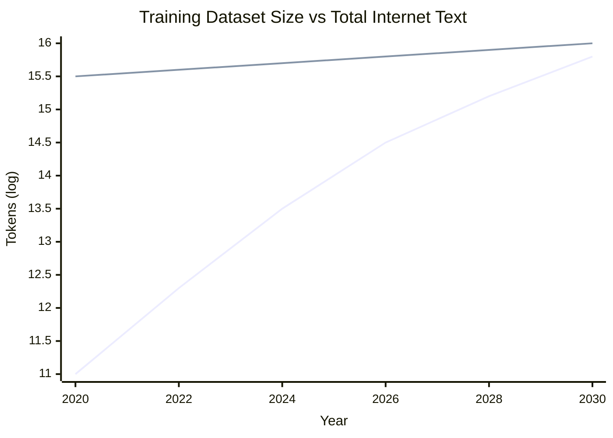
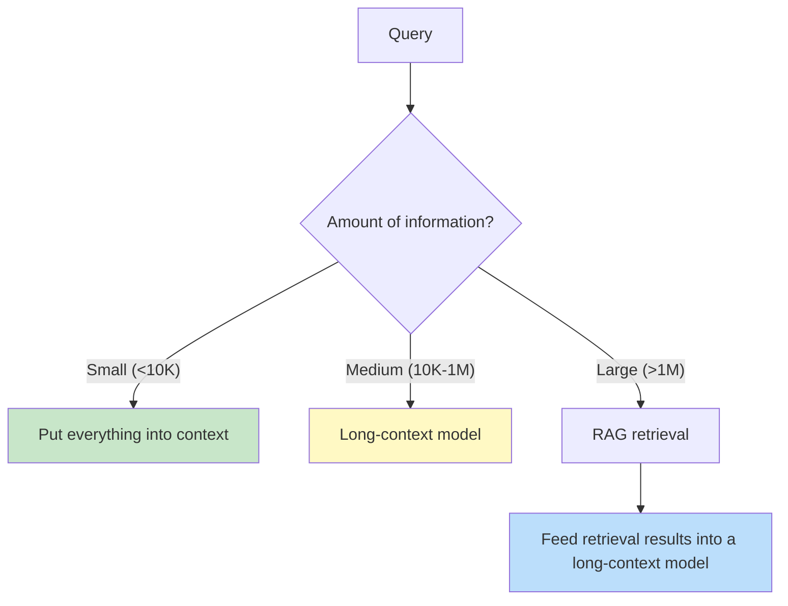
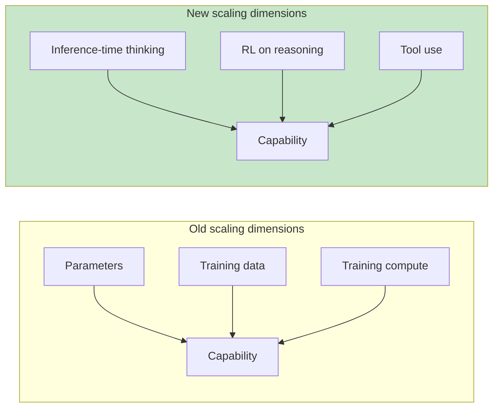
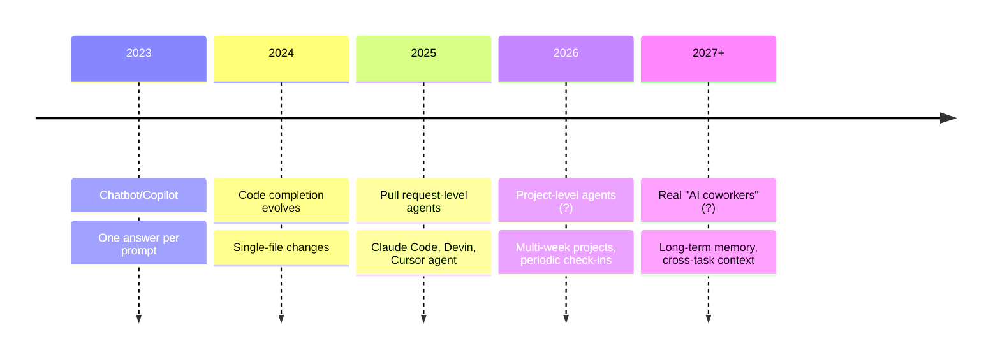
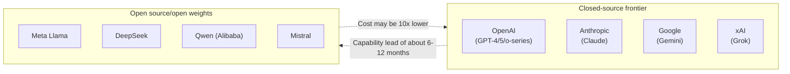

[← Previous Chapter](14-multimodal.md) | [Table of Contents](../README.md)

**中文**: [中文](../../chapters/15-future.md)

# Chapter 15: The Future of LLMs

> "Predictions are hard, especially about the future. Predictions about a field that doubles every six months are nearly worthless." — paraphrased

By now, we have covered what LLMs are, what they can do, what they cannot do, and how to use them. This final chapter looks ahead: over the next 5-10 years, what is already happening? What is a real trend, and what is hype? As an LLM engineer, what should you prepare for?

I will not make concrete predictions -- that is closer to fortune-telling. Instead, I will **map out several real tensions** -- forces pulling against each other, where the answers are not yet clear. Understanding these tensions is more valuable than believing any specific prophecy.

The core tensions in this chapter:

1. **The end of scaling**: Can we keep scaling up? Where are the data wall, energy wall, and economic wall?
2. **Synthetic data**: A lifeline for scaling, or a trap of recursively feeding models their own outputs?
3. **Long context vs RAG**: As context windows get longer, do we still need RAG?
4. **The future of reasoning**: Can test-time compute keep scaling?
5. **Agents, from tools to coworkers**: Where are the boundaries of automation?
6. **Open source vs closed source**: Who will win? Will both coexist, or will one crush the other?
7. **The LLM engineer role**: Will it disappear, evolve, or specialize?

None of these tensions have clear answers. I will lay out the arguments on each side and explain where I lean, but you should think through them yourself.

---

## 15.1 How Much Further Can Scaling Go?

### Three Walls

In Chapter 3, we discussed scaling laws: larger models and more data lead to lower loss. Over the past decade, from BERT's 110M parameters to GPT-4's estimated trillion-scale count, this curve has kept rising.

But scaling is not free. It is running into three walls:

**Wall 1: The data wall**

High-quality text on the internet is finite. Villalobos et al. (2024), in [_Will we run out of data?_](https://arxiv.org/abs/2211.04325), estimate that high-quality text data may be "used up" between 2026 and 2032 -- meaning training datasets will roughly equal all available high-quality text.



> Note: This is an illustrative chart; the actual numbers are highly uncertain.

After that point, every additional doubling of training data requires:
- Mining existing data again with smarter cleaning and deduplication
- Moving toward multimodality -- images and video are essentially more tokens
- Moving toward synthetic data, discussed in the next section
- Accepting diminishing marginal returns

**Wall 2: The energy/compute wall**

GPT-4 reportedly used tens of thousands of H100s for several months of training. The GPT-5/Claude 4 generation is rumored to require hundreds of thousands of GPUs. The next generation, at 10x more compute, would need millions of GPUs -- already near the physical limits of existing data centers and grid capacity.

NVIDIA, Meta, and xAI are all building data centers so large they require dedicated power plants. This is not exaggeration -- it is real. Electricity supply has already become a practical bottleneck for scaling.

**Wall 3: The economic wall**

Training costs are growing exponentially. Estimated costs for frontier models:

- 2020 GPT-3: about $5M
- 2023 GPT-4: about $100M
- 2025 estimated frontier models: $500M-$1B
- 2027 speculation: $5-$10B

Each generation increases by an order of magnitude. The question is not "can it be done?" -- it is "is it worth the price?"

If a model costs $10B to train, it must produce proportional business returns. The AI industry's current revenue is still nowhere near enough to support this level of training investment -- this is the biggest economic risk right now.

### Positions Compared

**The optimists (Sam Altman, Dario Amodei, Demis Hassabis)**:

- Synthetic data, multimodality, and inference-time compute will break through the data wall
- The energy problem is an infrastructure investment problem -- capital markets will solve it
- Economic returns will catch up: once AI handles "knowledge work," the TAM is in the trillions

**The conservatives (Yann LeCun, Gary Marcus)**:

- The current architecture -- the next-token transformer -- has fundamental limitations; more scaling will yield diminishing returns
- True intelligence breakthroughs require new architectures, such as world models and energy-based models
- The capital bubble risk is real; the scaling path may be interrupted by a business collapse

**My leaning**: scaling can still go 1-2 more orders of magnitude (5x-30x compute), but each step will yield smaller gains. Meanwhile, **new dimensions** -- test-time compute, reasoning RL, multimodality, and agents -- will carry more of the growth. The era of "just stack more parameters" is ending.

---

## 15.2 Synthetic Data: Savior or Trap?

### The Temptation of the Idea

If real data is running out, the most obvious idea is: let LLMs generate training data.

```python
# Simplified synthetic data pipeline
for prompt in seed_prompts:
    # Use a strong model to generate training samples
    sample = strong_llm.generate(f"Generate a training example for the following task: {prompt}")
    training_set.append(sample)
```

In theory, this scales infinitely -- no longer limited by how much humans have written.

### The Practical Complexity

But synthetic data has several real risks:

**Risk 1: Model collapse**

Shumailov et al. (2024), in [_The Curse of Recursion_](https://arxiv.org/abs/2305.17493), show that repeatedly training new models on synthetic data causes the model to "collapse" after several generations -- losing diversity, dropping long-tail distributions, and becoming increasingly mediocre.

The intuition: each generation reinforces what the previous generation thought was correct. Errors and biases amplify, while rare but real content gets discarded.

**Risk 2: Synthetic data reflects the generator's biases**

If GPT-4 generates training data for GPT-5, then GPT-5 learns not "the world," but "the world as seen by GPT-4." This bias is hard to detect on internal benchmarks, because those benchmarks may also have been generated by GPT-4.

**Risk 3: Distribution shift**

Synthetic data skews toward domains the model is already good at -- things it generates confidently. Rare, difficult content where the model is weak, exactly what is most worth training on, becomes systematically underrepresented.

### Which Synthetic Data Actually Works

Not all synthetic data suffers from these problems. **High-quality synthetic data** usually has these traits:

1. **Transformation, not pure generation**: derived from existing data through rewriting, translation, or question extraction, rather than generated from scratch
2. **Verification/filtering**: after generation, mechanisms like execution tests, human review, or multi-model voting filter out low-quality samples
3. **Targets model weaknesses**: deliberately fills in domains where the model is weak -- math, code, reasoning
4. **Mixed with real data**: supplements real data instead of replacing it

Part of DeepSeek-R1's training used large amounts of **automatically verifiable synthetic data**: math problems where the answer is computable, and coding problems where tests are runnable. Synthetic data with ground truth carries lower risk.

### My Judgment

Synthetic data **will become an important supplement**, but will not fully replace real data. The most effective form will be "semi-synthetic" data: intelligent rewrites of existing data, and domains with automatic verification like math, code, and formal logic.

Do not believe the simplistic narrative that "infinite synthetic data = infinite scaling."

---

## 15.3 Will Long Context Make RAG Disappear?

### The Trend

Context windows are growing quickly:

```
2020: GPT-3          → 2K tokens
2022: GPT-3.5        → 4K
2023: GPT-4          → 8K (32K later)
2023: Claude 2       → 100K
2024: Gemini 1.5     → 1M (2M later)
2024: Claude 3.5     → 200K
2025-now: multiple models → 1M+
```

If the window fits an entire document, codebase, or conversation history, is RAG still necessary?

### Arguments for Long Context

- **Simplicity**: no need for chunking, embeddings, vector databases, or retrieval tuning
- **Preserving global context**: avoids "chunk boundaries cutting off key information"
- **Better coherence**: the model sees everything at once and can reason across paragraphs

### Arguments That RAG Is Still Necessary

- **Cost**: as Chapter 6 discussed, attention is O(n²). A single 1M-context call may cost several dollars
- **Latency**: processing 1M tokens takes tens of seconds, unsuitable for real time
- **Lost in the middle**: as Chapter 6 discussed, information in the middle of long context is used less effectively
- **Data scale**: enterprise knowledge bases may be 100GB -- far larger than any context window
- **Updatability**: RAG indexes update incrementally; context must be resent every time
- **Auditability**: RAG tells you which document the answer came from; pure long context is harder to trace

### Compromise: Layered Architecture

The future is likely not "RAG disappears," but **a layering of RAG + long context**:



The three paths for knowledge injection from Chapter 10 will all persist, but their proportions and use cases are shifting.

### My Judgment

RAG will not disappear, but **its form will change**: from "slice everything into 512-token chunks to squeeze into context" to "retrieve once, give the model 100K-1M tokens of relevant material, and let it digest." The engineering around embeddings and vector databases will simplify -- larger chunks, coarser retrieval -- but will never become "just use long context."

---

## 15.4 The Future of Reasoning

### Test-Time Compute Is the New Scaling Dimension

Chapter 8 explained that reasoning models introduced a new source of capability: **more thinking time at inference yields monotonically better accuracy**.



This opens a new scaling path: even if training scale hits a wall, capability keeps improving with larger inference budgets.

**But test-time compute also has limits**. OpenAI's o3 reportedly used massive inference-time compute during training, and a single inference can cost tens of dollars. If reasoning through one problem costs $1,000, most applications become unviable.

### The Spread of Reasoning Applications

In practice, reasoning models will move from "special case" to "default" -- but still with layers:

| Scenario | What model to use |
|------|---------|
| Real-time conversation | Standard model |
| Customer support, information lookup | Standard model + tools |
| Code, analysis, planning | Reasoning model |
| Math, research, complex decisions | Reasoning + large thinking budget |
| Offline high-stakes tasks | Reasoning + multi-sample + verification |

The direction of API evolution: **let users specify a thinking budget for each call**, trading off quality, speed, and cost.

---

## 15.5 Agents: From Tools to Coworkers

### The Current Capability Curve of Agents

Chapter 11 explained that current agents are reliable on simple workflows but often fail on long-horizon open-ended tasks. This curve is moving quickly, though:

```
2023:  agents can complete 5-10 step tasks (about 70% success rate)
2024:  agents can complete 30-50 step tasks (about 60% success rate)
2025:  agents can complete hours of work (about 50% success rate, needs review)
2026?: agents can independently complete multi-day projects?
```

METR's study [_Measuring AI Ability to Complete Long Tasks_](https://arxiv.org/abs/2503.14499) (2025) found a striking pattern: **the length of tasks agents complete reliably, measured by the time a human would need, roughly doubles every 7 months**.

If this trend holds, agents' task horizon may move from minutes to days within a few years.

### Evolution of Real Use Cases



Each step requires a different **human-AI collaboration model**. Moving from "agent as query tool" to "agent as outsourced worker" to "agent as team member" demands new product forms, trust mechanisms, and failure backstops.

### Problems Not Yet Solved

Before agents can truly become "coworkers," we need to solve:

- **Long-term memory**: current agents have one-off context, with no real memory across conversations
- **Accountability**: when an agent makes a mistake, who is responsible?
- **Safety boundaries**: how much permission should an agent get, and how is it revoked?
- **Collaboration protocols**: how do multiple agents coordinate without the "communication cost explosion" from Chapter 11?

Most of these are not technical problems -- they are **product and institutional problems**. Technology solves half. The other half requires society, law, and organizations to evolve slowly.

---

## 15.6 Open Source vs Closed Source

### The Current Landscape



### Trend Observations

**Advantages of closed source**:

- The largest training budgets
- Frontier capabilities -- reasoning, long context, multimodality -- usually appear first in closed-source models
- More investment in safety and alignment engineering

**Advantages of open source**:

- Flexible deployment, including private, local, and customized deployments
- Low cost: download once, no per-token billing
- Inspectable and auditable
- Drives the whole ecosystem, including research, tools, and derived models

**The open-source catch-up time is shrinking**: closed-source models used to lead by 12-18 months; now, on some tasks, open source catches up in 3-6 months. DeepSeek-R1 nearly matched o1 on some benchmarks while being freely available.

### Who Will Win? Two Different Questions

"Who wins, open source or closed source?" is actually two different questions:

**Question 1: Who reaches the technical frontier first?**

Short term, still closed source -- capital and compute advantages. But open source is catching up fast.

**Question 2: Who dominates real-world deployment?**

They will **coexist in layers**:
- High-stakes / needs SOTA / does not need private deployment → closed-source API
- High volume / needs local deployment / needs customization / privacy-sensitive → open source
- Most enterprises will **mix both**: closed source for core scenarios, open source for long-tail scenarios

Like the database world: MongoDB did not eliminate Oracle, PostgreSQL did not eliminate SQL Server. Each has its market.

### The Policy Dimension

One more thing: **regulation adds uncertainty for open source**. Some governments are discussing whether frontier models must be licensed. If that becomes real, legal risk for open-source frontier models rises sharply. This is a real variable outside the technology itself.

---

## 15.7 What Will the LLM Engineer Role Evolve Into?

### The Current Definition

If you are an "LLM engineer" today, you are probably doing:

- Designing prompts
- Building RAG systems
- Fine-tuning
- Implementing agents / function calling
- Evaluation + monitoring

### Short-Term Evolution (1-2 Years)

Some work is being automated:

- **Prompt engineering**: reasoning models reduce the marginal gains from prompt tuning -- good models tolerate bad prompts better
- **RAG tuning**: embedding and chunking optimization will gradually give way to long context + automatic retrieval
- **Basic fine-tuning**: synthetic data generation + automated training pipelines will make small-model fine-tuning nearly push-button

New work is being added:

- **Eval engineering** (Chapter 12): every team is starting to recognize this gap
- **Agent orchestration**: how to stitch agents, tools, and human workflows together
- **Safety / red-teaming / alignment engineering**: as agent permissions grow, this area becomes increasingly important
- **Multimodal engineering**: applications involving video, audio, and cross-modal reasoning

### Medium-Term Evolution (3-5 Years)

The likely direction: **LLM engineers become a combination of infrastructure + evaluation + safety**, while "how to write a prompt" becomes a basic skill like "how to write SQL" -- every engineer needs a little of it.

This echoes the "machine learning engineer" story of the 2010s: at first a separate job, later absorbed into "software engineers who understand ML." LLM engineers may follow the same path: **specialization** and **generalization** happening simultaneously.

### The Parts That Will Not Be Replaced

Which parts of an LLM engineer's work are unlikely to be automated soon?

- **Understanding the business and defining tasks**: translating vague business requirements into evaluable LLM tasks
- **Root-cause analysis of failures**: the "failure mode diagnosis" discussed in Chapters 6 and 7
- **Cross-disciplinary system design**: stitching LLMs, traditional software, and human workflows into usable products
- **Judging what AI should not do**: knowing when to say "no"

First-principles understanding -- what this book teaches -- will become **more important**, not less. Surface-level tools change too fast. Only the underlying principles are stable, and they let you quickly judge whether a new tool is worth adopting.

---

## 15.8 Several Concrete Views of Mine

After acknowledging all the uncertainty, here are a few concrete views I personally hold. These **may be wrong**, but at least they are grounded guesses:

### 1. The "LLMs Are Hitting a Wall" Story Is Exaggerated, but the GPT-4 → GPT-5 Jump May Be the Last "Shocking" Leap

Marginal returns from stacking parameters are diminishing. Future progress will be more distributed: reasoning, agents' long-horizon tasks, multimodality, and domain-specific fine-tuning will all improve, but we may never again experience "overnight, the model feels like a different creature."

### 2. The Text LLM Application Layer Has Already Started Entering a "Red Ocean"

Chatbots, Q&A RAG, code copilots -- these areas are crowded with startups, and differentiation is getting harder. The new blue oceans are agents (long-horizon tasks), multimodality (video, audio), and vertical domains (medicine, law, scientific research).

### 3. Agents Are the Biggest Product Opportunity of This Generation, and Also the Biggest Engineering Trap

"Agent" in 2025 occupies a position similar to "blockchain" in 2017: real revolutionary potential mixed with a lot of bubble. Teams that build truly reliable agent systems will be extremely valuable; most "agent startups" will die.

### 4. Evaluation Will Go From "Undervalued" to a "Core Moat"

Whoever has the best eval sets and evaluation methodology iterates faster than everyone else. This is becoming a core moat for frontier model companies.

### 5. Open Source Will Never Disappear, but the Frontier Will Become Increasingly Concentrated in a Few Companies

Capital and compute thresholds will only rise. The frontier will be held by five companies, with open source arriving 18 months later. For 99% of applications, that gap is acceptable.

### 6. "AI Replacing Engineers" Will Not Happen; "Engineers Who Use AI Replacing Engineers Who Do Not Use AI" Is Already Happening

The old joke is right. The question is not "will AI do my job?" It is "will someone who knows how to use AI do your job?"

### 7. First Principles Will Become More Valuable

Tools, APIs, and best practices all become obsolete quickly. "How to build an agent with LangChain," learned in 2026, may be useless in 2027. But "why LLMs hallucinate," "why attention is O(n²)," and "why CoT works" -- these stay relevant for a decade.

This book is betting on point seven.

---

## 15.9 An Open Ending

LLMs are among the most profound technological changes of the past decade, but they are still very young.

This book was written in 2026. When you read it, some details may already be outdated: a specific model replaced, a benchmark conquered, a state-of-the-art method superseded.

But **the way of thinking should not become outdated**:

- Everything is continuation over tokens
- Attention is information routing
- Scale drives emergence
- Alignment changes expression, not capability
- Models have real hard limitations
- Hallucination is the price of continuation
- Reasoning trades token length for depth
- Prompts shape conditional probabilities
- Knowledge injection has three paths: RAG / fine-tune / context
- Agents are LLM + tools + loop
- Without evals, there is no real improvement
- Modality is an extension of tokenization

This is "thinking in LLM": a mental model for seeing stable structure beneath the rapidly changing surface of tools.

If, after reading this book, your first reaction when you see a new model, tool, or paper is not "what is this?" but "which existing concept is this an extension or variant of?" -- then this book has achieved its goal.

The rest is up to you.

---

## Summary

| Tension | My judgment |
|------|---------|
| How much further scaling can go | Another 1-2 orders of magnitude, but the era of pure parameter stacking is over |
| Synthetic data | It is a supplement, not a replacement; "semi-synthetic + automatic verification" works best |
| Long context vs RAG | RAG will not disappear; it will become a layer of "RAG retrieval + long-context digestion" |
| The future of reasoning | Test-time compute becomes the third scaling dimension, but has a cost ceiling |
| The evolution of agents | Task length doubles every 7 months, but social/institutional problems are harder to solve |
| Open source vs closed source | Closed source leads the frontier, open source owns the long tail, and they will coexist long term |
| LLM engineers | Specialization + generalization happen together; first principles become more important |

---

## Further Reading

- [Villalobos et al., 2024: _Will we run out of data?_](https://arxiv.org/abs/2211.04325) — quantitative analysis of the data wall
- [Shumailov et al., 2024: _The Curse of Recursion: Training on Generated Data_](https://arxiv.org/abs/2305.17493) — model collapse
- [Snell et al., 2024: _Scaling LLM Test-Time Compute Optimally_](https://arxiv.org/abs/2408.03314) — inference-time scaling
- [METR, 2025: _Measuring AI Ability to Complete Long Tasks_](https://arxiv.org/abs/2503.14499) — exponential growth in agent task length
- [Anthropic, 2024: _Building Effective Agents_](https://www.anthropic.com/research/building-effective-agents) — practical agent design
- [Bommasani et al., 2021: _On the Opportunities and Risks of Foundation Models_](https://arxiv.org/abs/2108.07258) — a panoramic view of foundation models
- [Bengio et al., 2024: _Managing extreme AI risks amid rapid progress_](https://www.science.org/doi/10.1126/science.adn0117) — a policy perspective on AI safety
- [Hendrycks et al., 2023: _An Overview of Catastrophic AI Risks_](https://arxiv.org/abs/2306.12001) — a systematic review of long-term risks

---

## Afterword

This book covered next-token prediction, attention, scaling, alignment, capability boundaries, hallucination, reasoning, prompting, RAG, agents, evals, interpretability, multimodality, and the future -- 15 chapters, from principles to practice to outlook.

But the field is too large for any book to cover completely. This book intentionally omitted:

- Details of training engineering, such as data pipelines, distributed training, and inference optimization -- see the companion [Complete Guide to LLM Training Engineers](https://github.com/yingwang/llm-tutorial)
- Concrete framework API usage (LangChain, LlamaIndex, Anthropic SDK, etc.) -- these go out of date quickly; read official documentation directly
- In-depth discussion of safety and alignment -- this would require another book
- Business and organizational dimensions, such as how to deploy AI inside a company and how to do AI product strategy

The goal of this book is to give you a **thinking framework**: when you encounter any new paper, tool, or model, you can quickly locate which chapter's concept it belongs to, whether it is an extension or variant, and which existing understanding it challenges.

If it has done that, the growth path ahead is clear:

1. **Keep reading papers** (especially official reports from Anthropic, OpenAI, Google DeepMind, Meta AI, and DeepSeek)
2. **Build projects by hand** (theory without practice does not stick)
3. **Follow a few high-quality signal sources** (Anthropic Blog, Simon Willison, Andrej Karpathy, Hacker News top stories)
4. **Participate in open source** (even using someone else's open-source project teaches faster than purely consuming content)

Finally: stay skeptical, stay curious. In AI, **people who confidently declare "this is how things are" are often the first to be proven wrong**. Including me, and including this book.

I wish you success in building useful LLM systems.

— Ying Wang, written in spring 2026

[← Previous Chapter](14-multimodal.md) | [Table of Contents](../README.md)
