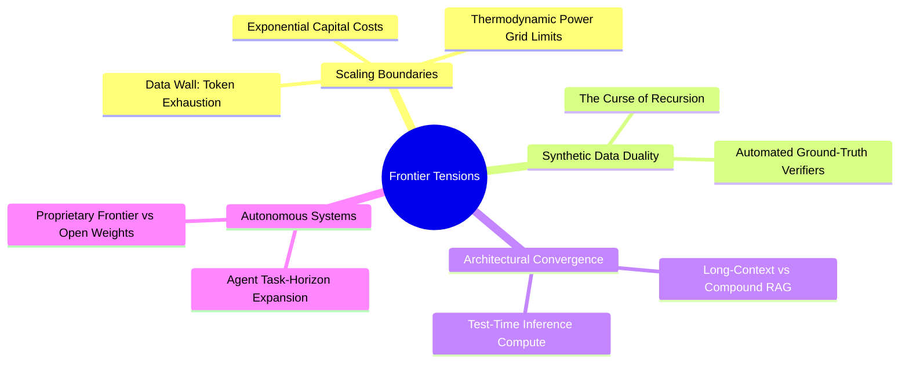
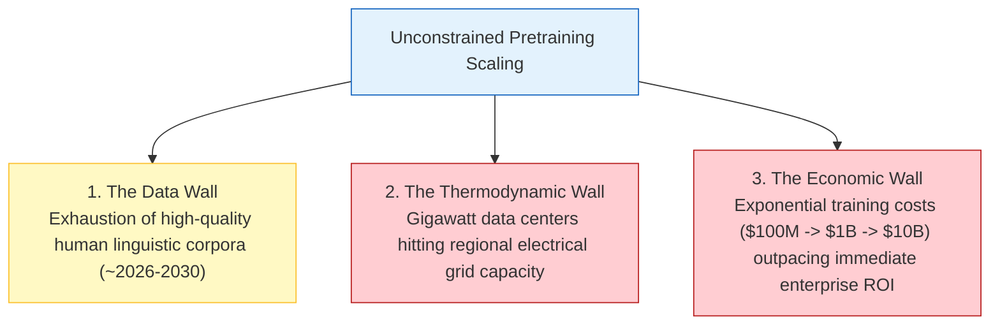
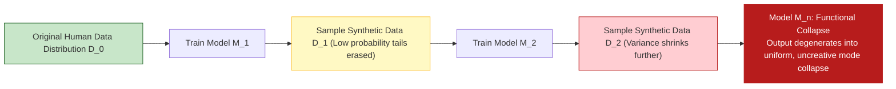
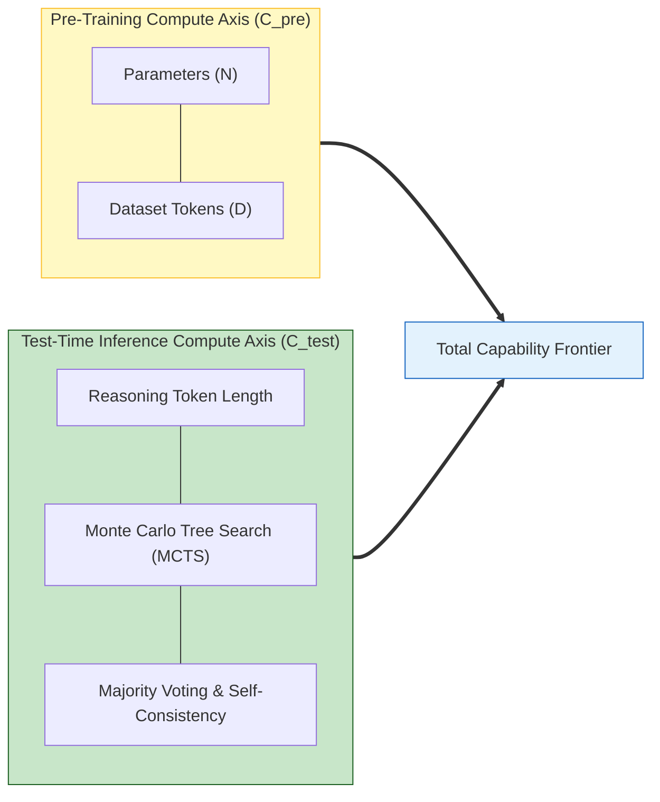
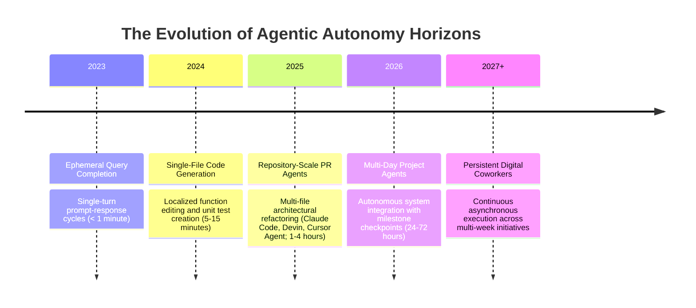
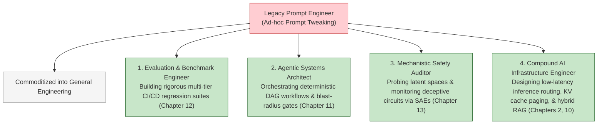
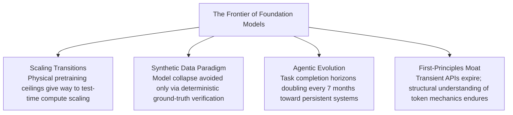

[← Previous Chapter](14-multimodal.md) | [Table of Contents](../README.md)

**中文**: [中文](../../chapters/15-future.md)

# Chapter 15: The Frontier and Future of Foundation Models

> "Forecasts are hazardous, particularly concerning the trajectory of a paradigm that doubles its computational density every six months."

Having deconstructed the internal mechanics, algorithmic strengths, hard physical boundaries, prompt dynamics, agentic loops, evaluation harnesses, and mechanistic interpretability of foundation models, we conclude by looking forward: what structural transformations will govern the next decade of artificial intelligence?

Rather than offering speculative prophecies, this chapter analyzes the **fundamental structural tensions**—the physical, thermodynamic, mathematical, and economic forces pulling the ecosystem in competing directions. Mastering these first-principles dynamics is far more valuable than betting on short-lived tooling trends.



---

## 15.1 The Tripartite Scaling Ceiling: Physical, Data, and Economic Limits

### The Three Boundaries of Pure Pretraining Scaling

In Chapter 3, we examined empirical scaling laws: cross-entropy loss decreases monotonically as a power-law function of parameter count $N$, dataset token volume $D$, and compute budget $C$. For nearly a decade, scaling model parameters by orders of magnitude yielded predictable capability jumps.

However, continuous pretraining scaling is confronting three hard physical walls:



#### 1. The Data Wall: Human Token Exhaustion
Villalobos et al. ([2024](https://arxiv.org/abs/2211.04325)) mathematically estimated the upper bound of high-quality natural language text across the public internet at $\approx 10^{14}$ to $10^{15}$ tokens. Frontier models (such as Llama 3, Claude 3.5, and GPT-4) have already consumed upwards of $1.5 \times 10^{14}$ tokens. Within this decade, the volume of unique, human-authored linguistic text will be fully exhausted by pretraining runs.

#### 2. The Thermodynamic & Energy Wall
Training a state-of-the-art frontier model requires hundreds of thousands of interconnected GPUs operating synchronously for months. Scaling compute by another $10\times$ demands multi-gigawatt facilities—exceeding the entire power distribution capacity of regional electrical grids and necessitating dedicated nuclear, hydroelectric, or geothermal power infrastructure.

#### 3. The Economic Capital Wall
Frontier training run expenditures scale exponentially:
- **2020 (GPT-3)**: $\approx \$5\text{M}$
- **2023 (GPT-4)**: $\approx \$100\text{M}$
- **2025 (Frontier Generation)**: $\approx \$500\text{M} - \$1\text{B}$
- **2027+ Speculation**: $\ge \$5\text{B} - \$10\text{B}$

A $\$10\text{B}$ training cluster demands hundreds of billions in direct software revenue to amortize, forcing a fundamental reckoning with enterprise Return on Investment (ROI).

---

## 15.2 The Synthetic Data Duality: Recursive Degeneracy vs. Grounded Verification

### The Model Collapse Threat: The Curse of Recursion

When real-world human data is exhausted, the intuitive workaround is recursive synthetic data generation: using strong foundation models to generate trillions of synthetic training tokens.

However, unconstrained recursive training incurs **Model Collapse** ([Shumailov et al., 2024](https://arxiv.org/abs/2305.17493)):



Because sampling from a model truncates the long-tail extremities of the true data distribution ($\mathbb{P}(X)$), repeatedly training models on synthetic outputs without external ground-truth grounding leads to irreversible information entropy decay and functional collapse.

### Ground-Truth Verifiable Synthetic Data

Synthetic data overcomes model collapse only when paired with **deterministic external verifiers**:

1. **Formal Code Execution**: Synthetic code generation filtered through automated unit test suites and compiler syntax checks.
2. **Mathematical Theorem Proving**: Multi-step derivations verified via symbolic algebra systems (Lean, Isabelle, SymPy).
3. **Self-Play Search Trees**: Reinforcement learning environments where trajectory outcomes are evaluated against objective rules (e.g., DeepSeek-R1, AlphaGo).

Where automated verification exists, synthetic data enables unbounded capability scaling; in ungrounded domains (such as creative prose and essay generation), it remains subject to recursive decay.

---

## 15.3 Long-Context Ingestion vs. Structured Compound RAG

### The Ingestion Spectrum

As context windows scale from $8\text{K}$ to $1\text{M}-10\text{M}+$ tokens, some practitioners prematurely declare Retrieval-Augmented Generation (RAG) obsolete. In enterprise production, however, long-context models and RAG serve complementary architectural roles:

```mermaid
flowchart TD
    EnterpriseQuery["Incoming Enterprise Query / Task"] --> SizeCheck{"Corpus Scale & Retrieval Scope"}
    
    SizeCheck -->|Localized / Dynamic Document (< 50K Tokens)| LongContextDirect["Direct In-Memory Long-Context Ingestion<br/>Full Attention over Raw Text"]
    SizeCheck -->|Enterprise Corpus (> 100M Tokens / 100GB+)| TieredHybrid["Tiered Hybrid Architecture<br/>1. Vector/Keyword Retrieval (Filter to Top-K)<br/>2. Feed 100K-500K Relevant Tokens to Long-Context LLM"]

    style LongContextDirect fill:#c8e6c9,stroke:#1b5e20
    style TieredHybrid fill:#e3f2fd,stroke:#1565c0
```

| Architectural Dimension | Pure Long-Context Ingestion | Compound RAG Pipeline | Tiered Hybrid Architecture |
|---|---|---|---|
| **Corpus Capacity** | $\le 2\times 10^6$ Tokens | $\ge 10^9$ Tokens (Terabyte scale) | Virtually Unlimited |
| **Inference Cost** | High ($\mathcal{O}(N^2)$ or heavy KV Cache) | Low (Fixed prompt length) | Balanced |
| **Time-to-First-Token (TTFT)** | $5–30\text{ seconds}$ | $< 500\text{ ms}$ | $1–3\text{ seconds}$ |
| **Incremental Updates** | Requires resending full context | Real-time index insertion | Real-time index + targeted context |
| **Auditability & Provenance** | Opaque attention attribution | Explicit chunk document citations | Fully auditable retrieved spans |

RAG will not disappear; it evolves from rigid 512-token chunk retrieval into **coarse semantic filtering that feeds rich 100K-token document corpora directly into long-context reasoning engines**.

---

## 15.4 Test-Time Compute Scaling Laws: The New Scaling Dimension

As pretraining scaling encounters thermodynamic and data limits, foundation model capability is advancing along a second scaling vector: **Test-Time Inference Compute** ([Snell et al., 2024](https://arxiv.org/abs/2408.03314)).



By trading sequence length for virtual circuit depth (as analyzed in Chapter 8), frontier reasoning architectures (such as OpenAI o1/o3 and DeepSeek-R1) generate extended internal chains of thought during inference.

This shifts the engineering paradigm: instead of paying massive upfront capital costs to train monolithic models, developers dynamically allocate **compute budgets per query**—spending fractions of a cent on routine conversational queries while allocating dollars of test-time search to complex mathematical proofs, code compilation tasks, and architectural designs.

## 15.5 Autonomous Agents: From Scripted Subroutines to Open-Horizon Coworkers

### The Exponential Expansion of Agent Task Horizons

In Chapter 11, we observed that while early autonomous agents suffered catastrophic error propagation on multi-step workflows, their operational horizon is expanding exponentially.

Empirical research from METR (*Measuring AI Ability to Complete Long Tasks*, [2025](https://arxiv.org/abs/2503.14499)) documented a predictable scaling phenomenon: **the continuous task duration that autonomous agents can reliably execute without human intervention roughly doubles every seven months**.



### Critical Unsolved Engineering Bottlenecks

1. **Persistent Cross-Session Epistemic State**: Current agent architectures operate over stateless episodic contexts, lacking lifelong episodic memory.
2. **Blast-Radius Authorization & Safety Gates**: Dynamic runtime permission architectures that prevent catastrophic cascading side effects during autonomous execution.
3. **Multi-Agent Coordination Entropy**: Mitigating quadratic communication token overhead and mutual hallucination loops in decentralized agent swarms.

---

## 15.6 Proprietary Frontier Monopolies vs. Open-Weights Democratization

### The Shrinking Frontier Capability Gap

```mermaid
flowchart LR
    subgraph ClosedFrontier["Proprietary Frontier Labs"]
        OAI["OpenAI (GPT-5 / o-series)"]
        ANT["Anthropic (Claude Series)"]
        GG["Google DeepMind (Gemini)"]
        XAI["xAI (Grok)"]
    end

    subgraph OpenDemocratization["Open-Weights Ecosystem"]
        META["Meta AI (Llama Series)"]
        DS["DeepSeek (V3 / R1)"]
        QW["Alibaba (Qwen Series)"]
        MIS["Mistral AI"]
    end

    ClosedFrontier -.->|"Frontier Capability Lead: 3-6 Months"| OpenDemocratization
    OpenDemocratization -.->|"Inference Cost Advantage: 5x-10x Lower"| ClosedFrontier

    style ClosedFrontier fill:#f3e5f5,stroke:#6a1b9a
    style OpenDemocratization fill:#e8f5e9,stroke:#2e7d32
```



The historical capability lag between closed proprietary frontier systems and open-weights releases has compressed from 18 months down to **3 to 6 months**. Architectures like DeepSeek-R1 have demonstrated that efficient reinforcement learning algorithms and high-quality synthetic data pipelines allow open-weights models to match proprietary reasoning benchmarks at a fraction of pretraining expenditure.

### Enterprise Deployment Topology: The Hybrid Equilibrium

Enterprises will settle on a **Layered Hybrid Topology**:
- **Proprietary Frontier APIs**: Reserved for mission-critical, unconstrained reasoning tasks and frontier multimodality where absolute maximum capability is non-negotiable.
- **Self-Hosted Open-Weights Clusters**: Deployed for high-throughput, latency-critical, privacy-sensitive, and cost-constrained production subroutines.

---

## 15.7 The Evolution of the Foundation Model Engineer

### The Specialization Shift

As automated reasoning models and programmatic frameworks commoditize trivial prompt authoring, the role of the "Prompt Engineer" dissolves into foundational software engineering. Simultaneously, the discipline of the **Foundation Model Systems Engineer** bifurcates into deep specialization:



---

## 15.8 The Twelve Axioms of Foundation Model Engineering

Throughout this book, we have formulated an invariant theoretical framework for navigating the rapidly shifting AI landscape. We synthesize these insights into **The Twelve Axioms of Thinking in LLM**:

1. **The Autoregressive Primitive**: Every transformer computation is a conditional probability estimation over a discrete token sequence: $\mathbb{P}(w_t \mid w_{<t})$.
2. **Attention as Routing**: Self-attention is not mysterious cognition; it is dynamic, soft, data-dependent information routing across sequence coordinates.
3. **Scaling Emergence**: Algorithmic reasoning and in-context learning emerge spontaneously when gradient descent minimizes cross-entropy loss over high-entropy pretraining corpora.
4. **Alignment as Behavioral Projection**: Post-training (SFT, RLHF, DPO) modifies the output sampling distribution surface without creating net-new fundamental factual capabilities.
5. **Irreducible Architectural Boundaries**: Autoregressive transformers suffer structural blindspots on sub-token character parsing, continuous precision arithmetic, and unguided global lookahead planning.
6. **Hallucination as Representation Entropy**: Hallucination is the mathematical consequence of sampling from smooth probabilistic manifolds without deterministic external verification.
7. **Reasoning as Virtual Depth Expansion**: Chain-of-thought expands effective computational circuit depth by serializing intermediate algorithmic state into token sequences.
8. **Prompts as Conditional Operators**: Prompts are mathematical conditioning operators that steer the sampling trajectory onto specific functional manifolds.
9. **The Tripartite Knowledge Architecture**: Knowledge is injected via parametric weight imprinting (SFT), non-parametric external retrieval (RAG), or in-memory context ingestion.
10. **The Agentic Triad**: Autonomous agents consist strictly of a foundation model policy, tool execution environments, and closed-loop feedback iterations.
11. **Evaluation Precedes Improvement**: A generative capability that cannot be evaluated with deterministic or calibrated rubrics cannot be reliably improved.
12. **The Universal Tokenization Principle**: Multimodality represents the projection of continuous physical sensory domains into the transformer's universal algebraic token space.

---

## Chapter Summary



Core takeaways:

1. **Scaling laws are diversifying**: While brute-force pretraining confronts physical and data walls, test-time inference compute and reinforcement learning unlock new capability frontiers.
2. **Synthetic data requires verification**: Recursive self-training without deterministic ground-truth anchors causes model collapse; verified domains (code, math, search) scale indefinitely.
3. **Compound AI systems dominate pure long-context**: High-value production architectures combine coarse neural retrieval with rich long-context semantic processing.
4. **First principles outlast transient frameworks**: High-level libraries, SDK APIs, and prompting tricks rapidly depreciate; foundational mathematical and architectural understanding endures.

---

## Further Reading

- [Will We Run Out of Data? Limits of LLM Scaling on Human-Generated Text](https://arxiv.org/abs/2211.04325) — Villalobos et al., Epoch AI, 2024
- [The Curse of Recursion: Training on Generated Data Makes Models Forget](https://arxiv.org/abs/2305.17493) — Shumailov et al., Nature / Oxford, 2024
- [Scaling LLM Test-Time Compute Optimally Can Be More Effective than Scaling Model Parameters](https://arxiv.org/abs/2408.03314) — Snell et al., UC Berkeley & Google DeepMind, 2024
- [Measuring AI Ability to Complete Long Tasks](https://arxiv.org/abs/2503.14499) — METR Research Team, 2025
- [Building Effective Agents](https://www.anthropic.com/research/building-effective-agents) — Anthropic Applied AI Team, 2024
- [DeepSeek-R1: Incentivizing Reasoning Capability in LLMs via Reinforcement Learning](https://arxiv.org/abs/2501.12948) — DeepSeek-AI, 2025

---

## Afterword

We have traversed the entire computational landscape of foundation models: from next-token autoregression, self-attention mechanics, scaling laws, and post-training alignment, to failure mode diagnosis, hallucination mitigations, native reasoning circuits, PromptOps, enterprise RAG architectures, autonomous agents, evaluation harnesses, mechanistic interpretability, and multimodal tokenization.

Frameworks will be rewritten, foundation model leaderboards will turn over, and programming interfaces will evolve. But when you look past the transient software abstractions and examine any future artificial intelligence architecture, your first reaction will not be bewilderment—it will be recognition:

*Which geometric manifold is this system conditioning? How is information routed through its attention subgraphs? Where are its causal verifiers? And how does it trade sequence length for virtual computational depth?*

That is the essence of **Thinking in LLM**.

— **Ying Wang**, written in spring 2026

[← Previous Chapter](14-multimodal.md) | [Table of Contents](../README.md)
